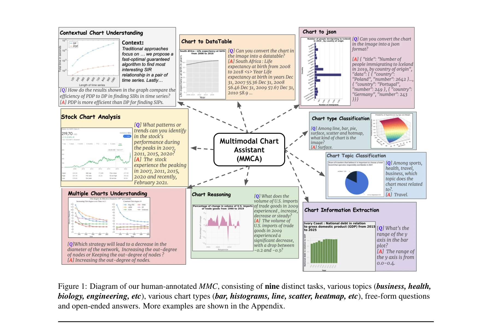
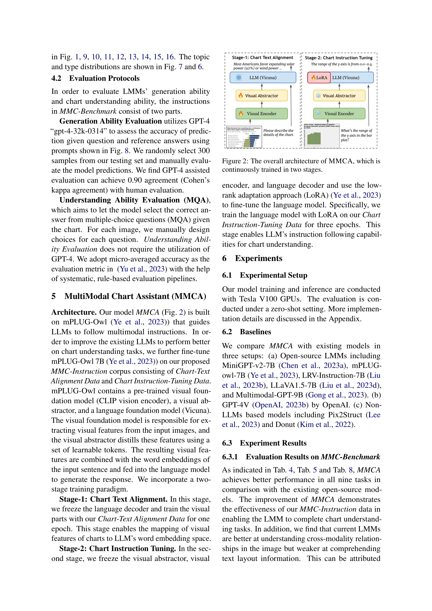
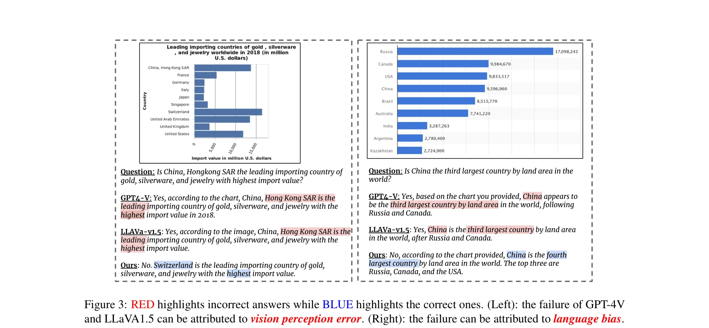

# MMC: Advancing Multimodal Chart Understanding with Large-scale Instruction Tuning

> **저자**: Fuxiao Liu, Xiaoyang Wang, Wenlin Yao, Jianshu Chen, Kaiqiang Song, Sangwoo Cho, Yaser Yacoob, Dong Yu | **날짜**: 2024-04-15 | **DOI**: [10.48550/arXiv.2311.10774](https://doi.org/10.48550/arXiv.2311.10774)

---

## Essence

 *MMC의 9가지 구별되는 작업, 다양한 주제(비즈니스, 건강, 생물학 등), 다양한 차트 유형(막대, 히스토그램, 선형, 산점도, 히트맵 등)으로 구성된 인간 주석 데이터셋*

대규모 멀티모달 차트 명령어 튜닝(600k 인스턴스)을 통해 차트 이해에 특화된 LMM(대규모 멀티모달 모델)을 개발하고, 9가지 하위 작업으로 구성된 포괄적 벤치마크를 제시하는 연구이다.

## Motivation

- **Known**: LLM 기반의 LMM(LLaVA, MiniGPT-4 등)은 일반 이미지 이해에서 우수한 성능을 보임
- **Gap**: 차트 이미지는 추상적 요소(범례, 추세선, 축 레이블 등)를 포함하므로 자연장면(natural scene) 이미지와 본질적으로 다르며, 기존 LMM들은 차트 특화 도메인 학습 부족으로 차트 이해에서 성능 저하
- **Why**: 데이터 분석, 학술 연구, 비즈니스 인텔리전스 등 다양한 실제 응용 분야에서 정확한 차트 이해 능력이 필수적
- **Approach**: (1) 600k 규모의 대규모 차트 명령어 튜닝 데이터셋 구축, (2) 이를 기반으로 차트 특화 LMM 개발, (3) 9가지 작업 포함 포괄적 인간 주석 벤치마크 제안

## Achievement

 *MMCA의 전체 아키텍처*

1. **MMC-Instruction 데이터셋**: 기존 공개 데이터셋(FigureQA 180k, DVQA 300k, PlotQA 224k, ChartQA 21.9k)보다 규모(600k), 다양성(주제, 언어 스타일, 차트 유형), 품질이 우수. 자유형식(free-form) 질문과 개방형(open-ended) 답변으로 인간 인지와 일치

2. **MMCA 모델**: 기존 오픈소스 LMM들을 능가하는 최첨단 성능 달성. 기존 차트 QA 벤치마크에서 우수한 성능 입증

3. **MMC-Benchmark**: 차트 정보 추출, 차트 추론, 문맥적 이해, 다중 차트 이해, 차트 유형 분류, 차트 주제 분류, 차트-데이터테이블 변환, 차트-JSON 변환, 주식 차트 분석 등 9가지 작업 포함. GPT-4V를 포함한 최신 모델들도 상당한 도전에 직면, 특히 Chart-to-Datatable/JSON 작업에서 제한적 성능

## How

 *GPT-4V의 실패 사례(빨강)와 정정 답안(파랑) 비교*

- **Chart-Text Alignment Data (400k)**: 
  - arXiv 학술논문(2010-2020)에서 추출한 Scientific Chart-Caption 데이터(210k): LaTeX 소스와 이미지 파일 활용하여 고품질 유지
  - 기존 5개 공개 데이터셋(Statista, PlotQA, VisText, ChartInfo, Unichart)에서 190k 이미지-텍스트 쌍 필터링

- **Chart Instruction-Tuning Data (200k)**:
  - GPT-4를 활용하여 차트 설명 텍스트로부터 다양한 언어 스타일과 작업 유형의 질문-답변 쌍 자동 생성
  - 5가지 작업: (1) 차트 정보 추출(20단어 이하 답변), (2) 차트 추론, (3) 과학 차트 이해, (4) 차트-데이터테이블 변환, (5) 차트-JSON 변환
  - 명령어 튜닝 형식: "Human: {질문} AI: {답변}"

- **MMC-Benchmark 구축**:
  - 총 2,063개 이미지, 2,126개 질문(자유형식 851개 + 객관식 1,275개) 포함
  - 9가지 작업별로 Statista, arXiv, 웹 크롤, VisText, Google Bard 등 다양한 소스에서 이미지 수집
  - 모든 데이터에 인간 주석 적용
  - 두 가지 정량적 평가 방법: (1) GPT-4 기반 자유형식 평가, (2) 객관식 형식 평가

- **모델 아키텍션**:
  - 기존 LMM 아키텍처에 명령어 튜닝 적용
  - 통일된 지시 따름(instruction-following) 능력으로 다양한 차트 작업 수행

## Originality

- **최초 대규모 차트 특화 명령어 튜닝 데이터셋**: 기존 데이터셋 대비 3배 규모(600k)이며, 템플릿 기반이 아닌 GPT-4 기반 자유형식 생성으로 자연스러운 언어 다양성 확보
- **인간 인지 기반 포괄적 벤치마크**: 차트 이해를 9가지 세분화된 작업으로 평가하는 최초의 인간 주석 벤치마크 제안
- **GPT-4V 포함 광범위한 실증**: 최신 멀티모달 모델(GPT-4V)까지 포함한 실험으로 현재 기술의 한계를 명확히 입증
- **학술 차트 기반 데이터 활용**: LaTeX 소스 파일 기반의 과학 논문 차트 추출로 고품질 데이터셋 구축

## Limitation & Further Study

- **데이터 품질 문제**: GPT-4로 생성된 질문-답변 쌍에서 환각(hallucination) 가능성 존재. 저자들은 20단어 이하 제한을 두었지만 근본적 해결 부재
- **평가 방법의 제약**: 자유형식 답변의 경우 GPT-4 기반 평가에 의존하므로 평가 자체의 신뢰성 문제 가능
- **차트 유형 편향**: 실제 사용 분포와 벤치마크 분포의 불일치 가능성
- **후속 연구**: 
  - 다중 모달리티(시계열, 도메인 특화 정보) 통합 연구
  - 사용자 피드백 기반의 반복적 데이터 정제
  - 더 강력한 자동 평가 메트릭 개발
  - 실시간 차트 스트림 처리 능력 확대

## Evaluation

- **Novelty**: 4.5/5 - 차트 특화 대규모 데이터셋과 포괄적 벤치마크는 신규성이 높으나, 기술적 혁신(모델 아키텍처)보다는 데이터셋/벤치마크 기여에 중점
- **Technical Soundness**: 4/5 - 방법론이 명확하고 실험이 체계적이나, GPT-4 기반 데이터 생성에서 환각 문제 미해결
- **Significance**: 5/5 - 차트 이해는 실제 응용 가치가 높으며, 포괄적 벤치마크는 향후 연구의 기준점이 될 것
- **Clarity**: 4.5/5 - 데이터셋 구축과 실험이 명확하게 기술되었으나, 일부 세부 메서드(GPT-4 프롬프트 설계 등)는 부록 의존
- **Overall**: 4.5/5

**총평**: 본 논문은 차트 이해라는 중요한 하위 도메인에서 대규모 고품질 데이터셋과 포괄적 벤치마크를 제시함으로써 멀티모달 AI의 실제 응용 확대에 기여하는 의미 있는 작업이다. 기술적 혁신보다는 데이터셋/평가 자산의 가치가 높으며, GPT-4V 포함 광범위한 실증을 통해 현재 모델들의 한계를 명확히 드러낸 점이 강점이다.

## Related Papers

- 🧪 응용 사례: [[papers/369_Gemini_a_family_of_highly_capable_multimodal_models/review]] — Gemini 같은 멀티모달 모델의 차트 이해 능력을 전문적으로 평가하고 개선하는 연구
- 🔄 다른 접근: [[papers/197_Chartcoder_Advancing_multimodal_large_language_model_for_cha/review]] — 둘 다 차트 이해에 특화되었지만 ChartCoder는 코딩 접근법을, MMC는 명령어 튜닝을 사용
- 🔗 후속 연구: [[papers/204_Chartx__chartvlm_A_versatile_benchmark_and_foundation_model/review]] — ChartX & ChartVLM의 기초 모델을 대규모 명령어 튜닝으로 발전시킨 연구
- 🧪 응용 사례: [[papers/722_Scifibench_Benchmarking_large_multimodal_models_for_scientif/review]] — MMC의 차트 이해 기술을 과학 분야 특화 멀티모달 벤치마크로 확장
- 🏛 기반 연구: [[papers/199_ChartInstruct_Instruction_Tuning_for_Chart_Comprehension_and/review]] — 대규모 차트 데이터셋이 차트 이해 모델 훈련의 기반이 됨
- 🏛 기반 연구: [[papers/200_Chartist_Task-driven_Eye_Movement_Control_for_Chart_Reading/review]] — 대규모 차트 데이터셋이 차트 읽기 시선 패턴 예측의 데이터 기반 제공
- 🔗 후속 연구: [[papers/201_ChartLlama_A_Multimodal_LLM_for_Chart_Understanding_and_Gene/review]] — 차트 이해와 생성에 특화된 멀티모달 LLM이 대규모 차트 데이터셋을 활용한 범용 차트 이해 모델로 발전했다
- 🔗 후속 연구: [[papers/203_Chartsketcher_Reasoning_with_multimodal_feedback_and_reflect/review]] — 대규모 멀티모달 차트 이해 데이터셋이 반복적 스케칭 방법론의 성능 평가에 확장 적용될 수 있습니다.
- 🔄 다른 접근: [[papers/691_S1-MMAlign_A_Large-Scale_Multi-Disciplinary_Dataset_for_Scie/review]] — 과학 vs 일반 차트 이해에서 멀티모달 대규모 데이터셋의 다른 접근법을 비교할 수 있다
- 🏛 기반 연구: [[papers/552_Mmsci_A_dataset_for_graduate-level_multi-discipline_multimod/review]] — MMC의 차트 이해 기술이 MMSCI의 과학 시각화 데이터 처리 방법론의 핵심 구성요소임
- 🧪 응용 사례: [[papers/369_Gemini_a_family_of_highly_capable_multimodal_models/review]] — Gemini의 멀티모달 능력이 MMC의 차트 이해 작업에 직접 적용될 수 있음
- 🏛 기반 연구: [[papers/722_Scifibench_Benchmarking_large_multimodal_models_for_scientif/review]] — 대규모 차트 이해 데이터셋 MMC의 방법론을 과학 논문 그림으로 확장한 기반
- 🏛 기반 연구: [[papers/196_ChartAssisstant_A_Universal_Chart_Multimodal_Language_Model/review]] — 대규모 멀티모달 차트 이해 연구의 방법론을 범용 모델 개발에 적용
- 🏛 기반 연구: [[papers/708_SciCap_Generating_Captions_for_Scientific_Figures/review]] — 대규모 멀티모달 차트 이해 데이터셋이 과학 도형 캡션 생성의 기술적 기반을 제공한다.
