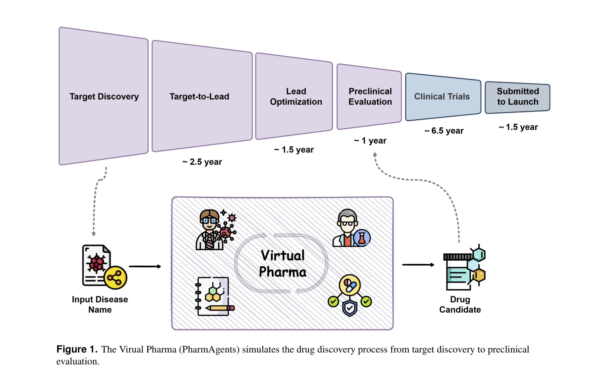
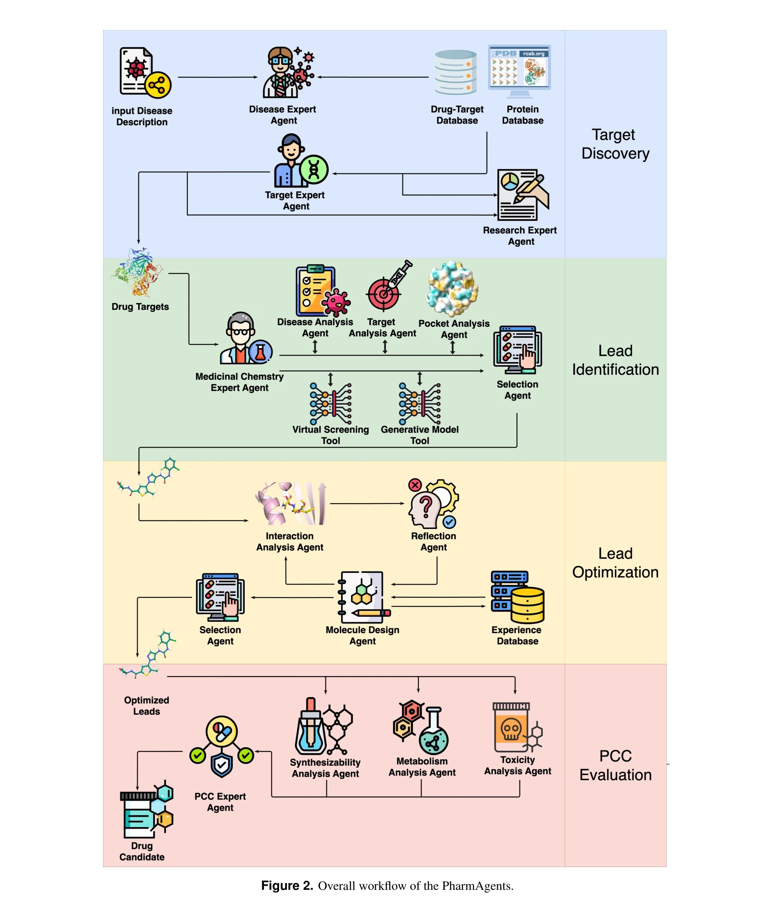
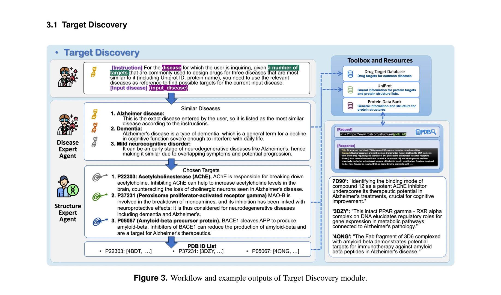
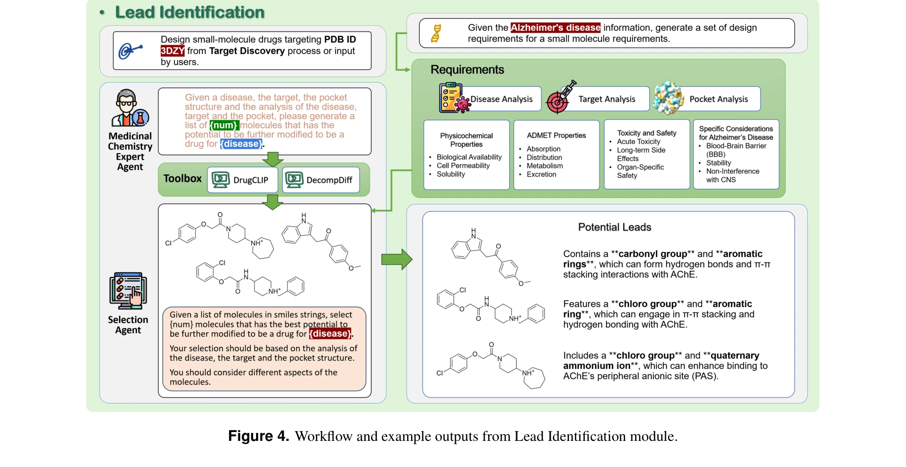
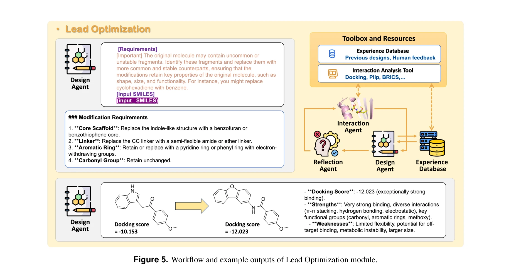

# PharmAgents: Building a Virtual Pharma with Large Language Model Agents

> **저자**: Bowen Gao, Yanwen Huang, Yiqiao Liu, Wenxuan Xie, Wei-Ying Ma, Ya-Qin Zhang, Yanyan Lan | **날짜**: 2025년 3월 31일 | **DOI**: [arXiv:2503.22164v2](https://arxiv.org/abs/2503.22164v2)

---

## Essence

 *Virtual Pharma (PharmAgents)는 약물 발견 타겟 발굴부터 전임상 평가까지의 전체 과정을 시뮬레이션한다.*

PharmAgents는 대규모 언어 모델(LLM) 기반의 다중 에이전트 협력 시스템으로, 신약 개발의 전체 워크플로우—타겟 발굴, 리드 화합물 식별, 최적화, 전임상 평가—를 자동화하고 투명하게 수행한다.

## Motivation

- **Known**: 기계학습 모델들(가상 스크리닝, 분자 생성, 독성 예측 등)이 신약 개발의 개별 단계에서 우수한 성능을 보여왔으나, 이들은 독립적으로 작동하며 설명가능성이 부족하다.

- **Gap**: (1) 신약 개발 전체 파이프라인을 통합하는 자동화 시스템의 부재, (2) AI 모델의 낮은 해석가능성으로 인한 규제 수용 한계, (3) 다학제 전문지식의 효과적 통합 부족

- **Why**: 신약 개발은 생물학, 화학, 약리학, 데이터과학 등 다양한 영역의 전문가 협력이 필수적이며, 높은 비용과 긴 개발 기간, 높은 탈락률 문제를 해결하려면 지능형 통합 시스템이 필요하다.

- **Approach**: LLM의 광범위한 지식과 추론 능력에 특화된 머신러닝 모델과 계산 도구를 결합하고, 역할 기반(role-based) 에이전트 구조로 신약 개발 파이프라인을 모듈화하여 협력 체계 구축

## Achievement

 *PharmAgents의 전체 워크플로우: 질병 정보 입력부터 최종 후보 약물 평가까지의 4개 주요 모듈*

1. **타겟 발굴의 정확성**: 18개 중 16개 타겟이 인간 전문가에 의해 적절하다고 평가됨. 질병 맥락에서 오차 누적 없이 신뢰할 수 있는 타겟과 리간드 결합 위치 확인

2. **분자 생성 및 최적화 성능**: SOTA 방법 대비 성공률을 15.72%에서 37.94%로 향상, 동일 타겟에서 질병별 맥락을 반영하여 상충하는 성질의 화합물 설계 가능

3. **전임상 평가의 견고성**: 신진대사(metabolism) 및 독성 평가에서 과소평가 위험이 12%로 낮음, 분자 합성 가능성을 정량 지표와 높은 상관성(Pearson r=0.645) 유지하며 해석 가능한 근거 제시

4. **자기진화 능력**: 과거 경험을 학습하여 향후 설계를 개선하며 성공률을 30%에서 36%로 증가

## How

 *타겟 발굴 모듈의 워크플로우와 예시 결과*

### 4개 모듈 구조:

- **Target Discovery (타겟 발굴)**: 
  - Disease Expert가 질병 설명으로부터 Drug Target Database 및 UniProt에서 3가지 병리학적 유사 질병 검색
  - Structure Expert가 PDB ID 필터링, 리간드 정보와 문헌 기반 최적 구조 선택
  - 최종 출력: PDB ID 목록 및 포켓 중심 좌표

- **Lead Identification (리드 화합물 식별)**:
   *리드 화합물 식별 모듈의 워크플로우와 예시 결과*
  - 타겟 정보, 질병 맥락, 포켓 구조 기반으로 가능성 있는 리드 화합물 생성

- **Lead Optimization (리드 최적화)**:
   *리드 최적화 모듈의 워크플로우와 예시 결과*
  - 결합 친화력(binding affinity) 및 약물 유사성(drug-likeness) 성질 개선

- **Preclinical Candidate (PCC) Evaluation (전임상 평가)**:
  - 신진대사, 독성, 합성 가능성 평가

### 기술적 특징:

- **LLM 에이전트 + 특화 도구 결합**: LLM의 추론과 지식은 3D 구조 이해 등에서의 한계를 특화 ML 모델로 보완
- **도메인 특화 프롬프트 엔지니어링**: 명확한 작업 분해와 잘 정의된 워크플로우로 일관된 실행 보장
- **구조화된 협력 프레임워크**: MetaGPT 영감을 받아 명확히 정의된 역할과 책임을 가진 다중 에이전트 시스템 설계
- **외부 데이터베이스 통합**: Drug Target Database (427개 질병, 1789개 타겟), UniProt, PDB 등 연계

## Originality

- **혁신적 패러다임**: 신약 개발 **전체 파이프라인**을 LLM 기반 다중 에이전트로 통합한 첫 사례 (기존: ChemCrow, ChemAgent 등은 개별 화학 작업만 다룸)

- **투명성과 자동화의 결합**: 높은 성능을 유지하면서도 각 단계에서 해석 가능성(interpretability) 확보—규제 환경 진입 가능성 향상

- **역할 기반 에이전트 설계**: MetaGPT의 소프트웨어 개발 패러다임을 신약 개발에 적응, 질병 전문가(Disease Expert), 구조 전문가(Structure Expert) 등 명확한 역할 정의

- **자기진화(self-evolution) 메커니즘**: 과거 경험을 요약하고 학습하여 향후 설계 개선—학습 능력 갖춘 약물 발견 시스템의 초기 사례

- **다중 출력 모드**: 단순 예측뿐 아니라 해석 가능한 근거(rationale) 제시로 과학적 신뢰도 증대

## Limitation & Further Study

- **검증 범위 제한**: 실제 실험(wet-lab) 검증이 아닌 전산 평가만 수행; 상한(upper bound) 평가 필요

- **질병 다양성 부족**: 한 가지 무작위 질병에 대해서만 인간 전문가 평가 수행, 광범위한 질병군에 대한 일반화 가능성 미검증

- **LLM 의존성**: LLM의 지식 컷-오프(knowledge cutoff) 및 환각(hallucination) 문제에 의한 제약, 외부 도구와의 상호작용에서의 오류 전파 가능성

- **생물학적 복잡성 추상화**: 실제 약물 개발의 생물학적 변동성(예: 이중특이성 약물, 유전자 치료)을 완전히 포괄하지 못함

- **후속 연구 방향**:
  - 실제 실험 검증 파이프라인 통합
  - 더 많은 질병과 타겟에 대한 광범위한 벤치마킹
  - 규제 표준(예: FDA 기준) 통합
  - 장기 약물 안전성 모니터링(pharmacovigilance) 모듈 추가
  - 종합적 약물 생명주기 관리(drug lifecycle management) 확장

## Evaluation

- Novelty: 4.5/5
- Technical Soundness: 4/5
- Significance: 4.5/5
- Clarity: 4/5
- Overall: 4.2/5

**총평**: PharmAgents는 LLM 기반 다중 에이전트 시스템을 신약 개발 전체 파이프라인에 체계적으로 적용한 획기적 사례로, 자동화와 해석가능성의 결합을 통해 규제 친화적 AI 약물 발견의 새로운 패러다임을 제시한다. 다만 실제 실험 검증과 광범위한 질병별 평가를 통해 실용성을 더욱 강화할 필요가 있다.

## Related Papers

- 🔄 다른 접근: [[papers/514_MAC-AMP_A_Closed-Loop_Multi-Agent_Collaboration_System_for_M/review]] — PharmAgents의 포괄적 신약 개발과 MAC-AMP의 항균펩타이드 특화 시스템은 서로 다른 범위에서 약물 개발을 자동화하는 접근이다.
- 🔗 후속 연구: [[papers/805_The_Virtual_Lab_of_AI_agents_designs_new_SARS-CoV-2_nanobodi/review]] — Virtual Lab의 실제 나노바디 설계 성공이 PharmAgents의 가상 제약회사 개념을 특정 단백질 영역에서 실증한 구체적 확장 사례이다.
- 🏛 기반 연구: [[papers/115_Augmenting_large_language_models_with_chemistry_tools/review]] — 화학 도구로 증강된 대규모 언어 모델이 PharmAgents의 신약 개발 전 과정 자동화를 위한 핵심적인 기술적 토대를 제공한다.
- 🔄 다른 접근: [[papers/514_MAC-AMP_A_Closed-Loop_Multi-Agent_Collaboration_System_for_M/review]] — MAC-AMP의 항균펩타이드 특화 다중 에이전트와 PharmAgents의 포괄적 신약 개발 시스템은 서로 다른 범위에서 약물 설계를 자동화하는 접근이다.
