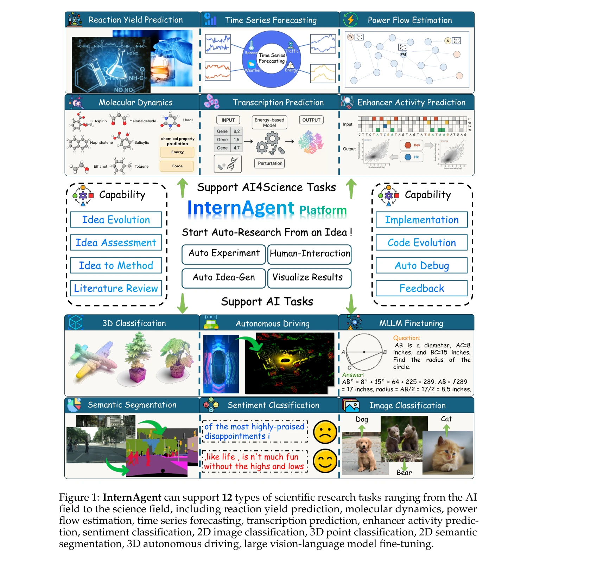
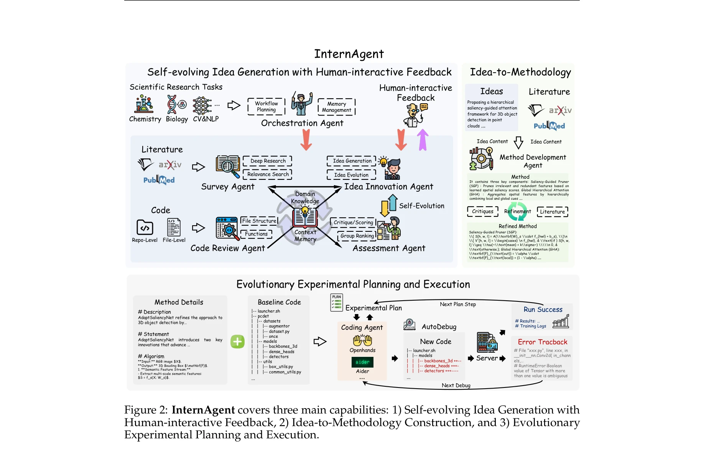
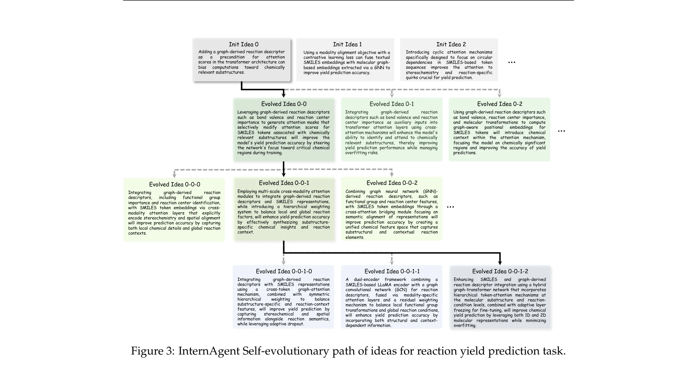

# InternAgent: When Agent Becomes the Scientist–Building Closed-Loop System from Hypothesis to Verification

> **저자**: Shanghai Artificial Intelligence Laboratory (InternAgent Team) | **날짜**: 2025 | **DOI**: [10.48550/arXiv.2505.16938](https://doi.org/10.48550/arXiv.2505.16938)

---

## Essence

*InternAgent가 지원하는 12가지 과학 연구 작업: 반응 수율 예측, 분자 동역학, 전력 흐름 추정, 시계열 예측, 전사 예측, 인핸서 활성도 예측, 감정 분류, 2D/3D 이미지 분류, 의미론적 분할, 자율 주행*

InternAgent는 대규모 언어 모델(LLM) 기반의 통합 폐루프(closed-loop) 다중 에이전트 프레임워크로, 가설 생성부터 실험 검증까지 과학 연구의 전체 사이클을 자동화하는 자율 과학 연구(Autonomous Scientific Research, ASR) 시스템이다. 이 시스템은 인간 전문가의 피드백을 통합하면서도 12개의 서로 다른 과학 분야(화학, 생물학, 컴퓨터 비전, NLP 등)에서 성능 향상을 달성했다.

## Motivation

- **Known**: 
  - LLM과 로봇공학을 활용한 자율 과학 발견(ASD)의 잠재력이 인정되고 있음
  - 데이터 분석, 가설 생성, 실험 설계, 결과 해석 자동화의 가능성

- **Gap**: 
  - 효과적이고 참신한 연구 제안(proposal)을 생성하는 어려움: AI 모델이 기존 데이터와 패턴에 의존하여 진정한 창의성과 과학적 타당성의 균형을 맞추기 어려움
  - 폐루프 피드백의 부재: 실험 설계 → 실행 → 분석 → 반복적 가설 개선의 seamless한 통합 부족
  - 예상 변수와 노이즈가 많은 실제 실험 환경에 대한 적응 능력 한계

- **Why**: 
  - 자동화된 과학 연구 시스템이 진정한 폐루프 구조를 갖춘다면, 인간 연구자의 몇 개월에 걸친 노력을 몇 시간으로 단축할 수 있음
  - 다양한 과학 분야에 확장 가능한 통합 프레임워크의 필요성

- **Approach**: 
  - 4가지 주요 모듈을 갖춘 종단간(end-to-end) 자동 연구 파이프라인 구축
  - 자체 진화 아이디어 생성(Self-Evolving Idea Generation), 인간 대화형 피드백, 아이디어-방법론 구성, 다중 라운드 실험 계획 및 실행

## Achievement

*InternAgent의 3가지 핵심 능력: 1) 인간 대화형 피드백이 있는 자체 진화 아이디어 생성, 2) 아이디어-방법론 구성, 3) 진화적 실험 계획 및 실행*

1. **성능 향상 (시간 효율성)**:
   - 반응 수율 예측(Reaction Yield Prediction): 기저선 27.6% → 35.4% (12시간 내)
   - 인핸서 활성도 예측(Enhancer Activity Prediction): 피어슨 상관계수 0.65 → 0.79 (4시간 내)
   - 2D 의미론적 분할(2D Semantic Segmentation): 정확도 78.8% → 81.0% (30시간 내)
   - 인간 연구자는 유사한 성능 향상에 수개월 소요

2. **12개 과학 분야의 확장성**: 
   - AI 작업(이미지 분류, 감정 분류) 및 과학 작업(화학, 생물학, 분자 동역학) 모두 지원
   - 단일 통합 프레임워크로 이질적인 문제 해결

3. **대규모 코드 베이스 처리**: 
   - 단순 파일 수정을 넘어 다중 파일로 구성된 프로젝트 레벨의 수정 및 디버깅 수행

## How

*반응 수율 예측 작업에 대한 InternAgent의 자체 진화 아이디어 경로*

### 2.1 자체 진화 아이디어 생성 모듈 (Self-Evolving Idea Generation)

**Survey Agent (조사 에이전트)**:
- **문헌 리뷰 모드(Literature Review Mode)**: 
  - 연구 작업을 키워드 조합으로 분해: $P : T \rightarrow K$
  - 학술 데이터베이스에서 광범위하게 논문 수집
  - 추상(abstract) 분석을 통해 관련성 평가: $R : L_{abs} \times T \rightarrow [0,1]$
  - 0~1 점수로 각 논문의 관련성 정량화

- **심층 연구 모드(Deep Research Mode)**:
  - 초기 조사 이후 관련 논문의 전문(full text) 다운로드 및 분석
  - 상세 분석으로부터 새로운 키워드 생성: $P : L \rightarrow K'$
  - 확장된 키워드 조합으로 추가 문헌 탐색

**Idea Innovation Agent**:
- 생성된 문헌으로부터 혁신적 아이디어 제안
- 기존 방법론의 한계 식별 및 개선 방향 도출

**Assessment Agent**:
- 생성된 아이디어의 품질, 참신성, 과학적 타당성 평가
- 도메인 전문가와의 협업을 통한 스코링 및 순위 매김

**Human-Interactive Feedback**:
- 인간 전문가의 평가를 통해 아이디어 개선
- AI 기반 평가와 인간 판단의 선택적 통합

### 2.2 아이디어-방법론 구성 모듈 (Idea-to-Methodology Construction)

**Method Development Agent**:
- 추상적 아이디어를 구체적, 구현 가능한 방법론으로 변환
- 알고리즘 설명, 수학적 정식화, 의사 코드(pseudocode) 작성
- 방법론의 각 모듈이 명확하게 분해되어 실험 검증 가능하도록 설계

**Code Review Agent**:
- 생성된 코드의 구문, 논리, 효율성 검토
- 에러 추적(error traceback) 분석 및 피드백

### 2.3 진화적 실험 계획 및 실행 모듈 (Evolutionary Experimental Planning and Execution)

**Coding Agent** (Openhands, Aider, AutoDebug 서버 활용):
- 아이디어에 기반한 코드 자동 생성
- 런타임 에러 자동 디버깅
- 반복적 코드 개선

**Orchestration Agent (조율 에이전트)**:
- 워크플로우 계획 및 메모리 관리
- 각 단계 간의 매끄러운 전환 관리
- 실험 피드백의 폐루프 운영

**Multi-round Experiment Loop**:
- 계획 → 실행 → 결과 분석 → 다음 단계 계획의 반복
- 각 라운드에서 성능 메트릭 추적 및 개선 평가

---

## Originality

- **폐루프 아키텍처의 진정한 구현**: 단순 아이디어 생성을 넘어 가설 검증까지 자동화된 완전한 연구 사이클 구현

- **인간-AI 협업 메커니즘**: 인간 전문가의 피드백 인터페이스를 시스템 내에 내재화하여 도메인 지식의 효과적 통합

- **다중 에이전트 전문화**: Survey, Idea Innovation, Assessment, Method Development, Code Review 등 역할별 특화된 에이전트 설계로 각 단계의 품질 향상

- **광범위한 작업 다양성**: 12개의 이질적인 과학 분야에서 동일한 프레임워크의 적용 가능성 입증

- **실제 프로젝트 규모 처리**: 단순 코드 파일이 아닌 복잡한 리포지토리 레벨의 수정 및 디버깅 자동화

---

## Limitation & Further Study

- **참신성 평가의 주관성**: 아이디어의 참신성을 정량적으로 평가하는 명확한 메트릭 부족; 인간 평가에 의존하는 경향

- **실험 환경의 제한성**: 현재 대부분의 검증이 시뮬레이션 또는 기존 데이터셋 기반이며, 실제 물리적 실험(습식 화학, 생물학 실험)과의 통합은 미흡

- **계산 비용**: 12시간~30시간의 처리 시간은 여전히 상당한 컴퓨팅 자원 요구; 스케일링에 따른 비용 최적화 필요

- **도메인 일반화의 한계**: 특정 도메인의 전문 지식이 부족한 분야에서의 성능 저하 가능성

- **후속 연구 방향**:
  - 실제 로봇 시스템과의 통합을 통한 물리적 실험 자동화
  - 더욱 강력한 폐루프 피드백 메커니즘 (불확실성 처리, 장기 실험 최적화)
  - 다중 모달(multimodal) 데이터 기반의 아이디어 생성
  - 아이디어 참신성의 정량적 평가 지표 개발

---

## Evaluation

- **Novelty (참신성)**: 4/5
  - 폐루프 자동 과학 연구 시스템의 실제 구현은 혁신적이나, 개별 컴포넌트(LLM, 코드 생성, 실험 실행)는 기존 기술의 조합

- **Technical Soundness (기술적 건전성)**: 4/5
  - 견고한 다중 에이전트 아키텍처 및 체계적 평가; 다만 수학적 정식화가 일부 모듈에서 미흡하고 실제 로봇 통합의 기술적 세부사항 부족

- **Significance (중요성)**: 5/5
  - 과학 연구의 패러다임 변화를 나타낼 수 있는 매우 중요한 작업; 다양한 분야에서의 재현 가능성과 실용성이 높음

- **Clarity (명확성)**: 3.5/5
  - 전체 시스템의 개요는 명확하나, Survey Agent의 키워드 생성 알고리즘, Assessment Agent의 평가 기준 등 세부 구현이 불명확; 논문의 일부 섹션이 요약 상태로 보임

- **Overall (종합)**: 4/5

**총평**: InternAgent는 가설 생성부터 검증까지 자동화된 폐루프 과학 연구 시스템을 구현한 의미 있는 작업이며, 12개 분야의 실제 성능 향상으로 실용성을 입증했다. 다만 일부 기술적 세부사항의 명확화와 실제 물리적 실험으로의 확장이 향후 과제이다.

## Related Papers

- 🔄 다른 접근: [[papers/285_Dolphin_Closed-loop_open-ended_auto-research_through_thinkin/review]] — InternAgent와 DOLPHIN 모두 폐쇄 루프 과학 연구 자동화를 추구하지만 다중 분야 vs 오픈엔드 접근방식이 다르다.
- 🔗 후속 연구: [[papers/794_The_AI_Scientist-v2_Workshop-Level_Automated_Scientific_Disc/review]] — AI Scientist-v2는 InternAgent의 통합 폐루프 다중 에이전트 프레임워크를 에이전트 기반 트리 서치로 발전시켜 동료 심사까지 포함한다.
- 🏛 기반 연구: [[papers/825_Towards_an_AI_co-scientist/review]] — AI 공동 과학자 연구는 InternAgent가 인간 전문가 피드백을 통합하면서 자율 과학 연구를 수행하는 이론적 기반을 제공한다.
- 🔄 다른 접근: [[papers/285_Dolphin_Closed-loop_open-ended_auto-research_through_thinkin/review]] — DOLPHIN과 InternAgent 모두 폐쇄 루프 과학 연구 자동화를 추구하지만 오픈엔드 vs 다중 분야 접근방식이 다르다.
