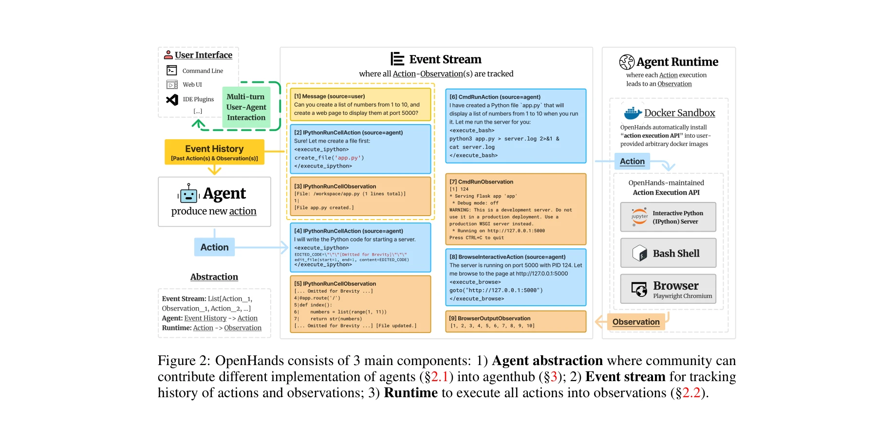
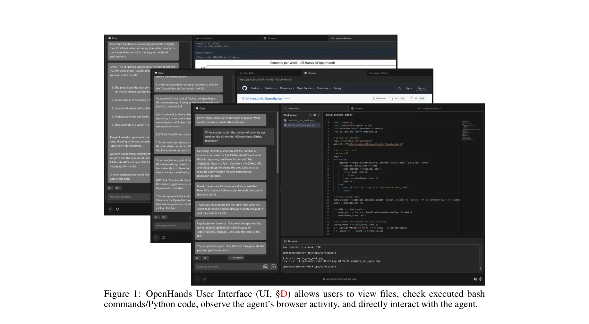
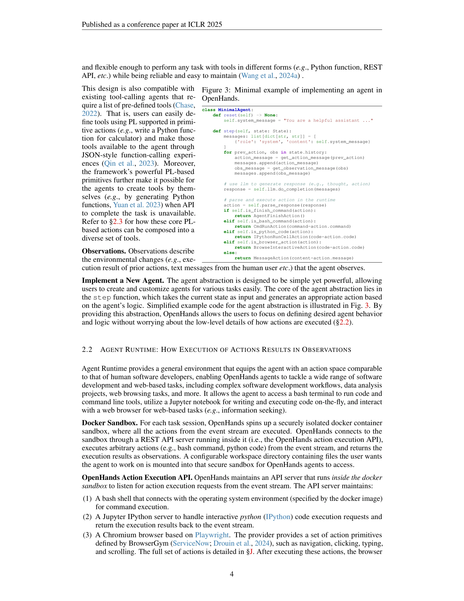

# OpenHands: AI 소프트웨어 개발자를 위한 오픈 플랫폼

> **저자**: Xingyao Wang, Boxuan Li, Yufan Song 외 다수 | **날짜**: 2024 | **DOI**: [arXiv:2407.16741](https://arxiv.org/abs/2407.16741)

---

## Essence

 *OpenHands의 3가지 주요 구성 요소: 에이전트 추상화, 이벤트 스트림, 런타임*

OpenHands는 AI 에이전트가 소프트웨어 개발자처럼 코드 작성, 명령줄 상호작용, 웹 브라우징을 통해 환경과 상호작용할 수 있도록 설계된 커뮤니티 기반 오픈소스 플랫폼이다. 188명 이상의 기여자로부터 2,100개 이상의 커밋을 받아 실제 동작하는 포괄적인 에이전트 개발 및 평가 프레임워크를 제공한다.

## Motivation

- **Known**: LLM 기반 AI 에이전트가 복잡한 작업(소프트웨어 개발, 웹 네비게이션 등)을 수행할 수 있게 발전했으며, 다양한 오픈소스 에이전트 프레임워크들이 존재한다.

- **Gap**: 기존 프레임워크들은 개별 도구 호출에 중점을 두고 있으나, 에이전트가 실제 소프트웨어 엔지니어처럼 복잡한 코드 작성/수정, 즉시 정보 수집, 안전한 환경 관리를 동시에 수행할 수 있는 통합 플랫폼이 부족하다.

- **Why**: 소프트웨어는 인간이 세상과 상호작용하는 가장 강력한 방식이며, 효율적인 소프트웨어 개발 도구 생태계(코드 편집, 컴파일, 배포)가 이미 존재하므로 AI 에이전트가 이를 활용하도록 설계하는 것이 자연스럽다.

- **Approach**: 이벤트 스트림 아키텍처, Docker 샌드박스 런타임, 프로그래밍 언어 기반 액션 프리미티브를 통해 통합된 플랫폼을 구축하고, 다중 에이전트 위임과 15개 벤치마크를 지원하는 평가 프레임워크를 제공한다.

## Achievement

 *OpenHands 사용자 인터페이스: 파일 뷰, 실행된 bash/Python 명령, 브라우저 활동, 직접 상호작용 기능*

1. **통합 에이전트 개발 플랫폼**: 10개 이상의 구현된 에이전트(CodeAct 기반 일반화 에이전트, 웹 브라우징 전문가, 코드 편집 전문가)를 포함한 에이전트 허브 제공

2. **다목적 런타임 환경**: Docker 샌드박스, Bash 셸, IPython 서버, Playwright 기반 웹 브라우저를 통해 소프트웨어 개발과 웹 기반 작업을 동시에 지원

3. **안전하고 유연한 상호작용**: 이벤트 스트림 기반 액션-옵저베이션 추적으로 에이전트-사용자 상호작용의 완전한 이력 관리 및 실시간 피드백 제공

4. **포괄적인 평가 프레임워크**: SWE-BENCH, WebArena 등 15개 벤치마크를 지원하는 통합 평가 시스템

5. **활발한 커뮤니티**: MIT 라이선스 하에서 32K GitHub 스타, 188명 기여자, 2.1K 이상의 커밋으로 산학연 협력의 실제 사례 구현

## How

 *OpenHands에서 에이전트 구현의 최소 예제: reset()과 step() 메서드*

### 에이전트 추상화 (Agent Abstraction)
- **상태 표현**: 이벤트 스트림(과거 액션-옵저베이션), LLM 호출 누적 비용, 다중 에이전트 메타데이터를 포함한 State 객체
- **핵심 액션**: IPythonRunCellAction(Python 코드 실행), CmdRunAction(Bash 명령 실행), BrowserInteractiveAction(웹 브라우징)으로 프로그래밍 언어 기반 프리미티브 제공
- **에이전트 구현**: 단순한 step(state) 함수 인터페이스로 사용자가 LLM 응답 파싱 및 액션 선택 로직만 정의하면 되도록 설계

### 런타임 환경 (Agent Runtime)
- **Docker 샌드박스**: 각 작업 세션마다 격리된 컨테이너 생성으로 보안성 보장
- **다중 도구 통합**: Bash 터미널, Jupyter 노트북(IPython), Playwright 기반 웹 브라우저를 REST API로 통신
- **자동 설정**: OpenHands가 사용자 제공 Docker 이미지에 액션 실행 API를 자동 설치

### 액션-옵저베이션 루프
- 에이전트가 상태 기반으로 액션 생성 → 런타임이 환경에서 실행 → 옵저베이션 반환 → 이벤트 스트림에 기록
- 사용자 인터페이스가 실시간으로 이벤트 스트림을 시각화하여 에이전트 동작 투명성 제공

### 다중 에이전트 위임 (Multi-Agent Delegation)
- 상태에 메타데이터를 포함하여 특화된 에이전트들이 작업을 위임받아 협력 가능
- 전체 이벤트 스트림 공유로 에이전트 간 정보 전달

## Originality

- **프로그래밍 언어 기반 액션 프리미티브**: 함수 호출 방식과 달리 임의의 코드 실행을 가능하게 하여 에이전트가 새로운 도구를 스스로 생성할 수 있는 근본적인 자유도 제공

- **이벤트 스트림 아키텍처**: 모든 액션-옵저베이션을 시간순으로 추적하여 완전한 실행 이력 관리 및 사용자-에이전트 상호작용의 투명성 확보

- **인간 소프트웨어 엔지니어 모델링**: 단순 도구 호출이 아닌 코드 작성, 컴파일, 브라우징의 통합적 워크플로우로 인간의 소프트웨어 개발 패턴을 직접 반영

- **포괄적 오픈소스 생태계**: 단순 개념이 아닌 완전히 기능하는 구현(10+ 에이전트, 15 벤치마크, 생산 수준의 런타임)을 MIT 라이선스로 공개하여 실질적 기여

- **커뮤니티 중심 설계**: 모듈화된 에이전트 추상화로 다양한 연구자/개발자가 쉽게 기여할 수 있는 구조(실제로 188명 기여자 달성)

## Limitation & Further Study

- **환경 격리의 한계**: Docker 샌드박스 기반 격리는 실시간 웹 서버 상호작용 같은 일부 시나리오에서 오버헤드와 지연 발생 가능성

- **복잡한 다중 에이전트 협력**: 현재 구현은 기본적인 위임 메커니즘만 제공하며, 더 정교한 협력 전략(e.g., 계층적 작업 분해, 동적 역할 할당)의 개발 필요

- **벤치마크 커버리지**: 15개 벤치마크는 포괄적이나 도메인별 성능 분석(e.g., 특정 프로그래밍 언어, 특수 도메인 과제)이 제한적

- **에이전트 해석성**: 이벤트 스트림은 실행 이력을 추적하지만, 에이전트의 의사결정 근거(사고 과정)를 명시적으로 저장/분석하는 메커니즘은 미흡

- **후속 연구 방향**:
  - 대규모 다중 에이전트 시스템에서 효율적인 작업 분배 전략
  - 에이전트가 스스로 에러를 감지하고 복구하는 자동 디버깅 기능 강화
  - 도메인 특화 에이전트 템플릿 라이브러리 확충
  - 실시간 성능 모니터링 및 적응형 리소스 할당

## Evaluation

- **Novelty**: 4/5  
  프로그래밍 언어 기반 액션과 이벤트 스트림 아키텍처는 기존 에이전트 프레임워크와 차별되나, 개별 기술 요소(코드 생성, 웹 브라우징)는 기존 연구 기반

- **Technical Soundness**: 5/5  
  Docker 샌드박스, REST API 통신, 모듈화된 에이전트 인터페이스 등 설계가 견고하며, 실제 구현과 평가가 충분하게 검증됨

- **Significance**: 5/5  
  32K 스타, 188명 기여자로 실제 커뮤니티 영향력이 증명되었으며, AI 에이전트 개발의 실질적 표준 플랫폼으로 작용 중

- **Clarity**: 4/5  
  아키텍처와 사용 방법이 명확하게 설명되었으나, 복잡한 다중 에이전트 사례와 런타임 세부 사항은 추가 문서화 필요

- **Overall**: 4.5/5  
  **총평**: OpenHands는 AI 에이전트를 위한 실용적이고 확장 가능한 플랫폼으로서 현재 가장 포괄적인 오픈소스 구현을 제공하며, 강력한 커뮤니티 지원과 함께 소프트웨어 공학 및 웹 기반 AI 작업의 새로운 벤치마크를 설정했다. 다만 다중 에이전트 협력과 해석성 측면에서는 추가 고도화의 여지가 있다.

## Related Papers

- 🔄 다른 접근: [[papers/590_Openhands_An_open_platform_for_ai_software_developers_as_gen/review]] — 소프트웨어 개발 에이전트 플랫폼의 서로 다른 구현 접근법과 커뮤니티 구축 방식을 비교한다.
- 🧪 응용 사례: [[papers/782_SWE-bench_Can_Language_Models_Resolve_Real-World_GitHub_Issu/review]] — 실제 GitHub 이슈 해결이라는 구체적 작업에서 플랫폼의 실용성을 검증할 수 있는 벤치마크를 제공한다.
- 🏛 기반 연구: [[papers/362_From_LLMs_to_LLM-based_Agents_for_Software_Engineering_A_Sur/review]] — LLM 기반 소프트웨어 엔지니어링 에이전트 연구의 포괄적 이론적 배경을 제공한다.
- 🔄 다른 접근: [[papers/416_Hyperagent_Generalist_software_engineering_agents_to_solve_c/review]] — HYPERAGENT의 멀티에이전트 소프트웨어 개발과 OpenHands의 오픈 플랫폼 접근은 AI 기반 코딩 작업 자동화를 서로 다른 아키텍처로 해결한다.
- 🔄 다른 접근: [[papers/205_Chatdev_Communicative_agents_for_software_development/review]] — ChatDev와 OpenHands는 모두 LLM 기반 소프트웨어 개발을 다루지만, 에이전트 간 통신 중심과 오픈 플랫폼 기반이라는 서로 다른 구현 철학을 가집니다.
