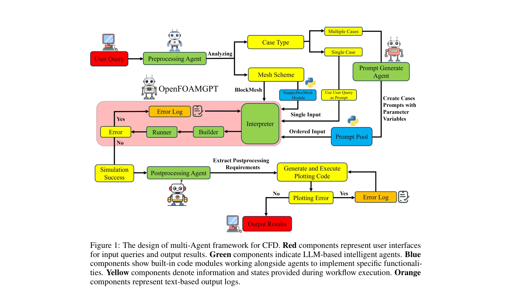
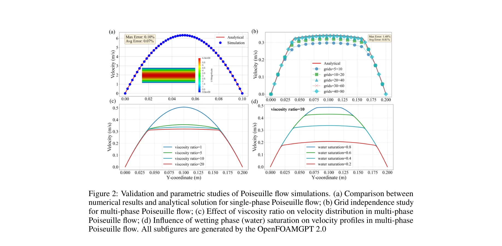
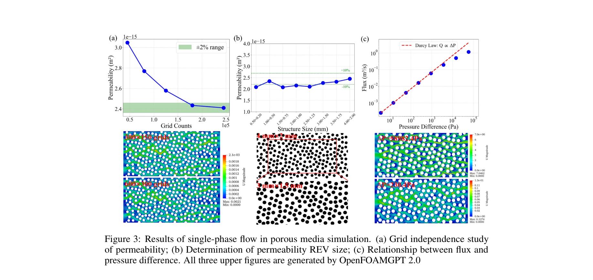

# OpenFOAMGPT 2.0: end-to-end, trustworthy automation for computational fluid dynamics

> **저자**: Jingsen Feng, Ran Xu, Xu Chu | **날짜**: 2025-04-27 | **DOI**: [10.48550/arXiv.2504.19338](https://doi.org/10.48550/arXiv.2504.19338)

---

## Essence

*Figure 1: 전산유체역학(CFD)을 위한 다중에이전트 프레임워크 설계. 빨강색은 사용자 인터페이스, 녹색은 LLM 기반 에이전트, 파랑색은 코드 모듈을 나타냄*

자연어 질의(natural language query)로부터 완전 자동화된 CFD 시뮬레이션을 수행하는 첫 번째 다중에이전트 프레임워크를 제안한다. 전처리, 프롬프트 생성, 시뮬레이션, 후처리의 네 가지 특화된 에이전트가 협력하여 450건 이상의 시뮬레이션에서 100% 성공률을 달성했다.

## Motivation

- **Known**: 대규모 언어모델(LLM)의 발전으로 다중에이전트 시스템이 사회학, 경제학, 의학, 공학 등 다양한 분야에서 복잡한 과제 해결에 탁월함
- **Gap**: CFD는 정밀한 수치 명세, 복잡한 기하학 처리, 고급 물리 모델링이 필요하나, LLM-CFD 통합은 신뢰성과 자동화 측면에서 미충분함
- **Why**: CFD의 높은 진입장벽과 노동집약적 워크플로우로 인해 접근성이 제한되어 있으며, 자동화를 통해 과학 계산의 민주화가 가능
- **Approach**: 특화된 에이전트 4개를 설계하여 자연어에서 최종 시각화까지 전 과정을 자동화하고, 엄격한 신뢰성 검증 수행

## Achievement

*Figure 2: Poiseuille 유동 시뮬레이션의 검증 및 매개변수 연구 결과*

1. **완전 자동화 달성**: 450건 이상의 다양한 시뮬레이션(Poiseuille 유동, 다공질 매질 유동, 공기역학)에서 100% 성공률과 재현성 입증

2. **신뢰성 검증**: 제로-톨러런스(zero-tolerance) 과학 계산 애플리케이션에 필요한 신뢰성 표준 달성 확인

3. **접근성 개선**: 자연어 기반 인터페이스를 유지하면서 계산물리의 엄격한 요구사항 충족

## How

*Figure 3: 다공질 매질 단상 유동 시뮬레이션 결과 및 격자 독립성 연구*

### 다중에이전트 아키텍처

- **전처리 에이전트(Pre-processing Agent)**: 사용자 질의 분석 → 단일 케이스 vs. 매개변수 연구 분류 → 격자 생성 전략 결정(blockMesh 또는 snappyHexMesh)

- **프롬프트 생성 에이전트(Prompt Generation Agent)**: 적응형 프롬프트 엔지니어링 파이프라인 구현 → 다중 케이스 시나리오에서 각 시뮬레이션별 전용 프롬프트 생성 → 프롬프트 풀(Prompt Pool) 저장소 관리

- **OpenFOAMGPT 에이전트(핵심 시뮬레이션 엔진)**:
  - 설정 파일 생성: 시스템 프롬프트와 케이스별 프롬프트 결합 → 온도(temperature) 0으로 설정하여 결정론적 출력 보장
  - 자동 실행 관리: OpenFOAM v2406 Docker 컨테이너 활용 → 표준화된 재현 가능한 실행 환경 제공
  - 오류 기반 반복 개선: 시뮬레이션 실패 시 오류 로그 캡처 → LLM 피드백을 통한 폐루프 학습으로 자동 수정

- **후처리 에이전트(Post-processing Agent)**: 시뮬레이션 출력 자동 접근/분석 → NumPy/Matplotlib 활용 Python 스크립트 생성 → 출판 품질 시각화 및 Paraview VTK 파일 제공 → 매개변수 민감도 플롯 자동 생성

## Originality

- **첫 번째 완전 자동화 CFD 다중에이전트 프레임워크**: 자연어에서 최종 결과 시각화까지 인간 개입 없이 처리하는 end-to-end 자동화 달성

- **혁신적 프롬프트 생성 전략**: 파일 수정 방식 대신 각 케이스별 전용 프롬프트 생성으로 OpenFOAM의 엄격한 문법 요구사항 우회 → 다변수 매개변수 연구에서 오류 감소

- **자가 수정 루프(Self-correcting Loop)**: 오류 기반 피드백을 통한 폐루프 학습으로 LLM의 신뢰성 향상 → 과학 계산 요구사항 충족

- **신뢰성 검증 프레임워크**: 과학 계산의 엄격한 표준에 맞는 다중에이전트 시스템의 신뢰성 실증

## Limitation & Further Study

- **한계**:
  - 450개 시뮬레이션 검증이 주로 기본적인 유동 사례 중심이므로, 극단적 매개변수 범위(매우 높은 Reynolds 수, 비선형 물리 현상)에 대한 검증 부족
  - 본문이 15,000자까지만 제공되어 세부 실험 설계 및 실패 케이스 분석이 불완전
  - 계산 비용(computational cost)과 기존 CFD 소프트웨어 대비 성능 비교 미제시

- **후속 연구**:
  - 구조 최적화(topology optimization), 다물리 문제(multi-physics) 등 고급 CFD 애플리케이션 확장
  - 대규모 산업용 사례(항공우주, 자동차) 적용 검증
  - 오류 분류 및 진단 능력 강화로 더 복잡한 실패 케이스 처리
  - 사용자 피드백 루프를 통한 적응형 프롬프트 최적화

## Evaluation

| 평가 항목 | 점수 | 의견 |
|---------|------|------|
| **Novelty (독창성)** | 4.5/5 | 다중에이전트 CFD 자동화 프레임워크는 첫 시도이며, 프롬프트 생성 전략과 자가 수정 루프가 혁신적. 다만 기반 기술(OpenFOAMGPT)은 기존 연구 기반 |
| **Technical Soundness (기술적 건전성)** | 4/5 | 시스템 설계는 견고하고 온도 0 설정으로 결정론적 출력 보장. 다만 본문 제한으로 인한 상세 알고리즘 검증 부족 |
| **Significance (중요성)** | 4/5 | CFD 접근성 개선과 과학 계산 자동화라는 중요한 주제. 450건 시뮬레이션의 100% 성공률은 실용적 가치 입증. 그러나 산업 규모 검증 필요 |
| **Clarity (명확성)** | 4/5 | 아키텍처와 각 에이전트 역할이 명확하게 설명됨. Figure 1이 전체 구조를 잘 시각화. 다만 본문 제약으로 일부 세부 구현 불명확 |
| **Overall (종합)** | 4.1/5 | 우수 |

**총평**: 본 논문은 자연어 기반 CFD 자동화의 선구적 연구로, 다중에이전트 프레임워크의 높은 신뢰성과 재현성을 입증했다. 특히 프롬프트 생성 전략과 오류 기반 자가 수정 메커니즘은 LLM 기반 과학 계산 시스템의 설계 원칙으로서 중요한 기여이나, 극단적 조건과 산업용 사례에 대한 검증 확대가 필요하다.

## Related Papers

- 🔄 다른 접근: [[papers/535_MetaOpenFOAM_an_LLM-based_multi-agent_framework_for_CFD/review]] — OpenFOAMGPT 2.0과 MetaOpenFOAM은 모두 CFD 시뮬레이션 자동화를 다루지만, end-to-end 자동화와 다중 에이전트 협업이라는 서로 다른 접근 방식을 채택합니다.
- 🏛 기반 연구: [[papers/232_CodePDE_An_Inference_Framework_for_LLM-driven_PDE_Solver_Gen/review]] — OpenFOAMGPT 2.0의 자연어에서 PDE 해석 기능은 CodePDE가 제공하는 LLM 기반 PDE 솔버 생성 프레임워크를 기반으로 구현되었습니다.
