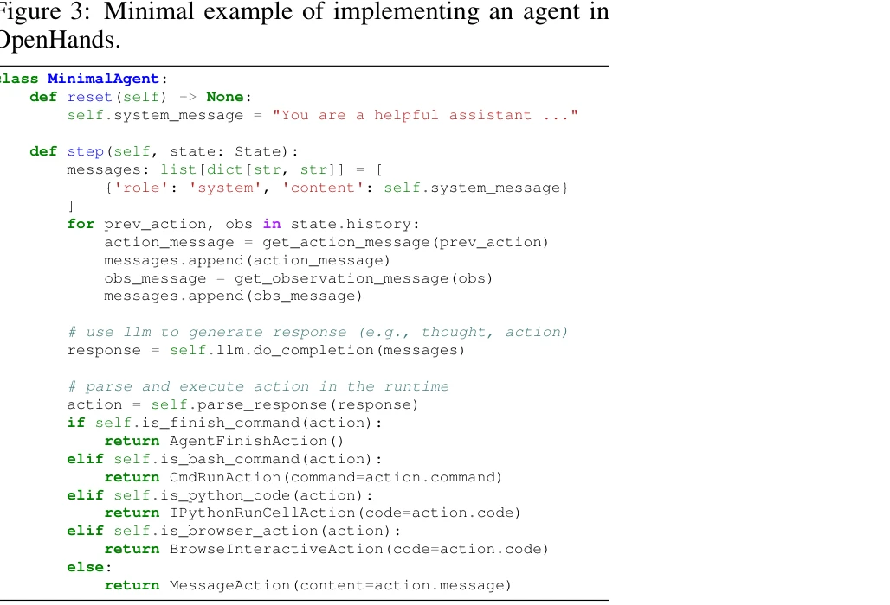

# Openhands: An open platform for ai software developers as generalist agents

> **저자**: Xingyao Wang, Boxuan Li, Yufan Song, Frank F. Xu, Xiangru Tang, Mingchen Zhuge, Jiayi Pan, Yueqi Song, Bowen Li, Jaskirat Singh, Hoang H. Tran, Fuqiang Li, Ren Ma, Mingzhang Zheng, Bill Qian, Yanjun Shao, Niklas Muennighoff, Yizhe Zhang, Binyuan Hui, Junyang Lin | **날짜**: 2024 | **DOI**: N/A

---

## Essence

 *OpenHands의 3가지 주요 구성요소: 1) Agent 추상화, 2) Event Stream, 3) Runtime*

OpenHands는 LLM 기반 AI 에이전트가 소프트웨어 개발자처럼 코드 작성, 명령행 인터페이스 조작, 웹 브라우징을 통해 세계와 상호작용할 수 있는 개방형 플랫폼이다. MIT 라이선스로 공개된 커뮤니티 프로젝트로, 188명 이상의 기여자로부터 2,100회 이상의 기여를 받았다.

## Motivation

- **Known**: 최근 LLM 기반 AI 에이전트들이 소프트웨어 개발(SWE-Bench), 웹 네비게이션(WebArena) 등 복잡한 작업을 수행할 수 있게 되었으나, 이들의 개발과 평가는 여전히 도전적이다.

- **Gap**: 기존 오픈소스 에이전트 프레임워크들은 함수 호출, 환경 제공, 상호작용 메커니즘을 제공하지만, 소프트웨어 엔지니어처럼 복잡한 소프트웨어 시스템에서 코드를 생성·수정하고, 동적으로 정보를 수집하며, 개발 중 안전성을 보장할 수 있는 통합적이고 체계적인 플랫폼이 부족하다.

- **Why**: 소프트웨어는 인간이 세계와 상호작용하는 가장 강력한 도구이며, 효율적인 소프트웨어 개발 도구와 프랙티스가 잘 정립되어 있으므로, AI 에이전트도 이를 통해 복잡하게 세계와 상호작용해야 한다.

- **Approach**: 이벤트 스트림 기반 아키텍처, Docker 샌드박스 런타임, CodeAct 기반의 범용 액션 인터페이스(IPython, Bash, 브라우저), 멀티 에이전트 위임(delegation), 15개 벤치마크 기반 평가 프레임워크를 포함한 통합 플랫폼을 제시한다.

## Achievement

 *OpenHands 사용자 인터페이스: 파일 뷰, 실행된 명령어/코드, 브라우저 활동, 에이전트 상호작용 표시*

1. **통합 플랫폼 제공**: 에이전트 정의, 액션 실행, 관찰(Observation) 수집을 위한 일관된 추상화를 제공하여, 사용자들이 복잡한 저수준 세부사항 없이 에이전트를 쉽게 개발할 수 있게 함.

2. **포괄적 액션 공간**: IPythonRunCellAction, CmdRunAction, BrowserInteractiveAction이라는 핵심 액션을 통해 소프트웨어 엔지니어링 대부분의 작업을 커버하는 동시에, 프로그래밍 언어 기반 접근으로 임의의 도구 통합을 가능하게 함.

3. **안전한 실행 환경**: 각 세션마다 Docker 컨테이너 샌드박스를 생성하여 에이전트의 코드 실행을 안전하게 격리시키며, REST API를 통한 연결로 신뢰성을 확보.

4. **다양한 에이전트 구현**: CodeAct 기반 범용 에이전트 외에도 웹 브라우징 전문가(ServiceNow), 코드 편집 전문가(Yang et al., 2024) 등 10개 이상의 에이전트를 제공.

5. **광범위한 평가**: SWE-Bench, WebArena 등을 포함한 15개 벤치마크로 다양한 소프트웨어 엔지니어링 및 웹 기반 작업에 대한 에이전트 성능을 종합 평가.

## How

 *OpenHands에서 에이전트 구현의 최소 예제: reset() 메서드와 step() 메서드로 구성*

**아키텍처 및 구현 방식:**

- **Event Stream 기반 상태 관리**: 에이전트가 과거의 모든 액션과 관찰을 시간순 리스트로 유지하여, 컨텍스트 윈도우 내에서 전체 실행 히스토리에 접근 가능하게 구성. 이는 LLM의 추론에 필요한 충분한 정보를 제공함.

- **간단한 에이전트 추상화**: 모든 에이전트는 `reset()`과 `step(state)` 메서드만 구현하면 되므로, 사용자는 에이전트의 핵심 로직(시스템 메시지, 응답 파싱)에만 집중 가능.

- **프로그래밍 언어 기반 액션**: IPython 코드 실행, Bash 명령 실행, BrowserGym 기반 브라우징을 코어 액션으로 제공하여, 이들의 조합으로 거의 모든 작업을 수행 가능하게 함. 기존의 JSON 함수 호출 방식과도 호환 가능.

- **Docker 샌드박스 격리**: 각 세션마다 독립적인 Docker 컨테이너를 생성하여, 에이전트의 잠재적으로 위험한 코드 실행(파일 삭제, 시스템 변경 등)을 호스트 시스템으로부터 안전하게 격리.

- **멀티 에이전트 위임**: 상태 내의 메타데이터를 활용하여 특정 작업을 다른 전문가 에이전트에게 위임할 수 있으며, 위임된 에이전트의 결과를 원래 에이전트로 반환하는 메커니즘 지원.

- **사용자 인터페이스**: 웹 기반 채팅 UI를 통해 에이전트의 실행 중인 액션을 실시간으로 시각화하고, 사용자가 실시간으로 피드백을 제공할 수 있도록 설계.

## Originality

- **Event Stream 추상화**: 액션-관찰(Action-Observation) 쌍을 명확하게 구조화하여, 에이전트 상태 관리를 체계적이고 확장 가능하게 설계한 점이 기존 프레임워크 대비 우수함.

- **Programming Language 기반 액션**: 함수 호출(tool calling) 방식 대신 코드 실행을 주요 인터페이스로 선택하여, 에이전트가 새로운 도구를 자동으로 생성할 수 있는 유연성 제공.

- **포괄적 플랫폼 통합**: 에이전트 구현, 런타임, 환경 격리, 멀티 에이전트 조율, 평가 벤치마크를 모두 하나의 프레임워크에 통합한 완성도 높은 오픈소스 솔루션.

- **커뮤니티 드리븐 개발**: 188명 이상의 기여자로부터 2,100회 이상의 기여를 받으며, 학계와 산업계의 다양한 이해관계자가 참여하는 활발한 오픈소스 에코시스템 구축.

## Limitation & Further Study

- **평가의 제한성**: 현재 15개 벤치마크로 평가하고 있지만, 실제 소프트웨어 엔지니어링의 다양한 도메인(컨테이너 관리, 데이터베이스 조작, 대규모 코드베이스 분석 등)을 충분히 커버하는지 미명확함.

- **멀티 에이전트 조율의 복잡성**: 여러 에이전트를 효과적으로 조율하는 전략이나 위임 판단 메커니즘에 대한 상세한 분석이 부족하며, 에이전트 간 충돌이나 비효율성이 발생할 수 있는 경우에 대한 논의 필요.

- **보안 및 샌드박스 한계**: Docker 기반 격리가 완벽하지 않을 수 있으며, 에이전트가 생성하는 악의적 코드에 대한 보안 검증 메커니즘이 상세하게 기술되지 않음.

- **LLM 의존성**: 에이전트의 성능이 LLM 모델의 능력에 크게 의존하므로, 더 약한 LLM 모델이나 특정 도메인 LLM에서의 성능 차이를 평가할 필요 있음.

- **후속 연구 방향**:
  - 더 많은 벤치마크와 도메인별 특화된 작업에 대한 평가 확대
  - 멀티 에이전트 협력 전략의 최적화 및 형식화
  - 에이전트 생성 코드에 대한 자동 검증 및 보안 검사 기법 개발
  - 장기 실행(long-horizon) 작업에서의 컨텍스트 관리 및 효율성 개선

## Evaluation

- **Novelty**: 4/5 — Event Stream 기반 추상화와 프로그래밍 언어 중심 액션 인터페이스는 기존 에이전트 프레임워크에 비해 새로운 관점이지만, 개별 구성 요소들(Docker 격리, 코드 실행 등)은 기존 기술의 조합.

- **Technical Soundness**: 4/5 — 아키텍처 설계가 체계적이고 구현이 실용적이나, 보안 보장, 멀티 에이전트 조율 알고리즘 등 일부 기술적 세부사항에 대한 형식화가 부족.

- **Significance**: 5/5 — 포괄적인 오픈소스 플랫폼으로 AI 에이전트 연구와 실제 응용을 크게 촉진할 수 있으며, 이미 2,100회 이상의 커뮤니티 기여와 32K GitHub 스타로 높은 임팩트를 입증함.

- **Clarity**: 4/5 — 논문의 구조가 명확하고 예제 코드가 유용하지만, 런타임 워크플로우나 멀티 에이전트 조율 메커니즘에 대한 상세 설명이 본문에서 일부 생략됨(섹션 참조로 대체).

- **Overall**: 4.25/5

**총평**: OpenHands는 LLM 기반 AI 에이전트의 개발과 평가를 위한 포괄적이고 실용적인 오픈소스 플랫폼으로, 이벤트 스트림 기반 추상화와 프로그래밍 언어 중심 액션 인터페이스를 통해 체계적인 설계를 제시한다. 광범위한 커뮤니티 참여와 이미 달성한 높은 임팩트에도 불구하고, 보안 보장, 멀티 에이전트 조율, 장기 실행 작업 등에서 기술적 심화가 필요하며, 더욱 다양한 실제 응용 사례와 도메인별 평가 확대가 향후 과제이다.

## Related Papers

- 🏛 기반 연구: [[papers/849_UI-TARS_Pioneering_Automated_GUI_Interaction_with_Native_Age/review]] — 일반적인 AI 소프트웨어 개발 플랫폼이 네이티브 GUI 에이전트의 기반이 됩니다.
- 🔄 다른 접근: [[papers/586_Opendevin_An_open_platform_for_ai_software_developers_as_gen/review]] — 소프트웨어 개발 에이전트 플랫폼의 서로 다른 구현 접근법과 커뮤니티 구축 방식을 비교한다.
