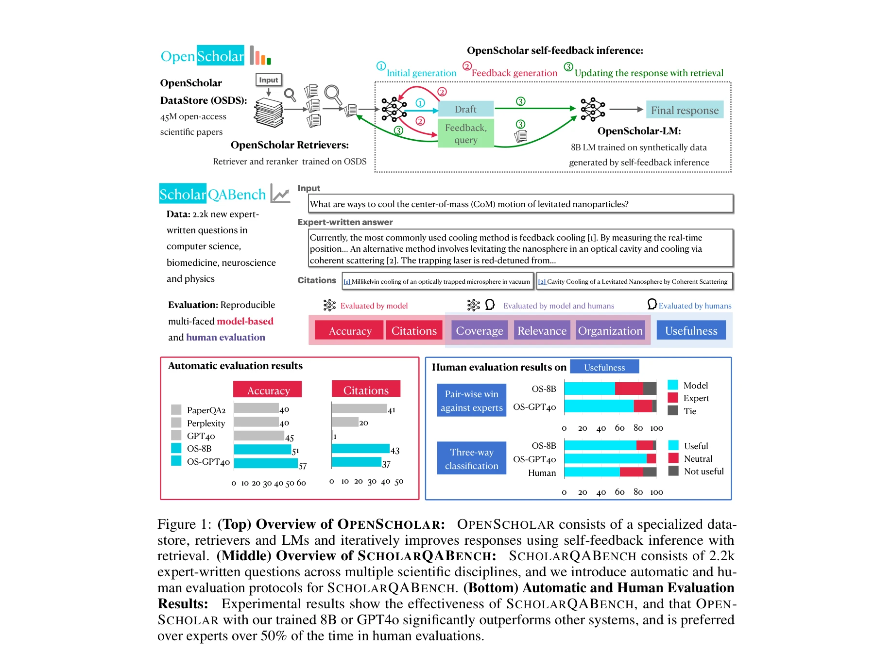
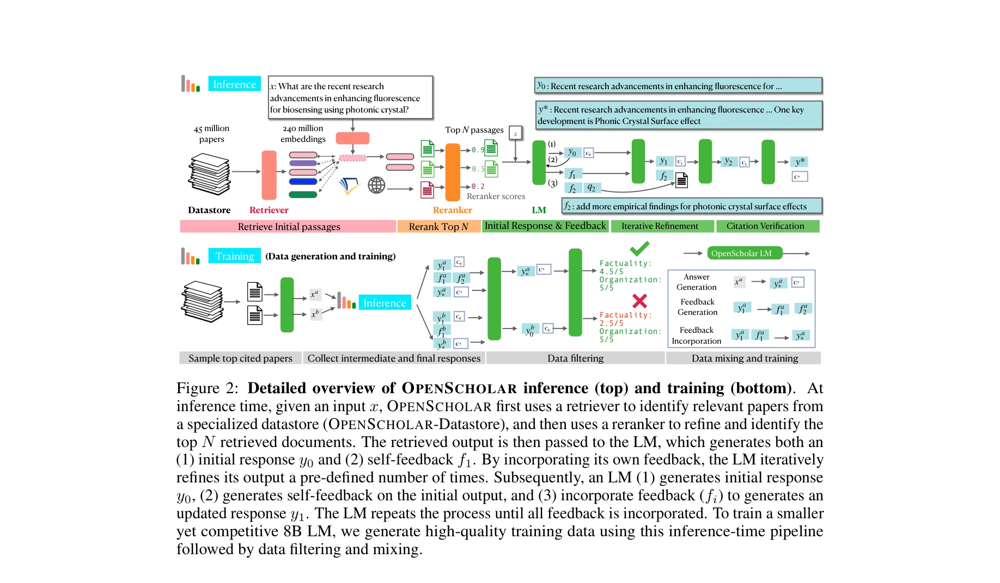

# Openscholar: Synthesizing scientific literature with retrieval-augmented lms

> **저자**: Akari Asai, Jacqueline He, Rulin Shao, Weijia Shi, Amanpreet Singh, Joseph Chee Chang, Kyle Lo, Luca Soldaini, Sergey Feldman, Mike D'Arcy, David Wadden, Matt Latzke, Mingliang Tian, Peng Ji, Shengyan Liu, Tong Hao, Borong Wu, Yi Xiong, Luke Zettlemoyer, Graham Neubig | **날짜**: 2024 | **DOI**: 

---

## Essence

*OpenScholar의 전체 개요: 전문화된 데이터스토어, 검색기 및 언어모델로 구성되며, 검색 기반 자체 피드백 추론 루프를 통해 반복적으로 응답을 개선한다.*

본 논문은 4,500만 개의 오픈 액세스 과학 논문에서 관련 구절을 검색하고 인용 기반 응답을 합성하는 검색 증강 대규모 언어모델(RAG-LM) 기반 시스템 OpenScholar를 제안하며, 함께 과학 논문 합성 평가를 위한 대규모 벤치마크 ScholarQA-Bench를 소개한다.

## Motivation

- **Known**: 대규모 언어모델(LLM)은 과학 문헌 합성에 도움을 줄 수 있지만, 환각(hallucination), 구식 학습 데이터, 투명한 인용 부족 등의 심각한 한계를 가지고 있다. 특히 GPT-4는 최신 문헌 인용 시 78-90%의 사례에서 가짜 인용을 생성한다.

- **Gap**: 기존 문헌 검색 시스템은 독점 API나 일반용 LLM에 의존하거나, 평가가 단일 분야의 소규모 인간 평가에 제한되어 있으며, 현실적인 다중 논문 합성 작업을 평가하기 어렵다.

- **Why**: 과학 연구자들의 급증하는 문헌을 효과적으로 종합하려면, 정확한 검색, 신뢰할 수 있는 인용 속성, 실시간 현재 문헌 접근이 필수적이다.

- **Approach**: 과학 문헌 전문화 데이터스토어(45M 논문), 학습된 검색기와 재순위 지정기, 자체 피드백 반복 개선 루프를 포함한 통합 RAG 시스템을 구축하고, 전문가가 작성한 질의-응답 쌍(2,967개)으로 구성된 ScholarQA-Bench 벤치마크를 개발한다.

## Achievement

*OpenScholar의 상세한 추론(상) 및 학습(하) 파이프라인. 추론 시에는 검색기를 통해 관련 논문을 식별하고 재순위 지정기로 상위 N개를 정제한 후, LM이 초기 응답과 자체 피드백을 생성하여 반복적으로 개선한다.*

1. **성능 우수성**: OpenScholar-8B가 GPT-4o보다 정확도에서 5%, PaperQA2보다 7% 우수한 성능을 보이며, GPT-4o의 인용 환각률(78-90%)을 인간 전문가 수준으로 개선(인용 정확도 대폭 향상)

2. **인간 평가 선호도**: OpenScholar-8B는 전문가 작성 응답 대비 51% 승률, OpenScholar-GPT4o는 70% 승률을 달성하여 GPT-4o의 32%를 크게 상회

3. **범용성**: OpenScholar 파이프라인이 GPT-4o 개선(정확도 12% 향상), 오픈소스 모델 학습(OpenScholar-8B), 검색기 학습 등 다양한 용도로 활용 가능

4. **자원 공개**: 코드, 학습된 모델 체크포인트, 45M 논문 데이터스토어(237M 임베딩), ScholarQA-Bench 데이터셋, 공개 데모 전부 공개

## How

*OpenScholar의 상세 구조: (1)검색 단계: 질의로부터 데이터스토어의 관련 구절 검색, (2)재순위: 신경망 재순위 지정기로 상위 N개 정제, (3)생성: LM이 초기 응답 생성, (4)피드백: LM이 자신의 출력에 대해 자연언어 피드백 생성, (5)반복 개선: 피드백을 반영하여 응답 업데이트를 여러 번 수행*

- **OpenScholar-DataStore (OSDS)**: Semantic Scholar에서 수집한 45M 개의 오픈 액세스 논문과 237M 개의 대응 구절 임베딩으로 구성된 전문화된 데이터스토어

- **검색 및 재순위 지정**: 기본 검색기로 후보 문서 식별 후, 학습된 신경망 재순위 지정기가 상위 N개 구절 선별하여 검색 품질 향상

- **자체 피드백 반복 개선 (Self-Feedback Inference Loop)**: 
  - (1) 초기 응답 y₀ 생성
  - (2) 응답에 대한 자연언어 피드백 f₁ 생성 (예: "더 많은 실증적 발견 추가")
  - (3) 피드백을 반영하여 개선된 응답 y₁ 생성
  - 이 과정을 미리 정의된 횟수만큼 반복

- **인용 검증**: 생성된 인용이 실제 논문과 구절에 대응되는지 자동 검증

- **학습 데이터 생성**: 데이터스토어의 샘플링된 논문에서 합성 질의 및 지시사항 생성 → OpenScholar 추론 파이프라인 실행 → 중간 및 최종 출력을 활용하여 OpenScholar-8B 학습

- **ScholarQA-Bench**: 컴퓨터과학, 물리학, 신경과학, 생의학 4개 분야의 2,967개 전문가 작성 질의와 208개 장문형 응답(평균 작성 시간 1시간, Ph.D./박후 작성자)

- **다면적 평가**: 인용 정확도, 사실 정확성, 내용 커버리지, 응집성, 전체 품질을 자동 지표와 인간 평가로 측정

## Originality

- **최대 규모 공개 과학 데이터스토어**: 4,500만 개 논문의 전문화된 검색 가능 데이터스토어는 기존 공개 자원 중 최대 규모

- **다중 분야 전문가 기준 벤치마크**: 4개 과학 분야의 2,967개 질의와 전문가(Ph.D./박후) 작성 장문형 응답으로 구성된 ScholarQA-Bench는 현실적인 다중 논문 합성 작업의 평가 기준 제시

- **자체 피드백 반복 개선 루프의 실용화**: LM의 자체 피드백을 활용한 반복 개선이 추론 시간과 학습 모두에서 일관된 성능 향상을 도출

- **확장 가능한 RAG 프레임워크**: 개발된 파이프라인이 다양한 기반 모델(오픈소스 8B, GPT-4o 등)과 호환되며 성능 향상을 보임

- **포괄적 공개**: 모든 코드, 모델 체크포인트, 데이터스토어, 벤치마크, 공개 데모를 함께 제공하여 재현성과 확장성 극대화

## Limitation & Further Study

- **검색 품질 의존성**: 시스템의 성능이 초기 검색 단계의 품질에 상당히 의존하며, 매우 전문적이거나 최신 분야의 논문 검색 성능 한계 가능성

- **인용 정확도 검증**: 자동 인용 검증이 모든 오류를 포착하지 못할 수 있으며, 구절 수준의 정밀한 매칭에서 거짓 양성 가능성

- **계산 비용**: 반복적 피드백 루프로 인한 추론 시간 증가 (여러 번의 LM 호출 필요)

- **도메인 편향**: 오픈 액세스 논문 중심 데이터스토어로 인한 특정 출판사나 학파에 대한 편향 가능성

- **후속 연구 방향**:
  - 매우 새로운 논문(최근 수개월)에 대한 검색 성능 개선
  - 다중 언어 과학 문헌 지원 확대
  - 인용 검증의 더욱 정교한 자동화 방법 개발
  - 실시간 논문 인덱싱 갱신 메커니즘 구현
  - 도메인 특화 LM의 추가 학습 및 최적화

## Evaluation

- **Novelty (독창성)**: 4.5/5
  - 최대 규모 공개 과학 데이터스토어와 다중 분야 전문가 벤치마크의 구축이 우수하나, 자체 피드백 반복 개선의 기본 개념은 기존 연구의 적용

- **Technical Soundness (기술적 건전성)**: 4.5/5
  - 검색, 재순위, 생성, 피드백 루프의 각 단계가 체계적으로 설계되고 구현되었으나, 일부 설계 선택(피드백 반복 횟수, 재순위 top-N 크기 등)에 대한 상세 정당화 부족

- **Significance (중요도)**: 4.5/5
  - 과학 문헌 합성이라는 실질적 문제 해결 및 인용 정확도 개선의 실무적 가치가 높으나, 생의학/신경과학 등 특정 분야에 제한된 평가

- **Clarity (명확성)**: 4/5
  - 시스템 구조와 파이프라인이 명확하게 설명되었으나, 일부 기술적 세부 사항(LM 학습 데이터 필터링, 재순위 지정기 아키텍처)에 대한 상세 설명 부족

- **Overall (종합)**: 4.4/5

**총평**: 본 논문은 과학 문헌 합성을 위한 현실적이고 포괄적인 RAG 시스템을 제시하며, 최대 규모의 공개 데이터스토어와 다중 분야 전문가 벤치마크를 통해 중요한 평가 기반을 마련했다. 특히 인용 정확도 개선과 전문가 수준의 성능 달성이 실무적 가치가 크며, 모든 자원을 공개하여 재현성과 확장성을 확보한 점이 우수하다.

## Related Papers

- 🔗 후속 연구: [[papers/335_Few-shot_Learning_with_Retrieval_Augmented_Language_Models/review]] — 소규모 검색 증강 모델의 기본 개념을 4천500만 개 논문을 다루는 대규모 과학 문헌 시스템으로 발전시킨 연구입니다.
- 🔄 다른 접근: [[papers/224_Clinical_entity_augmented_retrieval_for_clinical_information/review]] — 일반적인 과학 문헌 검색 합성과 임상 도메인 특화 엔티티 기반 검색이라는 서로 다른 전문 분야 접근법입니다.
- 🏛 기반 연구: [[papers/812_TLDR_Extreme_Summarization_of_Scientific_Documents/review]] — 과학 논문 극단적 요약 연구가 대규모 문헌 검색 합성 시스템의 요약 생성 모듈 개발에 기초 기술을 제공합니다.
- 🔄 다른 접근: [[papers/386_Google_Scholar_to_overshadow_them_all_Comparing_the_sizes_of/review]] — 검색 증강 문헌 합성 도구로 기존 학술 데이터베이스와 다른 접근의 과학 문헌 접근 방식을 제시한다.
- 🔗 후속 연구: [[papers/493_Litllm_A_toolkit_for_scientific_literature_review/review]] — 검색 증강 생성을 통한 과학 문헌 합성이 LitLLM의 관련 연구 섹션 작성을 더 포괄적인 문헌 통합으로 확장한다.
- 🔗 후속 연구: [[papers/675_Retrieval-Augmented_Generation_for_Knowledge-Intensive_NLP_T/review]] — 과학 문헌 합성을 위한 검색 증강을 일반적인 RAG 시스템의 과학 특화 확장으로 발전시킬 수 있다
- 🔗 후속 연구: [[papers/404_Hiperrag_High-performance_retrieval_augmented_generation_for/review]] — 과학 문헌 합성을 위한 검색 증강 방법이 HiPerRAG의 대규모 처리 능력과 결합될 수 있습니다.
- 🔄 다른 접근: [[papers/224_Clinical_entity_augmented_retrieval_for_clinical_information/review]] — 임상 정보 추출을 위한 엔티티 기반 검색과 과학 문헌 합성을 위한 일반적 검색 증강의 서로 다른 접근법을 제시합니다.
- 🔗 후속 연구: [[papers/335_Few-shot_Learning_with_Retrieval_Augmented_Language_Models/review]] — 소규모 검색 증강 모델의 기본 아이디어를 대규모 과학 문헌 데이터베이스로 확장한 발전된 형태의 연구입니다.
- 🏛 기반 연구: [[papers/768_Splade_v2_Sparse_lexical_and_expansion_model_for_information/review]] — 희소-밀집 하이브리드 검색 모델이 대규모 과학문헌 검색 시스템의 첫 단계 검색기로 활용될 수 있는 기술적 기반을 제공합니다.
- 🔗 후속 연구: [[papers/812_TLDR_Extreme_Summarization_of_Scientific_Documents/review]] — 과학 논문의 극단적 요약에서 전체 과학 문헌의 종합적 검색과 합성으로 확장한 더 포괄적인 연구입니다.
- 🔄 다른 접근: [[papers/457_Language_agents_achieve_superhuman_synthesis_of_scientific_k/review]] — OpenScholar가 과학 문헌 합성에 초점을 맞춘 반면, PaperQA2는 정확한 정보 검색과 요약에 특화되어 서로 다른 강점을 가진 상호 보완적 시스템임
- 🔄 다른 접근: [[papers/602_Paperqa_Retrieval-augmented_generative_agent_for_scientific/review]] — OpenScholar의 과학 문헌 합성 접근법이 PaperQA의 검색 증강 방식과 다른 각도에서 대규모 과학 지식 처리 문제를 해결하는 대안적 방법론을 제시함
- 🔄 다른 접근: [[papers/087_Ai2_scholar_qa_Organized_literature_synthesis_with_attributi/review]] — 과학 문헌을 검색하고 합성하는 오픈 시스템으로 동일한 목표를 다른 구조로 달성한다.
