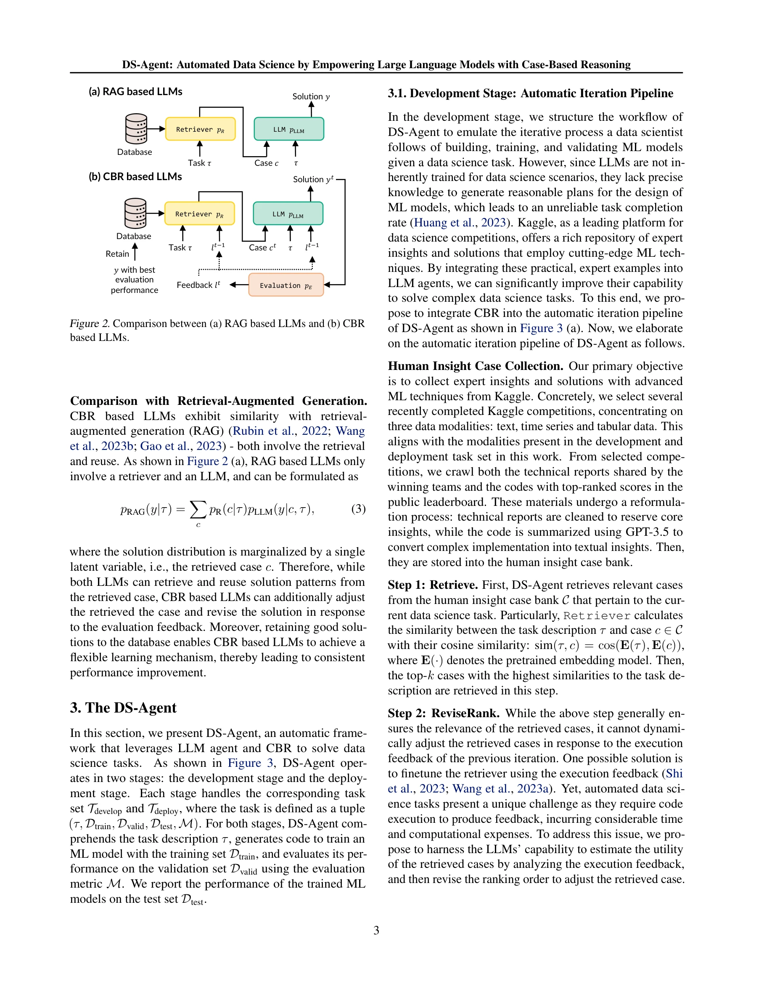

# DS-Agent: Automated Data Science by Empowering Large Language Models with Case-Based Reasoning

> **저자**: Siyuan Guo, Cheng Deng, Ying Wen, Hechang Chen, Yi Chang, Jun Wang | **날짜**: 2024 | **DOI**: [arXiv:2402.17453](https://arxiv.org/abs/2402.17453)

---

## Essence

*DS-Agent의 CBR 기반 구조: (a) 개발 단계와 배포 단계의 개요 (b) 반복 단계에 따른 성능 개선*

LLM 기반 에이전트를 케이스 기반 추론(Case-Based Reasoning, CBR)과 결합하여 자동화된 데이터 과학 작업(ML 모델 설계, 학습, 검증)을 수행하는 프레임워크이다. Kaggle의 전문가 지식을 활용하고 실행 피드백을 통한 반복적 개선으로 기존 LLM 에이전트의 낮은 성공률 문제를 해결한다.

## Motivation

- **Known**: LLM 기반 에이전트(AutoGPT, LangChain, ResearchAgent)가 다양한 작업에서 성공을 거두고 있다.
- **Gap**: 기존 LLM 에이전트들은 데이터 과학 작업에서 합리적인 실험 계획 생성과 환각(hallucination) 문제로 인해 낮은 완료율(GPT-4 사용 시에도 미흡)을 보인다.
- **Why**: LLM을 데이터 과학 시나리오에 맞게 미세조정(finetuning)하는 것은 시간 비용(코드 실행 피드백 필요)과 계산 자원이 많이 소요된다.
- **Approach**: Kaggle의 풍부한 전문가 솔루션 데이터베이스를 CBR 프레임워크로 구조화하여 LLM 에이전트에 통합하고, 피드백 기반의 반복적 수정을 통해 성능을 개선한다.

## Achievement

*반복 단계 증가에 따른 DS-Agent의 일관된 성능 개선*

1. **개발 단계 성능**: GPT-4 사용 시 12개 작업에서 100% 성공률 달성
2. **배포 단계 성능**: 
   - GPT-3.5: 85% one-pass rate (최고 baseline 56% 대비 36% 향상)
   - GPT-4: 99% one-pass rate (최고 baseline 60% 대비 39% 향상)
   - 오픈소스 모델 Mixtral-8x7b-Instruct: 6% → 31% (525% 개선)
3. **비용 효율성**: 표준 시나리오에서 GPT-3.5 $0.06, GPT-4 $1.60 / 실행, 저자원 배포 시나리오에서 각각 $0.0045, $0.135로 대폭 감소
4. **확장성**: 30개 데이터 과학 작업에서 성능 검증, 텍스트/시계열/테이블 형식 데이터 모두 처리

## How

*RAG 기반 LLM과 CBR 기반 LLM의 구조 비교*

### 개발 단계 (Development Stage)

**1. 인간 통찰 케이스 수집 (Human Insight Case Collection)**
- Kaggle의 최근 완료된 경쟁에서 우승팀 기술 보고서와 고순위 코드 수집
- 기술 보고서: 핵심 통찰만 추출하여 정제
- 코드: GPT-3.5로 요약하여 텍스트 통찰로 변환
- 텍스트/시계열/테이블 데이터 세 가지 모달리티 중심

**2. 단계 1 - Retrieve (검색)**
- 사전학습된 임베딩 모델 E(·) 사용
- 작업 설명 τ와 케이스 c 간 코사인 유사도 계산: sim(τ, c) = cos(E(τ), E(c))
- 상위 k개 유사 케이스 검색

**3. 단계 2 - ReviseRank (수정 및 재순위화)**
- 이전 반복의 실행 피드백(execution feedback)을 기반으로 검색된 케이스의 유용성을 LLM이 분석
- 재순위화를 통해 피드백에 대응하여 케이스 조정
- 미세조정 대신 LLM의 추론 능력으로 동적 조정 (계산 비용 감소)

**4. 단계 3 - Reuse (재사용) 및 단계 4 - Revise (수정)**
- Planner: 검색된 케이스를 기반으로 실험 계획 생성
- Programmer: 계획을 Python 코드로 변환
- 실행 결과(성공/오류)를 바탕으로 다음 반복을 위한 수정사항 결정

**5. 단계 5 - Retain (보유)**
- 최고 성능의 솔루션을 케이스 뱅크에 추가하여 향후 재사용

### 배포 단계 (Deployment Stage)

- 단순화된 CBR 프레임워크 적용
- 개발 단계에서 수집한 성공적인 솔루션을 직접 재사용
- 반복적 피드백 없이 코드 생성만 수행
- 과거 유사 솔루션을 문맥으로 제공하여 LLM의 기본 능력 요구 대폭 감소

### CBR 기반 LLM의 수학적 모델

$$p_{CBR}(y^t|\tau) = \sum_{l^{t-1}} p_E(l^{t-1}|\tau) \sum_{c_t} p_R(c_t|\tau, l^{t-1}) p_{LLM}(y^t|c_t, \tau, l^{t-1})$$

- 솔루션 분포가 이전 피드백 $l^{t-1}$과 검색된 케이스 $c_t$로 조건화됨
- RAG와 달리 평가자 $p_E$를 통한 피드백 기반 반복 루프 형성

## Originality

- **CBR-LLM 통합의 창의성**: 고전적인 CBR 패러다임을 현대적 LLM 에이전트에 체계적으로 통합한 새로운 접근
- **미세조정 회피**: 자원 집약적인 파라미터 최적화 대신 케이스 베이스 확장으로 성능 개선 - 샘플과 계산 효율성 동시 달성
- **이중 단계 구조**: 개발 단계의 반복적 개선과 배포 단계의 저자원 실행을 구분하여 실무 적용성 극대화
- **동적 케이스 순위화**: 실행 피드백 기반의 RankReviser로 정적인 검색 순서 개선
- **대규모 평가**: 30개 데이터 과학 작업, 3가지 데이터 모달리티, 여러 LLM 모델에 걸친 포괄적 검증

## Limitation & Further Study

- **케이스 의존성**: 성능이 Kaggle 케이스 뱅크의 질과 다양성에 크게 의존 - 새로운 도메인이나 특이한 작업에 대한 일반화 가능성 미검증
- **모달리티 제한**: 텍스트, 시계열, 테이블 데이터만 다룬다. 이미지, 그래프 등 다른 모달리티로의 확장 필요
- **검색 메커니즘 단순성**: 코사인 유사도 기반 검색이 기본적이며, 의미론적 유사성을 더 정교하게 포착할 수 있는 하이브리드 검색 방식 미탐색
- **CBR 오버헤드**: 대규모 케이스 뱅크에서의 검색, 순위화, 평가 과정의 지연 시간 상세 분석 부재
- **배포 단계 한계**: 개발 단계와 배포 단계의 작업 분포가 동일하다고 가정 - 도메인 시프트(domain shift) 시나리오 미다룸
- **후속 연구 방향**:
  - 다중 모달 데이터(멀티미디어) 처리 확장
  - 약한 피드백(weak feedback) 기반 CBR 개선
  - 점진적 도메인 적응(incremental domain adaptation) 메커니즘
  - 검색 효율성 향상을 위한 계층적 케이스 인덱싱

## Evaluation

- Novelty: 4.5/5
- Technical Soundness: 4/5
- Significance: 4.5/5
- Clarity: 4.5/5
- Overall: 4.4/5

**총평**: DS-Agent는 CBR과 LLM을 효과적으로 결합하여 자동화된 데이터 과학 작업에서 기존 접근법을 크게 능가하는 실용적이고 비용 효율적인 솔루션을 제시한다. 특히 저자원 배포 단계에서의 성능과 오픈소스 모델의 대폭적 개선은 주목할 만하나, 케이스 품질 의존성과 도메인 일반화 능력에 대한 추가 검증이 필요하다.

## Related Papers

- 🔄 다른 접근: [[papers/476_Large_language_models_orchestrating_structured_reasoning_ach/review]] — 케이스 기반 추론과 경험적 학습 이론이라는 서로 다른 이론적 접근으로 자동화된 데이터 과학을 구현한다.
- 🔗 후속 연구: [[papers/253_Data_Interpreter_An_LLM_Agent_For_Data_Science/review]] — 기본적인 LLM 데이터 과학 에이전트를 Kaggle 전문 지식과 케이스 기반 추론으로 고도화한다.
- 🏛 기반 연구: [[papers/121_Autokaggle_A_multi-agent_framework_for_autonomous_data_scien/review]] — 자동화된 데이터 과학의 다중 에이전트 프레임워크에 대한 구체적 구현 사례를 제공한다.
- 🧪 응용 사례: [[papers/170_Blade_Benchmarking_language_model_agents_for_data-driven_sci/review]] — 언어모델 에이전트의 데이터 기반 발견 능력 평가가 실제 데이터 사이언스 업무 자동화 시스템 개발에 핵심적인 벤치마킹 도구로 활용된다
- 🔄 다른 접근: [[papers/253_Data_Interpreter_An_LLM_Agent_For_Data_Science/review]] — 계층적 그래프 모델링 기반 데이터 해석기와 대형언어모델 기반 데이터 사이언스 자동화가 각각 구조적, 언어적 접근법으로 동일한 문제를 해결한다
- 🏛 기반 연구: [[papers/177_Can_ai_agents_design_and_implement_drug_discovery_pipelines/review]] — DS-Agent의 데이터 과학 자동화 방법론이 Deep Thought의 신약 발견 파이프라인 구현 능력의 기반이 됨
- 🔄 다른 접근: [[papers/429_Infiagent-dabench_Evaluating_agents_on_data_analysis_tasks/review]] — 데이터 분석에서 평가 중심 접근법과 케이스 기반 추론 접근법이라는 서로 다른 방법론을 제시한다.
- 🔄 다른 접근: [[papers/476_Large_language_models_orchestrating_structured_reasoning_ach/review]] — Kaggle 경쟁과 자동화된 데이터 과학에서 각각 학습 이론과 케이스 기반 추론이라는 서로 다른 이론적 기반을 사용한다.
- 🔗 후속 연구: [[papers/293_Ds-agent_Automated_data_science_by_empowering_large_language/review]] — 개선된 DS-Agent가 기존 Kaggle 기반 자동 데이터 과학 프레임워크를 더 강화된 사례 기반 추론과 배포 최적화로 발전시킨 확장 버전이다.
- 🔄 다른 접근: [[papers/121_Autokaggle_A_multi-agent_framework_for_autonomous_data_scien/review]] — AutoKaggle과 DS-Agent는 모두 데이터 과학 자동화를 목표로 하지만, Kaggle 경진대회 특화와 일반적 데이터 과학 워크플로우라는 서로 다른 접근법을 취합니다.
- 🔗 후속 연구: [[papers/543_Mlcopilot_Unleashing_the_power_of_large_language_models_in_s/review]] — DS-Agent의 대규모 언어 모델 기반 자동 데이터 사이언스는 MLCopilot의 ML 작업 자동화를 데이터 과학 전반으로 확장한다.
- 🔄 다른 접근: [[papers/650_RD-Agent_Automating_Data-Driven_AI_Solution_Building_Through/review]] — R&D-Agent와 DS-Agent 모두 LLM 기반 데이터 과학 자동화를 추구하지만 이중 에이전트 vs 단일 에이전트 아키텍처를 사용한다.
- 🔄 다른 접근: [[papers/136_Automl-gpt_Automatic_machine_learning_with_gpt/review]] — 데이터 과학 자동화에서 AutoML과 다중 에이전트 시스템이라는 다른 접근 방식을 보여준다.
