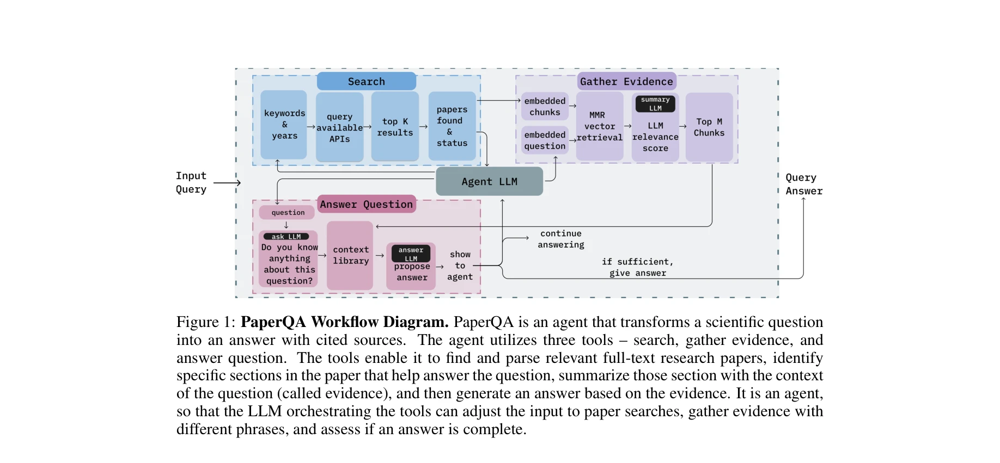
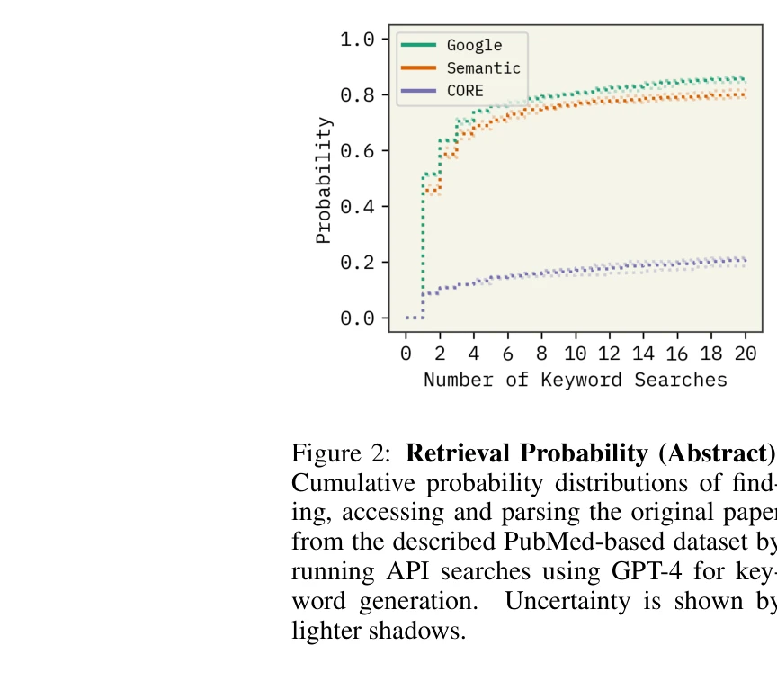
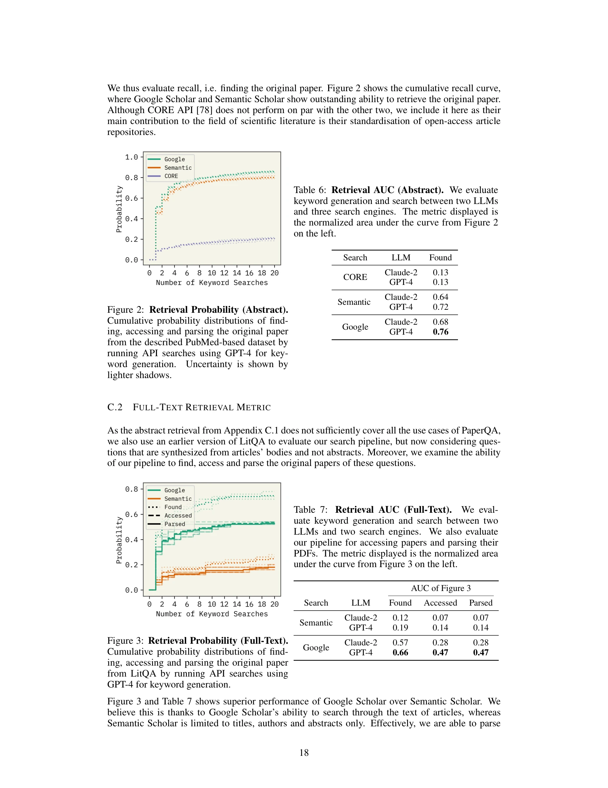

# PaperQA: Retrieval-Augmented Generative Agent for Scientific Research

> **저자**: Jakub Lála, Odhran O'Donoghue, Aleksandar Shtedritski, Sam Cox, Samuel G. Rodriques, Andrew Dickson White | **날짜**: 2023 | **DOI**: N/A

---

## Essence

*PaperQA는 과학 논문 검색 및 합성을 통해 과학적 질문에 답변하는 에이전트 기반 검색 증강 생성(RAG) 시스템이다.* 대규모언어모델(LLM)의 환각(hallucination) 문제를 해결하기 위해 모듈화된 RAG 컴포넌트를 활용하여 전문가 수준의 성능을 달성한다.

## Motivation

- **Known**: 
  - LLM은 언어 작업에서 우수한 일반화 능력을 보유
  - RAG 모델은 환각 감소 및 답변 추적성(provenance) 제공으로 제안됨
  - 연간 500만 이상의 논문이 발행되며 과학 발견 과정은 여전히 수동적

- **Gap**: 
  - 표준 RAG 모델은 고정된 선형 흐름을 따르므로 다양한 과학 질문에 대응 제한
  - 기존 과학 QA 벤치마크(PubMedQA 등)는 초록 기반으로만 구성되어 전문 정보 검색 능력 미흡
  - 사전학습 데이터 이후 발표된 최신 정보 활용 불가능

- **Why**: 
  - 과학에서 부정확한 정보는 정보 없음보다 더 해로울 수 있음
  - 과학자들은 광범위한 문헌을 신뢰성 있게 처리할 시스템 필요

- **Approach**: 
  - RAG를 모듈화하여 에이전트가 질문 특성에 따라 동적으로 검색 및 증거 수집 조정
  - 맵-리듀스(map-reduce) 요약 단계 적용으로 다중 소스 처리 확대
  - LLM 기반 관련성 점수 부여로 벡터 임베딩 기반 검색 보완
  - 사전/사후 프롬프팅(a priori/a posteriori prompting)으로 내재 지식 활용

## Achievement

1. **벤치마크 성능 우위**: 
   - PubMedQA(초록 기반, 폐쇄형)에서 GPT-4 대비 28.4% 성능 향상 (57.9% → 86.3%)
   - 제안한 LitQA 데이터셋(전문 논문 기반 복합 질문)에서 모든 테스트된 모델 및 상용 도구 능가

2. **인간 전문가 수준 달성**: 
   - LitQA에서 인간 전문가와 동등한 성능 및 소요 시간 달성
   - 상업적 비용 대비 훨씬 저렴한 운영 비용

3. **개선된 지식 경계(knowledge boundary)**: 
   - 경쟁 도구 대비 더 낮은 오류율로 부정확한 답변 제시
   - "불확실함" 응답 비율 증가로 신뢰성 강화

4. **최신 정보 처리**: 
   - 사전학습 데이터 이후 발표된 논문 정보 활용 가능

## How

- **검색 도구(search)**: ArXiv, PubMed 등 온라인 데이터베이스에서 키워드 기반 논문 검색, 선택적 연도 범위 설정
  
- **증거 수집 도구(gather evidence)**:
  - 검색된 논문을 4,000자 단위 중복 청크(chunk)로 분할
  - text-embedding-ada-002 모델로 임베딩 후 벡터 데이터베이스 저장
  - 최대 한계 관련성(maximal marginal relevance, MMR) 검색으로 다양성 확보
  - 각 청크에 대해 요약 LLM이 1-10 점수로 관련성 평가

- **답변 생성 도구(answer question)**:
  - 사전 단계: ask LLM이 사전학습된 지식에서 유용한 정보 추출
  - 맵 단계: 수집된 증거들을 정렬 및 컨텍스트 라이브러리 구성
  - 리듀스 단계: answer LLM이 최종 답변 생성 및 인용 출처 제공

- **에이전트 루프**: 
  - 초기 질문으로 검색 수행 후, 증거 부족 시 LLM이 다양한 키워드로 반복 검색 결정
  - 5개 이상의 다중 소스 증거 또는 충분한 시도 후 답변 생성
  - 불완전한 답변은 거절하고 재시도 가능

## Originality

- **에이전트 기반 RAG 분해**: 표준 고정형 RAG 파이프라인을 모듈화하여 각 단계를 도구화, 에이전트가 동적으로 제어 가능하게 개선

- **LLM 기반 관련성 점수 부여**: 벡터 거리 이외에 LLM이 의미론적 관련성을 1-10 척도로 평가하여 검색 정확도 강화

- **맵-리듀스 증거 수집**: 다중 소스 처리 확대 및 중간 추론 단계(scratchpad) 제공으로 복잡한 질문 처리 능력 향상

- **LitQA 벤치마크 도입**: 전문 논문 전문(full-text) 기반으로 정보 합성이 필요한 복잡한 QA 데이터셋 신규 제시

- **사전/사후 프롬프팅 통합**: LLM의 내재 지식과 검색 기반 정보를 결합하는 프롬프팅 전략 체계화

## Limitation & Further Study

- **검색 엔진 의존성**: ArXiv, PubMed 등 외부 검색 API의 실패율(PDF 파싱 오류 등)에 영향받으며, 이는 부록 C에서만 다룸

- **청크 크기 고정**: 4,000자 고정 청크로 설정하여 최적 크기 탐색 미흡

- **계산 비용**: 맵-리듀스 단계에서 다중 LLM 호출로 인한 계산 비용 증가 (동시 처리로 완화하나 여전히 부담)

- **평가 데이터셋 규모**: LitQA가 "최근 문헌"에서 구성되었으나 정확한 규모 및 분야 다양성 제시 부족

- **후속 연구**:
  - 더 큰 규모의 LitQA 확장 및 다양한 과학 분야 포괄
  - 청크 크기, 검색 알고리즘, LLM 모델 조합 최적화 연구
  - 다국어 과학 논문 지원 확대
  - 실시간 과학 발견 시나리오에서 사용성 검증

## Evaluation

- **Novelty**: 4/5
  - 에이전트 기반 RAG 분해 및 LLM 기반 관련성 평가는 참신하나, 개별 컴포넌트(벡터 검색, 맵-리듀스)는 기존 기법의 조합

- **Technical Soundness**: 4/5
  - 시스템 설계는 논리적이고 구현 세부사항 충분하나, 검색 실패율 및 청크 최적화 분석 부족

- **Significance**: 5/5
  - 과학 커뮤니티의 실질적 필요를 해결하며, 인간 전문가 수준 성능 달성은 높은 임팩트

- **Clarity**: 4/5
  - 전체 워크플로우는 명확하나, 일부 프롬프트 상세사항과 에러 처리 절차가 부록에만 기술됨

- **Overall**: 4.25/5

**총평**: PaperQA는 모듈화된 에이전트 기반 RAG를 통해 과학 문헌 기반 질답에서 인간 전문가 수준의 성능을 달성한 실질적 기여로, LitQA라는 새로운 벤치마크 도입으로 분야 발전에 촉매 역할을 할 것으로 기대된다. 다만 외부 API 의존성과 계산 비용 최적화 측면에서의 추가 연구가 필요하다.

## Related Papers

- 🏛 기반 연구: [[papers/457_Language_agents_achieve_superhuman_synthesis_of_scientific_k/review]] — PaperQA의 기본적인 검색 증강 생성 에이전트 구조가 PaperQA2의 환각 해결과 초인적 과학 지식 합성 능력의 기초 프레임워크를 제공함
- 🧪 응용 사례: [[papers/715_Scidqa_A_deep_reading_comprehension_dataset_over_scientific/review]] — SciDQA의 깊이 있는 과학 논문 이해 평가가 PaperQA 시스템의 복잡한 과학 텍스트 처리 능력을 검증할 수 있는 구체적 벤치마크를 제공함
- 🔄 다른 접근: [[papers/593_Openscholar_Synthesizing_scientific_literature_with_retrieva/review]] — OpenScholar의 과학 문헌 합성 접근법이 PaperQA의 검색 증강 방식과 다른 각도에서 대규모 과학 지식 처리 문제를 해결하는 대안적 방법론을 제시함
- 🏛 기반 연구: [[papers/042_Academicbrowse_Benchmarking_academic_browse_ability_of_llms/review]] — 과학 문헌의 검색 증강 생성 에이전트로 학술 정보 검색 능력 평가의 기술적 기반을 제공한다.
- 🧪 응용 사례: [[papers/667_ReSearch_Learning_to_Reason_with_Search_for_LLMs_via_Reinfor/review]] — PaperQA의 과학 문헌 검색 증강 생성은 ReSearch의 강화학습 기반 검색 학습을 학술 문헌 도메인에 직접 적용한 실제 사례를 보여준다.
- 🔄 다른 접근: [[papers/675_Retrieval-Augmented_Generation_for_Knowledge-Intensive_NLP_T/review]] — 과학 논문 정보 처리를 위해 일반 RAG와 과학 특화 검색 증강 생성이라는 다른 접근법을 사용한다
- 🧪 응용 사례: [[papers/018_A_retrieval-augmented_knowledge_mining_method_with_deep_thin/review]] — 과학 연구를 위한 검색 증강 생성 에이전트의 실제 구현 사례를 보여준다.
- 🧪 응용 사례: [[papers/067_Agentic_retrieval-augmented_generation_A_survey_on_agentic_r/review]] — 과학 연구를 위한 검색 증강 생성 에이전트의 실제 구현 사례를 제시한다.
- 🧪 응용 사례: [[papers/904_How_AI-powered_science_search_engines_can_speed_up_your_rese/review]] — 과학 논문 검색을 위한 검색증강 생성 에이전트가 AI 과학 검색 엔진의 구체적 구현 사례이다.
- 🔗 후속 연구: [[papers/295_Dynamic_multi-agent_orchestration_and_retrieval_for_multi-so/review]] — 과학 논문 검색 증강 생성 에이전트로 다중 소스 질의응답의 과학 분야 특화 확장을 보여준다.
- 🔗 후속 연구: [[papers/338_Figuring_out_figures_Using_textual_references_to_caption_sci/review]] — 검색 증강 생성 에이전트를 이용한 과학 QA 시스템이 과학 도형 캡션 생성에서 참조 텍스트 활용을 더욱 정교화할 수 있다.
- 🔗 후속 연구: [[papers/457_Language_agents_achieve_superhuman_synthesis_of_scientific_k/review]] — PaperQA2가 PaperQA의 기본 검색 증강 접근법을 환각 문제 해결과 모순 탐지 기능으로 대폭 개선하여 박사급 성능을 달성한 직접적 후속 연구임
- 🏛 기반 연구: [[papers/715_Scidqa_A_deep_reading_comprehension_dataset_over_scientific/review]] — PaperQA의 과학 연구용 검색 증강 생성 에이전트가 SciDQA의 복잡한 과학 논문 이해 과제를 실제로 해결할 수 있는 기술적 기반을 제공함
- 🔄 다른 접근: [[papers/087_Ai2_scholar_qa_Organized_literature_synthesis_with_attributi/review]] — 과학적 질문 답변을 위한 검색-증강 생성 시스템으로 유사한 기능을 다른 방식으로 구현한다.
- 🔄 다른 접근: [[papers/424_Improving_health_question_answering_with_reliable_and_time-a/review]] — 과학 논문 검색에서 시간 인식 증거 최적화와 검색 증강 생성 에이전트의 서로 다른 접근법을 비교할 수 있습니다.
- 🔄 다른 접근: [[papers/450_Knowledge_navigator_Llm-guided_browsing_framework_for_explor/review]] — 과학 문헌 탐색에서 LLM 가이드 클러스터링과 검색 증강 생성 에이전트의 서로 다른 조직화 방법을 비교할 수 있습니다.
- 🔗 후속 연구: [[papers/711_Sciclaims_An_end-to-end_generative_system_for_biomedical_cla/review]] — 과학적 질의응답을 위한 검색 증강 에이전트를 생의학 주장 분석이라는 특화된 도메인으로 확장하여 더 정밀한 증거 검색과 검증이 가능하다.
- 🔗 후속 연구: [[papers/488_Leveraging_LLMs_in_Scholarly_Knowledge_Graph_Question_Answer/review]] — 과학적 질의응답을 검색 증강 생성 에이전트로 확장한 연구이다
