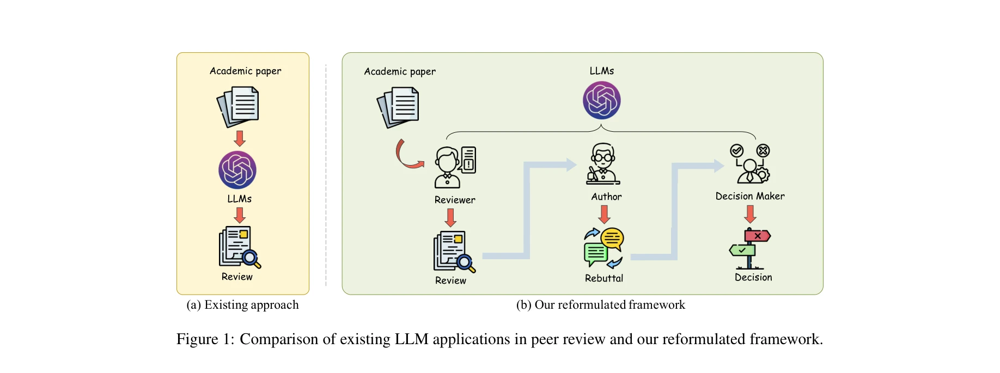
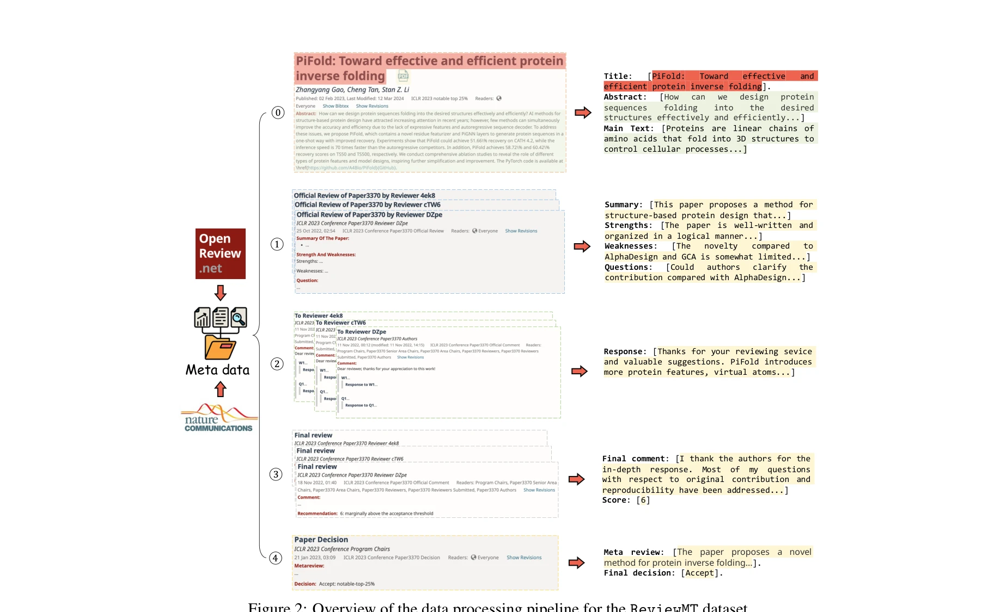
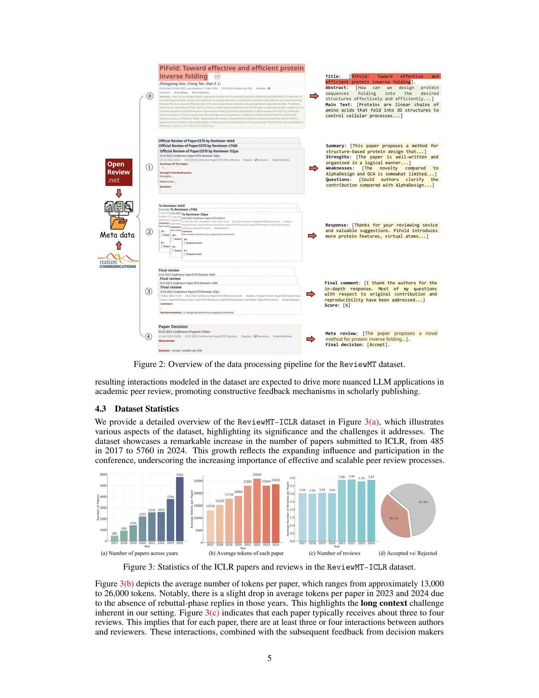
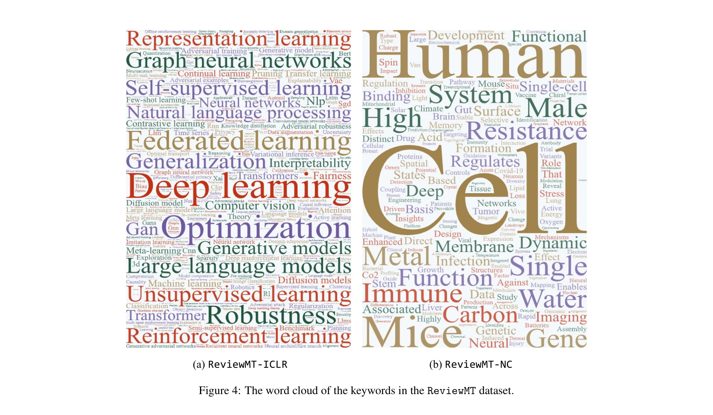

# Peer Review as A Multi-Turn and Long-Context Dialogue with Role-Based Interactions

> **저자**: Cheng Tan, Dongxin Lyu, Siyuan Li, Zhangyang Gao, Jingxuan Wei, Siqi Ma, Zicheng Liu, Stan Z. Li | **날짜**: 2024-06-09 | **DOI**: [10.48550/arXiv.2406.05688](https://doi.org/10.48550/arXiv.2406.05688)

---

## Essence

*그림 1: 기존 LLM 피어리뷰 접근법과 개선된 프레임워크 비교*

대규모언어모델(LLM)의 학술 논문 피어리뷰 과정을 단순한 정적 검토 생성에서 저자-검토자-의사결정자 간의 동적 다중턴 대화로 재정의하고, 92,017개의 검토문을 포함한 대규모 데이터셋(ReviewMT)을 구축했다.

## Motivation

- **Known**: LLM이 개별 논문에 대한 정적 검토문 생성에서 우수한 성능을 보임이 입증됨
- **Gap**: 기존 연구는 단일턴 검토 생성에만 초점을 맞추고, 실제 피어리뷰의 동적·반복적 특성(저자의 재반박, 검토자의 재검토, 의사결정 과정)을 포착하지 못함
- **Why**: 실제 학술 출판 시스템은 검토자-저자 간 상호작용과 최종 의사결정을 포함한 다단계 프로세스이며, 이를 정확히 시뮬레이션해야 LLM의 실용적 적용 가능성을 평가할 수 있음
- **Approach**: (1) 다중턴 대화 구조로 피어리뷰 과정 재정의, (2) ICLR과 Nature Communications에서 26,841개 논문의 92,017개 검토문 수집, (3) 각 역할별 평가 메트릭스 제시

## Achievement

*그림 2: ReviewMT 데이터셋 데이터 처리 파이프라인 개요*

1. **종합 데이터셋 구축**: 26,841개 논문, 92,017개 검토문으로 구성된 ReviewMT 데이터셋 공개. ICLR(2017-2024)과 Nature Communications(2023)의 이질적 검토 프로세스를 ReviewMT-ICLR, ReviewMT-NC 두 부분집합으로 분할하여 제공

2. **역할기반 다중턴 프레임워크**: 4단계 상호작용 구조 공식화
   - 1턴: 검토자 초기 검토(P → Ri)
   - 2턴: 저자 재반박(Ri → Ai)
   - 3턴: 검토자 최종 검토(Ai → R'i)
   - 4턴: 의사결정자 최종 판정({Ri, Ai, R'i} → D)

3. **평가 메트릭스 제시**: 각 역할의 성능 평가를 위한 다차원 지표 제안(응답의 유효성, 텍스트 품질, 점수 평가, 의사결정 평가)

## How

*그림 3: ReviewMT-ICLR 데이터셋의 ICLR 논문과 검토문 통계*

- **데이터 수집**: OpenReview API(ICLR), Requests 라이브러리를 통한 웹 크롤링(Nature Communications)으로 체계적 수집. Robots 프로토콜 준수
- **텍스트 처리**: PDF-to-text 변환 시 Marker 소프트웨어를 활용하여 마크다운 형식 유지로 구조적 충실성 확보
- **구조화**: JSON 형식으로 각 턴의 필드를 체계적으로 저장
  - 1턴: "Summary", "Strengths", "Weaknesses", "Questions"
  - 2턴: "Response"
  - 3턴: "Final comment", "Score"
  - 4턴: "Meta review", "Final decision"
- **적응적 처리**: 연도별·저널별 검토 프로세스 변화에 대응(예: 초기 평점 미제공 논문은 최종 평점만 사용)

*그림 4: ReviewMT 데이터셋의 키워드 워드클라우드*

## Originality

- **프레임워크 혁신**: 피어리뷰를 단순 텍스트 생성 과제에서 복합 역할기반 다중턴 대화로 재정의하는 개념적 전환
- **장문맥 대화 데이터셋**: 기존 명령어 튜닝 데이터셋(Dolly, Alpaca 등)이 단일턴 상호작용 중심인 반면, 실제 학술 환경의 다단계 상호작용을 충실히 반영
- **이질적 소스 통합**: ICLR(컨퍼런스)과 Nature Communications(저널)의 서로 다른 검토 프로세스를 체계적으로 통합하여 다양성 확보
- **역할별 평가체계**: 검토자, 저자, 의사결정자 각각의 역할에 맞춘 맞춤형 평가 메트릭스 고안

## Limitation & Further Study

- **데이터셋 규모의 한계**: 26,841개 논문은 충분하지만, 전체 학술 출판 영역의 대표성 측면에서 특정 분야(AI/ML 중심)에 편중
- **자동 검토 품질 검증 부재**: 현재까지 논문에서 LLM의 실제 검토 성능 평가 결과가 제시되지 않음. 향후 GPT-4, LLaMA 등 다양한 모델의 평가 필요
- **재반박-재검토 품질 편차**: Nature Communications의 경우 공식 재반박 구조가 ICLR과 다르므로, 데이터 정규화 과정에서 정보 손실 가능성
- **윤리적 고려사항 미흡**: 실제 피어리뷰 자동화 시 검토자의 역할 축소, 이해상충 탐지 능력 등에 대한 논의 부족
- **후속 연구 방향**: 
  - 소규모 언어모델(7B-13B 파라미터)의 파인튜닝 성능 비교
  - 검토 품질의 자동 평가 메트릭 개발(기존 BLEU/ROUGE 보다 의미론적 신뢰도 중시)
  - 거부 논문의 공통 문제점 분석을 통한 검토자 훈련 활용

## Evaluation

- **Novelty**: 4.5/5 - 피어리뷰의 다중턴 대화 재정의는 신선하나, 개별 컴포넌트(명령어 튜닝, 검토 생성)는 기존 연구 활용
- **Technical Soundness**: 4/5 - 데이터 수집·처리 방법론은 타당하나, 평가 메트릭스의 구체적 구현 상세 부족. 논문 초안 단계로 완전한 검증 데이터 미제시
- **Significance**: 4.5/5 - 학술 출판 시스템의 구조적 문제 해결에 기여 잠재력이 높고, 공개 데이터셋은 커뮤니티 자산으로 가치 높음. 다만 실제 도입 시 인간 검토자 역할 축소 우려
- **Clarity**: 4/5 - 프레임워크와 데이터셋 구성은 명확하나, 평가 메트릭스 정의와 실험 결과 섹션이 본문 범위에서 불완전
- **Overall**: 4.2/5

**총평**: 이 논문은 대규모언어모델의 학술 피어리뷰 적용을 현실적 다중턴 대화 구조로 혁신적으로 재설정하고, 이를 뒷받침하는 대규모 고품질 데이터셋을 공개함으로써 학술 AI 응용의 중요한 기초를 제공한다. 다만 LLM 성능 평가 결과의 부재와 자동 평가 메트릭스의 미성숙이 시급한 과제이며, 실제 학술 생태계에 미치는 영향에 대한 심층 논의가 필요하다.

## Related Papers

- 🔄 다른 접근: [[papers/262_Deepreview_Improving_llm-based_paper_review_with_human-like/review]] — 인간과 같은 심층 사고를 통한 LLM 리뷰 개선과 함께 피어 리뷰의 다양한 개선 방향을 제시한다.
- 🔗 후속 연구: [[papers/628_Position_The_ai_conference_peer_review_crisis_demands_author/review]] — AI 학술대회 피어 리뷰 위기에 대한 해결책으로 다중턴 대화 기반 리뷰 시스템을 제안한다.
- 🏛 기반 연구: [[papers/070_Agentreview_Exploring_peer_review_dynamics_with_llm_agents/review]] — LLM 에이전트를 이용한 피어 리뷰 동역학 탐구로 다중턴 대화 기반 리뷰 프로세스의 이론적 기반을 제공한다.
- 🔗 후속 연구: [[papers/262_Deepreview_Improving_llm-based_paper_review_with_human-like/review]] — 다중턴 대화 기반 피어 리뷰를 인간과 같은 심층 사고로 개선하여 더 정교한 리뷰 생성이 가능하다.
- 🏛 기반 연구: [[papers/628_Position_The_ai_conference_peer_review_crisis_demands_author/review]] — 다중턴 대화 기반 피어 리뷰로 양방향 피드백 시스템 구현의 기술적 기반을 제공한다.
- 🔄 다른 접근: [[papers/739_Seagraph_Unveiling_the_whole_story_of_paper_review_comments/review]] — 피어 리뷰를 다중 턴 대화로 모델링하는 다른 접근 방식을 제시한다.
- 🔗 후속 연구: [[papers/173_Bridging_social_psychology_and_llm_reasoning_Conflict-aware/review]] — 다중 턴 장문맥 대화로서의 동료심사는 메타-리뷰의 갈등 인식 프레임워크를 실제 리뷰 프로세스로 확장한 응용입니다
- 🔗 후속 연구: [[papers/883_When_reviewers_lock_horn_Finding_disagreement_in_scientific/review]] — 다회차 긴 컨텍스트 대화로서의 피어 리뷰가 리뷰어 간 모순 탐지를 대화적 관점에서 확장한다.
- 🔗 후속 연구: [[papers/250_CycleResearcher_Improving_Automated_Research_via_Automated_R/review]] — 자동화된 검토가 다중턴 대화 기반 동료 검토로 확장됩니다.
- 🧪 응용 사례: [[papers/877_What_Can_Natural_Language_Processing_Do_for_Peer_Review/review]] — 동료 심사에서 NLP 활용 방안이 멀티턴 대화와 장문맥을 고려한 AI 기반 동료 심사 시스템의 구체적 구현에 적용된다
- 🔗 후속 연구: [[papers/1089_Prompting_llms_to_compose_meta-review_drafts_from_peer-revie/review]] — 피어 리뷰를 다중 턴 장문맥 대화로 확장하여 메타리뷰 작성을 발전시킨다.
- 🔄 다른 접근: [[papers/624_Piors_Personalized_intelligent_outpatient_reception_based_on/review]] — 의료 접수 업무에서 다중 에이전트 시스템과 다중 턴 대화 기반 접근법을 비교할 수 있습니다.
- 🔄 다른 접근: [[papers/654_Re_2_A_consistency-ensured_dataset_for_full-stage_peer_revie/review]] — 피어리뷰 과정에서 일관성 보장 데이터셋과 다중 턴 대화 기반 접근법을 비교할 수 있습니다.
- 🔄 다른 접근: [[papers/070_Agentreview_Exploring_peer_review_dynamics_with_llm_agents/review]] — 피어 리뷰 과정에서 사회학적 편향 분석과 다중 턴 대화 분석이라는 서로 다른 접근법으로 리뷰 역학을 탐구한다.
