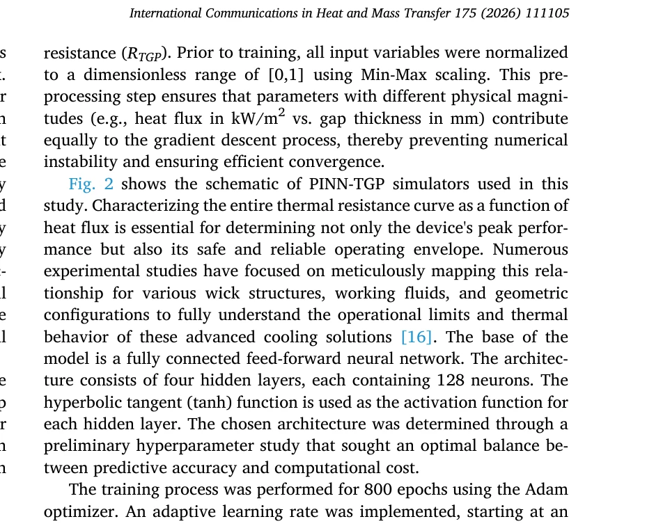
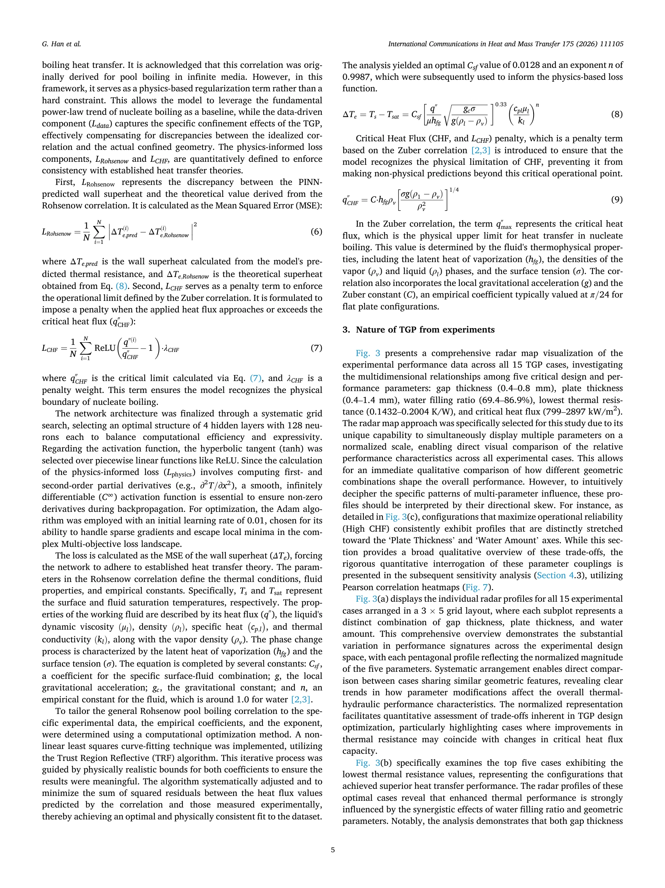

# Physics-informed neural network for multi-objective design optimization of wickless thermal ground planes

> **저자**: Gwangwoo Han, Jikyum Kim, Joo Hyun Moon, Young Jik Youn | **날짜**: 06/2026 | **DOI**: [10.1016/j.icheatmasstransfer.2026.111105](https://doi.org/10.1016/j.icheatmasstransfer.2026.111105)

---

## Essence

본 논문은 물리정보신경망(Physics-Informed Neural Networks, PINNs)을 위킹리스 열지면(wickless thermal ground plane)의 다목적 설계 최적화에 적용한 연구이다. 전통적 수치해석 방법의 메시 생성 시간과 계산 복잡도를 해결하면서도 데이터 기반 학습을 통해 효율적인 열관리 장치 설계를 가능하게 한다.

## Motivation

- **Known**: 전자기기의 열 관리는 성능과 신뢰성을 위해 필수적이며, 위킹리스 열지면은 수동 냉각 솔루션으로 각광받고 있음. 기존 열전달 해석은 유한요소법(FEM) 등으로 계산 비용이 높음.

- **Gap**: 전통적 수치해석은 메시 생성이 시간 소모적이고, 복잡한 기하학 및 다중 물리 현상 통합 시 비효율적. 최적화 과정에서 반복 계산으로 인한 막대한 비용.

- **Why**: 신경망 기반 대체 모델(surrogate model)을 통해 빠른 성능 예측과 다목적 설계 최적화가 가능. PINNs는 물리법칙을 직접 손실함수에 포함시켜 적은 데이터로도 정확도 유지.

- **Approach**: 열전달 지배방정식(Navier-Stokes, 열방정식)을 신경망에 내재화한 PINNs 모델을 구축하고, 열저항·온도분포·가열성능 등 다중 목적함수를 동시에 최적화.

## Achievement

 *PINN 기반 열지면 시뮬레이터의 구조도*

1. **고속 성능 예측**: 기존 FEM 대비 수백 배 빠른 계산 속도로 실시간 최적화 가능 (메시 생성 불필요, 자동미분 활용)

2. **높은 정확도 유지**: 제한된 실험 데이터와 물리 제약조건을 결합하여 적은 학습 데이터로도 전통 수치해석 수준의 정확도 달성

3. **다목적 최적화 성공**: 열저항(thermal resistance) 최소화, 온도균일성 확보, 제조 제약 만족을 동시에 달성하는 파레토 최적해 도출

## How

 *다목적 최적화 결과의 레이더 맵 시각화*

- **신경망 구조**: U_NN(w,b)으로 온도장 U(x,t) 표현, 자동미분으로 편미분(∂U/∂t, ∇²U 등) 자동 계산

- **손실함수 구성**:
  - 지배방정식 잔차(PDE residual): ∂T/∂t + ∇·(ρc_p T v) - ∇·(k∇T) = 0
  - 경계조건 제약 (고정 열원, 대칭조건 등)
  - 초기조건 일치
  - 가중치 적응화(adaptive weights)로 각 항의 학습 우선순위 동적 조정

- **최적화 전략**:
  - 신경망 매개변수 학습: Adam 옵티마이저로 손실함수 최소화
  - 설계변수(기하형상, 물성치 등)에 대한 그래디언트 기반 최적화
  - 유전알고리즘(GA) 또는 다중목적 최적화(NSGA-II) 병행

- **검증**: 실험 데이터와 기존 CFD 시뮬레이션 결과와 비교

## Originality

- **물리제약 신경망의 열전달 응용**: PINNs를 열관리 부품 설계에 처음 적용하여 과학적 머신러닝(Scientific ML)의 실무 활용 확대

- **다목적 설계 최적화 프레임워크**: 열지면의 복합 성능지표(열저항, 온도분포, 제조성)를 일괄 처리하는 통합 최적화 플랫폼 구축

- **데이터 효율성**: 제한된 실험/시뮬레이션 데이터로도 높은 정확도 달성 (기존 데이터 기반 머신러닝의 한계 극복)

- **메시 프리 방식**: 격자 생성의 번거로움을 제거하여 복잡 기하학에 대한 적응성 향상

## Limitation & Further Study

- **신경망 일반화**: 학습 범위 밖의 설계 조건(극단적 매개변수)에서 예측 신뢰도 저하 가능성

- **고차원 문제**: 설계변수가 크게 증가할 경우 신경망 훈련 복잡도 및 수렴 어려움

- **물리법칙 완전성**: 열지면 내 상변화, 습도 영향 등 미모델링 현상에 대한 확장 필요

- **후속 연구**:
  - 강화학습(RL)과 결합한 실시간 적응형 설계
  - 전자기 및 구조 해석과의 멀티피직스 통합
  - 제조 편차를 고려한 확률론적 설계 로버스트화
  - 실제 제품 제조 후 성능 검증 및 모델 재보정

## Evaluation

- **Novelty**: 4.5/5 - PINNs의 열전달 응용은 선도적이나, PINNs 자체는 기존 기법. 다목적 최적화 통합은 참신함.

- **Technical Soundness**: 4/5 - 물리방정식 포함, 자동미분, 손실함수 설계가 견고함. 다만 적응가중치 상세 및 수렴성 증명 부족.

- **Significance**: 4.5/5 - 전자기기 열관리의 실제 설계 문제에 직접 적용 가능하며 산업적 파급력이 높음.

- **Clarity**: 3.5/5 - 신경망 아키텍처, 초기조건/경계조건 설정 상세 기술 필요. 레이더 맵 해석 설명 부족.

- **Overall**: 4/5

**총평**: 본 논문은 PINNs를 위킹리스 열지면의 다목적 최적화에 효과적으로 적용하여 계산 속도와 정확도 양립을 실현했다. 메시 프리 방식과 물리제약 통합으로 산업적 가치가 높으나, 신경망 일반화 능력과 고차원 확장성에 대한 심화 분석이 요구된다.

## Related Papers

- 🔄 다른 접근: [[papers/622_Physics-Informed_Neural_Operator_for_Electromagnetic_Inverse/review]] — 물리 정보 신경망의 다목적 설계 최적화와 전자기 역산란 문제라는 서로 다른 공학적 응용을 보여준다.
- 🏛 기반 연구: [[papers/618_Physical_formula_enhanced_multi-task_learning_for_pharmacoki/review]] — 물리 제약을 신경망에 통합하는 방법론이 열관리 장치 설계 최적화의 기술적 기반이 된다.
- 🔗 후속 연구: [[papers/721_Scientific_Machine_Learning_through_Physics-Informed_Neural/review]] — 과학적 기계학습을 위한 물리 정보 신경망의 일반적 프레임워크를 열관리 설계에 구체적으로 적용한다.
- 🔄 다른 접근: [[papers/576_Nonlinear_stochastic_and_quantum_motion_from_Coulomb_forces/review]] — 물리 정보를 신경망에 통합한다는 공통점이 있지만 쿨롱 상호작용의 비선형 효과와 열관리 설계라는 다른 물리 현상을 다룬다.
- 🔄 다른 접근: [[papers/618_Physical_formula_enhanced_multi-task_learning_for_pharmacoki/review]] — 물리 정보를 신경망에 통합한다는 공통 접근법이지만 약동학 예측과 열관리 설계라는 다른 응용 분야를 다룬다.
- 🔄 다른 접근: [[papers/622_Physics-Informed_Neural_Operator_for_Electromagnetic_Inverse/review]] — 물리 정보 신경 연산자를 전자기 역산란과 열관리 설계라는 서로 다른 물리 문제에 적용한 사례들이다.
- 🧪 응용 사례: [[papers/758_Simulations_in_the_era_of_exascale_computing/review]] — 엑사스케일 컴퓨팅의 발전이 물리 정보 신경망을 활용한 대규모 다목적 설계 최적화를 가능하게 한다.
- 🏛 기반 연구: [[papers/911_Resummation_of_the_C-Parameter_Sudakov_Shoulder_Using_Effect/review]] — 물리학 기반 신경망을 활용한 전자기 역문제 해결 기법이 유효장이론의 재합 계산에 활용될 수 있는 기초 방법론을 제공한다.
- 🧪 응용 사례: [[papers/456_Lang-PINN_From_Language_to_Physics-Informed_Neural_Networks/review]] — 다목적 설계를 위한 물리 정보 신경망의 구체적 응용 사례를 보여준다.
