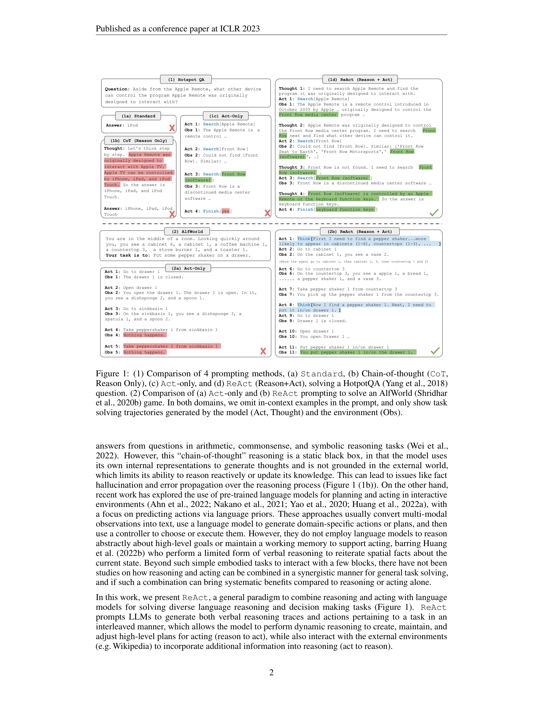
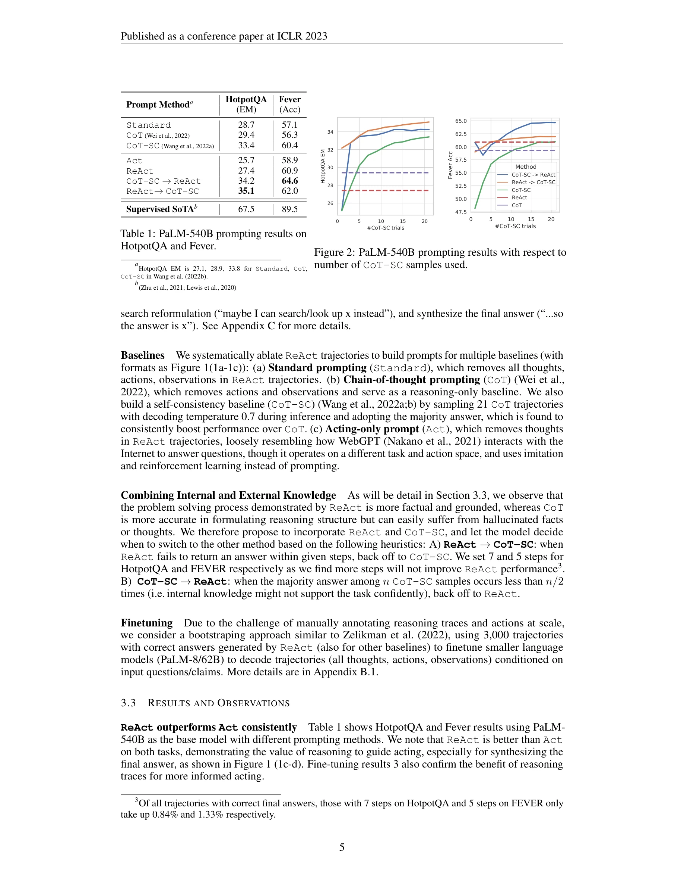
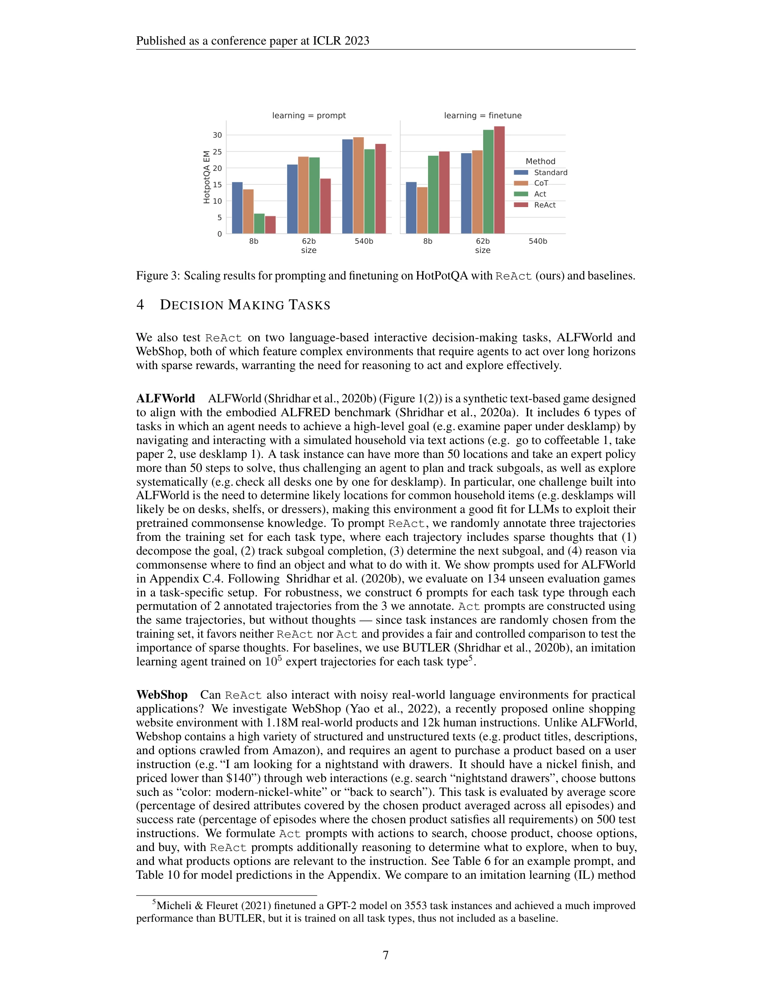

# ReAct: Synergizing Reasoning and Acting in Language Models

> **저자**: Shunyu Yao, Jeffrey Zhao, Dian Yu, Nan Du, Izhak Shafran | **날짜**: 2022 | **DOI**: [10.48550/arXiv.2210.03629](https://doi.org/10.48550/arXiv.2210.03629)

---

## Essence

*Figure 1: 4가지 프롬프팅 방식 비교 - (a) 표준, (b) 사고의 연쇄(CoT), (c) 행동만, (d) ReAct (reasoning+acting). HotpotQA와 AlfWorld 작업 해결 과정 시연*

본 논문은 대규모 언어 모델(LLM)의 추론(reasoning)과 행동(acting)을 상호작용적으로 결합하여 복잡한 작업을 해결하는 ReAct 패러다임을 제시한다. 모델이 사고(thought)와 행동(action)을 번갈아 생성하면서 외부 환경과 상호작용하여 동적 추론을 수행하고 오류 전파 및 환각(hallucination)을 완화한다.

## Motivation

- **Known**: 
  - LLM의 사고의 연쇄(Chain-of-Thought, CoT) 프롬프팅은 추론 능력을 보여주었으나, 내부 표현만 사용하여 외부 세계와 단절됨
  - 최근 연구는 LLM을 환경과 상호작용하는 에이전트로 활용하지만, 고수준의 목표에 대한 추상적 추론이 부족함

- **Gap**: 
  - 기존 방식들은 추론과 행동을 독립적으로 연구했으며, 두 능력이 상호 보강될 수 있다는 가정이 검증되지 않음
  - CoT는 사실 확인이 불가능하고 오류 전파에 취약함
  - 행동만으로는 복잡한 논리적 계획을 수립하기 어려움

- **Why**: 
  - 인간 지능은 추론과 행동을 긴밀히 통합하여(요리 예시) 자기조절, 전략 수립, 작업기억 관리를 수행함
  - 이러한 통합이 불확실성 하에서 견고한 의사결정을 가능케 함

- **Approach**: 
  - 에이전트의 행동 공간을 Â = A ∪ L로 확장 (L은 언어 공간)
  - 사고(언어 행동)는 환경 피드백을 생성하지 않으면서도 문맥을 업데이트하여 향후 추론/행동을 지원
  - 고정된 PaLM-540B를 몇-샷(few-shot) 프롬프팅으로 사용하여 도메인 특화 행동과 자유형식 사고 동시 생성

## Achievement

*Figure 2: HotpotQA와 Fever에서 프롬프팅 결과 비교 (PaLM-540B)*

1. **질의응답(QA) 및 사실검증 작업에서 우수한 성능**:
   - HotpotQA: ReAct가 Wikipedia API 접근 권한 하에서 행동만 수행하는 기준선을 능가하고, CoT와 경쟁력 있는 성능 달성
   - Fever: 사실검증 정확도에서 뚜렷한 개선으로 환각 문제 완화 실증
   - ReAct + CoT 결합 방식이 최고 성능 달성 (내부 지식과 외부 정보 활용)

2. **대화형 의사결정 작업에서 기존 학습 방식 압도**:
   - ALFWorld: 1-2샷 프롬프팅으로 103~105개 샘플로 학습한 모방학습(imitation learning)과 강화학습(RL) 방법을 34% 절대 성공률로 능가
   - WebShop: 10% 절대 성공률 개선으로 RL 기반선 방법들을 초과 성능

3. **해석가능성과 신뢰성 향상**:
   - 모델의 내부 지식 vs. 외부 환경 정보 구분 명확
   - 추론 궤적(reasoning trace)을 통한 의사결정 근거 검사 가능
   - 진단 가능성(diagnosability) 증대로 신뢰성 강화

## How

*Figure 3: HotpotQA에서 프롬프팅 및 파인튜닝 스케일링 결과 비교*

**ReAct 프레임워크의 핵심 구성 요소**:

- **확장된 행동 공간**: 기존 도메인 행동(A)에 언어 기반 사고(L) 추가로 정책 π(âₜ|cₜ)의 암묵적 매핑 문제 완화

- **문맥 업데이트 메커니즘**: 
  - 각 시간 단계 t에서 관찰 oₜ과 행동 aₜ으로 구성된 문맥 cₜ = (o₁, a₁, ..., oₜ)를 유지
  - 사고 âₜ ∈ L 생성으로 cₜ₊₁ = (cₜ, âₜ) 업데이트하되 환경 피드백 없음

- **추론-행동 교대 생성**:
  - 추론 중심 작업(HotpotQA, Fever): 사고-행동-관찰(Thought-Action-Observation) 순환
  - 의사결정 중심 작업(ALFWorld, WebShop): 사고가 필요한 지점에 비동기적으로 삽입

- **프롬프팅 전략**:
  - 각 문맥 내 예시(in-context example)는 인간 해결 궤적(action, thought, observation)으로 구성
  - 최소 샘플(1-2샷)로 목표 작업 해결 방향 제시

- **환경 상호작용**:
  - Wikipedia API 연동으로 외부 지식 검색 가능 (QA/사실검증)
  - 텍스트 기반 환경(시뮬레이터) 상호작용으로 행동 피드백 수집

## Originality

- **새로운 프롬프팅 패러다임**: 추론과 행동의 상호작용적 통합이라는 개념적 혁신으로, 기존의 분리된 접근(CoT vs. 행동 생성)을 통합

- **인간 인지에서 영감**: Vygotsky의 내적 언어(inner speech) 이론과 작업기억(working memory) 개념을 LLM 에이전트에 구현

- **광범위한 작업 범위의 일관성**: 언어 추론(HotpotQA, Fever)과 대화형 의사결정(ALFWorld, WebShop) 모두에 동일 패러다임 적용으로 범용성 입증

- **확장 가능한 설계**: 특정 도메인에 맞춰 사고의 빈도와 유형을 조정 가능한 유연한 구조

- **해석가능성 기여**: 기존 블랙박스형 LLM 추론에 명시적 추론 궤적을 추가하여 투명성 향상

## Limitation & Further Study

- **프롬프팅 설정의 한계**:
  - 동결된(frozen) 모델에만 의존하여 도메인 특화 행동과 사고 능력의 향상에 한계
  - 문맥 길이 제약으로 장시간 작업에서 성능 저하 가능성
  - 프롬프트 설계에 따른 성능 민감도 미분석

- **정량화되지 않은 사고의 질**:
  - 어떤 유형의 사고가 가장 효과적인지에 대한 체계적 분석 부족
  - 비합리적이거나 모순된 추론이 도입될 수 있는 위험성

- **외부 도구 의존성**:
  - Wikipedia API와 같은 고품질 외부 자원 접근 필요
  - 도메인별로 적절한 환경 인터페이스 구축 비용

- **후속 연구 방향**:
  - 파인튜닝을 통한 ReAct 성능 극대화 (초기 실험에서 가능성 시현)
  - 강화학습과의 결합으로 정책 최적화
  - 더 많은 작업과 도메인에 대한 스케일링
  - 사고 생성의 동적 제어 메커니즘 개발
  - 오류 있는 외부 정보 처리 방안 연구

## Evaluation

- **Novelty (독창성): 5/5**
  - 추론과 행동을 상호작용적으로 통합하는 개념적 혁신
  - 기존 분리된 접근들을 통일하는 새로운 패러다임

- **Technical Soundness (기술적 건전성): 4/5**
  - 명확한 방법론과 일관된 실험 설계
  - 다양한 작업에서 검증됨
  - 다만 이론적 분석이나 수렴성 보장 부족

- **Significance (중요도): 5/5**
  - LLM 기반 에이전트 설계의 실질적 영향
  - 적은 샘플로 기존 학습 방식 초과 성능으로 실용적 가치 높음
  - 해석가능성 개선으로 신뢰 가능한 AI 실현에 기여

- **Clarity (명확성): 5/5**
  - 직관적이고 명확한 프레임워크 설명
  - 다양한 예시와 시각화(Figure 1)로 개념 이해 용이
  - 구현 세부사항 충분히 기술됨

- **Overall (종합): 4.75/5**

---

**총평**: 

ReAct는 대규모 언어 모델의 추론과 행동을 상호작용적으로 통합하여 복잡한 작업 해결 능력을 획기적으로 향상시킨 매우 영향력 있는 연구이다. 광범위한 벤치마크(HotpotQA, Fever, ALFWorld, WebShop)에서 기존 방식을 압도하는 성능을 보였으며, 특히 해석가능성과 신뢰성의 동시 개선이라는 부가 이점을 제공한다. 다만 동결된 모델에 대한 프롬프팅 의존, 외부 자원 필요성, 사고의 질적 분석 부족 등이 한계로 남으나, 파인튜닝 실험을 통해 개선 가능성을 시사하고 있다. LLM 기반 에이전트 개발의 실질적 표준이 될 수 있는 중요한 기여라고 평가된다.

## Related Papers

- 🔗 후속 연구: [[papers/325_Executable_Code_Actions_Elicit_Better_LLM_Agents/review]] — ReAct의 추론-행동 패러다임을 코드 실행 기반으로 구체화하여 실행 가능한 행동으로 확장한다.
- 🏛 기반 연구: [[papers/655_ReAct_Synergizing_Reasoning_and_Acting_in_Language_Models/review]] — OpenHands가 채택한 핵심 아키텍처인 추론과 행동의 상호작용적 결합의 이론적 기반을 제공한다.
- 🧪 응용 사례: [[papers/429_Infiagent-dabench_Evaluating_agents_on_data_analysis_tasks/review]] — ReAct 패러다임을 데이터 분석 작업에 적용하여 구체적인 성능 평가 방법을 제시한다.
- 🏛 기반 연구: [[papers/120_AutoGen_Enabling_Next-Gen_LLM_Applications_via_Multi-Agent_C/review]] — ReAct의 추론-행동 결합 패러다임이 AutoGen의 에이전트 간 대화형 문제 해결 메커니즘의 기본적인 설계 원리를 제공한다.
- 🏛 기반 연구: [[papers/310_Embodied_Science_Closing_the_Discovery_Loop_with_Agentic_Emb/review]] — ReAct의 추론과 행동 통합 패러다임은 Embodied Science의 PLAD 프레임워크에서 언어-행동 통합의 기초가 된다.
- 🔗 후속 연구: [[papers/813_Toolformer_Language_Models_Can_Teach_Themselves_to_Use_Tools/review]] — 도구 사용 학습에서 추론과 행동을 결합한 더 포괄적인 에이전트 프레임워크로 발전한 연구입니다.
