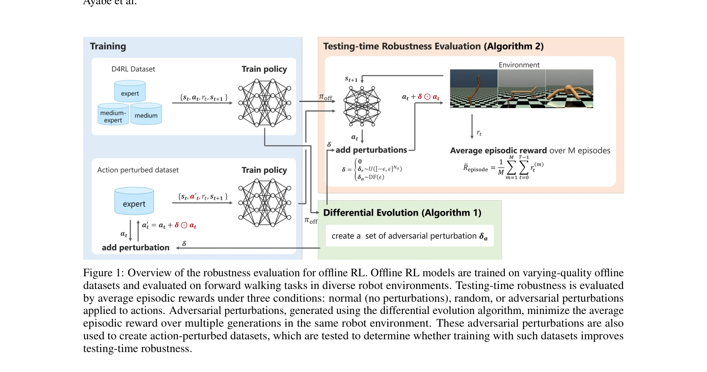
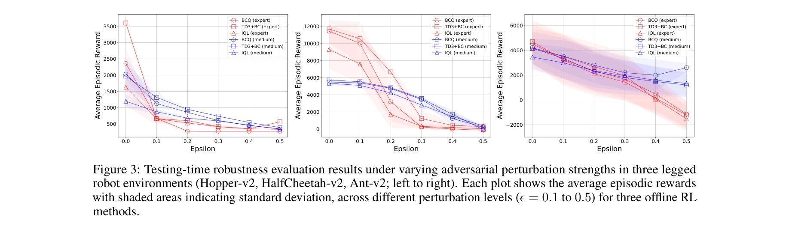
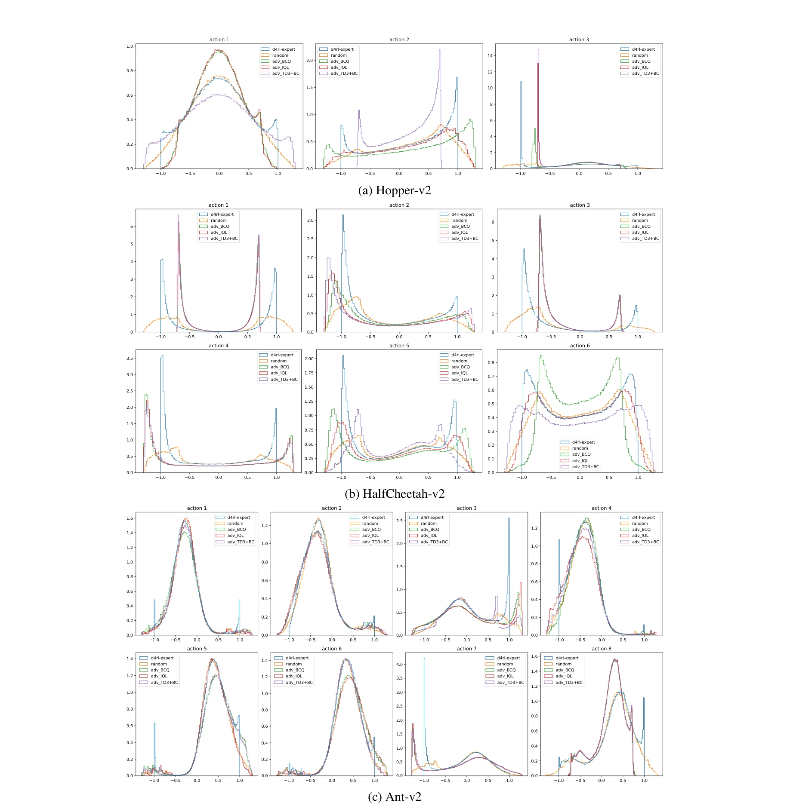

# 오프라인 강화학습의 로봇 제어 견고성 평가: 행동 공간 섭동에 대한 연구

> **저자**: Shingo Ayabe, Takuto Otomo, Hiroshi Kera, Kazuhiko Kawamoto | **날짜**: 2025 | **DOI**: [arXiv:2412.18781](https://arxiv.org/abs/2412.18781)

---

## Essence

*오프라인 강화학습의 견고성 평가 개요: 다양한 품질의 오프라인 데이터셋으로 학습된 모델을 정상, 랜덤, 적대적 섭동 조건에서 평가*

본 논문은 **오프라인 강화학습(Offline RL) 기반 로봇 제어 시스템의 행동 공간 섭동에 대한 견고성을 체계적으로 평가**하며, 기존 오프라인 RL 방법들이 액추에이터 고장과 같은 실제 운영 환경의 도전에 얼마나 취약한지를 실증적으로 증명한다.

## Motivation

- **Known**: 오프라인 RL은 환경과의 상호작용 없이 사전 수집 데이터셋에서만 학습하므로 비용과 위험을 감소시킬 수 있다. 기존 연구들은 주로 **상태 공간 섭동(state-space perturbations)**에 대한 견고성만 다루었다.

- **Gap**: 실제 로봇 시스템에서 액추에이터 고장, 마찰 계수 불일치 등 **행동 공간 섭동(action-space perturbations)**은 동등하게 중요하지만, 오프라인 RL의 관점에서는 거의 탐구되지 않았다. 상태 공간 섭동에 대한 방어 전략(평활화 손실, KL 발산 제약)이 행동 공간 섭동에도 효과적인지 불명확하다.

- **Why**: 오프라인 RL은 데이터셋 외의 행동 탐색을 제한하는 보수적 제약(conservative constraint)을 사용하기 때문에, 훈련 데이터에 포함되지 않은 섭동에 매우 취약할 것으로 예상된다. 이를 체계적으로 검증하는 것이 신뢰할 수 있는 로봇 제어 시스템 개발에 필수적이다.

- **Approach**: (1) 미분 진화(differential evolution) 기반 적대적 섭동 생성, (2) BCQ, TD3+BC, IQL 등 표준 오프라인 RL 방법의 견고성 평가, (3) 섭동이 포함된 데이터셋으로 재학습 시도를 통한 방어 전략 검증

## Achievement

*세 종류의 다리 로봇(Hopper, HalfCheetah, Ant)에서 적대적 섭동 강도에 따른 테스트 타임 견고성 평가 결과*

1. **오프라인 RL의 심각한 취약성 실증**: 기존 오프라인 RL 방법들(BCQ, TD3+BC, IQL)이 무작위 및 적대적 행동 섭동에 대해 **온라인 RL보다 훨씬 더 취약**함을 정량적으로 입증. 예를 들어, Hopper 환경에서 적대적 섭동 하에 평균 에피소드 보상이 극적으로 감소.

2. **데이터셋 커버리지의 중요성 규명**: 테스트 타임 견고성이 훈련 데이터셋의 상태-행동 커버리지(state-action coverage)에 직접 의존함을 발견. 전문가(expert) 데이터셋은 중간(medium) 데이터셋보다 섭동에 더 잘 견딤.

3. **기존 방어 전략의 무효성**: 온라인 RL의 표준 방어 전략인 "섭동이 추가된 환경에서 훈련"을 오프라인 설정에서 적용했을 때, **섭동이 포함된 데이터셋으로 훈련해도 견고성 개선이 거의 없음**을 발견. 이는 오프라인 설정에서 특화된 새로운 방어 방법 개발의 필요성을 강조.

## How

*Hopper, HalfCheetah, Ant의 훈련 데이터셋에서의 행동 분포 비교: 히스토그램으로 표시된 상태-행동 커버리지*

- **적대적 섭동 생성**: 미분 진화 알고리즘을 사용하여 평균 에피소드 보상을 최소화하는 행동 섭동을 반복적으로 최적화. 온라인 RL의 그래디언트 기반 공격과 달리, 오프라인 설정에서 정책-섭동 결합 최적화를 요구하지 않음.

- **평가 메트릭**: 세 가지 조건에서 평균 에피소드 보상 측정: (1) 정상(normal), (2) 무작위 섭동, (3) 적대적 섭동

- **데이터셋 구성**: D4RL 벤치마크의 expert, medium, medium-expert 데이터셋 사용. 섭동 강도 변화에 따른 영향 분석.

- **방어 실험**: 적대적 섭동으로 증강된 데이터셋을 생성하고, 이를 사용하여 정책을 재학습 후 견고성 재평가

- **환경**: MuJoCo 물리 시뮬레이션에서 3종의 다리 로봇(Hopper-v2, HalfCheetah-v2, Ant-v2)의 전진 보행 태스크

## Originality

- **오프라인 RL의 행동 공간 섭동 취약성을 최초로 체계적 평가**: 기존 연구들이 상태 공간 섭동만 다룬 반면, 본 연구는 실제 로봇 응용에서 더 직접적인 영향을 미치는 행동 공간 섭동을 중점 분석

- **오프라인-온라인 RL의 견고성 비교 프레임워크**: 동일한 평가 환경과 메트릭으로 두 패러다임의 차이를 정량화

- **오프라인 설정에 적합한 적대적 공격 방법론**: 정책-섭동 결합 최적화를 요구하지 않는 미분 진화 기반 공격으로 오프라인 특수성 반영

- **데이터셋 커버리지-견고성 상관관계 분석**: 훈련 데이터의 행동 분포가 섭동 견고성에 미치는 직접적 영향 규명

## Limitation & Further Study

- **제한된 환경**: MuJoCo 물리 시뮬레이션만 사용. 실제 로봇 하드웨어나 더 복잡한 환경(부분 관찰성, 비선형 역학)에서의 검증 필요

- **제한된 오프라인 RL 방법**: BCQ, TD3+BC, IQL 3가지만 평가. 더 최신의 오프라인 RL 알고리즘(CQL, AWAC 등)과의 비교 부족

- **섭동 형태의 단순성**: 관절 토크 신호의 부분적 섭동만 다룸. 다중 액추에이터 동시 고장, 센서-액추에이터 결합 고장 등 복잡한 시나리오는 미포함

- **효과적인 방어 전략 부재**: 섭동 증강 데이터셋이 실패한 이유에 대한 깊이 있는 분석과 원리 기반 대안 제시 부족

- **후속 연구 방향**:
  1. 보수적 제약을 완화하면서도 오프라인성을 유지하는 "적응형 탐색(adaptive exploration)" 방법 개발
  2. 섭동에 대해 내재적으로 견고한 행동을 학습하는 정규화 기법(예: action robustness regularization) 연구
  3. 모델 기반 오프라인 RL에서의 동역학 불확실성 활용
  4. 실제 로봇 플랫폼에서의 현실성 검증

## Evaluation

- **Novelty**: 4/5 — 오프라인 RL의 행동 공간 섭동 취약성을 최초로 다루고, 온라인 RL과의 체계적 비교를 제시. 다만 문제 정의 자체는 비교적 직관적.

- **Technical Soundness**: 4/5 — 미분 진화 기반 공격, D4RL 표준 벤치마크, 명확한 메트릭(평균 에피소드 보상) 사용으로 실험 설계가 건전. 다만 섭동 강도 범위의 정당성이나 통계적 유의성 검증(신뢰 구간, p-값) 명시 부족.

- **Significance**: 4/5 — 로봇 제어의 실무적 신뢰성 문제를 정면 제기하고, 기존 방어 전략의 무효성을 증명함으로써 오프라인 RL 커뮤니티에 중요한 경고 신호 제공. 그러나 실질적 해결책 제시 부족으로 임팩트 제한.

- **Clarity**: 4/5 — 명확한 동기, 체계적인 실험 설계, 직관적 시각화. 다만 일부 기술적 상세(미분 진화 초매개변수, 수렴 기준 등)가 부족하고, 결과 분석에서 "왜 섭동 증강이 실패하는가"에 대한 인과적 설명 미흡.

- **Overall**: 4/5

**총평**: 본 논문은 **오프라인 강화학습의 실제 운영 환경에서의 적용 가능성에 중요한 의문을 제기**하며, 행동 공간 섭동에 대한 체계적 취약성 평가를 통해 실무적 가치를 제공한다. 특히 데이터셋 커버리지와 견고성의 상관관계 규명은 향후 더 견고한 오프라인 RL 알고리즘 개발의 기초가 될 수 있다. 다만 **문제 진단에는 탁월하지만 해결책 제시는 미흡**하며, 실제 로봇 검증과 더 다양한 공격 형태 분석을 통한 심화가 필요하다.

## Related Papers

- 🔄 다른 접근: [[papers/688_Robustness_evaluation_of_offline_reinforcement_learning_for/review]] — 두 논문 모두 오프라인 강화학습의 견고성을 다루되 한국어 논문은 행동 공간 섭동, 영어 논문은 동일한 주제를 다른 관점에서 접근한다.
- 🏛 기반 연구: [[papers/395_Guided_by_guardrails_Control_barrier_functions_as_safety_ins/review]] — 제어 장벽 함수 기반 안전 학습은 오프라인 강화학습의 행동 공간 섭동 문제를 해결하는 안전성 보장 메커니즘을 제공한다.
- 🔗 후속 연구: [[papers/422_Improving_generalization_of_robot_locomotion_policies_via_sh/review]] — 샤프니스 인식 최소화를 통한 일반화 개선은 오프라인 강화학습의 견고성 문제를 모델 최적화 관점에서 해결하는 추가적인 방법론을 제시한다.
- 🔗 후속 연구: [[papers/395_Guided_by_guardrails_Control_barrier_functions_as_safety_ins/review]] — 오프라인 강화학습의 견고성 평가는 제어 장벽 함수 기반 안전 학습에서 행동 공간 섭동에 대한 추가적인 견고성 분석을 제공한다.
- 🔄 다른 접근: [[papers/688_Robustness_evaluation_of_offline_reinforcement_learning_for/review]] — 두 논문 모두 오프라인 강화학습의 견고성을 다루되 영어 논문과 한국어 논문이 동일한 주제를 다른 관점에서 접근한다.
- 🔗 후속 연구: [[papers/003_A_comprehensive_survey_of_cross-domain_policy_transfer_for_e/review]] — 오프라인 강화학습의 로봇 제어 견고성을 크로스 도메인 정책 전이로 확장한다.
- 🔗 후속 연구: [[papers/140_Autonomous_reinforcement_learning_agent_for_chemical_vapor_d/review]] — 오프라인 강화학습의 견고성 평가 방법론을 화학 공정 제어에 적용한 확장 연구다
