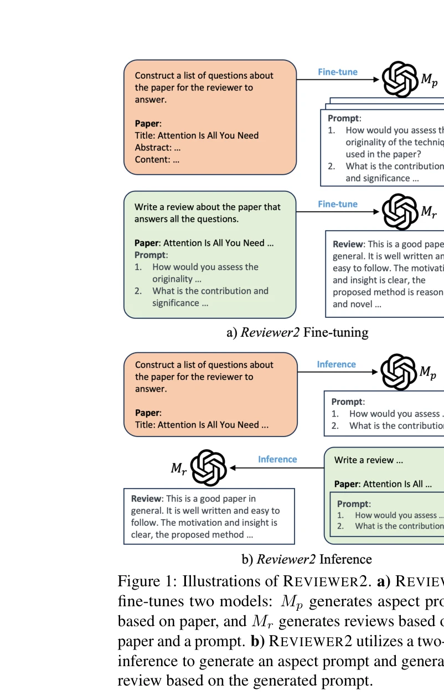
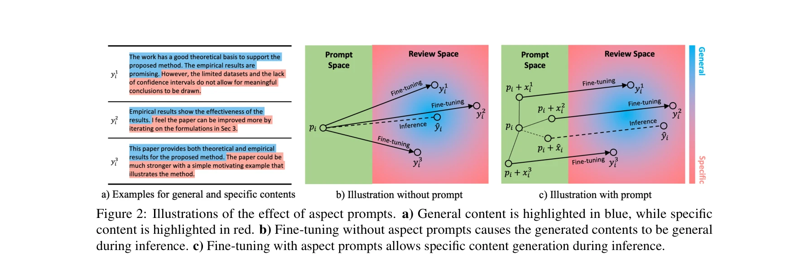
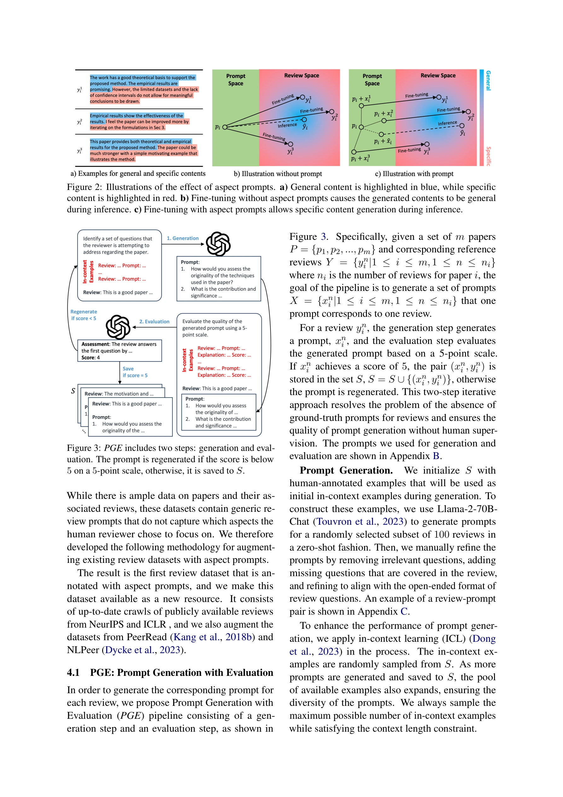

# Reviewer2: Optimizing Review Generation Through Prompt Generation

> **저자**: Zhaolin Gao, Kianté Brantley, Thorsten Joachims | **날짜**: 2024-12-02 | **DOI**: [10.48550/arXiv.2402.10886](https://doi.org/10.48550/arXiv.2402.10886)

---

## Essence

*REVIEWER2의 구조: (a) 두 단계 모델 미세조정 (Mp: 논문→측면 프롬프트, Mr: 논문+프롬프트→리뷰) (b) 추론 단계에서의 순차적 생성*

본 논문은 LLM 기반 자동화된 논문 리뷰 생성의 문제를 **측면 프롬프트(aspect prompt)를 명시적으로 모델링하는 두 단계 프레임워크**로 해결하여, 더 구체적이고 다양한 리뷰를 생성한다.

## Motivation

- **Known**: LLM의 발전으로 자동화된 논문 리뷰 생성이 가능하며, 기존 피어 리뷰 데이터셋이 풍부하게 존재함
- **Gap**: 기존 단계 미세조정(single-stage fine-tuning) 방식의 리뷰 생성은 (1) **구체성 부족**: 일반적이고 추상적인 리뷰만 생성, (2) **측면 커버리지 제한**: "평균으로의 회귀(regression-to-the-mean)" 현상으로 인해 다양한 리뷰 측면을 반영하지 못함
- **Why**: 측면 지정 없는 개방형 리뷰 생성은 과도하게 불명확한 과제(under-specified task)로, 언어 모델의 학습을 어렵게 함
- **Approach**: 두 단계 파이프라인으로 (1) 측면 프롬프트 생성 모델, (2) 프롬프트 조건 리뷰 생성 모델을 분리하여 명시적 제어 가능성 추가

## Achievement

*측면 프롬프트의 효과: (a) 인간 리뷰들의 일반적(파란색) 및 특정(빨간색) 내용 (b) 프롬프트 없이는 일반 내용만 생성 (c) 프롬프트로 특정 내용 생성 가능*

1. **리뷰 품질 향상**: REVIEWER2는 기존 방식 대비 충실성(faithfulness), 커버리지, 구체성 측면에서 현저히 우수한 리뷰 생성
2. **대규모 주석 데이터셋 구축**: 27,000개 논문과 99,000개 리뷰에 측면 프롬프트를 주석한 첫 번째 규모 데이터셋 공개 (6개 학회: NeurIPS, ICLR, PeerRead, NLPeer 등)
3. **효율적 구현**: LongLoRA 기반으로 32k 토큰 컨텍스트 길이 지원, 논문의 추출적 요약(extractive summary) 불필요

## How

*PGE (Prompt Generation with Evaluation) 파이프라인: 생성 단계와 평가 단계의 반복적 프로세스*

**REVIEWER2 구조**:
- **1단계 모델 (Mp)**: 논문 p를 입력받아 측면 프롬프트 집합 {x₁, ..., xₖ} 생성
- **2단계 모델 (Mr)**: 논문 p와 측면 프롬프트 x를 입력받아 리뷰 y 생성
- **추론**: Mp로 프롬프트 생성 → Mr로 조건부 리뷰 생성

**PGE (프롬프트 생성 및 평가) 파이프라인**:
- **생성 단계**: Llama-2-70B-Chat을 이용해 리뷰로부터 측면 프롬프트 생성 (100개 수동 주석 예시로 초기화)
- **평가 단계**: 생성된 프롬프트를 5점 척도로 평가, 점수 5점 미만 시 재생성 (인간 감독 없이 자동화)
- **반복**: 고품질 (프롬프트, 리뷰) 쌍만 데이터셋에 포함

**기술적 최적화**:
- LoRA+: 임베딩 및 정규화 계층을 학습 가능하게 확장
- S2-Attn: 셀프 어텐션의 이차 복잡도 문제 해결

## Originality

- **신규 프레임워크**: 측면 프롬프트를 명시적으로 모델링하는 두 단계 파이프라인은 기존 단계 미세조정 대비 혁신적 접근
- **기하학적 직관**: "평균으로의 회귀" 현상을 기하학적으로 설명하고 측면 프롬프트의 노이즈 감소 효과 논증
- **PGE 파이프라인**: LLM 자체 평가를 활용한 자동 프롬프트 생성 및 품질 관리 메커니즘 (기존 수동 주석 방식의 대안)
- **대규모 주석 데이터셋**: 첫 번째 측면 프롬프트 주석 피어 리뷰 데이터셋 제공 (학계 자산)

## Limitation & Further Study

- **평가의 한계**: 자동 평가 지표의 신뢰성 문제 (특히 구체성 평가 메트릭이 명확하지 않음)
- **PGE 순환성**: 평가 단계에서 같은 LLM 모델을 사용하여 프롬프트를 평가하므로, 생성 편향이 평가에 영향을 미칠 가능성
- **확장성**: 6개 학회에서만 평가했으며, 타 분야(예: 생물학, 의학) 리뷰 생성으로의 일반화 미검증
- **인간 평가 부족**: 정성적 인간 평가가 제한적이어서 실제 저자들의 도움 여부 미확인
- **후속 연구**: (1) 크로스 도메인 리뷰 생성, (2) 대화형 리뷰 피드백 시스템 개발, (3) 편향된 또는 악의적 리뷰 방지 메커니즘

## Evaluation

- Novelty: 4.5/5
- Technical Soundness: 4/5
- Significance: 4.5/5
- Clarity: 4.5/5
- Overall: 4.4/5

**총평**: 본 논문은 측면 프롬프트 모델링이라는 창의적 아이디어로 자동화 리뷰 생성의 구체성과 커버리지 문제를 우아하게 해결하며, 새로운 주석 데이터셋을 학계에 공개한 점에서 큰 가치가 있으나, PGE의 자체-평가 순환성과 인간 평가의 부재는 실용적 신뢰성을 약화시킨다.

## Related Papers

- 🏛 기반 연구: [[papers/481_Lazyreview_a_dataset_for_uncovering_lazy_thinking_in_nlp_pee/review]] — 동료 검토의 게으른 사고 문제를 해결하기 위한 측면 프롬프트 기반 리뷰 생성 최적화 접근법을 제시합니다.
- 🔗 후속 연구: [[papers/206_ChatGPT_outperforms_crowd_workers_for_text-annotation_tasks/review]] — ChatGPT의 텍스트 주석 우수성을 논문 리뷰라는 더 복잡하고 전문적인 작업으로 확장한 응용 연구입니다.
- 🔄 다른 접근: [[papers/592_Openreviewer_A_specialized_large_language_model_for_generati/review]] — 측면 프롬프트 모델링과 과학 리뷰 전용 대규모 언어모델이라는 서로 다른 자동 리뷰 생성 접근법을 제시합니다.
- 🏛 기반 연구: [[papers/206_ChatGPT_outperforms_crowd_workers_for_text-annotation_tasks/review]] — LLM이 인간 주석자를 능가할 수 있다는 기초 연구로서 자동화된 리뷰 생성 연구의 이론적 근거를 제공합니다.
- 🔗 후속 연구: [[papers/481_Lazyreview_a_dataset_for_uncovering_lazy_thinking_in_nlp_pee/review]] — 동료 검토의 게으른 사고 탐지 연구가 LLM 기반 리뷰 생성 최적화 연구의 품질 평가 기준을 제공합니다.
- 🔗 후속 연구: [[papers/843_Treereview_A_dynamic_tree_of_questions_framework_for_deep_an/review]] — Reviewer2의 프롬프트 최적화 접근법이 TreeReview의 계층적 질문 생성 메커니즘과 결합되어 더 효과적인 검토 시스템을 구축할 수 있음
- 🏛 기반 연구: [[papers/519_MARG_Multi-Agent_Review_Generation_for_Scientific_Papers/review]] — 프롬프트 생성을 통한 리뷰 최적화가 다중 에이전트 리뷰 생성의 개별 에이전트 성능 향상에 기초를 제공합니다.
- 🔗 후속 연구: [[papers/592_Openreviewer_A_specialized_large_language_model_for_generati/review]] — 프롬프트 최적화를 통한 리뷰 생성을 전문 파인튜닝된 모델로 확장하여 더 비판적이고 현실적인 리뷰를 생성합니다.
