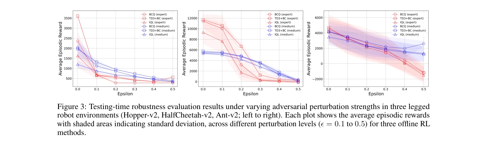

# Robustness evaluation of offline reinforcement learning for robot control against action perturbations

> **저자**: Shingo Ayabe, Takuto Otomo, Hiroshi Kera, Kazuhiko Kawamoto (Chiba University) | **날짜**: 2024 | **DOI**: [arXiv:2412.18781](https://arxiv.org/abs/2412.18781)

---

## Essence

 *오프라인 RL의 견고성 평가 개요: 다양한 품질의 오프라인 데이터셋에서 학습한 모델을 정상, 랜덤, 적대적 행동 섭동 조건에서 평가*

본 논문은 오프라인 강화학습(Offline RL)이 로봇 제어에서 행동 공간의 섭동(action perturbations)에 대해 얼마나 취약한지를 체계적으로 평가하고, 기존의 온라인 RL 방법보다 더 큰 약점을 가짐을 실증적으로 증명한다.

## Motivation

- **Known**: 오프라인 RL은 환경과의 상호작용 없이 고정 데이터셋에서만 학습하므로 비용과 위험을 감소시킬 수 있다. 다만 상태 공간 섭동(state-space perturbations)에 대한 견고성 연구는 존재한다.

- **Gap**: 로봇 제어의 현실 세계 문제인 액추에이터 고장이나 구동부 오류로 인한 행동 공간 섭동(action-space perturbations)에 대한 오프라인 RL의 견고성 평가는 충분하지 않다. 상태 공간 섭동과 행동 공간 섭동은 본질적으로 다르다.

- **Why**: 오프라인 RL은 데이터셋에 포함된 상태-행동 쌍에만 제한되므로 보수적 훈련(conservative training)을 사용한다. 따라서 섭동이 적용된 행동에 대한 데이터가 없으면 이러한 새로운 상황에 매우 취약할 가능성이 높다.

- **Approach**: MuJoCo 시뮬레이터에서 Hopper, HalfCheetah, Ant 다리 로봇에 대해 BCQ, TD3+BC, IQL 등 기존 오프라인 RL 방법들을 평가한다. 차분 진화(differential evolution) 알고리즘으로 생성한 적대적 섭동(adversarial perturbations)과 랜덤 섭동을 적용하여 견고성을 측정한다.

## Achievement

 *세 가지 다리 로봇에서 적대적 섭동 강도 변화에 따른 테스트 시간 견고성 평가 결과*

1. **오프라인 RL의 심각한 취약성**: 기존 오프라인 RL 방법들은 행동 공간 섭동에 매우 취약하며, 온라인 RL 방법들보다 훨씬 큰 성능 저하를 보인다. 예를 들어 적대적 섭동 하에서 보상이 30-70% 감소한다.

2. **데이터셋 커버리지의 중요성**: 테스트 시간 견고성은 훈련 데이터셋의 상태-행동 커버리지에 크게 의존한다. Expert 데이터셋이 Medium 데이터셋보다 일관되게 더 높은 견고성을 나타낸다.

 *훈련 데이터셋의 행동 분포 및 상태-행동 커버리지: 더 나은 커버리지를 가진 데이터셋이 더 견고한 정책을 생성*

3. **데이터셋 증강의 한계**: 섭동이 적용된 행동으로 훈련 데이터셋을 증강해도 견고성이 유의미하게 개선되지 않는다. 이는 단순한 데이터 증강만으로는 충분하지 않음을 시사한다.

## How

- **실험 설정**: D4RL(Deep Offline Reinforcement Learning) 벤치마크의 Expert, Medium, Medium-Expert 데이터셋 사용. 3개의 다리 로봇 환경에서 16 에피소드당 평균 보상으로 평가.

- **섭동 생성**:
  - 랜덤 섭동: 정규분포 N(0, σ²)에서 표본화
  - 적대적 섭동: 차분 진화 알고리즘으로 50 세대 동안 평균 보상을 최소화하는 방향으로 최적화

- **평가 메트릭**: 정상 조건 대비 섭동 조건에서의 보상 감소율, 다양한 섭동 강도(σ = 0.05, 0.1, 0.15, 0.2)에서의 성능 추적

- **비교 대상**: BCQ(Policy Constraint), TD3+BC(Mixed Regularization), IQL(Value Function Regularization), 그리고 온라인 RL(SAC, PPO)

- **데이터셋 증강**: 적대적 섭동을 원래 행동에 더한 후 결과 상태와 보상을 계산하여 증강 데이터셋 구성

## Originality

- **첫 포괄적 평가**: 오프라인 RL의 행동 공간 섭동에 대한 체계적 견고성 평가는 처음이다. 기존 연구는 주로 상태 공간 섭동이나 훈련 시간 견고성에 초점을 맞추었다.

- **적응형 알고리즘 미사용**: 차분 진화 같은 전통적 알고리즘을 사용하여 온라인 RL과 달리 정책 학습과 분리된 오프라인 상황에 적합한 접근법을 제시했다.

- **통합 분석**: 데이터셋 품질, 섭동 유형(랜덤 vs 적대적), 방어 전략(데이터 증강)의 상호작용을 동시에 분석하는 종합적 실험 설계

## Limitation & Further Study

- **제한사항**:
  - MuJoCo 시뮬레이션 환경만 사용 (실제 로봇 검증 부재)
  - 3개 다리 로봇만 평가 (조작 작업 등 다른 도메인 미포함)
  - 다목적 섭동 최적화 문제의 복잡성으로 인한 차분 진화 계산 비용
  - 데이터 증강 시 관찰된 상태와 보상을 계산하는 환경 모델 필요

- **후속 연구**:
  - 온라인 RL의 도메인 랜더마이제이션, 적대적 훈련 방법의 오프라인 RL 적응
  - 견고한 오프라인 RL 알고리즘 개발 (예: 섭동에 명시적으로 최적화)
  - 실제 로봇 플랫폼에서의 검증
  - 불확실성 집합(uncertainty set) 기반 접근법의 오프라인 RL 적용 가능성 탐색
  - 정책 학습 과정에서 섭동 고려

## Evaluation

- **Novelty**: 4/5
  - 행동 공간 섭동에 대한 오프라인 RL 평가는 신규 주제이나, 방법론 자체는 기존 기법의 조합

- **Technical Soundness**: 4/5
  - 실험 설계는 합리적이고 재현 가능하나, 시뮬레이션에만 제한되고 실제 로봇 검증 부재

- **Significance**: 4/5
  - 로봇 제어의 안전성과 견고성을 위해 중요한 문제를 다루나, 명확한 솔루션 제시는 부족

- **Clarity**: 5/5
  - 논문의 구성, 실험 설정, 결과 해석이 명확하고 이해하기 쉬움

- **Overall**: 4/5

**총평**: 본 논문은 오프라인 RL의 행동 공간 섭동에 대한 취약성을 처음으로 체계적으로 드러냄으로써 중요한 안전성 문제를 제기한다. 다만 문제 제시에 머물고 해결책이 부족하며, 실제 로봇 환경에서의 검증이 필요하다는 점이 제약이다.

## Related Papers

- 🔄 다른 접근: [[papers/662_Reinforcement_Learning_for_Dynamic_Microfluidic_Control/review]] — 두 논문 모두 오프라인 강화학습의 견고성을 다루되 영어 논문과 한국어 논문이 동일한 주제를 다른 관점에서 접근한다.
- 🔗 후속 연구: [[papers/395_Guided_by_guardrails_Control_barrier_functions_as_safety_ins/review]] — 제어 장벽 함수를 통한 안전 학습은 오프라인 강화학습의 행동 공간 섭동 취약성을 해결하는 추가적인 안전성 보장 메커니즘을 제공한다.
- 🏛 기반 연구: [[papers/863_Value_iteration_for_learning_concurrently_executable_robotic/review]] — 동시 실행 가능한 로봇 제어 태스크 학습 연구는 오프라인 강화학습의 견고성 평가에 멀티태스킹 환경에서의 성능 분석 방법론을 제공한다.
- 🔗 후속 연구: [[papers/422_Improving_generalization_of_robot_locomotion_policies_via_sh/review]] — 오프라인 강화학습의 견고성 평가 연구는 샤프니스 인식 최소화 기법이 실제 로봇 제어에서 어떤 견고성 개선을 가져오는지 실증적으로 분석할 수 있다.
- 🔄 다른 접근: [[papers/662_Reinforcement_Learning_for_Dynamic_Microfluidic_Control/review]] — 두 논문 모두 오프라인 강화학습의 견고성을 다루되 한국어 논문은 행동 공간 섭동, 영어 논문은 동일한 주제를 다른 관점에서 접근한다.
- 🔗 후속 연구: [[papers/863_Value_iteration_for_learning_concurrently_executable_robotic/review]] — 오프라인 강화학습의 견고성 평가 방법론은 동시 실행 태스크 학습에서 개별 태스크들의 견고성과 상호 간섭 효과를 분석하는 평가 프레임워크를 제공한다.
