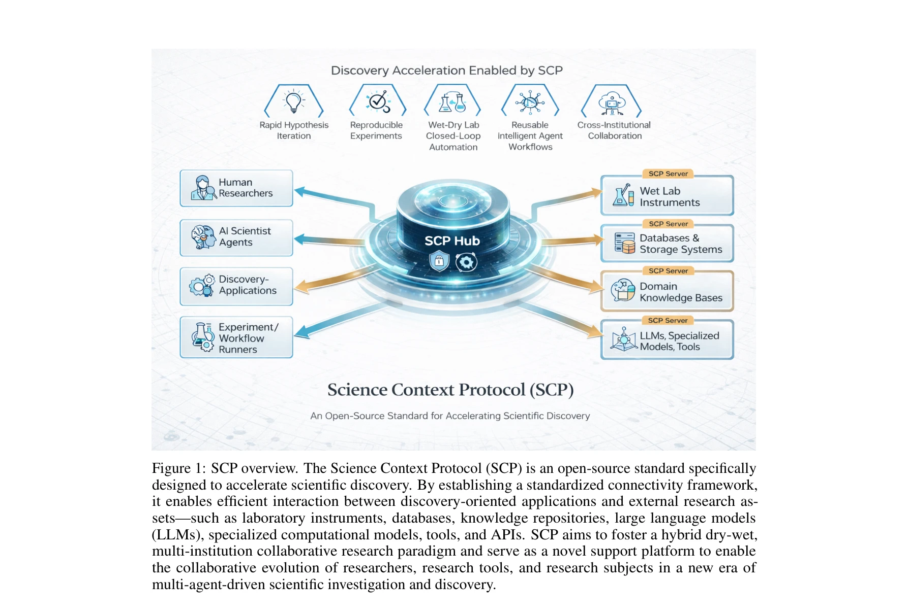
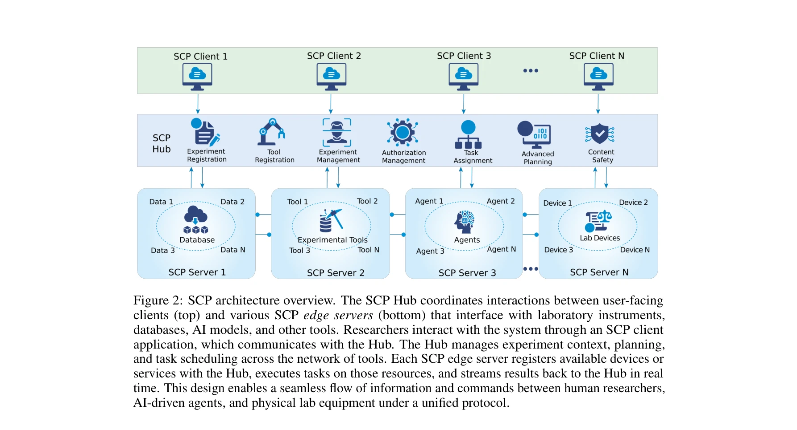

# SCP: Accelerating Discovery with a Global Web of Autonomous Scientific Agents

> **저자**: Yankai Jiang, Wenjie Lou, Lilong Wang, Zhenyu Tang, Shiyang Feng, Jiaxuan Lu, Haoran Sun, Yaning Pan, Shuang Gu, Haoyang Su, Feng Liu, Wangxu Wei, Pan Tan, Dongzhan Zhou, Fenghua Ling, Cheng Tan, Bo Zhang, Xiaosong Wang, Lei Bai, Bowen Zhou | **날짜**: 2025-12-30 | **DOI**: [10.48550/arXiv.2512.24189](https://doi.org/10.48550/arXiv.2512.24189)

---

## Essence

본 논문은 자율 과학 에이전트의 글로벌 네트워크를 가능하게 하는 개방형 표준인 **Science Context Protocol (SCP)**를 제안한다. SCP는 소프트웨어 도구, 데이터셋, 물리 기기를 통합하는 통일된 자원 인터페이스와 실험의 전체 생명주기를 관리하는 오케스트레이션 아키텍처를 제공하여 기관 간 이질적 AI 시스템의 안전한 협업을 가능하게 한다.

## Motivation

- **Known**: 최근 A-Lab, ChemCrow, Coscientist 등 자율 과학 에이전트들이 다양한 과학 분야에서 성공적인 실험 자동화를 시연하고 있으며, 이러한 에이전트들을 연결한 "웹"의 출현이 가속화되고 있다.

- **Gap**: 기존 에이전트 시스템들은 특정 실험실에 종속되고 수작업으로 구성되며, 표준화된 프로토콜 계층이 부재하여 기관 간 상호운용성, 실험 상태 관리, 데이터 접근 제어 등이 어렵다. MCP(Model Context Protocol) 같은 기존 표준은 과학 맥락의 지속성과 실험 생명주기 관리를 충분히 해결하지 못한다.

- **Why**: 분산된 도구, 데이터, 물리 기기를 통합하고 기관 간 보안 협업을 지원하는 프로토콜 수준의 표준이 필수적이며, 이를 통해 확장 가능하고 재현 가능한 과학 발견 인프라를 구축할 수 있다.

- **Approach**: 중앙집중식 SCP Hub와 연합형 SCP Server로 구성된 허브-스포크 아키텍처를 설계하여, (1) 과학 자원에 대한 통일된 명세, (2) 실험 생명주기의 제1급 추상화, (3) 지능형 워크플로우 오케스트레이션 엔진을 제공한다.

## Achievement

*SCP는 실험실 기기, 데이터베이스, LLM, 계산 모델, API 등을 통합하여 드라이(computational)/웻(wet) 하이브리드 협업 연구 패러다임을 지원*

1. **대규모 통합 생태계**: 1,600개 이상의 도구 자원을 보유한 과학 발견 플랫폼 구축으로, 이질적 AI 시스템과 인간 연구자의 안전한 대규모 협업을 가능하게 함.

2. **프로토콜 수준 표준화**: 소프트웨어 함수, 데이터셋, 물리 기기, 복합 에이전트를 단일 명세(specification schema)로 기술하여 개발자의 통합 오버헤드를 대폭 감소시키고 확장성 확보.

3. **완전한 실험 생명주기 관리**: 등록(registration)부터 계획(planning), 실행(execution), 모니터링(monitoring), 아카이빙(archival)까지 추적 가능한 end-to-end 워크플로우 제공.

4. **지능형 오케스트레이션**: 고수준의 실험 의도를 자동으로 다단계 계획으로 분해하고, 의존성 구조, 지연시간, 실험 위험, 비용 추정치 등을 함께 제시.

## How

*SCP Hub가 사용자 애플리케이션, SCP Server, 메시징/저장소 컴포넌트 간의 상호작용을 조율하는 중앙 통제 역할 수행*

- **Hub-and-Spoke 아키텍처**: 중앙 SCP Hub가 분산된 SCP Server들의 페더레이션을 조율하며, 클라이언트는 단일 진입점을 통해 이질적 자원에 접근.

- **실험 컨텍스트의 제1급 추상화**: 실험 ID, 유형(드라이/웻/하이브리드), 목표, 데이터 저장 URI, 설정 매개변수를 포함하는 구조화된 메타데이터로 종단 간 추적성과 버전 관리 실현.

- **통일된 자원 명세**: 도구의 capability description에 매개변수, 부작용(side effects), 보안 요구사항을 포함하여 클라이언트가 안전하게 조성(compose)할 수 있도록 설계.

- **OAuth2.1 기반 인증/인가**: 실험 및 사용자별 세분화된(fine-grained) 접근 제어로 기관 경계 존중 및 데이터 접근 정책 강제.

- **지능형 워크플로우 합성**: 현재 실험 컨텍스트를 파악하고 이용 가능한 자원(도구, 데이터셋, 에이전트)을 감지하여 고수준 목표로부터 후보 작업(task)을 자동 합성.

- **비동기 모니터링 및 이상 감지**: 도구 상태, 데이터 흐름, 자원 사용률을 실시간 추적하고 예정된 폴백 전략을 자동 트리거.

- **물리 기기 통합**: 표준화된 기기 드라이버와 capability description을 통해 로봇 플랫폼, 분석 기기와 시뮬레이션을 동일한 프로토콜로 주소 지정.

## Originality

- **프로토콜 수준의 과학 맥락 표준화**: MCP 등 기존 모델-도구 상호작용 프로토콜을 과학 실험의 전체 생명주기 관리로 확장한 첫 시도로서, 기관 간 상호운용성을 위한 패러다임 전환 제시.

- **드라이-웻 랩 통합**: 계산 도구와 물리 기기를 단일 프로토콜 체계 내에서 조성 가능하게 한 설계는 독창적이며, 자동화 생물학, 재료과학 등 다학제 과학에 새로운 가능성 제공.

- **실험 오케스트레이션의 지능화**: 고수준 의도로부터 멀티스텝 계획을 자동 합성하고 자원 예측/충돌 감지를 수행하는 내장형 AI 거버넌스 모듈은 기존 워크플로우 엔진과 차별화.

- **Open-source 참조 구현**: 사실상의(de facto) 표준 수립을 위해 전체 스펙과 구현을 오픈소스로 공개한 점은 학계 및 산업의 채택을 촉진하는 전략적 결정.

## Limitation & Further Study

- **확장성 검증 부족**: 논문에서 제시된 실증적 사례 연구(case study)가 제한적이며, 매우 대규모 연합 환경(수십 개 기관, 수만 개 도구)에서의 성능, 레이턴시, 거버넌스 오버헤드에 대한 평가가 부재.

- **의미론적 상호운용성**: 이질적 도구의 명세화(specification)는 구조적으로 표준화되지만, 과학적 의미론(예: 화학 분자의 표현 방식, 생물정보학 데이터 형식)의 이질성은 완전히 해결되지 않을 가능성.

- **물리 기기 표준화의 현실성**: 기존 실험실 기기는 다양한 레거시 프로토콜을 사용하는데, 실제 기기 드라이버 작성 및 표준 준수의 비용·난도에 대한 논의 부족.

- **보안 거버넌스의 세분화**: OAuth2.1 기반 접근 제어만으로는 불충분하며, 데이터 계보(provenance) 추적 중 악의적 변조 방지, 계산 자원의 공정한 할당 등에 대한 고급 거버넌스 메커니즘 추가 필요.

- **후속 연구 방향**: 
  - 의미 웹(Semantic Web) 기술과 온톨로지(ontology) 통합으로 과학 도메인의 어휘 표준화
  - 블록체인 기반 감사 추적(audit trail) 및 불변 계보 관리
  - 연합 학습(federated learning) 환경에서의 프라이버시 보존 분석 도구 통합
  - 멀티 클라우드/엣지 환경에서의 분산 오케스트레이션 최적화

## Evaluation

- Novelty: 4/5
- Technical Soundness: 4/5
- Significance: 5/5
- Clarity: 4/5
- Overall: 4.3/5

**총평**: SCP는 분산 과학 에이전트의 상호운용성과 협업을 가능하게 하는 중요한 프로토콜 표준을 제시하며, 실무적 가치와 장기적 영향력이 높다. 다만 대규모 연합 환경에서의 성능 검증, 의미론적 표준화, 물리 기기 통합의 실현 가능성 등에 대한 더 깊은 기술적 논의가 필요하다.