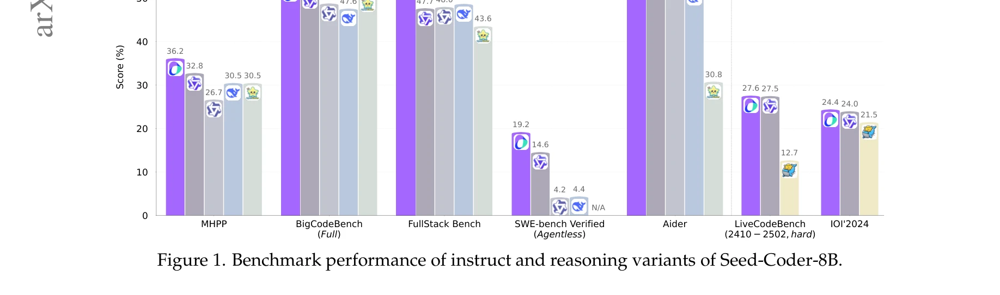

# Seed-coder: Let the code model curate data for itself

> **저자**: ByteDance Seed, Yuyu Zhang, Jing Su, Yifan Sun, Chenguang Xi, Xia Xiao, Zheng Shen, A. Q. Zhang, Kaibo Liu, Daoguang Zan, Tao Sun, J. Zhu, Shijie Xin, Dong Huang, Y. Bai, Lixin Dong, C. J. Li, Jianchong Chen, Hao Zhou, Yifan Huang | **날짜**: 2025 | **DOI**: [arXiv:2506.03524](https://arxiv.org/abs/2506.03524)

---

## Essence

*그림 1. Seed-Coder-8B 지시어(Instruct)와 추론(Reasoning) 변형의 벤치마크 성능 비교*

본 논문은 코드 데이터 전처리 과정에서 인간의 수작업 필터링 규칙에 의존하지 않고, LLM 기반 자동 필터링을 활용하여 6조 토큰의 고품질 코드 사전학습 데이터를 구축한 Seed-Coder 모델 시리즈를 제시한다. 동일 규모의 오픈소스 모델을 능가하고 더 큰 모델과도 경쟁력 있는 성능을 달성한다.

## Motivation

- **Known**: 기존 오픈소스 LLM(DeepSeek-Coder, Qwen2.5-Coder, OpenCoder 등)은 코드 데이터 품질 필터링을 위해 130개 이상의 수작업으로 작성된 휴리스틱 규칙(hand-crafted rules)을 적용해왔다. 이러한 규칙 기반 필터링은 직관적이고 초단기에는 효과적이다.

- **Gap**: 수작업 규칙 기반 접근은 프로그래밍 언어 간 확장성이 낮고, 규칙 간 충돌이 발생하며, 유지보수 비용이 높고, 연구자의 주관적 편향을 내포한다. 코드 품질의 미묘한 차이를 명시적으로 정량화하기 어렵다.

- **Why**: "The Bitter Lesson"(Sutton, 2019)의 통찰에 따르면, 인간 중심 접근은 단기 성과는 탁월하지만 장기적으로는 확장성 부족으로 정체된다. 대규모 계산과 데이터 활용이 더 근본적인 진전을 가져온다.

- **Approach**: **모델 중심 데이터 파이프라인(model-centric data pipeline)**으로 전환한다. LLM 자신을 품질 평가자로 활용하여 GitHub, GitHub Commits, 코드 관련 웹 데이터를 필터링한다. 이어 base, instruct, reasoning의 세 가지 8B 모델 변형을 개발한다.

## Achievement

*그림 2. 사전학습 데이터 처리 파이프라인. GitHub와 웹 아카이브에서 수집한 데이터를 네 가지 범주(파일 수준, 저장소 수준, 커밋, 웹 데이터)로 분류하고 LLM 기반 품질 필터와 최소한의 규칙을 적용*

1. **모델 기반 필터링의 성공**: LLM을 이용한 품질 필터(Quality Scorer)가 수작업 규칙보다 우수한 성능을 보였다. 정확도, 일관성, 대규모 처리 능력에서 인간적 개입을 최소화하면서도 높은 필터링 품질 달성.

2. **벤치마크 우위성**: 동일 규모(8B) 오픈소스 모델(Qwen2.5-Coder-7B, DeepSeek-Coder-V2-Lite, OlympicCoder-7B)을 능가하고, 더 큰 모델들과도 경쟁 가능한 성능. 특히 코드 생성(code generation), 코드 완성(code completion), 코드 편집(code editing), 다단계 추론(multi-step reasoning), 소프트웨어 엔지니어링 작업에서 우수한 성능.

3. **대규모 고품질 데이터 구축**: 6조 토큰의 중복 제거된 코드 사전학습 코퍼스 구축. 원본 데이터의 약 98% 감소를 통해 효율적이고 관리 가능한 고품질 데이터셋 확보.

## How

*그림 3-5. LLM 기반 품질 평가 파이프라인 및 예시*

### 사전학습(Pretraining) 단계

- **병렬 파이프라인 설계**: 순차 의존성을 제거하여 각 필터가 독립적으로 실행 가능하도록 설계. 점진적 데이터 확장과 유연한 파이프라인 조작 지원.

- **전처리(Preprocessing)**:
  - SHA256 해시 기반 정확 중복 제거(exact deduplication)
  - MinHash 알고리즘 기반 근사 중복 제거(near-deduplication)
  - Tree-sitter 등 구문 파서로 구문 오류 코드 제거
  - 언어 추론으로 비관련 데이터 제거
  - 원본 대비 약 98% 데이터 감소

- **LLM 기반 품질 필터링(Quality Filtering)**:
  - 기존 휴리스틱 규칙을 LLM 평가자로 대체
  - 코드 가독성, 논리적 정확성, 실행 가능성, 완결성 등을 LLM이 평가
  - 확장성과 일관성 보장
  
- **데이터 범주화**:
  - 파일 수준 코드(file-level): 단순 구조, 단문맥 학습
  - 저장소 수준 코드(repo-level): 프로젝트 구조 보존, 장문맥 학습
  - GitHub Commits: 커밋 메시지, 메타데이터, 패치 포함
  - 코드 관련 웹 데이터: 코드 블록 포함 문서

- **이단계 사전학습(Two-phase Pretraining)**:
  1. 정규 사전학습: 파일 수준 코드 + 웹 데이터로 기초 능력 구축
  2. 연속 사전학습: 네 범주 전부 활용하여 성능 및 정렬(alignment) 강화

### 사후학습(Post-training) 단계

- **지시어 모델(Instruct Model)**:
  - 데이터 다양성 구성: 다양한 프로그래밍 난제, 언어, 도메인 포함
  - 품질 및 난이도 필터링: LLM 기반 난이도 분류
  - 샌드박스 검증 자체 수정(self-correction with sandbox verification)
  - 직접 선호도 최적화(DPO, Direct Preference Optimization)

- **추론 모델(Reasoning Model)**:
  - 장 연쇄 사고(Long-Chain-of-Thought, LongCoT) 강화학습
  - 복잡한 다단계 코딩 작업의 추론 능력 향상
  - 문제 분해, 중간 단계 설명, 최종 코드 생성

- **Fill-in-the-Middle(FIM)**: 양방향 코드 완성 능력 향상

### 오염 제거(Decontamination)

- 벤치마크 데이터셋과의 중복 확인 및 제거하여 평가의 신뢰성 보장

## Originality

- **패러다임 전환**: 코드 데이터 필터링에서 "인간 중심 → 모델 중심" 접근으로의 본질적 전환. 이는 "The Bitter Lesson"을 코드 LLM 분야에 구체적으로 적용한 첫 번째 대규모 사례.

- **자동화된 품질 평가**: 단순 휴리스틱을 LLM 기반 다차원 평가로 대체. 코드 품질의 미묘한 뉘앙스를 자동으로 포착하며 확장성 극대화.

- **병렬 파이프라인 설계**: 순차 의존성을 제거한 모듈식 구조로 점진적 데이터 확장 및 유연한 조작 가능.

- **포괄적인 데이터 범주화**: 파일, 저장소, 커밋, 웹 데이터 등 다양한 코드 소스를 체계적으로 통합.

- **다양한 모델 변형**: Base, Instruct, Reasoning 세 가지 변형을 통해 서로 다른 사용 사례 지원.

## Limitation & Further Study

- **모델 규모**: 8B로 제한되어 있으며, 더 큰 모델(100B+)에서의 효과는 미확인. 향후 더 큰 규모로의 확장 필요.

- **LLM 필터의 비용**: LLM을 이용한 대규모 필터링의 계산 비용은 논의되지 않음. 실제 운영 비용과 ROI 분석 필요.

- **언어별 편향**: GitHub 데이터가 특정 프로그래밍 언어에 편중되어 있을 수 있으며, 모든 언어에 동등한 효과를 제공하는지 명확하지 않음.

- **LLM 필터의 순환 편향(circular bias)**: LLM 기반 필터가 특정 패턴을 선호하면, 동일한 LLM이 학습되어 자기 강화(self-reinforcement)가 발생할 가능성.

- **평가 벤치마크 다양성**: 특정 벤치마크 세트에서의 높은 성능이 일반화되는 정도는 추가 검증 필요.

- **후속 연구 방향**:
  - 더 큰 규모 모델에서의 효과 검증
  - 다국어 코드 데이터 품질 평가 메커니즘 개발
  - LLM 필터의 순환 편향 분석 및 완화 방안
  - 실시간 코드 데이터 업데이트 파이프라인 개발

## Evaluation

- Novelty: 4.5/5
- Technical Soundness: 4.5/5
- Significance: 4.5/5
- Clarity: 4/5
- Overall: 4.4/5

**총평**: Seed-Coder는 코드 데이터 큐레이션의 근본적인 방식을 재정의하여, 인간의 수작업 규칙 대신

## Related Papers

- 🔄 다른 접근: [[papers/263_Deepseek-coder_When_the_large_language_model_meets_programmi/review]] — DeepSeek-Coder와 달리 Seed-Coder는 LLM 기반 자동 필터링으로 인간 수작업을 제거
- 🔗 후속 연구: [[papers/231_Codegen_An_open_large_language_model_for_code_with_multi-tur/review]] — CodeGen의 프로그램 생성 기법을 자동화된 데이터 큐레이션으로 발전시킨 연구
- 🔄 다른 접근: [[papers/230_Code_llama_Open_foundation_models_for_code/review]] — Code Llama와 유사한 코드 모델이지만 데이터 전처리에서 완전 자동화 달성
- 🔗 후속 연구: [[papers/770_Starcoder_2_and_the_stack_v2_The_next_generation/review]] — StarCoder의 코드 생성 능력을 자가 큐레이션 데이터로 더욱 향상시킨 연구
- 🔄 다른 접근: [[papers/263_Deepseek-coder_When_the_large_language_model_meets_programmi/review]] — 둘 다 코드 생성 모델이지만 Seed-Coder는 LLM 기반 자동 필터링으로 차별화됨
- 🔄 다른 접근: [[papers/894_AI_Copilot_Code_Quality_2025_Data_Suggests_4x_Growth_in_Code/review]] — 둘 다 코딩 LLM을 다루지만 하나는 AI Copilot 코드 품질에, 다른 하나는 Seed-Coder의 자동 큐레이션에 초점을 맞춘다.
