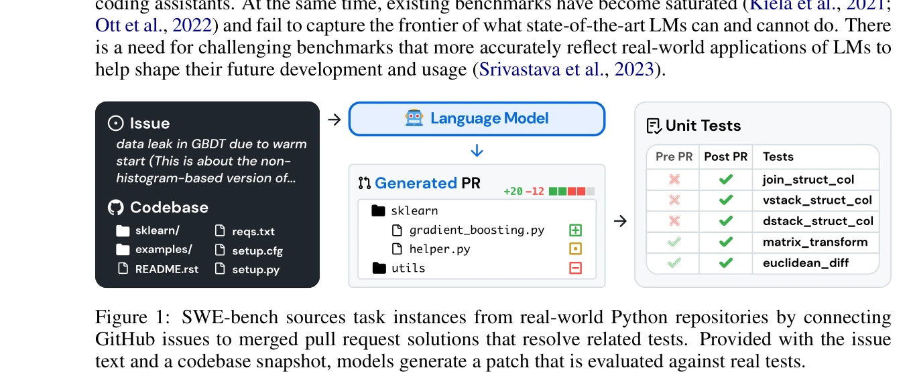
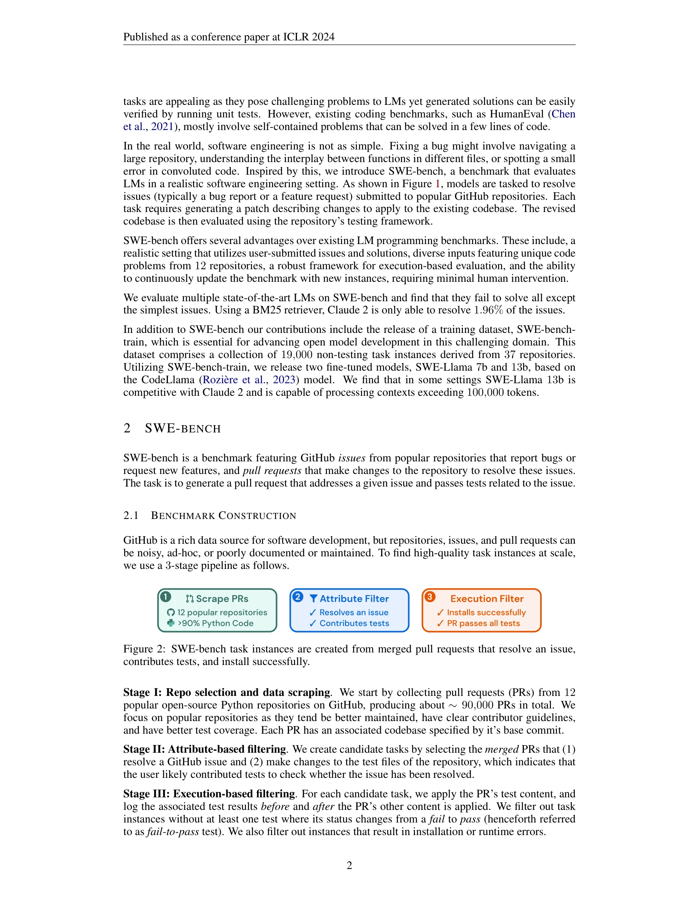
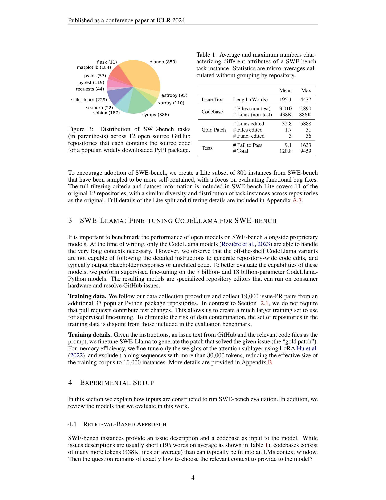

# SWE-bench: Can Language Models Resolve Real-World GitHub Issues?

> **저자**: Carlos E. Jimenez, John Yang, Alexander Wettig, Shunyu Yao, Kexin Pei, Ofir Press, Karthik Narasimhan | **날짜**: 2024-11-11 | **DOI**: [10.48550/arXiv.2310.06770](https://doi.org/10.48550/arXiv.2310.06770)

---

## Essence

*Figure 1: SWE-bench는 GitHub 이슈를 실제 코드베이스와 함께 제시하여 언어 모델이 생성한 패치를 단위 테스트로 검증하는 방식으로 작동*

실제 GitHub 이슈 2,294개를 기반으로 한 소프트웨어 엔지니어링 벤치마크 SWE-bench를 제시하며, 최고 성능 모델(Claude 2)도 1.96%의 낮은 해결율만 달성하여 대규모 언어 모델의 실제 소프트웨어 엔지니어링 능력의 한계를 명확히 드러낸다.

## Motivation

- **Known**: 기존 HumanEval, MBPP 등의 코딩 벤치마크는 수십 줄의 자체 포함된(self-contained) 문제만 평가하며, 기존 NLP 벤치마크들이 포화되어 있음
- **Gap**: 실제 소프트웨어 엔지니어링은 대규모 리포지토리 이해, 다중 파일/함수 간 조율, 복잡한 컨텍스트 처리를 요구하는데 이를 평가할 벤치마크가 부재
- **Why**: 언어 모델의 실제 실무 능력을 정확히 평가하고, 향후 개발 방향을 수립하기 위해 현실적이고 도전적인 벤치마크 필요
- **Approach**: 실제 GitHub 이슈-PR 쌍을 3단계 필터링(속성 필터링, 실행 필터링)으로 정제하여 고품질 작업 인스턴스 구성

## Achievement

*Figure 2: 3단계 데이터 파이프라인: (1) 인기 리포지토리 90,000개 PR 수집 → (2) 이슈 해결 + 테스트 기여 PR 필터링 → (3) 실행 기반 필터링으로 2,294개 최종 작업 구성*

1. **포괄적 벤치마크 구성**: 12개 인기 Python 리포지토리에서 2,294개의 실제 이슈를 기반으로 한 고품질 벤치마크 생성. 각 작업은 평균 438K 라인의 대규모 코드베이스, 195단어의 이슈 설명, 평균 1.7개 파일과 3.0개 함수 수정 필요

2. **상태 최고 모델의 성능 한계 실증**: Claude 2 (BM25 retriever 포함) 1.96%, GPT-4는 미포함되었으나 공개 모델 중 SWE-Llama 13b가 경쟁 가능 수준의 성능 달성

3. **학습 데이터 및 파인튠드 모델 공개**: 37개 추가 리포지토리에서 19,000개 비테스팅 인스턴스로 구성된 SWE-bench-train 및 CodeLlama 기반 SWE-Llama 7b/13b 모델 공개

4. **지속적 확장 가능성**: 최소 인간 개입으로 새로운 Python 리포지토리를 추가할 수 있는 자동화된 파이프라인 설계

## How

*Figure 3: 12개 리포지토리별 작업 분포 (django 850개가 가장 많고, flask 11개가 가장 적음)*

### 데이터 구성 방법론

- **Stage I**: GitHub에서 ~90,000개 PR 수집 (>90% Python 코드, 인기 리포지토리 중심)
- **Stage II**: (1) 이슈 해결 PR (2) 테스트 변경 포함 조건으로 후보 작업 선별
- **Stage III**: PR 적용 전후 테스트 실행, fail-to-pass 테스트 존재 확인, 설치/런타임 오류 제거

### 작업 포뮬레이션

- **입력**: 이슈 텍스트 설명 + 완전한 코드베이스 스냅샷
- **출력**: Unified diff 형식의 패치 파일
- **평가**: `patch` 유틸리티로 패치 적용 후 모든 테스트 통과 확인 (fail-to-pass + 회귀 테스트 ~51개)

### 파인튠 학습 전략

- **모델**: CodeLlama 7b/13b (기존 모델은 지시문 따르기 능력 부족)
- **데이터**: 19,000 (이슈-PR 쌍), 테스트 변경 요구사항 제거로 크기 확대
- **최적화**: LoRA로 주의(attention) 부계층만 파인튠, 30,000 토큰 이상 시퀀스 제외 (10,000개로 축소)

## Originality

- **현실성 기반 구성**: 실제 오픈소스 커뮤니티 데이터로 벤치마크 구축하여 기존 합성 데이터 벤치마크와 차별화
- **자동화된 품질 관리**: 3단계 필터링 파이프라인으로 체계적 품질 보증 및 확장성 확보
- **장문맥 처리 요구**: 438K 라인의 대규모 코드베이스와 평균 195단어 이슈로 다중 파일 추론 능력 평가
- **실행 기반 평가**: 형식적 정확성이 아닌 실제 테스트 통과로 정량적 검증 (fail-to-pass 테스트 평균 9.1개, 회귀 테스트 중앙값 51개)
- **공개 모델 에코시스템 지원**: 별도 학습 데이터셋(SWE-bench-train) 및 파인튠드 모델 공개로 오픈소스 커뮤니티 기여

## Limitation & Further Study

### 한계

- **초기 평가 제한**: Claude 2만 1.96% 해결 (GPT-4 평가 미포함), 대규모 모델의 성능 비교 부족
- **검색 기반 접근의 의존성**: BM25 retriever에 의존하여 실제 현실성 (파일 탐색, 오류 처리) 부분 추상화
- **Python 언어 편향**: 12개 모두 Python 리포지토리로 언어 다양성 부족
- **패치 형식 제약**: Unified diff 형식만 지원하여 구조적 리팩토링 등 복잡한 변환 표현 한계
- **테스트 기여 리포지토리 편향**: Stage II에서 테스트 변경 PR만 선별하여 테스트 커버리지 높은 리포지토리 과대대표

### 후속 연구 방향

- **에이전트 기반 접근**: 코드 실행, 오류 분석, 반복적 디버깅을 포함한 의사결정 에이전트 평가
- **다중 언어 확장**: Java, JavaScript, Go 등 다양한 언어의 리포지토리 추가
- **더 강력한 모델 평가**: GPT-4, Gemini 등 최신 모델 벤치마킹
- **SWE-bench Lite 확대**: 더 큰 규모의 간단한 버전으로 단계적 진입 장벽 낮추기
- **창의적 해결책 평가**: 참조 PR과 다른 해결책의 동등성 판정 메커니즘

## Evaluation

- Novelty: 4.5/5
- Technical Soundness: 4.5/5
- Significance: 4.8/5
- Clarity: 4.7/5
- Overall: 4.6/5

**총평**: SWE-bench는 기존 코딩 벤치마크의 인공성을 벗어나 실제 GitHub 이슈 해결을 통해 언어 모델의 실무 소프트웨어 엔지니어링 능력을 엄격하게 평가하는 중요한 작업이며, 공개 데이터셋과 자동화된 확장성으로 장기적 학술 가치가 높다. 다만 검색 기반 접근과 초기 평가 모델 제한은 개선 여지가 있다.

## Related Papers

- 🔄 다른 접근: [[papers/429_Infiagent-dabench_Evaluating_agents_on_data_analysis_tasks/review]] — 실제 소프트웨어 문제 해결과 데이터 분석이라는 서로 다른 영역에서 LLM 에이전트의 실용적 성능을 평가한다.
- 🔗 후속 연구: [[papers/716_ScienceAgentBench_Toward_Rigorous_Assessment_of_Language_Age/review]] — 소프트웨어 엔지니어링에서 드러난 한계를 과학 발견 영역으로 확장하여 보다 포괄적인 평가 기준을 제시한다.
- 🏛 기반 연구: [[papers/704_SciAgentGym_Benchmarking_Multi-Step_Scientific_Tool-use_in_L/review]] — 현실적인 벤치마크 설계의 중요성을 보여주며 다단계 도구 활용 평가의 필요성을 뒷받침한다.
- 🔗 후속 연구: [[papers/1088_Lag_Llm_agents_for_leaderboard_auto_generation_on_demanding/review]] — GitHub 이슈 해결 벤치마크로 League가 생성하는 리더보드의 실제 소프트웨어 개발 성과 평가에 활용할 수 있다.
- 🏛 기반 연구: [[papers/546_Mlgym_A_new_framework_and_benchmark_for_advancing_ai_researc/review]] — 실제 개발 문제 해결이 AI 연구 에이전트의 기반을 제공합니다.
- 🏛 기반 연구: [[papers/871_WebAgent-R1_Training_Web_Agents_via_End-to-End_Multi-Turn_Re/review]] — SWE-bench의 실제 GitHub 이슈 해결 벤치마크는 WebAgent-R1의 웹 에이전트 훈련에 실제 소프트웨어 개발 작업의 복잡성을 반영한 학습 환경을 제공한다.
- 🔄 다른 접근: [[papers/769_StableToolBench_Towards_Stable_Large-Scale_Benchmarking_on_T/review]] — 실제 문제 해결 능력 평가를 위해 도구 사용과 GitHub 이슈 해결이라는 다른 벤치마킹 접근법을 사용한다
- 🧪 응용 사례: [[papers/327_Experiential_co-learning_of_software-developing_agents/review]] — 실제 GitHub 이슈 해결을 통해 경험적 협력학습의 효과를 검증할 수 있는 벤치마크를 제공한다.
- 🏛 기반 연구: [[papers/429_Infiagent-dabench_Evaluating_agents_on_data_analysis_tasks/review]] — 실제 문제 해결 능력 평가의 중요성을 보여주며 현실적 벤치마크 설계의 필요성을 뒷받침한다.
- 🧪 응용 사례: [[papers/586_Opendevin_An_open_platform_for_ai_software_developers_as_gen/review]] — 실제 GitHub 이슈 해결이라는 구체적 작업에서 플랫폼의 실용성을 검증할 수 있는 벤치마크를 제공한다.
- 🏛 기반 연구: [[papers/716_ScienceAgentBench_Toward_Rigorous_Assessment_of_Language_Age/review]] — 현실적 문제 해결 능력 평가의 중요성을 보여주며 과학 발견 영역에서의 엄밀한 평가 기준을 제시한다.
- 🏛 기반 연구: [[papers/416_Hyperagent_Generalist_software_engineering_agents_to_solve_c/review]] — SWE-bench의 실제 GitHub 이슈 해결 벤치마크가 HYPERAGENT의 일반화된 소프트웨어 엔지니어링 에이전트 성능 평가의 기반이 된다.
- 🔄 다른 접근: [[papers/888_X-webagentbench_A_multilingual_interactive_web_benchmark_for/review]] — X-WebAgentBench가 다국어 웹 환경에서 에이전트를 평가하는 반면, SWE-bench는 GitHub 코드 저장소에서 실제 문제 해결 능력을 측정하는 대안적 벤치마킹 접근법을 제시합니다.
