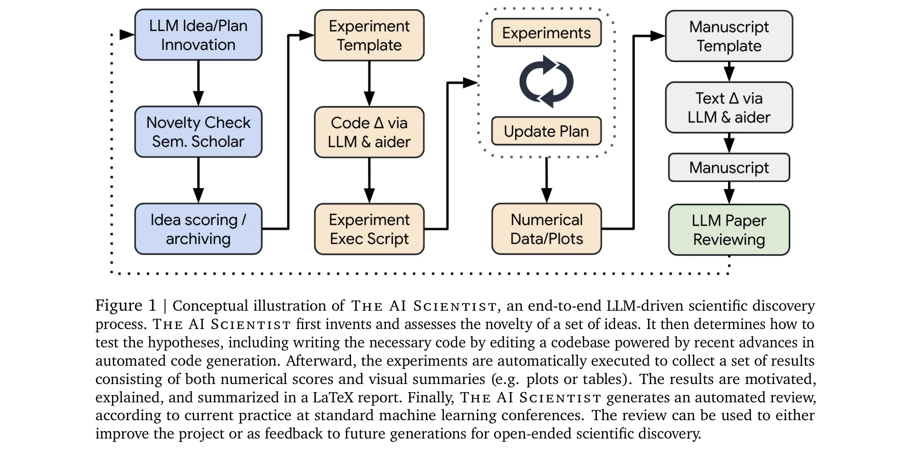
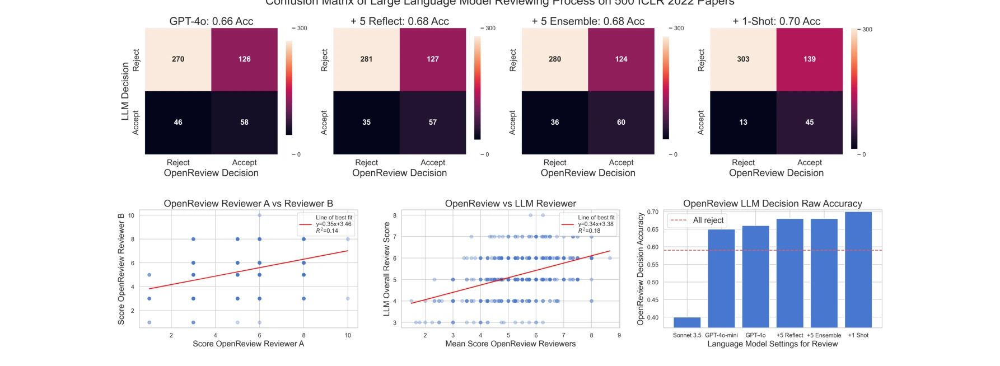
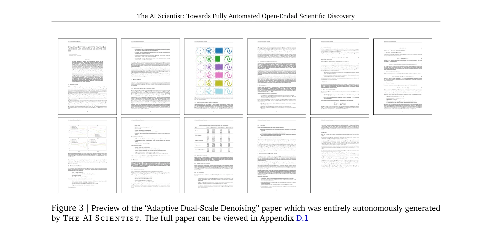

# The AI Scientist: Towards Fully Automated Open-Ended Scientific Discovery

> **저자**: Chris Lu, Cong Lu, Robert Tjarko Lange, Jakob Foerster, Jeff Clune, David Ha | **날짜**: 2024 | **DOI**: [10.48550/ARXIV.2408.06292](https://doi.org/10.48550/ARXIV.2408.06292)

---

## Essence

*Figure 1: The AI Scientist의 개념도 - 아이디어 생성부터 논문 작성 및 자동 리뷰까지의 전체 파이프라인*

대규모 언어모델(LLM)을 기반으로 하는 완전 자동화된 과학 연구 수행 시스템으로, 아이디어 생성에서 실험 수행, 논문 작성, 동료 검토까지 전체 과학 연구 프로세스를 자동으로 처리할 수 있다. 한 편의 논문 생성에 15달러 미만의 비용이 소요되며, 자동 리뷰 시스템이 인간 수준에 가까운 성능으로 논문 품질을 평가한다.

## Motivation

- **Known**: 최신 LLM들(GPT-4, Claude, Gemini 등)은 개별 연구 작업(논문 작성, 코딩, 아이디어 브레인스토밍)에서 인간 과학자의 보조 역할로 우수한 성능을 보이고 있음

- **Gap**: 그러나 기존 연구는 과학 연구 프로세스의 일부분만 자동화하였으며, 아이디어 생성부터 논문 작성까지 **전체 연구 사이클을 완전 자동화한 사례는 없음**. 기존 자동화 연구도 사전에 정의된 탐색 공간에 제한됨

- **Why**: 1970년대부터 과학 발견의 자동화를 목표로 해온 학문적 전통이 있으며, 최근 LLM의 코딩 능력 향상(Aider 등)이 이를 가능하게 함

- **Approach**: 
  1. LLM의 체인-오브-싱킹(chain-of-thought)과 자기성찰(self-reflection) 활용
  2. 자동화 코딩 어시스턴트(Aider)를 통한 실험 구현
  3. 진화 연산과 개방형 탐색(open-endedness) 원칙 적용
  4. 자동 논문 리뷰 시스템을 통한 품질 평가

## Achievement

*Figure 2: ICLR 2022 OpenReview 데이터를 사용한 자동 리뷰 시스템의 성능 평가*

1. **완전 자동화 파이프라인 구현**: 아이디어 생성→실험 설계→코드 작성→실험 실행→논문 작성→자동 리뷰까지 인간 개입 없이 전체 프로세스를 자동화

2. **고품질 자동 리뷰 시스템**: ICLR 2022 데이터 기반 평가에서 65% vs 66% 균형잡힌 정확도(balanced accuracy)로 인간 리뷰어와 유사한 성능 달성

3. **비용 효율성**: 논문 1편당 $15 미만의 저비용으로 수백 편의 중간 품질 논문을 일주일 내에 생성 가능

4. **실제 논문 생성**: 확산 모델(diffusion modeling), 언어모델(language modeling), 그로킹(grokking) 등 3개 분야에서 실제 학회 수용 기준을 초과하는 논문 생성 달성

## How

*Figure 3: AI Scientist가 자동으로 생성한 "Adaptive Dual-Scale Denoising" 논문의 미리보기*

**3단계 주요 프로세스:**

### 1단계: 아이디어 생성 (Idea Generation)
- 기본 코드 템플릿에서 출발하여 다양한 연구 방향을 반복 생성
- 진화 연산 원칙에 따라 아이디어 아카이브를 누적
- 각 아이디어: 설명(description), 실험 계획(experiment plan), 재미(interestingness)/참신성(novelty)/실행가능성(feasibility) 점수 포함
- Semantic Scholar API를 통한 문헌 검색으로 참신성 검증

### 2단계: 실험 수행 (Experimental Iteration)
- Aider를 활용하여 아이디어를 실제 코드로 구현
- LLM이 지정한 계획에 따라 기본 템플릿 수정
- 실험 실행 결과 수집 (수치 점수 및 시각화 자료)
- 재현성과 해석 가능성 확보

### 3단계: 논문 작성 (Paper Write-up)
- LLM이 실험 결과를 바탕으로 LaTeX 형식의 전체 과학 논문 작성
- 표준 기계학습 학회 포맷 준수
- 결과 해석 및 토의 자동 생성

### 4단계: 자동 리뷰 및 평가
- LLM 기반 동료 리뷰 프로세스 실행
- 기준 초과 아이디어를 지속적인 발전을 위한 아카이브에 추가
- 피드백 기반 반복 개선 가능

## Originality

- **최초 성과**: 기존 연구는 하이퍼파라미터 탐색, 아키텍처 검색 등 특정 부분만 자동화하였으나, 본 논문은 **아이디어 생성부터 논문 작성까지 전체 과학 연구 사이클의 완전 자동화 달성**

- **LLM 에이전트 프레임워크의 혁신적 활용**: 체인-오브-싱킹, 자기성찰, 자동화 코딩(Aider)을 통합하여 과학적 창의성과 실행 능력을 동시에 구현

- **진화적 아이디어 아카이브**: 과거 연구 결과를 바탕으로 새로운 아이디어를 조건부로 생성하는 개방형 탐색 방식으로, 인간 과학 공동체의 누적 발전 프로세스를 모방

- **자동 리�뷰 시스템의 검증**: 실제 학회 데이터(ICLR 2022)로 자동 리뷰의 신뢰성을 입증 (인간 수준 성능)

- **실용적 적용 가능성**: 단순한 개념 증명이 아닌, 실제 작동하는 시스템으로 다수의 논문 생성

## Limitation & Further Study

- **실험 규모의 제한**: 계산 효율성을 위해 소규모 실험에 제한되어 있으나, 원칙적으로는 대규모 실험으로 확장 가능

- **도메인 의존성**: 현재 기계학습 분야에만 적용되었으며, 실험 자동 실행이 어려운 분야(실험 생물학, 재료 과학 등)의 확장에는 별도 기술 필요

- **논문 품질의 편차**: 수백 편의 논문 중 유의미한 기여도를 가진 논문의 비율, 완전히 새로운 발견의 정도에 대한 상세 분석 부재

- **자동 리뷰의 한계**: ICLR과 같은 특정 학회 데이터로 훈련되어 다른 분야나 학회 리뷰 기준으로의 일반화 가능성 불명확

- **윤리적 고려사항**: 대규모 자동 논문 생성으로 인한 학술출판 시스템 부담, 저작권, 과학적 엄밀성 기준에 대한 충분한 논의 필요

- **향후 연구 방향**:
  - 다양한 과학 분야로의 확장 (생물학, 물리학, 화학 등)
  - 인간 과학자와의 협업 시스템 개발
  - 자동 논문의 학술 출판 가능성 검증
  - 다단계 검증 메커니즘 강화

## Evaluation

- **Novelty (참신성)**: 4.5/5
  - 과학 발견의 완전 자동화는 처음 시도이나, 개별 기술들(LLM, 코드 생성, 자동 리뷰)은 기존 기술의 통합

- **Technical Soundness (기술적 건전성)**: 4/5
  - 시스템은 잘 설계되었으나, 논문 품질 평가 메트릭의 객관성과 충분성에 의문 여지 있음
  - 자동 리뷰의 ICLR 특정 데이터 의존성으로 인한 일반화 우려

- **Significance (중요도)**: 4.5/5
  - 과학 연구 자동화의 새로운 가능성을 제시하며, 저비용 대량 생성의 실현
  - 그러나 생성 논문의 실제 과학적 가치와 인용도에 대한 장기 검증 필요

- **Clarity (명확성)**: 4/5
  - 전체 파이프라인이 명확하게 설명되었으나, 실패 사례, 생성된 논문의 편향성에 대한 상세 분석 부족

- **Overall: 4.25/5**

**총평**: 본 논문은 대규모 언어모델의 능력을 과학 연구의 완전 자동화로 확장한 획기적 시도로, 저비용 고속도의 자동 연구 수행 가능성을 입증하였다. 다만, 생성 논문의 실제 학술적 가치, 다양한 도메인으로의 일반화 가능성, 과학 출판 시스템에 미칠 윤리적 영향에 대한 심층 분석이 필요하다.

## Related Papers

- 🧪 응용 사례: [[papers/834_Towards_Scientific_Discovery_with_Generative_AI_Progress_Opp/review]] — 생성형 AI를 이용한 과학 발견의 이론적 프레임워크를 완전 자동화 시스템으로 구현한다
- ⚖️ 반론/비판: [[papers/081_Ai_scientists_fail_without_strong_implementation_capability/review]] — AI 과학자의 성공 사례에 대해 구현 능력 부족이라는 비판적 관점을 제시한다
- 🔗 후속 연구: [[papers/321_Evaluating_Sakanas_AI_Scientist_Bold_Claims_Mixed_Results_an/review]] — AI Scientist의 실제 연구 수행 능력을 다양한 관점에서 평가한 확장 연구다
- 🧪 응용 사례: [[papers/575_Nobel_Turing_Challenge_creating_the_engine_for_scientific_di/review]] — 과학 발견 엔진의 구체적 구현체로서 노벨 튜링 챌린지에 부응하는 시스템을 제시한다
- 🔗 후속 연구: [[papers/353_From_Automation_to_Autonomy_A_Survey_on_Large_Language_Model/review]] — 완전 자동화된 AI 과학자 개발 사례로 본 논문이 제시한 자율적 에이전트로의 진화를 실제 구현한다.
- 🏛 기반 연구: [[papers/268_Democratizing_AI_scientists_using_ToolUniverse/review]] — 자동화된 과학 발견이 AI 과학자 민주화의 기반을 제공합니다.
- 🧪 응용 사례: [[papers/265_DeepSeek-R1_incentivizes_reasoning_in_LLMs_through_reinforce/review]] — DeepSeek-R1의 자기 검증 능력은 AI Scientist의 완전 자동화된 과학 발견에서 핵심적인 추론 검증 모듈로 활용될 수 있다.
- 🔗 후속 연구: [[papers/718_Scientific_discovery_in_the_age_of_artificial_intelligence/review]] — AI를 통한 과학적 발견의 일반적 조망이 완전 자동화된 AI 과학자 시스템의 구체적 구현으로 발전했다
- 🔗 후속 연구: [[papers/137_Autonomous_Agents_for_Scientific_Discovery_Orchestrating_Sci/review]] — 완전 자동화된 과학 발견을 자율 과학 에이전트의 구체적 실현으로 확장할 수 있다
- ⚖️ 반론/비판: [[papers/044_Accelerating_Scientific_Research_with_Gemini_Case_Studies_an/review]] — 인간-AI 협력을 강조하는 반면 완전 자동화된 과학 발견을 추구하여 서로 다른 AI 과학 철학을 보입니다.
- 🧪 응용 사례: [[papers/056_Advancing_the_scientific_method_with_large_language_models_F/review]] — 완전 자동화된 오픈엔드 과학자 AI가 LLM으로 변화하는 과학 방법론의 구체적 실현 사례이다.
- 🔗 후속 연구: [[papers/575_Nobel_Turing_Challenge_creating_the_engine_for_scientific_di/review]] — AI Scientist의 초기 구현을 완전 자동화된 개방형 과학 발견으로 발전시킨다.
- 🔄 다른 접근: [[papers/418_Hypothesis_Generation_for_Materials_Discovery_and_Design_Usi/review]] — LLM 기반 과학 연구 자동화 시스템이지만 재료 과학 특화 vs 범용 과학 연구의 차이를 비교할 수 있다
- 🏛 기반 연구: [[papers/834_Towards_Scientific_Discovery_with_Generative_AI_Progress_Opp/review]] — 완전 자동화 과학 연구 시스템의 현실적 한계와 필요 구성 요소에 대한 이론적 기반을 제공한다
- ⚖️ 반론/비판: [[papers/081_Ai_scientists_fail_without_strong_implementation_capability/review]] — AI Scientist의 성과에 대해 구현 능력 부족이라는 근본적 한계를 제기한다
- 🏛 기반 연구: [[papers/784_Systematic_Framework_of_Application_Methods_for_Large_Langua/review]] — 완전 자동화 과학 연구 시스템 구축에 체계적인 LLM 응용 방법론의 기반을 제공한다
- 🧪 응용 사례: [[papers/076_AI_for_Science_An_Emerging_Agenda/review]] — AI for Science 로드맵을 실제 자동화된 과학 발견 시스템으로 구현한 사례
- 🔄 다른 접근: [[papers/1083_A_framework_for_discovering_scientific_equations_with_large/review]] — LLM 기반 과학 방정식 발견과 완전 자동화된 과학 발견의 다른 접근법
- 🔗 후속 연구: [[papers/188_Can_we_automatize_scientific_discovery_in_the_cognitive_scie/review]] — 완전 자동화된 과학 발견에서 인지과학 특화 자동화로의 확장
- ⚖️ 반론/비판: [[papers/321_Evaluating_Sakanas_AI_Scientist_Bold_Claims_Mixed_Results_an/review]] — AI Scientist의 심각한 결함 발견이 완전 자동화된 과학 발견의 한계를 지적
- 🔄 다른 접근: [[papers/922_Vibe_physics_The_AI_grad_student/review]] — AI를 활용한 과학 연구 자동화의 두 가지 접근법을 비교하여 인간 감독 vs 완전 자동화의 장단점을 파악할 수 있다.
- 🔄 다른 접근: [[papers/352_From_AI_for_Science_to_Agentic_Science_A_Survey_on_Autonomou/review]] — 에이전틱 사이언스와 AI 과학자의 서로 다른 자율적 과학 연구 패러다임을 비교하여 각각의 강점과 한계를 명확히 할 수 있다.
- 🏛 기반 연구: [[papers/828_Towards_end-to-end_automation_of_AI_research/review]] — AI 과학자의 초기 개념과 구현을 완전한 엔드투엔드 시스템으로 발전시킨 진화 과정을 보여준다.
- ⚖️ 반론/비판: [[papers/326_Exp-bench_Can_ai_conduct_ai_research_experiments_arXiv_prepr/review]] — AI Scientist의 완전 자동화된 과학 발견 주장에 대해 EXP-Bench가 현재 AI 에이전트의 실제 실험 성공률 한계를 실증적으로 반박한다.
- 🏛 기반 연구: [[papers/825_Towards_an_AI_co-scientist/review]] — AI Scientist의 완전 자동화된 과학 발견 방법론이 Gemini 2.0 기반 AI co-scientist 시스템 개발의 기본적인 기술적 토대를 제공한다.
- 🔄 다른 접근: [[papers/1094_Towards_a_Medical_AI_Scientist/review]] — 의료 AI 과학자와 The AI Scientist는 모두 자율 과학 연구를 다루지만, 임상 의학 특화와 범용 과학 발견이라는 서로 다른 도메인 접근법을 취합니다.
- 🔄 다른 접근: [[papers/794_The_AI_Scientist-v2_Workshop-Level_Automated_Scientific_Disc/review]] — AI Scientist-v2와 원래 AI Scientist 모두 완전 자동화된 과학 발견을 추구하지만 에이전트 기반 트리 서치 vs 기본적인 자동화 접근을 사용한다.
- 🔄 다른 접근: [[papers/817_Toward_a_Team_of_AI-made_Scientists_for_Scientific_Discovery/review]] — AI 과학자 자동화 시스템의 또 다른 구현으로 완전 자동화된 과학 발견 프레임워크를 제시한다.
- 🔄 다른 접근: [[papers/436_InternAgent_When_Agent_Becomes_the_Scientist_--_Building_Clo/review]] — 완전 자동화된 과학 발견에서 폐쇄 루프 시스템과 오픈엔드 시스템이라는 다른 접근법을 제시한다.
- 🔄 다른 접근: [[papers/041_Aaar-10_Assessing_ais_potential_to_assist_research/review]] — AI의 연구 지원 능력 평가와 완전 자동화된 AI 과학자 개발이라는 서로 다른 AI 과학 연구 접근법을 제시합니다.
- 🔗 후속 연구: [[papers/1129_SARS-CoV-2_simulations_go_exascale_to_predict_dramatic_spike/review]] — 분산 컴퓨팅을 활용한 단백질 동역학 연구가 완전 자동화된 과학 발견 시스템의 핵심 구성요소가 될 수 있다
