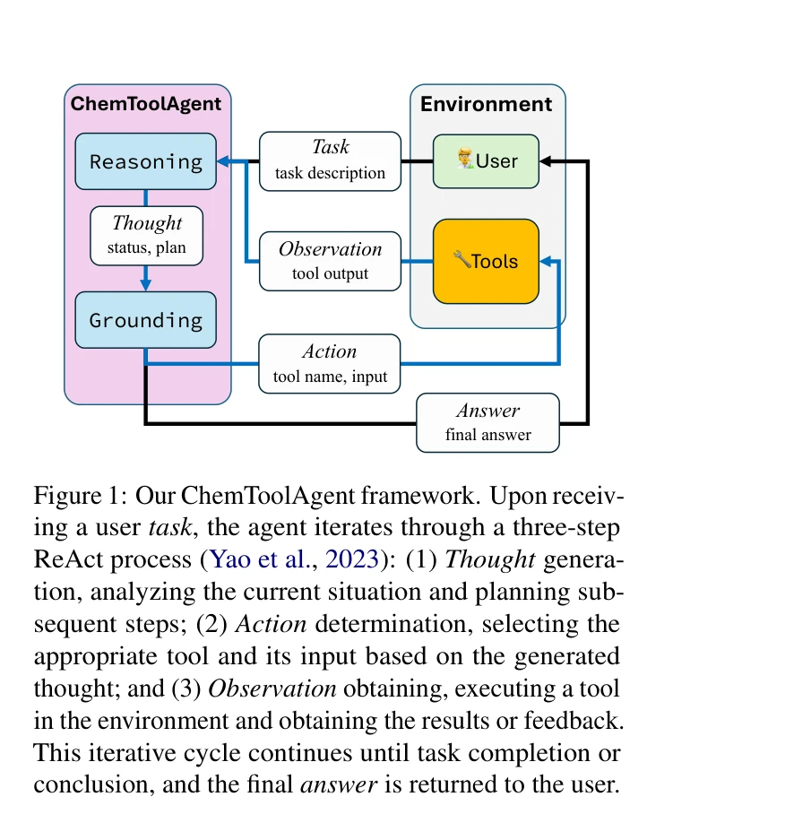
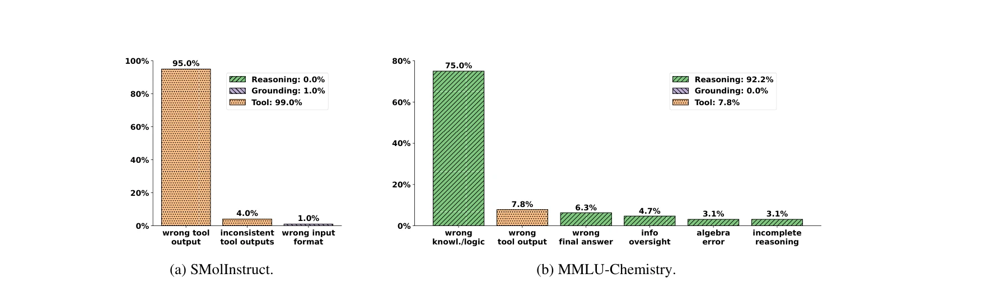

# Tooling or Not Tooling? The Impact of Tools on Language Agents for Chemistry Problem Solving

> **저자**: Botao Yu, Frazier N. Baker, Ziru Chen, Garrett Herb, Boyu Gou | **날짜**: 2025 | **DOI**: [10.48550/arXiv.2411.07228](https://doi.org/10.48550/arXiv.2411.07228)

---

## Essence

*ChemToolAgent 프레임워크: ReAct 기반으로 Thought 생성 → Action 결정 → Observation 획득의 반복 사이클을 통해 화학 문제를 해결*

본 논문은 대규모 언어 모델(LLM)에 도구를 통합한 화학 에이전트(ChemToolAgent)가 전문화된 화학 작업에서는 우수하나, 일반적인 화학 시험 문제에서는 기반 LLM을 하회한다는 놀라운 발견을 보고한다. 이는 도구 증강(tool augmentation)이 항상 성능을 개선하지 않음을 시사하며, 작업 특성에 따른 신중한 도구 적용이 필요함을 강조한다.

## Motivation

- **Known**: ChemCrow, Coscientist 등 도구를 탑재한 화학 에이전트들이 제안되어 왔으나, 이들의 평가는 좁은 범위(ChemCrow는 14개 작업, Coscientist는 6개 작업)에 국한되어 있음.

- **Gap**: 다양한 화학 작업에 걸쳐 도구 증강의 효과가 일관되게 나타나는지, 어떤 상황에서 도움이 되는지에 대한 포괄적 이해 부족.

- **Why**: 화학 도메인에서 LLM은 계산 오류, 도메인 지식 부족, 반응 예측 불가 등의 한계를 가지고 있으며, 이를 해결하는 효과적 방안을 찾기 위해서는 체계적 평가가 필수적임.

- **Approach**: 29개 도구를 탑재한 강화된 ChemToolAgent(CTA)를 개발하고, 전문화된 화학 작업(SMolInstruct, 14개 작업 유형, 700개 샘플)과 일반 화학 질문(MMLU-Chemistry, SciBench-Chemistry, GPQA-Chemistry, 총 386개 샘플)으로 구분하여 체계적으로 평가.

## Achievement

*CTA(GPT) 오류 분석: SMolInstruct에서 102개, MMLU-Chemistry에서 64개 오류 분류. 전문화 작업에서는 도구 오류 비중이 높고, 일반 질문에서는 추론 오류(특히 잘못된 지식/논리, 정보 간과)가 지배적*

1. **전문화 작업에서의 대폭 성능 향상**: CTA는 SMolInstruct의 화학명-SMILES 변환(NC-S2I) 70%, 분자 성질 예측(PP-SIDER) 70%, 합성 경로 예측(RS) 42% 정확도를 달성하여 기반 LLM(GPT-4o: 0%, 44%, 0%)과 ChemCrow를 크게 초과. 전문화된 분자 표현과 화학 연산이 필요한 작업에서 도구의 가치를 명확히 입증.

2. **일반 화학 질문에서의 역설적 성능 저하**: CTA(GPT)는 MMLU-Chemistry 71.0%, SciBench-Chemistry 60.1%, GPQA-Chemistry 33.8% 정확도로, 기반 LLM인 GPT-4o(80.5%, 60.7%, 40.5%)를 하회. 도구 증강이 항상 성능을 개선하지 않음을 입증.

3. **오류 분석을 통한 근본 원인 규명**: 전문화 작업에서는 도구 오류(tool error)가 주 원인이나, 일반 질문에서는 잘못된 지식/논리(wrong knowledge/logic, 약 34%)와 정보 간과(information oversight, 약 23%)라는 추론 오류가 지배적. 도구 증강으로 인한 인지 부하 증가가 추론 능력을 방해하는 것으로 해석됨.

## How

- **ChemToolAgent 아키텍처**: ReAct(Reasoning and Acting) 프레임워크 기반으로 Thought(상황 분석 및 계획), Action(도구 선택 및 입력), Observation(도구 실행) 3단계를 반복 수행. Reasoning(이해, 평가, 계획)과 Grounding(도구 선택, 입력 결정) 두 가지 인지 능력을 통합.

- **도구 세트 구성**: 29개 도구를 General tools(Python 코드 실행, PythonREPL), Molecule tools(분자 분석, 성질 예측, 변환), Reaction tools(합성 경로 예측, 역합성)로 분류. 16개 신규 도구 개발 및 6개 기존 도구 강화(예: PubchemSearchQA, BBBPPredictor, SideEffectPredictor, 개선된 WebSearch).

- **오류 분류 체계**: Chemistry 전문가 참여로 오류를 Reasoning error(잘못된 지식/논리, 잘못된 최종 답, 정보 간과, 대수 오류, 불완전 추론), Grounding error(도구 호출 오류, 잘못된 입력 형식), Tool error(도구 자체 실패)로 체계적 분류.

- **다층 평가 설계**: 두 가지 작업 범주(전문화/일반) × 3개 LLM 백본(GPT-4o, Claude-3.5-Sonnet 단독 vs. 에이전트) × 4개 데이터셋(SMolInstruct 700개, MMLU 70개, SciBench 223개, GPQA 93개)로 포괄적 평가 수행.

## Originality

- **기존 연구와의 차별성**: ChemCrow의 좁은 평가 범위(14개 작업)를 극복하여 **700-1086개 샘플의 대규모 다중 데이터셋으로 포괄적 평가** 수행. 전문화 작업과 일반 질문으로 명확히 구분하여 **도구 효과의 작업 의존성**을 최초로 체계적으로 규명.

- **반직관적 발견의 이론적 의의**: "도구 증강이 항상 도움이 된다"는 널리 퍼진 가정에 대해 **첫 번째 대규모 실증적 반증**을 제시. 도구 사용 시 **인지 부하 증가로 인한 추론 성능 저하**라는 새로운 가설 제시.

- **오류 분석 깊이**: Chemistry 전문가 참여를 통해 단순 성공/실패를 넘어 **구체적 오류 유형 분류 및 정량화(SMolInstruct 102개, MMLU-Chemistry 64개 오류)**로, 후속 개선 방향을 구체적으로 제시.

- **공개 자원**: 29개 도구와 평가 코드를 공개하여 화학 에이전트 연구의 재현성과 확장성 기여.

## Limitation & Further Study

- **LLM 백본 제한**: GPT-4o와 Claude-3.5-Sonnet만 평가하여 오픈소스 LLM(Llama, Mixtral 등)의 성능 미확인. 도구 증강 효과가 모델 크기나 능력에 따라 달라질 가능성 있음.

- **도구 설계의 최적화 부족**: 도구 개수(29개)와 추상화 수준의 최적성이 검증되지 않았으며, 도구 설명(tool description)이나 우선순위 설정(tool ranking) 등 프롬프트 공학적 개선 가능성 미탐색.

- **인지 부하 정량화의 미흡**: "도구 사용으로 인한 인지 부하 증가"가 성능 저하의 원인이라는 가설이 제시되나, 이를 직접 측정하거나 증명하는 실험 부재. 예를 들어, 도구 개수를 단계적으로 줄이는 ablation study 미수행.

- **동적 도구 선택 메커니즘 부재**: 현재 에이전트는 모든 도구를 이용 가능하게 하여, 필요한 도구만 선택적으로 활성화하는 "selective tool use" 미구현.

- **후속 연구 방향**:
  - 인지 부하를 감소시키기 위한 도구 요약(tool summarization) 또는 계층적 도구 구성(hierarchical tool organization) 연구
  - 작업별 최적 도구 세트를 자동으로 선택하는 학습 가능한 메커니즘 개발
  - 도구 사용과 직접 추론의 동적 혼합(hybrid reasoning) 연구
  - 다국어 화학 작업으로 평가 확장

## Evaluation

- Novelty: 4/5
- Technical Soundness: 4/5
- Significance: 4.5/5
- Clarity: 4/5
- Overall: 4/5

**총평**: 본 논문은 화학 도메인에서 LLM 에이전트의 도구 증강 효과에 대한 **첫 번째 대규모 체계적 평가**를 제공하며, "도구가 항상 도움이 된다"는 통념을 깨뜨리는 **중요한 반직관적 발견**을 제시한다. 강화된 ChemToolAgent, 29개 도구, 그리고 1086개 샘플의 포괄적 벤치마크를 통해 **작업 특성별 맞춤 설계의 중요성**을 입증하였다. 다만, 인지 부하 증가의 정량적 증명과 개선 메커니즘의 제시 부족이 논문의 실질적 임팩트를 제한한다. 화학 정보학 및 AI 에이전트 설계 분야에 의미 있는 기여를 하였으나, 근본적 해결책 제시는 향후 과제로 남긴다.

## Related Papers

- ⚖️ 반론/비판: [[papers/651_RAG-Enhanced_Collaborative_LLM_Agents_for_Drug_Discovery/review]] — 화학 작업에서 도구 증강이 항상 성능을 향상시키지 않는다는 발견이 RAG 기반 협력적 접근법의 필요성을 뒷받침한다.
- 🏛 기반 연구: [[papers/397_Hallucinations_can_improve_large_language_models_in_drug_dis/review]] — 도구 증강의 한계를 보여주는 연구로, 환각이 오히려 도움이 될 수 있다는 발견과 연결하여 AI 성능 개선의 복잡성을 이해할 수 있다.
- 🔗 후속 연구: [[papers/499_LLM_With_Tools_A_Survey/review]] — 도구를 활용한 LLM에 대한 종합적 조사를 화학 분야의 구체적 사례 분석으로 확장한다.
- 🔗 후속 연구: [[papers/214_ChemToolAgent_The_Impact_of_Tools_on_Language_Agents_for_Che/review]] — 언어 에이전트의 도구 사용 영향에서 화학 특화 도구로의 확장
- ⚖️ 반론/비판: [[papers/397_Hallucinations_can_improve_large_language_models_in_drug_dis/review]] — 화학 분야에서 도구 증강이 항상 성능 향상으로 이어지지 않는다는 발견과 환각이 오히려 도움이 된다는 발견이 기존 AI 개선 방식에 대한 의문을 제기한다.
- 🔄 다른 접근: [[papers/651_RAG-Enhanced_Collaborative_LLM_Agents_for_Drug_Discovery/review]] — 신약 발견에서 LLM 활용이라는 공통점이 있지만 RAG 기반 협력적 접근법과 도구 증강의 한계라는 다른 관점을 제시한다.
- ⚖️ 반론/비판: [[papers/499_LLM_With_Tools_A_Survey/review]] — 언어 에이전트에서 도구 사용이 미치는 영향에 대한 비판적 분석을 제공한다.
