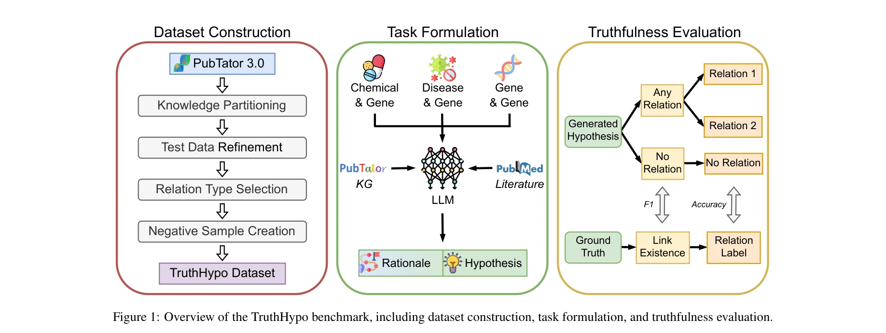
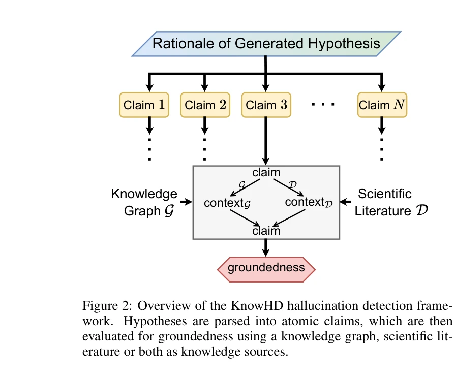
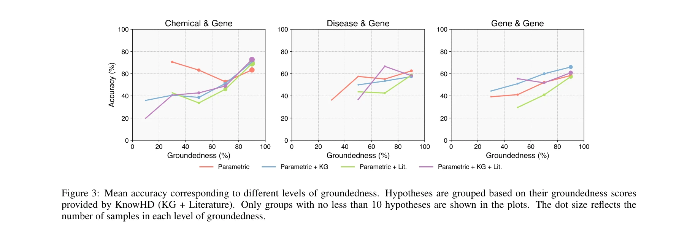
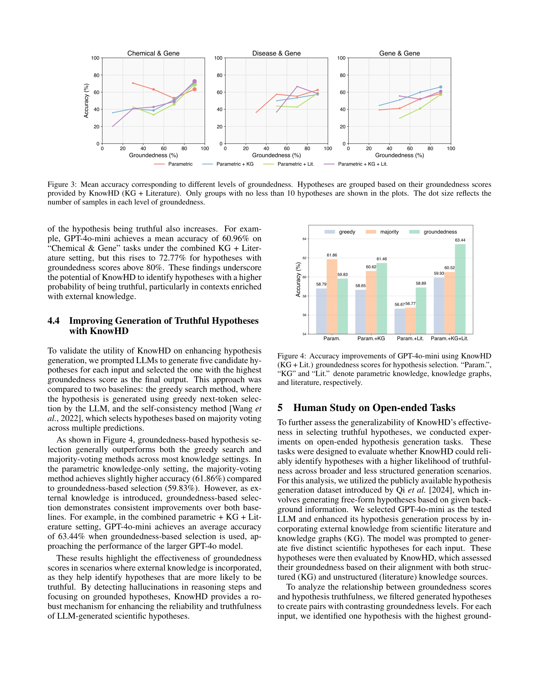

# Toward reliable biomedical hypothesis generation: Evaluating truthfulness and hallucination in large language models

> **저자**: Guangzhi Xiong, Eric Xie, Corey Williams, Myles Kim, Amir Hassan Shariatmadari, Sikun Guo, Stefan Bekiranov, Aidong Zhang (University of Virginia) | **날짜**: 2025 | **DOI**: [10.24963/ijcai.2025/873](https://doi.org/10.24963/ijcai.2025/873)

---

## Essence

*TruthHypo 벤치마크 개요: 데이터셋 구성, 작업 수식화, 진실성 평가를 포함*

대규모 언어 모델(LLM)의 생의학 가설 생성 능력을 평가하기 위해 TruthHypo 벤치마크와 KnowHD 할루시네이션 탐지 프레임워크를 제안했으며, LLM이 진실한 가설 생성에서 상당한 어려움을 겪음을 입증하고 지식 기반 접지(groundedness) 점수를 통한 검증 방법을 제시했다.

## Motivation

- **Known**: LLM은 광범위한 과학 문헌을 분석하여 패턴을 식별하고 새로운 연구 방향을 제안할 수 있으며, 신약 조합 제안 등에서 실제 검증 성과를 보임.

- **Gap**: 생성된 가설의 진실성(truthfulness)을 평가할 방법이 부재하고, LLM의 할루시네이션(hallucination) 문제로 인해 그럴듯하지만 과학적으로 타당하지 않은 가설이 생성되는 문제가 미해결 상태임. 기존 연구는 새로움(novelty)과 다양성에 집중했으나 진실성과 기존 지식과의 접지는 미충분함.

- **Why**: 과학 발견 가속화를 위해서는 생성된 가설이 기존 지식에 근거하고 과학적으로 타당함을 체계적으로 검증할 수 있는 벤치마크와 할루시네이션 탐지 방법이 필수적임.

- **Approach**: 생의학 지식그래프(PubTator 3.0)와 시간 기반 분할(2023년 이전/2024년 이후)을 활용한 TruthHypo 벤치마크를 구축하고, 추론 과정 분석을 통한 KnowHD 할루시네이션 탐지 프레임워크를 제안.

## Achievement

*KnowHD 할루시네이션 탐지 프레임워크 개요*

*접지도(groundedness) 수준에 따른 평균 정확도. 가설들이 접지도 점수별로 그룹화됨*

1. **벤치마크 구축**: PubTator 3.0 기반 3가지 관계 유형(Chemical & Gene, Disease & Gene, Gene & Gene)에 대해 총 2,024개 인스턴스의 TruthHypo 벤치마크 개발. 시간 기반 분할로 미래 과학 발견 시뮬레이션 구현.

2. **할루시네이션 탐지 프레임워크**: 가설과 추론 체인을 원자적 주장(atomic claims)으로 분해하여 접지도를 평가하는 KnowHD 프레임워크 제안. 이 점수가 진실한 가설 필터링의 효과적 지표임을 입증.

3. **성능 분석**: LLM이 진실한 가설 생성에서 상당한 어려움을 겪음을 밝혔으며, KnowHD의 접지도 점수와 가설의 진실성 간의 강한 연관성 입증.

4. **휴먼 평가 검증**: 개방형 가설 생성 작업에서 KnowHD의 과학적 타당성 있는 가설 식별 효용성을 휴먼 평가로 확인.

## How

*GPT-4o-mini를 사용한 KnowHD의 정확도 개선. 접지도에 따른 필터링 효과 시각화*

**TruthHypo 벤치마크:**
- PubTator 3.0 생의학 지식그래프에서 PMID 기반 시간 분할로 "본 것(seen)"과 "보지 못한 것(unseen)" 부분집합 구성
- "보지 못한 것" 부분집합에서 "본 것"과 중복되는 엔티티 쌍 제거로 데이터 무결성 확보
- 3가지 관계 유형에 대해 음의 샘플 생성으로 거짓 양성(false positive) 경향성 평가

**지식 증강 설정:**
- 매개변수 지식만 사용 (기저선)
- 구조화된 지식: 그래프에서 멀티-홉 링크 체인 텍스트화
- 검색 증강 생성(RAG): BM25로 PubMed 문헌 검색 (시간 제약 준수)
- 결합 설정: 구조화된 지식 + 비구조화된 문헌 정보

**KnowHD 할루시네이션 탐지:**
- 가설과 추론 체인을 LLM 프롬프팅으로 원자적 주장으로 분해
- 각 주장을 지식 기반(문헌/지식그래프)에 대해 검증
- 접지도 점수 산출: 지원되는 주장의 비율로 계산
- 접지도-진실성 매핑으로 필터링 임계값 결정

**평가 지표:**
- 링크 레벨(link-level): 정밀도(Precision), 재현율(Recall), F1 점수
- 관계 레벨(relation-level): 정확도(Accuracy) - 정확한 관계 레이블 예측 평가

## Originality

- **체계적 벤치마크 설계**: 시간 기반 분할과 음의 샘플 생성으로 현실적 과학 발견 시나리오를 시뮬레이션하는 벤치마크는 기존 과제에 비해 혁신적

- **추론 과정 기반 할루시네이션 탐지**: 원자적 주장 분해를 통한 세밀한 접지도 평가는 기존의 단순 사실 검증을 넘어선 새로운 접근법

- **다층적 지식 증강**: 매개변수 지식, 구조화된 지식, RAG, 결합 설정 등 4가지 시나리오를 포함한 종합적 평가 프레임워크

- **과학 도메인 특화**: 생의학 분야의 실제 지식그래프(PubTator 3.0)를 활용한 구체적이고 검증 가능한 평가 방식

## Limitation & Further Study

**한계:**
- 3가지 관계 유형(Chemical & Gene, Disease & Gene, Gene & Gene)에만 제한되어 있으며, 더 광범위한 생의학 관계 유형으로의 확장 필요
- PMID 기반 시간 분할의 정확성이 출판 지연 등 현실적 요인에 영향받을 수 있음
- KnowHD의 원자적 주장 분해 단계에서 LLM 자체의 오류가 평가에 영향을 미칠 가능성
- 휴먼 평가가 제한적으로 수행되어 대규모 검증이 필요함

**후속 연구:**
- 단백질-단백질 상호작용, 약물-약물 상호작용 등 추가 관계 유형으로 벤치마크 확장
- 다국어 과학 문헌을 포함한 글로벌 지식 기반 통합
- 더 정교한 할루시네이션 탐지 방법론 개발 (예: 엔티티 관점 기반 검증)
- 실제 과학자와의 협력 연구로 생성된 가설의 실험적 검증

## Evaluation

- **Novelty**: 4.5/5 - 시간 분할 벤치마크와 추론 기반 할루시네이션 탐지는 창의적이나, 할루시네이션 자체의 개념은 기존 연구에서 다루어짐

- **Technical Soundness**: 4/5 - 방법론이 타당하고 실험 설계가 체계적이나, KnowHD의 원자적 주장 분해 단계에서 LLM 의존도가 높음

- **Significance**: 4.5/5 - 과학 가설 생성의 신뢰성 문제를 직접 다루는 실용적 중요성이 높으며, 생의학 분야에서 즉시 활용 가능한 도구 제공

- **Clarity**: 4.5/5 - 전반적으로 명확하게 작성되었으나, 프롬프트 템플릿이 부록에 있어 본문 이해에 약간의 어려움 가능

- **Overall**: 4.3/5

**총평**: 본 논문은 LLM 기반 과학 가설 생성의 신뢰성 평가라는 중요한 문제를 체계적으로 다루었으며, 실용적 벤치마크와 할루시네이션 탐지 프레임워크를 제시한 고가치 연구이다. 다만 평가 범위 확대와 KnowHD의 자동화 정도 개선이 향후 과제이다.

## Related Papers

- ⚖️ 반론/비판: [[papers/518_Many_Heads_Are_Better_Than_One_Improved_Scientific_Idea_Gene/review]] — 단일 vs 다중 에이전트 가설 생성의 신뢰성에 대한 대조적 관점을 제시합니다.
- 🏛 기반 연구: [[papers/426_Improving_Scientific_Hypothesis_Generation_with_Knowledge_Gr/review]] — 지식 기반 가설 생성이 생의학 가설의 진실성 평가 기반을 제공합니다.
- 🔄 다른 접근: [[papers/820_Toward_Reliable_Scientific_Hypothesis_Generation_Evaluating/review]] — 과학 가설 생성의 신뢰성 평가를 위한 서로 다른 접근법을 제시합니다.
- 🏛 기반 연구: [[papers/518_Many_Heads_Are_Better_Than_One_Improved_Scientific_Idea_Gene/review]] — 가설 생성의 신뢰성 평가가 다중 에이전트 아이디어 생성의 기반을 제공합니다.
- 🏛 기반 연구: [[papers/719_Scientific_Hypothesis_Generation_and_Validation_Methods_Data/review]] — 신뢰할 수 있는 생의학 가설 생성 평가가 GPT-4 기반 약물 조합 가설의 검증 방법론 기반을 제공합니다.
- 🔗 후속 연구: [[papers/468_Large_Language_Models_are_Zero_Shot_Hypothesis_Proposers/review]] — 신뢰할 수 있는 생명의학 가설 생성 평가가 제로샷 가설 제안 능력의 실용적 검증과 개선 방향을 제시한다.
