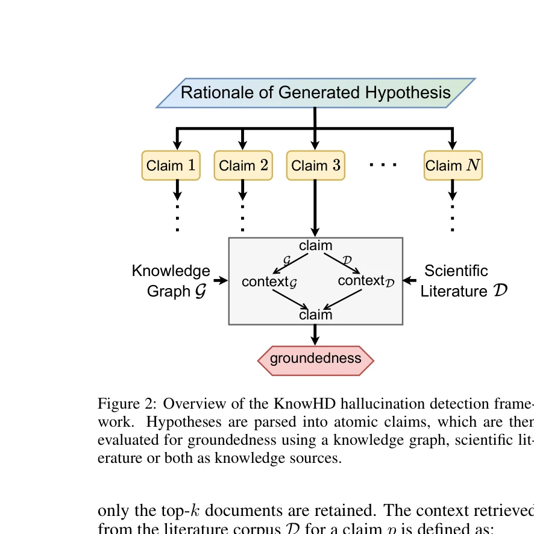

# Toward Reliable Scientific Hypothesis Generation: Evaluating Truthfulness and Hallucination in Large Language Models

> **저자**: Guangzhi Xiong, Eric Xie, Corey Williams, Myles Kim, Amir Hassan Shariatmadari | **날짜**: 2025 | **DOI**: [10.24963/ijcai.2025/873](https://doi.org/10.24963/ijcai.2025/873)

---

## Essence

*TruthHypo 벤치마크의 개요: 데이터셋 구성, 작업 공식화, 진실성 평가*

본 논문은 과학 가설 생성에서 대규모 언어모델(LLM)의 진실성을 평가하기 위한 TruthHypo 벤치마크와 환각(hallucination) 탐지를 위한 KnowHD 프레임워크를 제시한다. LLM이 그럴듯해 보이지만 과학적으로 부정확한 가설을 생성하는 문제를 체계적으로 연구하기 위한 포괄적 접근법을 제공한다.

## Motivation

- **Known**: LLM은 광범위한 과학 문헌을 분석하여 연구 방향을 제시하는 데 탁월한 능력을 보유하고 있으며, 일부 약물 조합 제안이 실험실에서 검증되기도 함.

- **Gap**: 기존 연구는 생성된 가설의 새로움(novelty)과 다양성에 집중했으나, **진실성(truthfulness)과 기존 지식에의 기반(groundedness)은 충분히 평가되지 않음**. LLM의 환각 문제로 인해 그럴듯하지만 과학적으로 무효한 가설이 신뢰성을 훼손함.

- **Why**: 생성된 가설의 정확성을 검증하려면 상당한 시간과 자원이 필요하므로, 자동으로 진실성을 평가할 수 있는 방법이 절실함. 과학 발견의 가속화를 위해 신뢰할 수 있는 가설 생성 시스템이 필수적.

- **Approach**: (1) 생의학 지식 그래프와 도메인 특화 코퍼스 기반의 TruthHypo 벤치마크 구축, (2) 생성 과정의 추론 단계를 분석하여 환각을 탐지하는 KnowHD 프레임워크 개발.

## Achievement

*KnowHD 환각 탐지 프레임워크 개요*

1. **TruthHypo 벤치마크**: PubTator 3.0의 생의학 지식 그래프를 기반으로 3가지 관계 유형(Chemical & Gene, Disease & Gene, Gene & Gene)에 대해 2024년 이전/이후 데이터로 시간적 분할을 수행한 1,209~547개 인스턴스의 평가 데이터셋 구축. 실제 과학 발견의 시간 진행을 모의(simulate)함.

2. **KnowHD 프레임워크**: 가설과 추론 사슬을 원자적 주장(atomic claims)으로 분해하여 기존 지식과의 부합도를 세밀하게 평가. groundedness 점수가 진실한 가설을 필터링하는 효과적인 메트릭임을 입증.

3. **LLM의 한계 실증**: 현존 LLM들이 진실한 가설 생성에 상당한 어려움을 겪음을 광범위한 실험으로 입증. 환각과 진실성 간의 연관성 분석으로 이론적 기초 제공.

4. **인간 평가 검증**: 개방형 가설 생성 과제에서 KnowHD의 과학적 타당성 판별 능력과 과학 발견 가속화 효용을 인간 평가자가 확인.

## How

*groundedness 수준에 따른 평균 정확도. 가설이 groundedness 점수별로 그룹화됨*

**데이터셋 구성**:
- PubTator 3.0에서 추출한 생의학 지식 그래프의 관계 엣지(edge)를 사용
- 2023년 이전 논문(PMID ≤ 366000001)을 "seen" 부분집합, 2024년 이후(PMID ≥ 38200000)를 "unseen" 부분으로 분할
- 시간적 누수 방지를 위해 unseen 부분에서 seen과 동일 엔티티 쌍을 제거
- 질 관리: 테스트 데이터에서 여러 논문이 발견한 관계만 보유
- 거짓 양성(false positive) 평가를 위해 음성 샘플(no relation) 추가

**과제 공식화**:
- 3가지 분류 과제: Chemical & Gene (1,209 instances), Disease & Gene (268), Gene & Gene (547)
- 입력: 두 엔티티 간의 관계 추론 쿼리
- 4가지 지식 증강 설정:
  1. 매개변수 지식만 사용 (parametric knowledge)
  2. 구조화된 그래프 지식 추가 (다중 홉 링크 체인)
  3. RAG를 통한 생의학 문헌 활용 (BM25 검색)
  4. 그래프 + 문헌 결합

**평가 지표**:
- 링크 수준(link-level): 정밀도(precision), 재현율(recall), F1 점수 → 엔티티 간 연결 식별 능력
- 관계 수준(relation-level): 정확도(accuracy) → 구체적 관계 레이블 예측 정확성

**KnowHD 프레임워크**:
- 가설과 추론을 원자적 주장으로 분해 (LLM 프롬프트 활용)
- 각 주장을 지식 베이스(문헌 또는 지식 그래프)와 대조
- Groundedness 점수 계산: 지원되는 주장 비율
- 환각된 주장의 패턴 분석을 통해 신뢰도 평가

## Originality

- **최초 벤치마크**: 과학 가설 생성에서 진실성(truthfulness)에 특화된 첫 체계적 벤치마크 개발. 기존 연구는 다양성(diversity)에만 집중.

- **시간 분할 설계**: PMID 기반 발행 연도 분할로 실제 과학 발견의 시간 진행을 모의하는 혁신적 평가 환경 구축.

- **지식 기반 환각 탐지**: 추론 과정을 분해하여 미시적 수준에서 환각을 탐지하는 새로운 접근법. 기존 환각 탐지는 생성 결과 전체를 평가했음.

- **다중 지식원**: 구조화된 지식(KG)과 비구조화 정보(문헌)를 결합하는 체계적 프레임워크로 현실적 가설 생성 시나리오 반영.

- **포괄적 검증**: 자동 평가 메트릭과 인간 평가를 결합하여 결과의 과학적 타당성 확보.

## Limitation & Further Study

- **데이터셋 규모의 한계**: Disease & Gene 과제(268 인스턴스)는 다른 과제 대비 매우 제한적. 더 많은 관계 유형과 대규모 데이터로 확장 필요.

- **생의학 분야 국한**: 본 벤치마크는 생의학 영역에 특화되어 있어, 화학, 물리학, 재료과학 등 다른 과학 분야에의 일반화 가능성 미지수.

- **LLM 배포 문제**: 연구에서 평가한 LLM 버전이 시간에 따라 변경되면서 향후 재현성 문제 가능성.

- **groundedness 계산의 자동화 한계**: 현재 원자적 주장 분해와 지식 대조 과정에서 LLM을 활용하고 있어, 모델의 오류가 누적될 수 있음. 더 견고한 자동 검증 방법 개발 필요.

- **인과 관계 추론의 부재**: 벤치마크가 상관 관계나 존재 여부 기반이며, 과학적으로 중요한 인과 메커니즘(causal mechanisms) 검증은 미흡.

- **후속 연구 방향**:
  - 더 정교한 환각 탐지 기법 개발 (예: 확률론적 검증)
  - 다른 과학 분야로의 벤치마크 확장
  - 인과 추론 기반의 가설 검증 방법론 추가
  - 하이브리드 인간-LLM 협업 시스템 개발

## Evaluation

- **Novelty**: 4.5/5
  - 과학 가설 생성 평가에서 진실성에 특화된 첫 체계적 벤치마크와 지식 기반 환각 탐지 프레임워크는 높은 독창성을 보유. 다만, 생의학 영역 국한이 일반화 가능성을 제한.

- **Technical Soundness**: 4/5
  - 시간 분할 설계, 다중 지식원 통합, 이중 평가 메트릭(link/relation level) 등 기술적으로 건실함. 그러나 KnowHD의 groundedness 계산에서 LLM 오류 누적 가능성이 있음. 자동 평가의 견고성 강화 필요.

- **Significance**: 4.5/5
  - 과학 발견 가속화를 위한 신뢰할 수 있는 LLM 활용 방안 제시로 높은 실제 의의 보유. 의학, 약학 등 다양한 생의학 분야에 직접 적용 가능. 다만, 평가 범위가 생의학 영역으로 제한되어 더 넓은 영향력 진출을 저해.

- **Clarity**: 4/5
  - 전체적으로 명확한 구조(동기-데이터셋-방법-평가)로 이해하기 쉬움. Figure 1, 2, 3이 핵심 내용을 잘 시각화. 다만, KnowHD의 groundedness 점수 계산 알고리즘 상세가 초록 단계에서 불명확하여 본문 정독 필요.

- **Overall**: 4/5
  - 과학 가설 생성의 진실성 평가라는 중요하면서도 미해결 문제에 체계적으로 접근한 견실한 연구. 포괄적 벤치마크와 실용적 환각 탐지 프레임워크의 결합으로 높은 학술적·실무적 가치 제공. 데이터셋 규모 확대와 다중 학문 분야 확장이 이루어진다면 더욱 영향력 있는 자원이 될 것으로 기대됨.

**총평**: 이 논문은 LLM 기반 과학 발견의 신뢰성 문제를 처음 체계적으로 다루며, TruthHypo와 KnowHD라는 실용적 도구를 제공함으로써 과학 혁신에 실질적으로 기여할 수 있는 중요한 작업이다. 다만 생의학 영역 국한과 자동 평가의 견고성 강화가 향후 과제이다.

## Related Papers

- ⚖️ 반론/비판: [[papers/728_SciMON_Scientific_Inspiration_Machines_Optimized_for_Novelty/review]] — TruthHypo의 진실성 검증과 SciMON의 참신성 추구가 과학 가설 생성에서 정확성과 창의성 간의 균형 문제를 부각시킨다.
- 🏛 기반 연구: [[papers/835_Towards_Scientific_Intelligence_A_Survey_of_LLM-based_Scient/review]] — TruthHypo의 환각 탐지와 진실성 평가가 Scientific Agent의 신뢰성 있는 과학적 발견을 위한 핵심적인 검증 메커니즘을 제공한다.
- 🔗 후속 연구: [[papers/186_Can_large_language_models_unlock_novel_scientific_research_i/review]] — LLM의 일반적인 아이디어 생성 능력 평가에서 TruthHypo의 구체적인 진실성 검증 방법론으로 발전하여 더 신뢰할 수 있는 평가를 가능하게 한다.
- 🧪 응용 사례: [[papers/191_Causal_learning_for_socially_responsible_ai/review]] — TruthHypo의 환각 탐지 프레임워크가 사회적 책임 AI의 인과학습에서 잘못된 인과관계 추론을 검출하는 도구로 활용될 수 있다.
- 🔄 다른 접근: [[papers/819_Toward_reliable_biomedical_hypothesis_generation_Evaluating/review]] — 과학 가설 생성의 신뢰성 평가를 위한 서로 다른 접근법을 제시합니다.
- 🔄 다른 접근: [[papers/417_HypoBench_Towards_Systematic_and_Principled_Benchmarking_for/review]] — 체계적 벤치마킹 vs 신뢰성 평가로 가설 생성 검증의 서로 다른 접근법
- ⚖️ 반론/비판: [[papers/631_Predicting_field_experiments_with_large_language_models/review]] — 실험 예측의 높은 정확도와 과학 가설 생성의 진실성 문제를 대조하여 LLM의 도메인별 신뢰성 차이를 분석할 수 있다.
- ⚖️ 반론/비판: [[papers/728_SciMON_Scientific_Inspiration_Machines_Optimized_for_Novelty/review]] — SciMON의 참신성 추구와 TruthHypo의 진실성 평가가 과학 아이디어 생성에서 창의성과 정확성 간의 트레이드오프를 보여준다.
- ⚖️ 반론/비판: [[papers/748_Semi-Supervised_2D_Human_Pose_Estimation_Driven_by_Position/review]] — 포즈 추정의 정확한 성능 측정과 과학 가설 생성의 진실성 평가 문제를 대조하여 과학적 검증의 도메인별 차이를 보여준다.
- 🏛 기반 연구: [[papers/835_Towards_Scientific_Intelligence_A_Survey_of_LLM-based_Scient/review]] — Scientific Agent의 강건한 검증 메커니즘 요구사항이 TruthHypo의 진실성 평가와 환각 탐지 연구의 필요성을 뒷받침한다.
- 🏛 기반 연구: [[papers/286_Domain-specific_ReAct_for_physics-integrated_iterative_model/review]] — 물리학 도메인의 정확한 모델링 요구사항이 과학 가설 생성에서 진실성과 검증 가능성의 중요성을 보여주는 기반 사례이다.
- 🏛 기반 연구: [[papers/186_Can_large_language_models_unlock_novel_scientific_research_i/review]] — LLM의 아이디어 생성 능력에 대한 기본 평가가 TruthHypo의 진실성 검증 연구의 필요성을 입증하는 기초 연구이다.
- 🧪 응용 사례: [[papers/191_Causal_learning_for_socially_responsible_ai/review]] — 인과학습의 편향 완화 도구들이 과학 가설 생성에서 환각과 편향을 탐지하는 TruthHypo의 검증 메커니즘에 적용될 수 있다.
- 🔄 다른 접근: [[papers/719_Scientific_Hypothesis_Generation_and_Validation_Methods_Data/review]] — 생의학 가설 생성에서 GPT-4 기반 실험 검증과 신뢰성 평가 중심 접근법을 비교할 수 있습니다.
- 🔗 후속 연구: [[papers/492_Literature_meets_data_A_synergistic_approach_to_hypothesis_g/review]] — 신뢰할 수 있는 생의학 가설 생성 평가가 문헌-데이터 통합 접근법을 의료 영역에 특화하여 가설 품질과 신뢰성을 체계적으로 검증하는 확장 연구임
