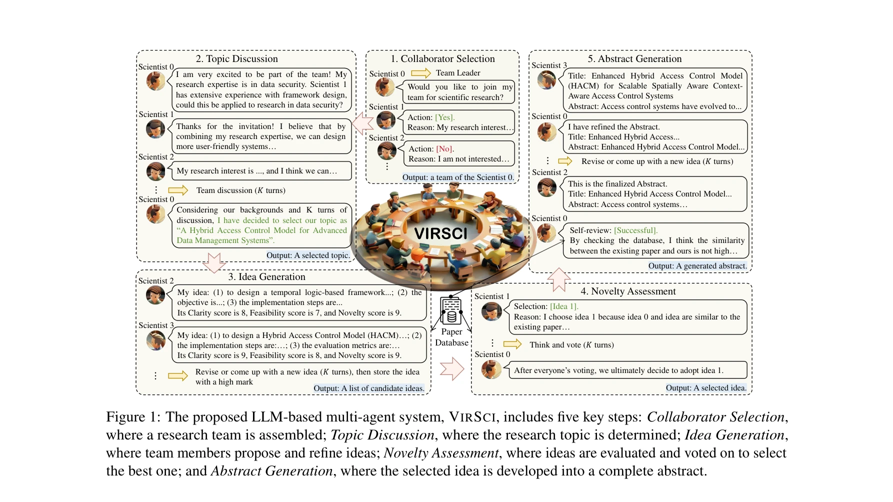

# Two heads are better than one: A multi-agent system has the potential to improve scientific idea generation

> **저자**: Haoyang Su, Renqi Chen, Shixiang Tang 외 | **날짜**: 2024 | **DOI**: [arXiv:2410.09403](https://arxiv.org/abs/2410.09403)

---

## Essence

*VIRSCI 시스템의 5단계: 협력자 선택, 주제 논의, 아이디어 생성, 새로운성 평가, 초록 생성*

본 연구는 대규모 언어모델(LLM) 기반의 다중 에이전트 시스템 VIRSCI(Virtual Scientists)를 제안하여, 실제 과학 연구의 협력 메커니즘을 모방함으로써 단일 에이전트 시스템보다 혁신적인 과학 아이디어 생성을 달성한다. 실제 과학자 데이터와 논문 데이터베이스를 활용한 가상 과학 생태계를 구축하여 객관적인 평가를 가능하게 했다.

## Motivation

- **Known**: 최근 AI 기술, 특히 LLM이 가설 생성과 실험 설계 등의 과학 연구 작업에서 유망한 성과를 보이고 있음. 기존 연구(AI Scientist, ResearchTown, HypoGen 등)가 자동 과학 발견에 기여하고 있음.

- **Gap**: 기존 접근법들이 단일 에이전트 시스템에 의존하거나, 과도하게 단순화된 협력 프레임워크와 비현실적 데이터(합성 프로필, 가상 협력 네트워크)를 사용하여 실제 과학 팀의 동적 관계를 제대로 포착하지 못함. 다중 에이전트 협력의 메커니즘에 대한 통찰이 부족함.

- **Why**: 실제 과학 연구에서 다양한 전문가 팀의 협력이 복잡한 문제 해결의 핵심이므로, 이를 정확히 모방하는 시스템이 필요함.

- **Approach**: 실제 과학자 데이터로 구성된 가상 과학 생태계를 기반으로, inter-team(팀 간)과 intra-team(팀 내) 토론 메커니즘을 포함한 5단계 협력 파이프라인을 설계하고, 과거/현재 논문 데이터베이스를 활용한 다각도 새로운성 평가를 수행.

## Achievement

*협력자 선택 과정의 주요 메커니즘*

1. **성능 향상**: 다중 에이전트 시스템이 단일 에이전트 대비 현대 연구와의 일치도에서 평균 +13.8%, 미래 연구에 미칠 잠재적 영향도에서 +44.1% 개선 달성

2. **과학적 타당성**: 실험 결과의 패턴이 Nature, Science 등 상위 저널에 발표된 과학과학(Science of Science) 연구 결과와 일치 (예: 새로운 팀이 더 혁신적인 연구를 생성한다는 발견)

3. **평가 프레임워크**: 과거 논문과의 유사성, 연구 트렌드 정렬, 미래 논문에 미치는 영향 등 3가지 관점에서 새로운성을 평가하는 포괄적 메트릭 개발

## How

*추상적 평가를 위한 새로운성 평가 방법론*

**VIRSCI의 5단계 파이프라인:**

- **협력자 선택(Collaborator Selection)**: 팀 리더가 선택되고, 과거 공동저자 기반의 탐색(exploitation)과 보완적 전문성을 가진 외부 과학자 탐색(exploration)의 균형 유지

- **주제 논의(Topic Discussion)**: 선택된 팀원들이 공통 관심 분야에 대해 논의하며, 합의 도출 불가 시 재시작 또는 비관심 팀원은 떠날 수 있음

- **아이디어 생성(Idea Generation)**: 과거 논문 데이터베이스에서 관련 논문 검색 후, inter-team(초청 메커니즘을 통한 외부 자문) 및 intra-team(팀 내 반복 대화) 토론 수행

- **새로운성 평가(Novelty Assessment)**: 제안된 모든 아이디어에 명확성, 실현 가능성, 새로운성 점수 부여 후 투표를 통해 최적 아이디어 선택

- **초록 생성(Abstract Generation)**: 선택된 아이디어를 상세한 학술 초록으로 개발하고, 자가 검토(self-review)를 통해 기존 논문과의 유사성 검증

**핵심 메커니즘:**

- Inter- 및 intra-team 토론의 구분으로 팀 내 다양성과 외부 통찰의 균형 달성
- 초청 메커니즘(Invitation Mechanism)을 통한 동적 팀 구성
- 실제 학술 네트워크와 출판 기록 기반 에이전트 프로필 구성

## Originality

- **최초 시도**: 실제 과학자 데이터를 활용한 가상 과학 생태계와 함께 다중 에이전트 시스템을 구축하여 과학 협력을 벤치마킹한 첫 번째 연구

- **혁신적 협력 메커니즘**: 기존 단순 그룹 토론 방식과 달리 inter-team과 intra-team 토론을 명확히 구분하여 더 현실적인 협력 동학 구현

- **통합 평가 프레임워크**: 과거 논문과의 거리, 현재 트렌드와의 정렬, 미래 영향력이라는 다각도 새로운성 평가로 아이디어의 진정한 혁신성 측정

- **과학적 근거**: 실험 결과가 기존 과학과학 이론과의 정렬을 통해 시스템의 신뢰성과 현실성 입증

## Limitation & Further Study

**한계:**
- 추상 생성에 초점을 맞추었으므로, 실제 구현 가능한 완전한 연구 제안서 생성으로의 확장은 아직 미흡
- LLM의 할루시네이션(hallucination) 및 편향성에 대한 제한된 분석
- 평가 메트릭이 주로 텍스트 유사성 기반이므로, 진정한 과학적 혁신성과의 관계에 대한 검증 필요
- 특정 필드(데이터 보안, 기계학습 등)에 제한된 실험으로, 다양한 과학 영역에의 일반화 가능성 미지수

**후속 연구 방향:**
- 전체 연구 제안서 및 초기 실험 설계까지의 확대
- 도메인 전문가의 정성적 평가를 통한 검증
- 더 정교한 새로운성 평가 메트릭 개발 (의미론적 새로운성, 예상 인용도 등)
- 다양한 학문 분야에서의 광범위한 검증
- 생성 아이디어의 실제 채택 및 인용 추적을 통한 장기 영향 분석

## Evaluation

- **Novelty (독창성)**: 4.5/5
  - 실제 데이터 기반 가상 생태계와 inter/intra-team 토론 메커니즘은 혁신적이나, 다중 에이전트 협력 자체는 기존 연구 영역

- **Technical Soundness (기술적 타당성)**: 4/5
  - 5단계 파이프라인과 평가 프레임워크가 논리적으로 잘 설계되었으나, LLM 기반 시스템의 고유한 한계(할루시네이션, 반복성)에 대한 심층 분석 부족

- **Significance (중요성)**: 4/5
  - 자동 과학 발견이라는 중요한 문제에 실질적 기여를 하며, 다중 에이전트 협력의 효과를 정량적으로 입증. 다만 실제 과학 공동체에의 영향은 추측 단계

- **Clarity (명확성)**: 4/5
  - 5단계 파이프라인과 시스템 구조가 명확하게 설명되었으나, 일부 기술적 세부사항(프롬프트 설계, 에이전트 역할 정의)의 상세 기술 부족

- **Overall (종합)**: 4.1/5

**총평**: VIRSCI는 실제 과학자 데이터와 정교한 협력 메커니즘을 결합하여 LLM 기반 과학 아이디어 생성의 새로운 패러다임을 제시하는 의미 있는 연구이다. 다중 에이전트 협력이 혁신성을 높인다는 정량적 증거를 제공하고 과학과학 이론과의 정렬을 통해 신뢰성을 강화했으나, 생성 아이디어의 실제 과학적 가치 검증 및 다양한 도메인에의 일반화 가능성 검토가 필요하다.

## Related Papers

- 🔄 다른 접근: [[papers/442_Iris_Interactive_research_ideation_system_for_accelerating_s/review]] — 다중 에이전트 협력 시스템 vs 단일 연구자 대상 인터랙티브 시스템의 대조적 접근
- 🔗 후속 연구: [[papers/110_AstroAgents_A_Multi-Agent_AI_for_Hypothesis_Generation_from/review]] — 일반적 다중 에이전트 과학 연구를 우주생물학 특화 가설 생성으로 구체화한 응용
- 🏛 기반 연구: [[papers/311_Empowering_Biomedical_Discovery_with_AI_Agents/review]] — 생의학 AI 에이전트 시스템이 다중 에이전트 과학 연구의 도메인별 기반
- 🔗 후속 연구: [[papers/817_Toward_a_Team_of_AI-made_Scientists_for_Scientific_Discovery/review]] — 가상 과학자 시스템을 실제 AI 과학자 팀 구성으로 발전시킨 연구
- 🔄 다른 접근: [[papers/442_Iris_Interactive_research_ideation_system_for_accelerating_s/review]] — 단일 연구자 대상 인터랙티브 시스템 vs 다중 에이전트 협력 시스템의 대조적 접근
- 🏛 기반 연구: [[papers/110_AstroAgents_A_Multi-Agent_AI_for_Hypothesis_Generation_from/review]] — 다중 에이전트 과학 연구 시스템을 우주생물학 특화 가설 생성으로 구체화한 응용
- 🔗 후속 연구: [[papers/311_Empowering_Biomedical_Discovery_with_AI_Agents/review]] — 생의학 AI 에이전트를 다중 에이전트 과학 연구 시스템으로 일반화한 확장 연구
