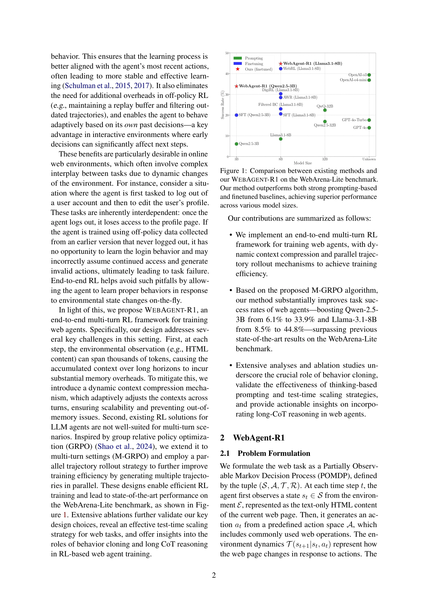
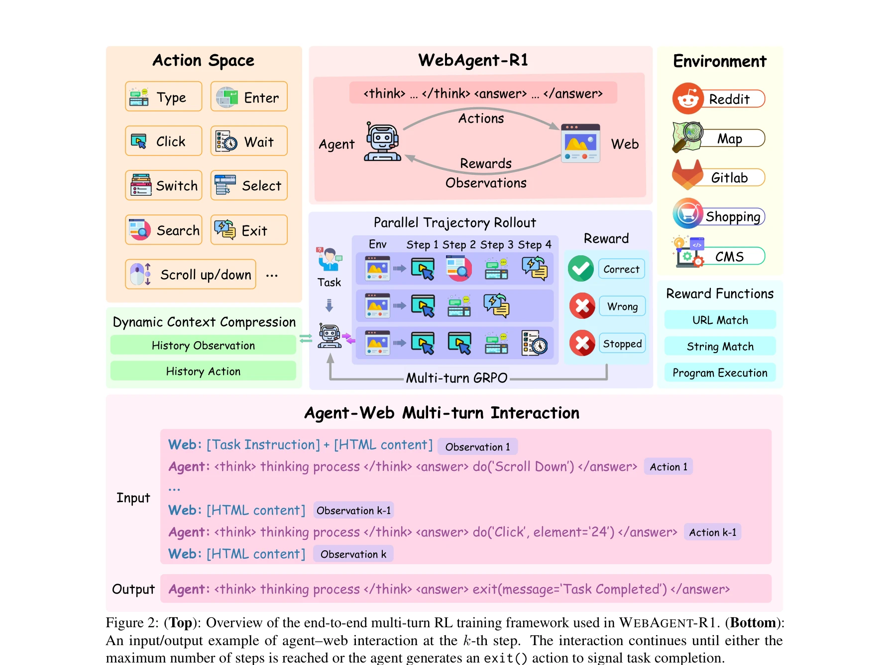

# WebAgent-R1: Training Web Agents via End-to-End Multi-Turn Reinforcement Learning

> **저자**: Zhepei Wei, Wenlin Yao, Yao Liu, Weizhi Zhang, Qin Lu | **날짜**: 2025 | **DOI**: [10.48550/arXiv.2505.16421](https://doi.org/10.48550/arXiv.2505.16421)

---

## Essence

웹 에이전트(Web Agent) 학습을 위한 종단 간(End-to-End) 다중턴 강화학습 프레임워크를 제안하며, 동적 컨텍스트 압축과 병렬 궤적 생성을 통해 실제 웹 환경에서의 장기 의사결정을 효과적으로 수행하도록 훈련한다.

## Motivation

- **Known**: 강화학습(RL)이 수학 문제 풀이 같은 단일턴 작업에서 큰 성공을 거두었으며, DeepSeek-R1 등의 사례가 있다. 초기 웹 에이전트는 프롬프팅 기반 방법(Prompting) 또는 행동 복제(Behavior Cloning, BC)에 의존했다.

- **Gap**: 다중턴 상호작용이 필요한 웹 작업의 경우, 기존 방법들이 동적 환경의 복잡성과 장기 의사결정의 어려움을 충분히 해결하지 못했다. 또한 기존 RL 접근법들은 오프폴리(Off-policy) 방식으로 궤적 필터링, 보상 모델 훈련 등 추가 복잡도를 야기했다.

- **Why**: 웹 환경의 상태 변화(예: 로그아웃 후 프로필 접근 불가)에 대한 적응 학습이 필수적이므로, 현재 정책에서 수집한 데이터로 즉시 학습하는 온폴리(On-policy) 방식의 종단 간 RL이 필요하다.

- **Approach**: 행동 복제로 초기화한 후, 다중턴 GRPO(M-GRPO) 알고리즘과 동적 컨텍스트 압축, 병렬 궤적 롤아웃을 활용한 온폴리 강화학습을 적용한다.

## Achievement


*WebArena-Lite 벤치마크에서 기존 방법 대비 WebAgent-R1의 성능 비교*

1. **성능 향상**: Qwen-2.5-3B를 6.1%에서 33.9%로, Llama-3.1-8B를 8.5%에서 44.8%로 성공률 향상. GPT-4o, OpenAI o3 등 강력한 프롬프팅 기반 모델을 능가한다.

2. **확장성**: 다양한 모델 크기(3B~32B)에서 일관되게 우수한 성과를 입증하며, 온폴리 방식으로 외부 감독(예: GPT-4 기반 보상 모델) 없이 자체적으로 완성된 학습이 가능하다.

## How


*WebAgent-R1의 종단 간 다중턴 RL 훈련 프레임워크 개요*

### 핵심 메커니즘

- **행동 복제 초기화**: 전문가 데이터셋을 이용한 SFT로 기본적인 웹 상호작용 능력 습득 (s1, a1, s2, a2, ... st 형태의 상호작용 히스토리 학습)

- **동적 컨텍스트 압축**: 이전 관측값들을 단순화된 템플릿(예: "Simplified HTML")으로 축약하면서 전체 행동 히스토리는 보존. 메모리 오버헤드를 줄이면서도 충분한 컨텍스트 유지

- **병렬 궤적 롤아웃**: 여러 궤적을 병렬로 생성하여 샘플링 효율 증대 및 다양한 탐색 전략 학습

- **M-GRPO 알고리즘**: GRPO(Group Relative Policy Optimization)를 다중턴 설정으로 확장. 이진 결과 보상(Binary Outcome Reward)을 기반으로 정책 최적화

- **앙상블 보상 함수**: 문자열 매칭(String Match), URL 매칭, 프로그램 실행(Program Execution) 등 규칙 기반 보상으로 외부 모델 의존성 제거

### 상호작용 형식

```
Web: [Task] + [HTML content]
Agent: <think> reasoning </think> <answer> do('Action') </answer>
Web: [Updated HTML]
...반복...
Agent: exit(message='Task Completed')
```

## Originality

- **종단 간 온폴리 RL**: 웹 에이전트를 위해 오프폴리 방식의 복잡도(궤적 필터링, 외부 보상 모델)를 완전히 제거한 첫 시도

- **동적 컨텍스트 압축**: 긴 웹 상호작용(수천 토큰)에서 메모리 문제를 해결하는 실용적 메커니즘

- **M-GRPO 확장**: 단일턴 수학 문제 해결용 GRPO를 다중턴 대화형 환경으로 성공적으로 확장

- **자체 충분성(Self-Sufficiency)**: 외부 감독 신호(예: GPT-4 기반 라벨링) 없이 웹 환경의 규칙 기반 보상만으로 학습

## Limitation & Further Study

- **비전 정보 미포함**: 스크린샷 기반 시각 입력은 미지원. 텍스트 기반 HTML만 사용하므로 레이아웃, 색상, 이미지 등 시각적 단서 활용 불가

- **액션 공간 최적화**: 사전 정의된 액션 공간(Click, Type, Scroll 등)만 사용. 더 세밀한 액션 공간 설계나 프롬프트 최적화는 직교적 문제로 미래 연구 제시

- **단일 벤치마크**: WebArena-Lite에서만 검증. 다른 웹 작업 벤치마크(WebShop, Mind2Web 등)에서의 일반화 검토 필요

- **보상 설계 한계**: 중간 단계 보상 없이 이진 결과 보상만 사용. 복잡한 다단계 작업의 학습 속도 개선을 위해 세밀한 보상 설계 가능성

- **향후 연구 방향**: 시각 정보 통합, 액션 공간 동적 구성, 더욱 정교한 중간 단계 보상 메커니즘

## Evaluation

- **Novelty (독창성)**: 4.5/5 - 온폴리 방식의 종단 간 RL과 동적 컨텍스트 압축은 신선하나, 개별 기술 요소는 기존 방법의 조합

- **Technical Soundness (기술적 타당성)**: 4/5 - GRPO 확장과 구현 전략이 타당하나, 컨텍스트 압축의 정보 손실에 대한 이론적 분석 부족

- **Significance (중요성)**: 4.5/5 - WebArena-Lite에서 획기적 성과 달성. 실제 웹 에이전트 배포 가능성 제시

- **Clarity (명확성)**: 4/5 - 전반적으로 명확하나, 동적 컨텍스트 압축의 정확한 구현 세부사항이 일부 생략됨

- **Overall (종합)**: 4.25/5

**총평**: 본 논문은 웹 에이전트 학습의 실무적 과제(메모리, 외부 감독)를 창의적으로 해결하여 상당한 성능 향상을 달성했으며, 온폴리 강화학습의 다중턴 상호작용 환경으로의 확장을 성공적으로 입증한 의미 있는 기여이다.

## Related Papers

- 🔄 다른 접근: [[papers/447_Iterative_self-incentivization_empowers_large_language_model/review]] — 두 논문 모두 에이전트 강화학습을 다루되 WebAgent-R1은 웹 환경, EXSEARCH는 정보 검색에 특화되어 있다.
- 🔗 후속 연구: [[papers/888_X-webagentbench_A_multilingual_interactive_web_benchmark_for/review]] — X-WebAgentBench의 다국어 웹 벤치마크는 WebAgent-R1의 종단 간 학습 프레임워크를 다양한 언어 환경에서 평가하고 개선할 수 있다.
- 🏛 기반 연구: [[papers/782_SWE-bench_Can_Language_Models_Resolve_Real-World_GitHub_Issu/review]] — SWE-bench의 실제 GitHub 이슈 해결 벤치마크는 WebAgent-R1의 웹 에이전트 훈련에 실제 소프트웨어 개발 작업의 복잡성을 반영한 학습 환경을 제공한다.
- 🏛 기반 연구: [[papers/447_Iterative_self-incentivization_empowers_large_language_model/review]] — WebAgent-R1의 종단 간 다중턴 강화학습 프레임워크는 EXSEARCH의 반복적 자기 개선 메커니즘에 이론적 토대를 제공한다.
- 🔗 후속 연구: [[papers/872_Webdancer_Towards_autonomous_information_seeking_agency/review]] — WebAgent-R1의 종단 간 다중턴 강화학습은 WebDancer의 감독학습-강화학습 순차 파이프라인을 더 통합적인 학습 프레임워크로 발전시킨다.
- 🔗 후속 연구: [[papers/061_Agent_S_An_Open_Agentic_Framework_that_Uses_Computers_Like_a/review]] — Agent S의 GUI 자동화 프레임워크는 WebAgent-R1의 웹 에이전트 훈련 기법을 확장하여 더 넓은 범위의 데스크톱 응용프로그램까지 포괄하는 범용 자동화를 실현합니다.
