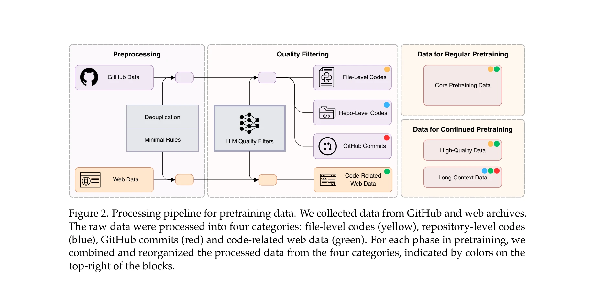
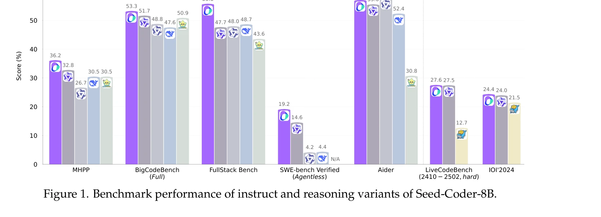

# AI Copilot Code Quality: 2025 Data Suggests 4x Growth in Code Clones - GitClear

> **저자**: Hongjing Shao, Qian Luo, Jiayi Xia | **날짜**:  | **DOI**: N/A

---

## Essence

*Figure 2. Processing pipeline for pretraining data. We collected data from GitHub and web archives.*

코드 LLM 사전학습 데이터를 자동으로 큐레이션하는 모델 중심 파이프라인을 제시하고, 이를 바탕으로 8B 규모의 Seed-Coder 모델 시리즈(base, instruct, reasoning)를 개발하여 동급 오픈소스 모델을 능가하는 성능을 달성했다.

## Motivation

- **Known**: 대규모 언어 모델의 코드 성능을 위해서는 고품질 코드 데이터가 필수적이며, 기존 오픈소스 모델들은 수작업 필터링 규칙이나 인간 주석을 통해 데이터를 구성해왔다.
- **Gap**: 수작업 규칙 기반 접근법은 확장성이 떨어지고, 주관적 편향이 있으며, 다양한 프로그래밍 언어 간 유지보수 비용이 높다는 근본적 한계가 있다.
- **Why**: 모델 중심의 자동 데이터 큐레이션은 인간의 주관성을 줄이고 수십억 개 샘플에 대한 일관된 평가를 제공할 수 있으며, 향후 코드 LLM의 확장 가능성을 크게 향상시킬 수 있다.
- **Approach**: LLM 기반 품질 스코어러를 사용하여 GitHub, 커밋, 웹 데이터를 자동 필터링하고 6조 토큰의 사전학습 코퍼스를 구성했으며, 지도 학습 미세조정과 DPO, LongCoT 강화학습을 통해 세 가지 모델 변형을 개발했다.

## Achievement

*Figure 1. Benchmark performance of instruct and reasoning variants of Seed-Coder-8B.*

- **자동 데이터 파이프라인**: 최소한의 인간 개입으로 6조 토큰의 코드 사전학습 데이터를 구성하는 병렬 처리 가능한 모델 중심 파이프라인 개발
- **벤치마크 성능**: BigCodeBench(55.8%), FullStack Bench(47.6%), SWE-bench Verified(50.9%) 등 다양한 코딩 태스크에서 동급 모델 능가 또는 최고 성능 달성
- **다양한 모델 변형**: Base, Instruct, Reasoning 세 가지 변형 제공으로 다양한 코딩 작업(생성, 완성, 편집, 추론, 소프트웨어 엔지니어링) 지원
- **오픈소스 기여**: 경량이면서도 강력한 8B 모델 시리즈를 공개하여 오픈소스 커뮤니티의 진전 촉진

## How

*Figure 2. Processing pipeline for pretraining data. We collected data from GitHub and web archives.*

- GitHub 데이터, 커밋 데이터, 코드 관련 웹 데이터에서 정확/근사 중복 제거 수행
- LLM 품질 스코어러를 활용한 자동 필터링으로 고품질 데이터 선별
- 파일 수준/저장소 수준 코드, 커밋, 웹 데이터를 네 가지 범주로 조직화
- 정규 사전학습과 지속 사전학습(high-quality, long-context 데이터) 단계 구분
- Instruct 모델: LLM 생성 합성 데이터 + DPO로 지시 따르기 능력 강화
- Reasoning 모델: LongCoT 강화학습으로 복잡한 멀티스텝 코딩 추론 능력 개선
- Sandbox 검증을 통한 자체 수정으로 데이터 품질 향상

## Originality

- **모델 중심 패러다임**: '쓰라린 교훈'(The Bitter Lesson) 원칙을 코드 데이터 큐레이션에 적용하여 인간 규칙 기반에서 LLM 기반 자동 평가로의 철학적 전환
- **병렬 처리 파이프라인**: 순차적 의존성을 제거하여 증분 확장과 유연한 파이프라인 조작을 가능하게 하는 구조적 혁신
- **LongCoT 강화학습**: 코딩 추론을 위한 장기 사고 연쇄 강화학습 적용으로 멀티스텝 문제 해결 능력 향상
- **통합 평가 프레임워크**: 코드 생성, 완성, 편집, 추론, 소프트웨어 엔지니어링 등 다양한 코딩 작업을 포괄적으로 평가

## Limitation & Further Study

- **8B 규모 제한**: 최대 8B 크기만 제시되어 더 큰 규모 모델의 성능 확장성 미확인
- **LLM 스코어러 비용**: 대규모 데이터 필터링을 위한 LLM 스코어러의 계산 비용이 초기 투자로 높을 수 있음
- **스코어러 정확도 분석 부족**: LLM 품질 스코어러의 정확도 및 신뢰도에 대한 상세 평가 제한적
- **오염 제거 메커니즘**: Decontamination 섹션이 간략하여 테스트 세트 오염 방지 방법의 상세 설명 부족
- **후속 연구**: (1) 더 큰 규모 모델(16B, 32B)에서의 성능 검증, (2) 다양한 프로그래밍 언어 비율 최적화 연구, (3) 실제 개발 생산성 영향 측정, (4) LLM 스코어러의 편향 분석 및 개선

## Evaluation

- Novelty: 4/5
- Technical Soundness: 4/5
- Significance: 4/5
- Clarity: 4/5
- Overall: 4/5

**총평**: Seed-Coder는 인간 규칙 기반 접근법의 한계를 체계적으로 극복하고 모델 중심의 자동 데이터 큐레이션 패러다임을 성공적으로 구현했으며, 경량급(8B) 오픈소스 모델에서 동급 이상의 성능을 달성하여 향후 코드 LLM 개발의 중요한 방향을 제시한다.

## Related Papers

- 🔄 다른 접근: [[papers/741_Seed-coder_Let_the_code_model_curate_data_for_itself/review]] — 둘 다 코딩 LLM을 다루지만 하나는 AI Copilot 코드 품질에, 다른 하나는 Seed-Coder의 자동 큐레이션에 초점을 맞춘다.
- 🏛 기반 연구: [[papers/263_Deepseek-coder_When_the_large_language_model_meets_programmi/review]] — DeepSeek-Coder가 대규모 코드 언어 모델의 기반 기술로서 AI Copilot의 코드 생성 품질 개선에 영향을 미친다.
- 🔗 후속 연구: [[papers/635_Productivity_assessment_of_neural_code_completion/review]] — 신경 코드 완성의 생산성 평가 연구가 AI Copilot 코드 품질의 4배 성장이 실제 개발자 생산성에 미치는 영향을 분석하는데 활용될 수 있다.
- 🔗 후속 연구: [[papers/635_Productivity_assessment_of_neural_code_completion/review]] — 코드 완성 도구의 생산성 측정을 코드 품질 평가로 확장하여 더 포괄적인 AI 코딩 도구 평가 프레임워크를 구축한다.
