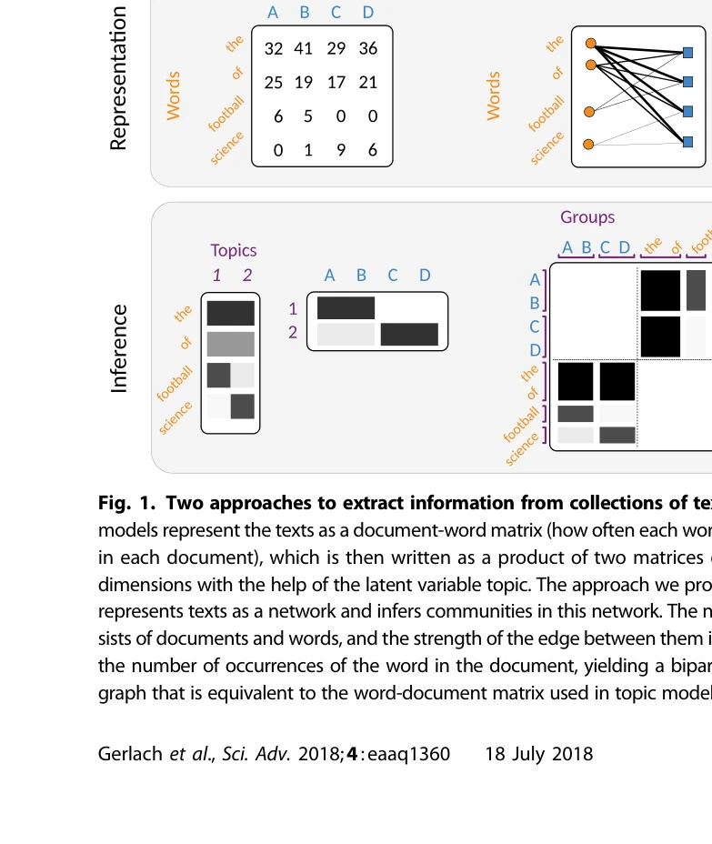
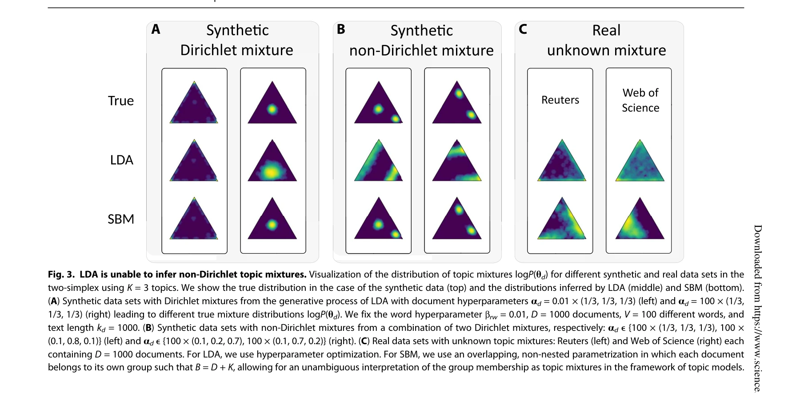
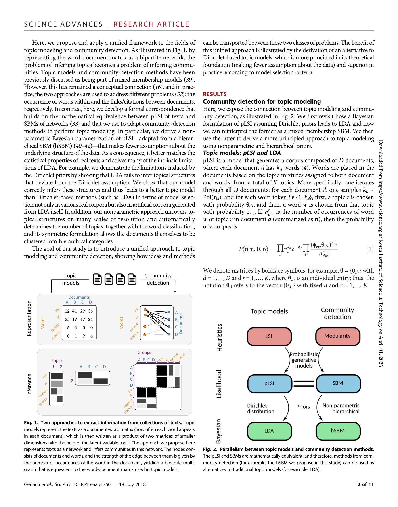

# A network approach to topic models

> **저자**: Martin Gerlach, Tiago P. Peixoto, Eduardo G. Altmann | **날짜**: 2018 | **DOI**: [10.1126/sciadv.aaq1360](https://doi.org/10.1126/sciadv.aaq1360)

---

## Essence

*Fig. 1. Two approaches to extract information from collections of texts. Topic*

텍스트 코퍼스를 문서-단어 이분 네트워크로 표현하여 토픽 모델링을 커뮤니티 탐지 문제로 재정의하고, 비모수 계층적 확률 블록 모델(hSBM)을 통해 LDA의 한계를 극복하는 통합 프레임워크를 제시한다.

## Motivation

- **Known**: LDA(Latent Dirichlet Allocation)는 토픽 모델링의 주요 방법이지만 토픽 수 자동 결정 불가, 디리클레 사전(Dirichlet prior) 정당화 부족, 실제 텍스트의 지프 법칙 등 통계적 성질과 불일치 등의 근본적 결함을 가진다.
- **Gap**: 토픽 모델링과 커뮤니티 탐지는 개념적 유사성이 있음에도 불구하고 독립적으로 발전했으며, 이 두 분야 간의 형식적 대응(formal correspondence)이 실제로 구현되지 못했다.
- **Why**: 비정형 텍스트에서 유용한 정보 추출의 자동화 필요성이 높아지는 현대에 더 원칙적이고 통계적으로 타당한 토픽 모델링 방법이 중요하며, 두 분야의 교차 수렴(cross-fertilization)은 더 강력한 방법론을 가능하게 한다.
- **Approach**: pLSI(Probabilistic Latent Semantic Indexing)의 수학적 동치성을 활용하여 확률 블록 모델(SBM)의 비모수 베이지안 표현화를 토픽 모델링에 적용하고, 계층적 구조를 통해 다중 해상도의 토픽 구조를 자동으로 탐지한다.

## Achievement

*Fig. 3. LDA is unable to infer non-Dirichlet topic mixtures. Visualization of the distribution of topic mixtures logP(qd*

- **이분 네트워크 표현**: 문서-단어 행렬을 가중 이분 다중그래프로 표현하여 토픽 모델링을 네트워크 커뮤니티 탐지로 형식화
- **비모수 접근법**: 디리클레 사전의 제약을 벗어나 더 유연한 비모수 계층적 확률 블록 모델(hSBM) 도입
- **자동 토픽 수 결정**: 모델 기반 선택(model selection)을 통해 최적 토픽 수를 자동으로 결정
- **계층적 구조 학습**: 단어와 문서를 동시에 계층적으로 클러스터링하여 다중 해상도의 토픽 구조 발견
- **우수한 성능**: 실제 및 인공 코퍼스에서 LDA보다 뛰어난 통계적 모델 선택 성능 입증

## How

*Fig. 2. Parallelism between topic models and community detection methods.*

- 문서-단어 매트릭스를 이분 네트워크로 변환 (노드: 문서/단어, 간선 가중치: 단어 빈도)
- pLSI와 혼합 멤버십 SBM 간의 수학적 동치성 활용
- 계층적 확률 블록 모델(hSBM) 적용으로 비모수 베이지안 표현화
- 모델 증거(model evidence) 기반 통계적 추론을 통한 최적 구조 선택
- 인공 코퍼스(LDA 생성)와 위키피디아 등 실제 코퍼스에서 성능 비교 평가

## Originality

- 토픽 모델링과 커뮤니티 탐지 간의 형식적 대응 관계 최초 구현
- pLSI의 비모수 계층적 확률론적 재해석으로 LDA의 디리클레 사전 의존성 제거
- 단어와 문서 모두에 대한 대칭적 계층적 클러스터링으로 기존 토픽 모델링 확장
- 복수 해상도의 토픽 구조를 자동으로 발견하는 새로운 패러다임

## Limitation & Further Study

- 대규모 코퍼스(수백만 문서)에 대한 계산 복잡도 및 확장성 분석 부족
- hSBM 추론의 수렴성과 수렴 속도 특성화 미흡
- 실제 응용 분야(정보 검색, 추천 시스템 등)에서의 LDA 대비 실용적 이점 검증 필요
- 후속 연구로 제시된 방법의 수렴 속도 개선 및 병렬화 알고리즘 개발 필요
- 다른 토픽 모델 변형들(syntax, topic correlation 고려 모델)과의 직접 비교 확대

## Evaluation

- Novelty: 4/5
- Technical Soundness: 3/5
- Significance: 4/5
- Clarity: 4/5
- Overall: 4/5

**총평**: 이 논문은 토픽 모델링과 네트워크 커뮤니티 탐지 간의 깊은 수학적 관계를 형식화하고, LDA의 근본적 한계를 극복하는 원칙적인 비모수 베이지안 대안을 제시함으로써 두 분야의 교차 수렴을 실현한 의미 있는 연구이다.

## Related Papers

- 🧪 응용 사례: [[papers/1051_Unsupervised_Word_Embeddings_Capture_Latent_Knowledge_from_M/review]] — 네트워크 기반 토픽 모델링을 의학 문헌에서 잠재적 지식 포착을 위한 비지도 워드 임베딩에 적용한다.
- 🏛 기반 연구: [[papers/948_Community_Detection_in_Graphs/review]] — 텍스트를 이분 네트워크로 표현하여 토픽 모델링을 커뮤니티 탐지 문제로 전환하는 이론적 기반을 제공한다.
- 🔗 후속 연구: [[papers/1076_Predicting_research_trends_with_semantic_and_neural_networks/review]] — 네트워크 기반 토픽 모델링을 시맨틱 네트워크와 신경망을 결합한 연구 트렌드 예측으로 확장한다.
- 🧪 응용 사례: [[papers/989_Modeling_Changing_Scientific_Concepts_with_Complex_Networks/review]] — 문서-단어 이분 네트워크 접근법을 과학 개념 변화의 복잡 네트워크 모델링에 적용한다.
- 🏛 기반 연구: [[papers/961_Fast_Unfolding_of_Communities_in_Large_Networks/review]] — 네트워크에서 커뮤니티 탐지의 기본 알고리즘을 제공하여 토픽 모델링을 커뮤니티 탐지로 재정의하는 이론적 기반이 된다.
- 🏛 기반 연구: [[papers/1073_MOLIERE_Automatic_Biomedical_Hypothesis_Generation_System/review]] — 토픽 모델에 대한 네트워크 접근법이 대규모 생의학 지식 네트워크 구축의 방법론적 기반을 제공한다.
- 🔄 다른 접근: [[papers/982_Mapping_Knowledge_Topic_Analysis_of_Science_Locates_Research/review]] — 주제 모델에 대한 네트워크 접근법과 기하학적 데이터 분석 접근법이라는 서로 다른 토픽 모델링 방식을 비교할 수 있다.
