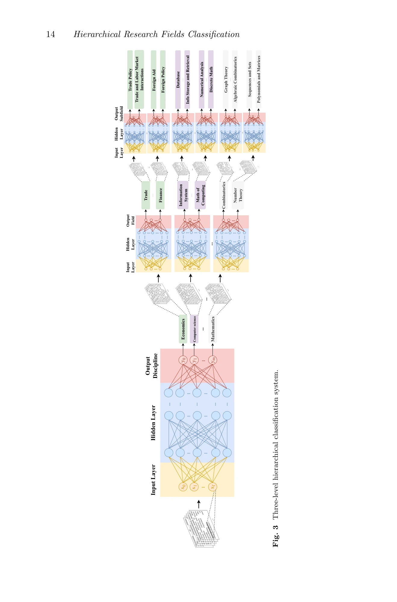
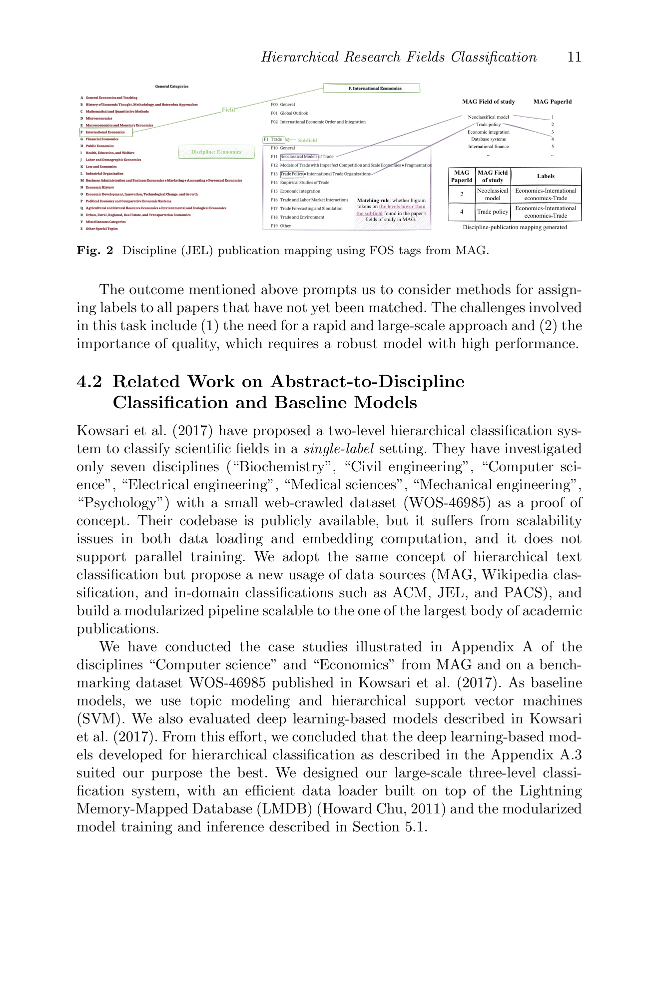

# Hierarchical Classification of Research Fields in the "Web of Science" Using Deep Learning

> **저자**: Susie Xi Rao, Peter H. Egger, Ce Zhang | **날짜**: 2024-07-25 | **DOI**: [10.48550/arXiv.2302.00390](https://doi.org/10.48550/arXiv.2302.00390)

---

## Essence

*Fig. 3 Three-level hierarchical classification system.*

본 논문은 Microsoft Academic Graph의 1.6억 개 논문 초록을 이용하여 심층 신경망 기반의 계층적 분류 시스템을 개발하여 학술 출판물을 44개 학문분야(discipline), 718개 분야(field), 1,485개 세부분야(subfield)로 자동 분류하는 시스템을 제시한다.

## Motivation

- **Known**: 학문분야의 계층적 분류는 학자 평가, 자금 배분, 학제간 연구 분석 등에서 필요하나, 컴퓨터 과학, 경제학 등 일부 학문만 체계화되어 있고 전 학문을 아우르는 통일된 분류 체계가 부재한 상황이다.
- **Gap**: 기존 분류 체계는 학문별로 불균등하며 학제간 분류를 충분히 수용하지 못하고, 160만 개 규모의 대량 논문을 효율적으로 처리하고 지속적으로 업데이트할 수 있는 자동화 시스템이 부족하다.
- **Why**: 통일된 계층적 분류 시스템은 학생의 진로 선택, 펀딩 기관의 학제성 평가, 테뉴어 위원회의 학자 평가 등 학계의 다양한 의사결정을 객관적으로 지원할 수 있으며, 학제간 연구의 정도를 정량화할 수 있다.
- **Approach**: Microsoft Academic Graph와 Wikipedia, JEL(경제), ACM(컴퓨터), PACS(물리) 등 기존 분류 체계를 결합하여 감독학습 기반의 모듈화된 계층적 분류 모델(CNN, RNN, Transformer)을 개발하고, 단일 레이블과 다중 레이블 설정 모두에서 3,140개 실험을 수행하였다.

## Achievement

*Fig. 2 Discipline (JEL) publication mapping using FOS tags from MAG.*

- **포괄적 분류 체계 구축**: 44개 학문분야, 718개 분야, 1,485개 세부분야로 구성된 전 학문을 아우르는 통일된 계층적 분류 체계 개발
- **높은 분류 정확도**: 단일 레이블 분류 77.13%, 다중 레이블 분류 78.19%에서 90% 이상의 정확도 달성
- **학제간 분류 지원**: 다중 레이블 설정을 통해 학제간 및 학제내 분류를 동시에 처리 가능
- **모듈화된 확장성**: 학문분야별로 선택적 재학습 가능한 모듈식 구조로 시스템 유지보수 효율성 극대화
- **공개 자원 제공**: 사전 학습된 모델 집합을 공개하여 향후 학술 출판 자동 색인 시스템의 기반 제공

## How

*Fig. 3 Three-level hierarchical classification system.*

- Microsoft Academic Graph (MAG) v2018-05-17에서 1.6억 개 논문의 초록과 키워드 추출
- Wikipedia 학문분야 목록과 JEL, ACM, PACS 등 학문별 표준 분류 체계를 결합하여 다층 레이블 세트 구성
- 초록 텍스트를 입력으로 하는 CNN, RNN, Transformer 기반 신경망 아키텍처 3가지 비교
- 배치 학습을 통한 분산식 모듈화 학습: 학문분야별→분야별→세부분야별 순차적 계층적 분류
- 단일 레이블(strict classification)과 다중 레이블(multi-label classification) 설정에서 별도로 정확도, 정밀도, 재현율 평가
- 3,140개 실험 수행으로 모델 성능과 하이퍼파라미터 최적화

## Originality

- 전 학문 영역을 아우르는 최초의 통일된 계층적 분류 체계 개발로, 기존의 학문별 산발적 분류를 통합
- 대규모 데이터(1.6억 논문)에 대한 모듈화된 계층적 다중 레이블 분류 시스템 설계로 확장성과 유지보수성 극대화
- 학제간 분류를 명시적으로 지원하는 다중 레이블 접근법으로 학제성 정도를 정량화할 수 있게 함
- 기존 여러 분류 체계(Wikipedia, JEL, ACM, PACS)를 체계적으로 통합하는 방법론 제시

## Limitation & Further Study

- 단일 시점(2018년 5월)의 MAG 데이터 사용으로 시간적 동적성 부재 및 이후 신흥 분야 미반영
- 초록과 키워드만 사용하여 본문 내용이 반영되지 않아 분류 정보 제한적
- 논문 초록의 품질, 길이 편차가 분류 성능에 미치는 영향 미분석
- 44개 학문분야 간 균형성 미검토로 학문분야별 정확도 편차 가능성
- **후속 연구**: 시계열 동적 학습을 통한 신흥 분야 반영, 본문 기반 분류 성능 개선, 학문분야별 세밀한 성능 분석, 실제 학술 출판 색인 시스템에의 적용 평가

## Evaluation

- Novelty: 4/5
- Technical Soundness: 3/5
- Significance: 4/5
- Clarity: 4/5
- Overall: 4/5

**총평**: 본 논문은 대규모 학술 데이터에 기반하여 학문 간 불균형을 해소하는 통일된 계층적 분류 체계를 최초로 제시하였으며, 모듈화된 설계와 다중 레이블 지원으로 높은 실용성을 확보하였다. 90% 이상의 분류 정확도와 공개 자원 제공으로 학제간 연구 평가, 학문분야 분석 등 다양한 메타-과학 연구에 중대한 기여를 할 것으로 판단된다.

## Related Papers

- 🔄 다른 접근: [[papers/952_Design_and_Update_of_a_Classification_System_The_UCSD_Map_of/review]] — UCSD 맵과 딥러닝 기반 분류는 모두 과학 분야를 체계적으로 분류하되 서로 다른 방법론을 사용한다.
- 🏛 기반 연구: [[papers/1018_Science_Mapping_and_Science_Maps/review]] — 과학 매핑의 이론적 기초와 실제 구현 방법론을 이해하는 데 필수적인 배경 지식을 제공한다.
- 🔗 후속 연구: [[papers/1051_Unsupervised_Word_Embeddings_Capture_Latent_Knowledge_from_M/review]] — 비지도 워드 임베딩으로 의학 지식을 추출하는 방법이 계층적 분류 시스템의 특화된 응용 사례이다.
- 🏛 기반 연구: [[papers/978_Introducing_the_open_biomedical_map_of_science/review]] — Web of Science의 연구 분야 계층적 분류 체계를 제공하여 생의학 과학 지도의 분류학적 기반이 된다.
- 🏛 기반 연구: [[papers/944_Co-Citation_Analysis_Bibliographic_Coupling_and_Direct_Citat/review]] — 서지학적 유사성 기반 연구 최전선 표현이 Web of Science 기반 연구 분야 계층적 분류의 방법론적 기반이 된다.
