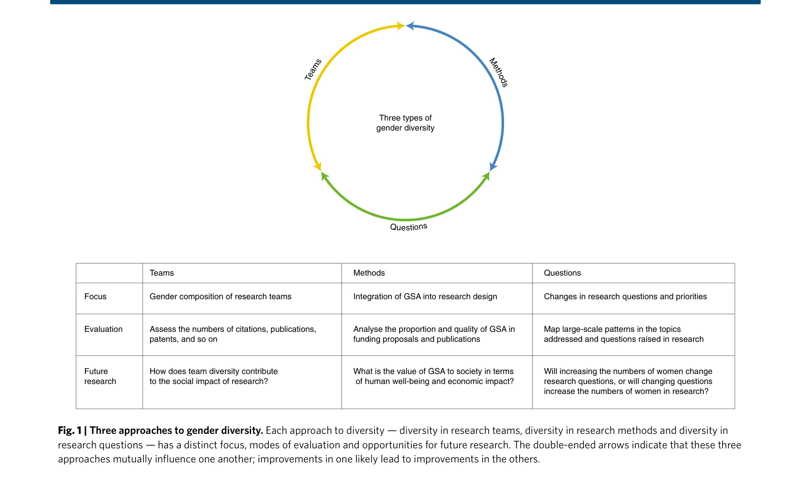
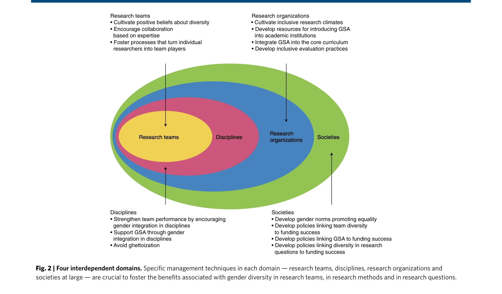

# Making gender diversity work for scientific discovery and innovation

> **저자**: Mathias Wullum Nielsen, Carter Walter Bloch, Londa Schiebinger | **날짜**: 2018-09-24 | **DOI**: [10.1038/s41562-018-0433-1](https://doi.org/10.1038/s41562-018-0433-1)

---

## Essence

*Fig. 1 | Three approaches to gender diversity. Each approach to diversity — diversity in research teams, diversity in re*

성별 다양성(gender diversity)을 연구팀 구성, 연구방법, 연구질문의 세 가지 차원에서 체계화하고, 이들이 연구팀·학문분야·연구기관·사회 네 개 영역에서 어떻게 작동하는지 분석하여 과학혁신을 극대화하는 프레임워크를 제시한다.

## Motivation

- **Known**: 성별 다양성이 과학혁신의 핵심동인으로 인식되고 있으며, 조직의 인지적 다양성(cognitive diversity)은 창의성과 문제해결능력을 향상시킨다는 연구가 존재한다.
- **Gap**: 기존 연구는 연구팀의 성별 구성에만 초점을 맞추고 있으며, 연구방법의 다양화(성별·성(sex) 분석 통합)와 연구질문의 변화에 대한 통합적 분석이 부재하다. 또한 과학팀의 성별 다양성이 사회적 영향에 미치는 효과에 대한 실증연구가 극히 제한적이다.
- **Why**: 성별 다양성은 높은 수준의 갈등을 야기할 수 있으므로 신중한 관리가 필요하며, 잘못된 연구 설계로 인한 약물 부작용(1997-2000년 미국에서 철회된 약물 중 80%가 여성에 위험)처럼 실제 인명피해와 경제적 손실을 초래하므로 중요하다.
- **Approach**: 세 가지 성별 다양성 접근법(팀 구성, 연구방법, 연구질문)을 정의하고, 이들이 상호의존적인 네 개 영역(연구팀·학문분야·연구기관·사회)에서 어떻게 상호작용하는지를 체계적 프레임워크로 제시하여 각 영역의 추동요인과 장애요인을 분석한다.

## Achievement

*Fig. 1 | Three approaches to gender diversity. Each approach to diversity — diversity in research teams, diversity in re*

- **성별 다양성의 3차원 분류**: 연구팀 구성의 성별 다양성, 성별·성(sex) 분석(Gender and Sex Analysis, GSA) 통합을 통한 연구방법의 다양화, 연구질문과 우선순위의 변화를 명확히 구분
- **다층적 분석 프레임워크**: 개별 연구팀에서 학문분야, 연구기관, 사회 수준까지 확대되는 4개 영역의 상호의존성을 보여주는 통합 모델 제시
- **문헌기반 근거**: 2006-2015년 11개 연구 검토 결과 기업 R&D에서는 5개 중 5개, 학계에서는 5개 중 2개가 성별 다양성의 긍정적 효과 입증
- **GSA 정책 추적**: 유럽·미국·캐나다의 12개 공공·민간 재단의 GSA 정책 현황 분석 및 캐나다 보건연구원의 사례(2011년 48% → 증가추세) 제시
- **사회적 영향 평가 방법론**: 약물 안전성 사례(8개 약물이 여성에 더 큰 위험) 등을 통해 GSA 부실이 초래하는 실제 피해를 정량화

## How

*Fig. 2 | Four interdependent domains. Specific management techniques in each domain — research teams, disciplines, resea*

- 사회심리학, 경영학, 과학혁신 사회학 등 다학제 문헌 통합 검토(보충자료의 검색방법 및 표 1, 2 참고)
- 팀 성과에 대한 기존 실증연구(실험실 및 기업 조직 연구) 메타분석을 통해 학계에 대한 공백 확인
- 인용도, 출판 생산성, 특허 등 기존 문헌계량학적 평가 지표 검토 및 사회적 관련성 평가의 필요성 제시
- 유럽위원회(EC)의 2010-2013년 출판물 GSA 분석(학문분야별·국가별) 및 정책 시행 전후 비교(캐나다)
- 구체적 사례 연구를 통한 질적 분석(골다공증, 심장질환, 임신 크래시 더미, 기계번역, 수자원 인프라 등)

## Originality

- 성별 다양성을 단순한 팀 구성 문제가 아닌 **방법론·질문의 다양성**까지 포함하는 3차원 개념으로 확장한 점이 혁신적
- 개별 팀 수준의 분석을 **학문분야·기관·사회 수준**으로 확대하는 다층적 프레임워크는 기존 연구에서 찾기 어려운 통합적 접근
- GSA 정책의 실제 이행률과 학문분야별 편차를 구체적으로 추적하고, 약물 철회 사례처럼 **성별 맹점의 실제 비용(인명피해, 경제적 손실)**을 실증적으로 제시
- 미래 연구질문으로 '성별 구성의 증가가 질문을 바꾸는가 vs 질문의 변화가 여성 참여를 늘리는가'의 인과관계 문제를 제시한 점

## Limitation & Further Study

- 학계 연구팀의 성별 다양성 효과에 대한 실증연구가 여전히 극히 적어 인과관계 규명이 미흡함 (11개 논문 중 학계 5개만 검토)
- 단순 인용도·발표 수량 지표로는 포착할 수 없는 **질적 영향(societal relevance, responsible research)** 평가 방법이 미개발 상태
- GSA 통합도의 학문분야별 편차(임상·보건 최고 7% vs 자연과학·공학 0%)의 원인에 대한 심층 분석 부재
- 조직 문화, 제도적 인센티브, 성별 규범 등 **사회 수준의 장애요인**에 대한 구체적 개입 방안이 미흡함
- 후속연구: (1) 팀 다양성의 사회적 영향 평가 방법론 개발, (2) GSA의 경제적·보건학적 가치 계량화, (3) 장기 추적 연구를 통한 인과관계 규명, (4) 각 영역별 제도적 장벽 제거 방안 개발

## Evaluation

- Novelty: 4/5
- Technical Soundness: 3/5
- Significance: 4/5
- Clarity: 4/5
- Overall: 4/5

**총평**: 본 논문은 성별 다양성을 팀·방법·질문의 3차원과 팀·분야·기관·사회의 4개 영역으로 체계화한 통합 프레임워크를 제시하여 산발적인 기존 연구를 조직화했다. 약물 부작용 사례처럼 성별 맹점의 실제 피해를 명확히 하고 정책적 함의를 제공하는 점에서 큰 의의가 있으나, 학계 연구팀 효과의 실증적 증거가 여전히 제한적이고 평가 방법론이 미개발 상태인 점이 한계다.

## Related Papers

- 🔗 후속 연구: [[papers/965_Gender-diverse_teams_produce_more_novel_and_higher-impact_sc/review]] — 성별 다양성이 높은 팀이 더 참신하고 높은 영향력을 가진 과학을 생산한다는 실증 결과를 체계적 프레임워크로 확장 설명한다.
- 🔄 다른 접근: [[papers/1039_The_Preeminence_of_Ethnic_Diversity_in_Scientific_Collaborat/review]] — 과학 협력에서 민족적 다양성의 탁월성을 성별 다양성과 비교하여 다차원적 다양성 효과를 종합적으로 이해한다.
- 🏛 기반 연구: [[papers/976_Intersectional_inequalities_in_science/review]] — 과학에서 교차적 불평등 연구가 성별을 포함한 다면적 다양성 효과 분석에 이론적 토대를 제공한다.
- 🔄 다른 접근: [[papers/1032_The_Diversity-Innovation_Paradox_in_Science/review]] — 다양성의 혁신 효과와 다양성-혁신 역설이라는 상반된 관점을 조화시키는 이론적 틀 필요
- ⚖️ 반론/비판: [[papers/1010_Remote_collaboration_fuses_fewer_breakthrough_ideas/review]] — 원격 협업이 혁신적 아이디어를 감소시킨다는 연구로 다양성 프레임워크의 한계를 시사한다
- 🔗 후속 연구: [[papers/1034_The_Increasing_Dominance_of_Teams_in_Production_of_Knowledge/review]] — 팀 기반 연구 증가 현상에 성별 다양성 프레임워크를 적용하여 확장할 수 있다
- 🏛 기반 연구: [[papers/965_Gender-diverse_teams_produce_more_novel_and_higher-impact_sc/review]] — 성별 다양성의 혁신 효과에 대한 실증적 증거를 체계적 프레임워크로 일반화할 수 있음
- 🧪 응용 사례: [[papers/1032_The_Diversity-Innovation_Paradox_in_Science/review]] — 성별 다양성을 과학적 발견과 혁신에 효과적으로 활용하기 위한 구체적 방안을 다양성-혁신 역설의 관점에서 재검토할 수 있다.
- 🧪 응용 사례: [[papers/1039_The_Preeminence_of_Ethnic_Diversity_in_Scientific_Collaborat/review]] — 인종적 다양성의 과학적 우수성을 실제 연구 발견과 혁신에 효과적으로 활용하기 위한 구체적 전략을 수립할 수 있다.
