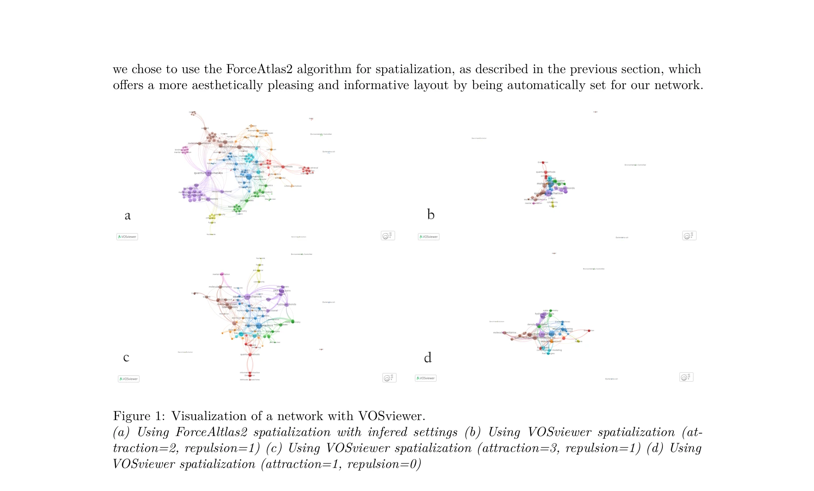

# Mapping scientific communities at scale

> **저자**: Victor Barbier, Eric Jeangirard | **날짜**: 2025-01-17 | **DOI**: [10.48550/arXiv.2501.10035](https://doi.org/10.48550/arXiv.2501.10035)

---

## Essence

*Figure 1: Visualization of a network with VOSviewer.*

대규모 bibliometric 데이터셋에서 과학 공동체를 효율적으로 매핑하기 위해 노드 필터링 대신 링크 필터링에 기반한 새로운 방법론을 제시하고, Elasticsearch, Graphology, VOSviewer 등을 통합한 확장 가능한 네트워크 분석 프레임워크를 제안한다.

## Motivation

- **Known**: Bibliographic 데이터베이스의 co-publication 또는 citation 정보를 통해 연구 공동체를 분석하는 것이 가능하며, VOSviewer 등의 도구가 존재하지만 대규모 데이터셋에 대한 확장성이 제한적이다.
- **Gap**: 기존 네트워크 분석 도구들은 매우 큰 코퍼스에서 계산 복잡도와 해석 용이성 문제로 인해 노드 기반 필터링을 적용하므로, 결과적으로 고립된 노드들만 남아 실질적인 상호작용 정보를 손실한다.
- **Why**: 과학정책 및 자금배분 결정을 위해 연구 기관, 실험실, 연구자 간의 협력 구조와 주제별 네트워크를 전국 규모에서 효과적으로 파악할 필요가 있다.
- **Approach**: 노드 필터링 대신 최강 상호작용 링크만 선별하는 링크 기반 필터링 전략을 도입하고, Elasticsearch를 통한 효율적 사전 계산, Graphology의 Force Atlas2 및 Louvain 알고리즘, LLM (Mistral Nemo)을 활용한 커뮤니티 레이블링을 통합한다.

## Achievement

*Figure 1: Visualization of a network with VOSviewer.*

- **링크 기반 필터링 방법론**: 노드 필터링의 한계를 극복하고 가장 강한 상호작용만 선별하여 네트워크의 구조적 정보 손실을 최소화
- **Elasticsearch 기반 확장성**: Publication 수준에서 사전 계산된 entity pair 필드 (co_topics, co_authors 등)를 활용한 고효율 대규모 링크 추출
- **통합 기술 스택**: Elasticsearch (데이터 집계), Graphology (네트워크 시각화 및 커뮤니티 탐지), VOSviewer (가시화), LLM 기반 자동 레이블링의 seamless 통합
- **실제 적용 및 오픈소스 공개**: scanR 포털을 통해 전국 규모의 공개 웹 도구로 배포하고, 모든 코드를 GitHub에서 오픈소스로 공개하여 재사용성 확보

## How

- Publication metadata 체계적 enrichment: idref (저자), SIRENE/RNSR (소속), Wikidata (주제) 등 persistent identifier 활용
- Elasticsearch aggregation으로 query별 최상위 2000개 링크 추출 (top-k link selection)
- 추출된 링크 쌍으로부터 그래프 생성 및 independent component 필터링
- Graphology의 Force Atlas2로 네트워크 spatialization (물리 기반 레이아웃)
- Louvain 알고리즘으로 커뮤니티 자동 탐지
- Mistral Nemo LLM으로 탐지된 커뮤니티에 대한 자동 레이블링
- OpenAlex 데이터와 fusion하여 citation count 기반 핫토픽 검출
- VOSviewer로 최종 네트워크 가시화 및 interactive web interface 제공

## Originality

- 노드 필터링에서 링크 필터링으로의 패러다임 전환으로 대규모 네트워크에서 상호작용 정보 보존
- Publication 수준의 사전 계산 (pre-calculated pairs)을 통해 실시간 interactive web 애플리케이션 실현
- LLM 활용 자동 커뮤니티 레이블링으로 해석 용이성 대폭 개선
- French-specific persistent identifier 인프라 (idref, SIRENE, RNSR)를 활용한 체계적 disambiguation

## Limitation & Further Study

- 고립된 노드 (연결 없는 entity)에 대한 가정이 일부 분야 (예: 문학)에서 타당하지 않을 수 있음
- Top-2000 링크 제한으로 인한 정보 손실 가능성 (작은 커뮤니티나 emerging topic 누락 위험)
- French research corpus 중심이므로 국제 협력 네트워크 파악의 불완전성
- Metadata 질 문제: 저자, 소속, 주제 disambiguation의 완전성이 100%가 아니므로 결과의 정확도 제약
- 후속연구: Non-French affiliations에 대한 국제 PID (ORCID, ROR 등) 통합, 동적 네트워크 분석 (시계열 커뮤니티 진화), 이질적 네트워크 분석 (멀티타입 entity-relation 모델링)

## Evaluation

- Novelty: 4/5
- Technical Soundness: 4/5
- Significance: 4/5
- Clarity: 4/5
- Overall: 4/5

**총평**: 이 논문은 대규모 bibliometric 네트워크 분석의 기술적 한계를 링크 필터링 전략으로 우아하게 해결하고, 성숙한 기술 스택을 통해 실제 정책 도구로 구현함으로써 학술 매트릭스와 과학정책 간의 간극을 실질적으로 좁혔다. 오픈소스 공개와 web 기반 배포로 재사용성과 영향력이 높다.

## Related Papers

- 🏛 기반 연구: [[papers/1115_Google_Scholar_Microsoft_Academic_Scopus_Dimensions_Web_of_S/review]] — 다양한 학술 데이터베이스 비교 연구가 확장 가능한 네트워크 분석 프레임워크 설계의 데이터 품질 기준을 제시한다.
- 🔗 후속 연구: [[papers/1023_SciSciNet_A_large-scale_open_data_lake_for_the_science_of_sc/review]] — SciSciNet의 대규모 오픈 데이터와 확장 가능한 매핑 방법론이 과학 공동체 분석의 완전한 파이프라인을 구성한다.
- 🧪 응용 사례: [[papers/978_Introducing_the_open_biomedical_map_of_science/review]] — 생의학 과학 지도 구축 경험이 대규모 과학 공동체 매핑 방법론의 특정 도메인 적용 사례가 된다.
- 🧪 응용 사례: [[papers/948_Community_Detection_in_Graphs/review]] — 커뮤니티 탐지 알고리즘을 대규모 과학 커뮤니티의 실제 매핑과 시각화에 적용한다.
- 🔗 후속 연구: [[papers/961_Fast_Unfolding_of_Communities_in_Large_Networks/review]] — 대규모 과학 공동체 매핑에서 Louvain 알고리즘의 확장성과 실용적 구현 방안을 제시한다.
- 🔗 후속 연구: [[papers/1040_The_Price-Pareto_growth_model_of_networks_with_community_str/review]] — 이론적 커뮤니티 성장 모델을 대규모 실제 과학 커뮤니티 매핑 문제에 적용한다.
