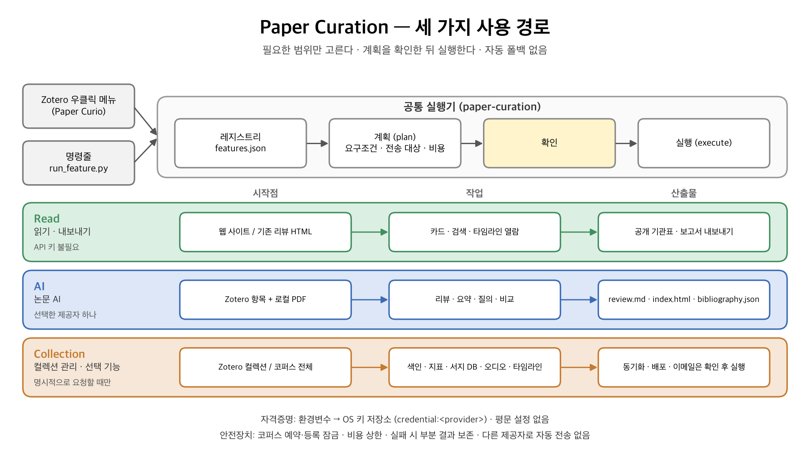

# Paper Curation 활용 매뉴얼

처음 시작하면 **[초보자용 간단버전](manual/beginner.md)**, 자동화와 라이브러리 운영은
**[파워유저용 심화버전](manual/advanced.md)** 을 보세요. [매뉴얼 목차](manual/index.md)에서 두 제품의 관계와 읽는 순서를 안내합니다.

**어디에서 무엇을 설정하고, 어떻게 동작시키는지**를 단계별로 정리한 문서입니다.
설치 절차의 세부 옵션은 [Setup Guide](setup-guide.md), 전체 큐레이션 운영은
[Operations Manual](operations.md), 내부 구조는 [Architecture](architecture.md)를 참고하세요.

🇬🇧 [English version](user-guide.en.md)



## 0. 먼저 알아둘 개념

| 개념 | 뜻 |
|------|----|
| **세 가지 경로** | **Read**(읽기·내보내기, 키 불필요) · **AI**(리뷰·요약·질의·비교, 선택한 제공자 하나) · **Collection**(색인·지표·서지·오디오·타임라인·동기화·배포·이메일, 명시적으로 요청할 때만) |
| **계획 → 확인 → 실행** | 모든 작업은 먼저 **계획(plan)** 을 만들어 요구조건·전송 대상·예상 비용을 보여주고, 사용자가 **확인**한 뒤에만 **실행(execute)** 합니다. 계획 단계에서는 파일도 API 호출도 발생하지 않습니다. |
| **공통 레지스트리** | Zotero 플러그인(Paper Curio)과 명령줄(`run_feature.py`)이 같은 기능 목록 `pipeline/features.json`을 사용합니다. 기능 ID·요구조건 표는 [Setup Guide의 생성 영역](setup-guide.md#공유-기능-레지스트리)이 기준입니다. |
| **자격증명** | API 키는 **환경변수 → OS 키 저장소**(macOS Keychain 등) 순으로 읽습니다. 설정 파일·요청 JSON·로그에는 평문 키를 저장하지 않습니다. |
| **자동 폴백 없음** | 선택한 제공자가 실패해도 다른 회사 모델로 자동 전송하지 않습니다. 실패는 상태 코드로 그대로 보고합니다. |
| **한 기능 = 한 작업** | 리뷰를 요청하면 리뷰만 만듭니다. 분류·검색 색인·타임라인·메일·배포는 각각 따로 요청해야 실행됩니다. |

## 1. 설치와 연결 (처음 한 번)

### 1-1. paper-curation 설치 — 터미널

```bash
git clone https://github.com/jehyunlee/paper-curation.git && cd paper-curation
conda create -n py312 -c conda-forge python=3.12 pip -y && conda activate py312
pip install -r requirements.txt
PYTHONUTF8=1 python pipeline/setup.py
```

- 결과: 최소 `config.json`과 `docs/papers/`가 생깁니다. 키를 묻지 않고, 네트워크 호출이나 전체 파이프라인 실행도 없습니다.
- 확인: `python pipeline/run_feature.py --list`가 기능 목록 JSON을 출력하면 정상입니다.
- **Python은 3.12 정확히** 필요합니다(3.14 등은 거부). Windows에서는 로컬 리뷰·코퍼스 잠금이 아직 지원되지 않습니다(macOS/Linux).

### 1-2. Zotero 플러그인 설치 — Zotero

1. [Paper Curio 최신 릴리스](https://github.com/jehyunlee/paper-curio/releases/latest)에서 `paper-curio.xpi`를 내려받습니다.
2. Zotero → **Tools → Plugins → ⚙️ → Install Plugin From File…** → 내려받은 파일 선택.
3. 이후 업데이트는 Zotero가 자동으로 확인합니다.

### 1-3. 두 프로그램 연결 — Zotero → Settings → Paper Curio → **출력 위치**

| 항목 | 입력할 값 |
|------|-----------|
| **paper-curation 루트 경로** | 1-1에서 클론한 폴더의 절대 경로 (`docs/papers/`가 있는 폴더). 비우면 `~/Documents/.../paper-curation` 등을 자동 탐색합니다. |
| **Python 경로** | 비우면 기본 conda `py312`를 사용합니다. 다른 위치에 만들었다면 그 인터프리터 경로를 적습니다. |
| **Fallback 출력 경로** | paper-curation이 없는 컴퓨터에서 기존 리뷰를 열람만 할 때 사용. 새 리뷰는 만들지 못합니다. |
| **기존 review 덮어쓰기** | 기본 OFF. 이미 리뷰가 있는 논문은 건너뜁니다. |

설정 창 상단의 상태 줄이 “연동됨”으로 바뀌면 연결이 끝난 것입니다.

### 1-4. API 키 저장 — Zotero → Settings → Paper Curio → **API 키**

1. **리뷰 제공자**에서 하나를 고릅니다: Anthropic · Sonnet 5(기본) / OpenAI · GPT-5 / Google · Gemini 3.1 Pro.
2. 해당 제공자의 키 입력칸에 키를 붙여 넣고 **OS 키 저장소에 저장** 버튼을 누릅니다.
   - 값은 OS 키 저장소로 들어가고, Zotero 설정에는 `credential:<provider>` 참조만 남습니다.
   - 같은 버튼에 **빈 값**을 저장하면 그 키가 삭제됩니다.
   - 버튼이 “먼저 paper-curation과 Python keyring 환경을 연결하세요”라고 하면 1-3을 먼저 끝내세요.
3. 다른 대화 제공자(OpenAI/Gemini)나 문헌 DB 키(Scopus 등)는 접힌 **다른 대화 제공자 및 선택 기능** 영역에서 같은 방식으로 저장합니다.

터미널에서 저장하려면(키를 화면에 표시하지 않음):

```bash
python -c 'import getpass,sys; sys.stdout.write(getpass.getpass())' | \
  python pipeline/credentials.py --operation write --provider anthropic
python pipeline/credentials.py --operation status --provider anthropic     # 값은 출력하지 않음
PYTHONUTF8=1 python pipeline/setup.py --check-feature review                # 준비 상태 진단
```

> 이전 버전(v0.9.x)의 평문 키 설정은 더 이상 읽지 않습니다. 업그레이드 후 위 절차로 키를 다시 저장하세요.
> 자동화 환경에서는 환경변수(`ANTHROPIC_API_KEY` 등)를 주입해도 되며, 환경변수가 OS 저장소보다 우선합니다.

### 1-5. 비용 상한 (선택) — 같은 **API 키** 영역의 **리뷰 비용 상한**

최대 USD와 현재 제공자의 **입력/출력 단가(100만 토큰당 USD)** 를 함께 적습니다. 단가가 없거나 보수적 예상비용이 상한을 넘으면 실행을 **차단**합니다(`budget-unavailable` / `budget-exceeded`). 비워 두면 상한 없이 실행합니다.

## 2. 경로 A — 읽기 · 내보내기 (키 불필요)

| 하고 싶은 일 | 어디에서 | 어떻게 |
|--------------|----------|--------|
| 공개 사이트 열람 | 브라우저 | [Humanoid](https://paper-curation.jehyunlee.dev/humanoid/) · [Physical AI](https://paper-curation.jehyunlee.dev/physical-ai/) — 카드·검색·타임라인·논문별 리뷰 |
| 내 리뷰 열기 | Zotero 우클릭 → **paper-curation Review HTML 열기** | 이미 생성된 `docs/papers/{slug}/index.html`을 브라우저로 엽니다(생성하지 않음) |
| 로컬 사이트 전체 열람 | 터미널 | `PYTHONUTF8=1 python pipeline/serve_local.py` → `http://localhost:8000/` |
| 공개 기관표 내보내기 (`institution-export`) | 기능 모듈 → **읽기 / 내보내기** → *공개 기관표 내보내기* | `outdir` 지정 → 실행 계획 확인 → 실행. 개인정보·수식·로컬 경로가 있으면 내보내기가 거부됩니다 |
| 로컬 PDF 추출만 (`extract`) | 기능 모듈 → **읽기 / 내보내기** → *로컬 PDF 추출* | 선택 항목의 PDF 경로가 자동 채워짐. 빈 `output_dir`에 `text.md`·`figures/` 생성. API 호출 없음 |

## 3. 경로 B — 논문 AI

### 3-1. 리뷰 생성 (Zotero에서) — `review`

1. 라이브러리에서 **논문 항목**을 선택합니다(PDF 첨부 줄이 아닌 상위 항목). 로컬 PDF가 첨부되어 있어야 합니다.
2. 우클릭 → **paper-curation Review 생성**.
3. **계획 창**이 뜹니다. 확인할 것:
   - 제공자·모델 (설정의 리뷰 제공자와 일치하는지)
   - **Output** 경로 — `docs/papers/{번호}_{제목}/`로 예약된 최종 저장 위치
   - 예상 비용과 상한 — 제목·초록·그림 캡션·본문 발췌만 선택한 제공자에 전송됩니다
4. **OK**를 누르면 실행: PDF 텍스트·그림 추출 → 리뷰 → `review.md` + `index.html` + `bibliography.json`. 취소하면 API 호출 없이 예약이 해제됩니다.
5. 완료 토스트 “리뷰 완료 … **서지 DB 반영 대기**”는 정상입니다. 리뷰는 끝났고, 전역 서지 DB 반영은 4-2의 별도 작업입니다.
6. 결과 열기: 우클릭 → **paper-curation Review HTML 열기**.

여러 항목을 선택하면 순서대로 처리하며, 항목별로 계획 확인을 요청합니다.

### 3-2. 리뷰 생성 (명령줄에서) — `review`

[Setup Guide의 요청 예시](setup-guide.md#단일-pdf-로컬-리뷰)를 `review-request.json`으로 저장한 뒤:

```bash
python pipeline/local_review.py --request review-request.json            # 계획만 (파일·API 호출 없음)
python pipeline/local_review.py --request review-request.json --execute  # 확인 후 실행
```

`--request`는 **JSON 파일 경로**를 받습니다. 종료 코드 0은 `ready`/`completed`/`exists`, 2는 차단 상태입니다.

### 3-3. 요약 · 질의 · 비교 (기능 모듈) — `summary` · `chat` · `comparison`

1. 근거로 쓸 논문(1편 이상, 비교는 2편 이상)을 선택한 상태에서 우클릭 메뉴 맨 아래 → **(adv.) run Paper Curation modules** → **논문 AI** 탭.
   (우클릭 **paper-curation Comparison**은 같은 화면의 *근거 기반 비교* 카드를 바로 엽니다.)
2. 카드에서 **선택한 PDF 본문 사용**을 누르면 선택 논문의 본문이 `sources`에 채워집니다.
3. 제공자를 고릅니다. 요약·질의는 로컬 **Ollama `qwen3.8:27b-mlx`** 도 선택할 수 있습니다(무료, 로컬). 비교와 리뷰는 클라우드 제공자만 지원합니다.
4. `question`(질의는 필수)과 필요하면 비용 상한·단가를 적습니다.
5. **실행 계획 확인** → 계획 JSON에서 제공자·전송 대상·비용을 읽습니다 → **선택 작업 실행** → 확인 대화상자에서 OK.
6. 결과는 **원문 인용이 붙은 주장 목록**입니다. 인용을 원문에서 찾을 수 없는 답변은 거부되며, 근거가 부족하면 `insufficient-data`로 끝납니다.
7. **결과 JSON 내보내기** 또는 **공유용 HTML 보고서 내보내기**로 저장합니다. HTML 보고서에는 로컬 경로·키가 들어가지 않습니다.

입력을 고치면 이전 계획은 무효가 되어 다시 **실행 계획 확인**을 눌러야 합니다.

### 3-4. AI Chat (PDF와 대화)

우클릭 → **paper-curation AI Chat — single / multiple**. paper-curation 연동 없이도 동작하는 기존 기능이며, 창 상단에서 모델을 고르고 EN/KO 답변 언어를 바꿀 수 있습니다. 여기서 쓰는 키는 1-4에서 저장한 OS 키 저장소 또는 환경변수를 사용합니다.

## 4. 경로 C — 컬렉션 관리 · 선택 기능

모두 우클릭 → **(adv.) run Paper Curation modules**의 **컬렉션 관리** / **선택 기능** 탭, 또는 명령줄 `run_feature.py`에서 실행합니다. 명령줄은 요청 JSON 파일을 만들어 `--request` 로 넘기고, 계획을 확인한 뒤 `--execute`를 붙입니다.

```bash
python pipeline/run_feature.py --list                                   # 기능 목록·요구조건
python pipeline/run_feature.py --request feature-request.json           # 계획
python pipeline/run_feature.py --request feature-request.json --execute # 실행
```

요청 파일 형식: `{"schema_version":1,"feature":"<기능 ID>","params":{...},"provider"?:..., "budget"?:...}`

### 4-1. 검색 색인·조회

| 기능 ID | 필요한 것 | 메모 |
|---------|-----------|------|
| `keyword-search` | 키 없음 | `params.operation`이 `build`면 BM25 색인 생성, `query`(기본)면 조회. Google 없이 동작 |
| `semantic-search` | Google 키 | 임베딩 기반 색인·조회. BM25 색인에 의미 검색을 요청하면 자동 대체 없이 명시적으로 거부됩니다 |

```json
{"schema_version":1,"feature":"keyword-search","params":{"topic":"my_topic","operation":"build"}}
```

### 4-2. 지표 · 서지 DB · 기관표

| 기능 ID | 필요한 것 | 메모 |
|---------|-----------|------|
| `metrics` | 키 없음(공개 API) | 피인용·레퍼런스를 `citations.md`·`references.md`에 누적 |
| `bibliography-update` | 키 없음(기본 offline) | 리뷰 뒤 “서지 DB 반영 대기”를 해소하는 단계. 기본은 변경분만 로컬 DB에 반영하며 Zotero 원격·이메일은 건드리지 않습니다 |
| `institution-export` | 키 없음 | 공개용 기관 정규화 표(CSV·XLSX) |

### 4-3. 오디오 · 타임라인

| 기능 ID | 필요한 것 | 메모 |
|---------|-----------|------|
| `audio` | Google 키, `ffmpeg` | 기존 리뷰(또는 검증된 저장 대본)로 MP3 생성. 메일은 보내지 않습니다 |
| `timeline-text` | Anthropic 키 | 카테고리 내러티브(텍스트)만 |
| `timeline-image` | PaperBanana 설정 + 백엔드 키 | 저장된 내러티브로 그림만. 준비 안 된 백엔드는 계획 단계에서 `needs-runtime`으로 막힙니다 |

### 4-4. 동기화 · 배포 · 이메일 (확인 필수)

| 기능 ID | 필요한 것 | 메모 |
|---------|-----------|------|
| `zotero-sync` | Zotero API 키, `config.json`의 컬렉션 매핑 | 기본 `dry_run: true`. 실제 삭제 반영은 `dry_run:false` + `confirm:true` |
| `publish` | Cloudflare 토큰·계정 ID, Node.js, Git | `confirm:true` 필수. 업로드·저장소 변경이 일어나므로 공개 권한을 먼저 확인 |
| `email` | Resend 키 | **기존 MP3 파일**을 지정 수신자에게 전달. 오디오를 새로 만들지 않습니다 |

### 4-5. 컬렉션 전체 처리 (고급)

- Zotero 컬렉션 우클릭 → **이 컬렉션 전체 처리 (리뷰·주제분류·타임라인)** — 새 컬렉션이면 별칭을 물어 `config.json`에 등록한 뒤 실행합니다(배포 제외).
- 터미널: 반드시 `--dry-run`으로 계획을 먼저 봅니다.

```bash
PYTHONUTF8=1 python pipeline/run_full.py --topic my_topic --mode curate --source zotero --dry-run
```

전체 처리가 실행 중이면 같은 코퍼스의 리뷰·모듈 작업은 잠금 때문에 `busy`로 대기합니다. 모드·복구 절차는 [Operations Manual](operations.md)을 보세요.

## 5. 상태와 오류 메시지 읽는 법

| 상태 | 의미 | 할 일 |
|------|------|-------|
| `ready` | 계획 완료, 실행 가능 | 내용 확인 후 실행 |
| `exists` | 이미 같은 논문의 완성된 리뷰가 있음 | 덮어쓰려면 설정 **기존 review 덮어쓰기** ON |
| `needs-key` | 선택한 제공자의 키가 없음 | 1-4에서 OS 키 저장소에 저장 |
| `needs-runtime` | Python 3.12·PyMuPDF·제공자 SDK·PaperBanana 등 준비 안 됨 | 1-1, 1-3 확인. `setup.py --check-feature <기능>` |
| `insufficient-data` | PDF 없음/읽기 실패/메타데이터 불일치, 근거 부족 | PDF 첨부·항목 선택 확인 |
| `budget-exceeded` / `budget-unavailable` | 상한 초과 / 단가 미확정 | 1-5 조정. 모델은 호출되지 않았음 |
| `blocked` | `confirm:true`가 필요한 작업 | 의도한 작업이면 확인 값 추가 |
| `busy` | 다른 코퍼스 작업(전체 처리, 다른 리뷰)이 진행 중 | 끝난 뒤 재시도 |
| `completed` | 성공 | — |
| **partial** (“목록/마커 갱신 실패”) | 리뷰 파일은 완성, 목록 등록 또는 Zotero 마커만 실패 | 표시된 HTML은 바로 열 수 있음. 같은 항목을 다시 실행하면 완성된 폴더를 재사용하여 등록만 다시 시도합니다(유료 호출 없음) |

플러그인 오류 메시지는 `[코드]`를 함께 표시합니다(예: `[corpus-busy]`). 원인 문구는 안전한 고정 메시지이며, 제3자 라이브러리의 원문 오류는 키 노출 위험 때문에 표시하지 않습니다.

## 6. 자주 묻는 질문

- **무엇이 외부로 전송되나?** 리뷰: 제목·초록·그림 캡션·본문 발췌(최대 12,000자)를 **선택한 제공자에게만**. 요약·질의·비교: 선택한 PDF 본문. 읽기·키워드 검색·추출·오프라인 서지 반영은 전송이 없습니다.
- **다른 제공자로 자동 재시도하나?** 하지 않습니다. 실패는 상태로 보고되며, 재시도는 사용자가 명시적으로 합니다.
- **키가 평문으로 남는 곳은?** 없습니다. 설정에는 `credential:<provider>` 참조만, 값은 OS 키 저장소. `credentials.py --operation read`는 플러그인 내부 파이프 전용이므로 터미널에서 실행하지 마세요.
- **Windows에서 리뷰가 안 된다.** 로컬 리뷰·코퍼스 잠금은 POSIX 파일 잠금이 필요합니다. 읽기와 AI Chat은 동작합니다.
- **비용은?** 리뷰 1편은 대략 $0.05–0.15(모델·분량에 따라 다름). 정확한 상한이 필요하면 1-5의 비용 상한을 설정하세요. 요약·질의는 Ollama로 무료 실행할 수 있습니다.
- **기존 전체 파이프라인(run_full)은 없어졌나?** 아닙니다. 4-5의 고급 작업으로 그대로 있으며, 리뷰 하나가 전체 파이프라인을 자동으로 끌고 가지 않도록 바뀐 것입니다.
