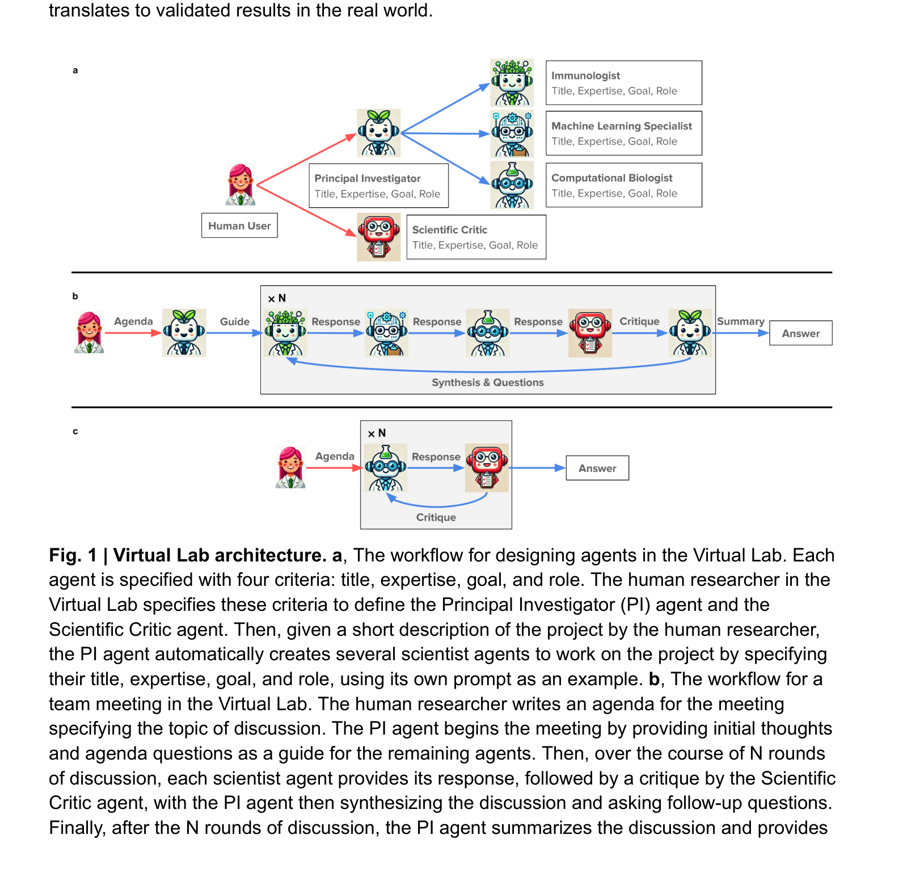
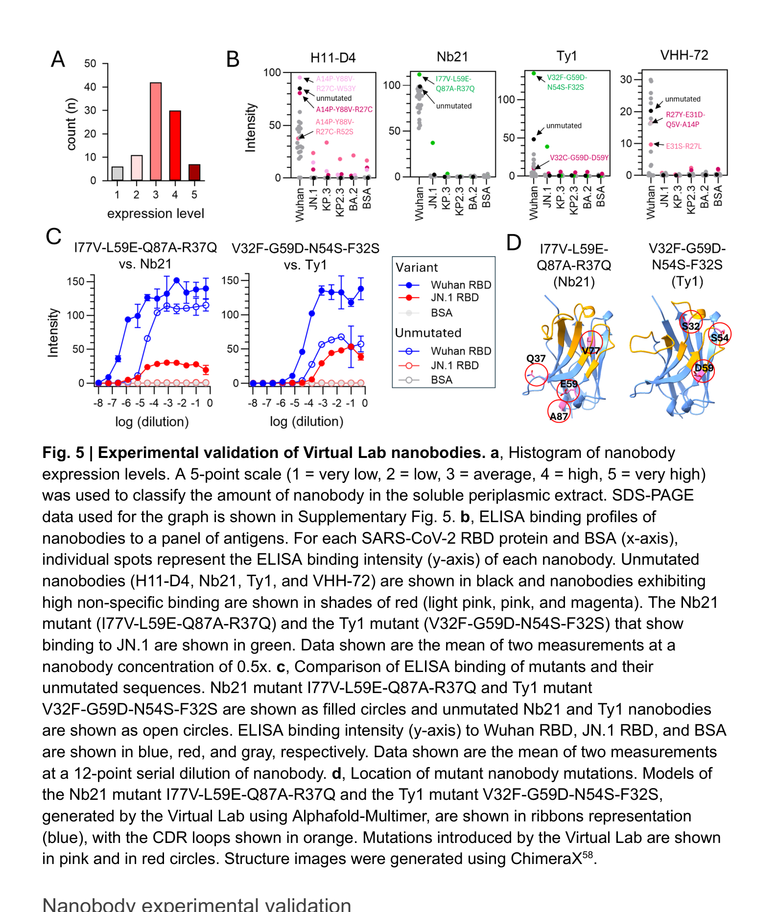
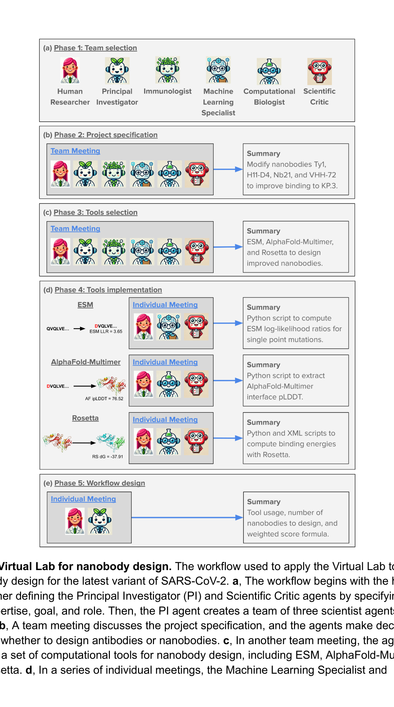
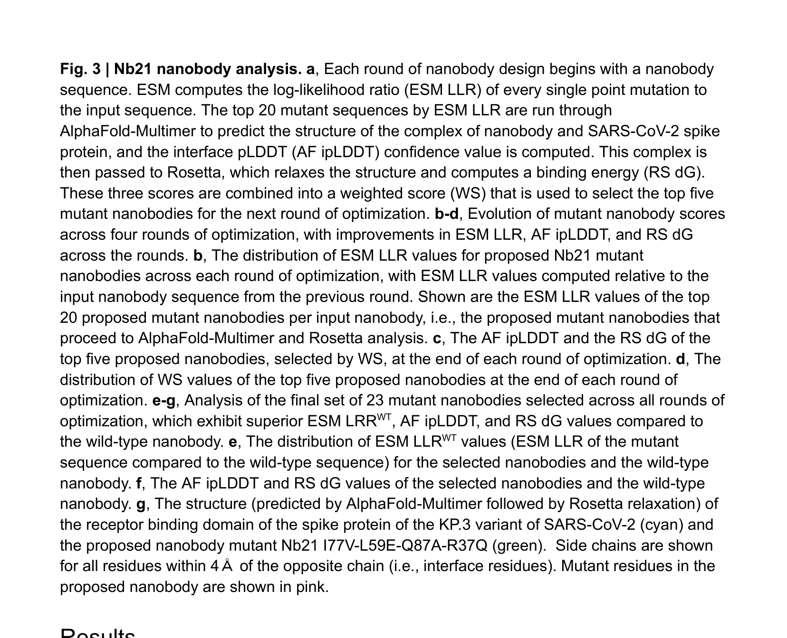
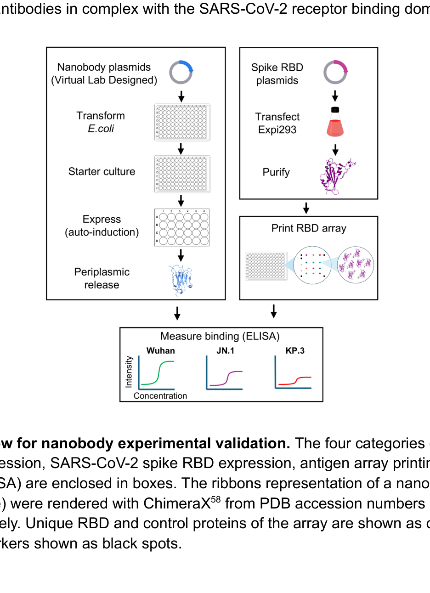
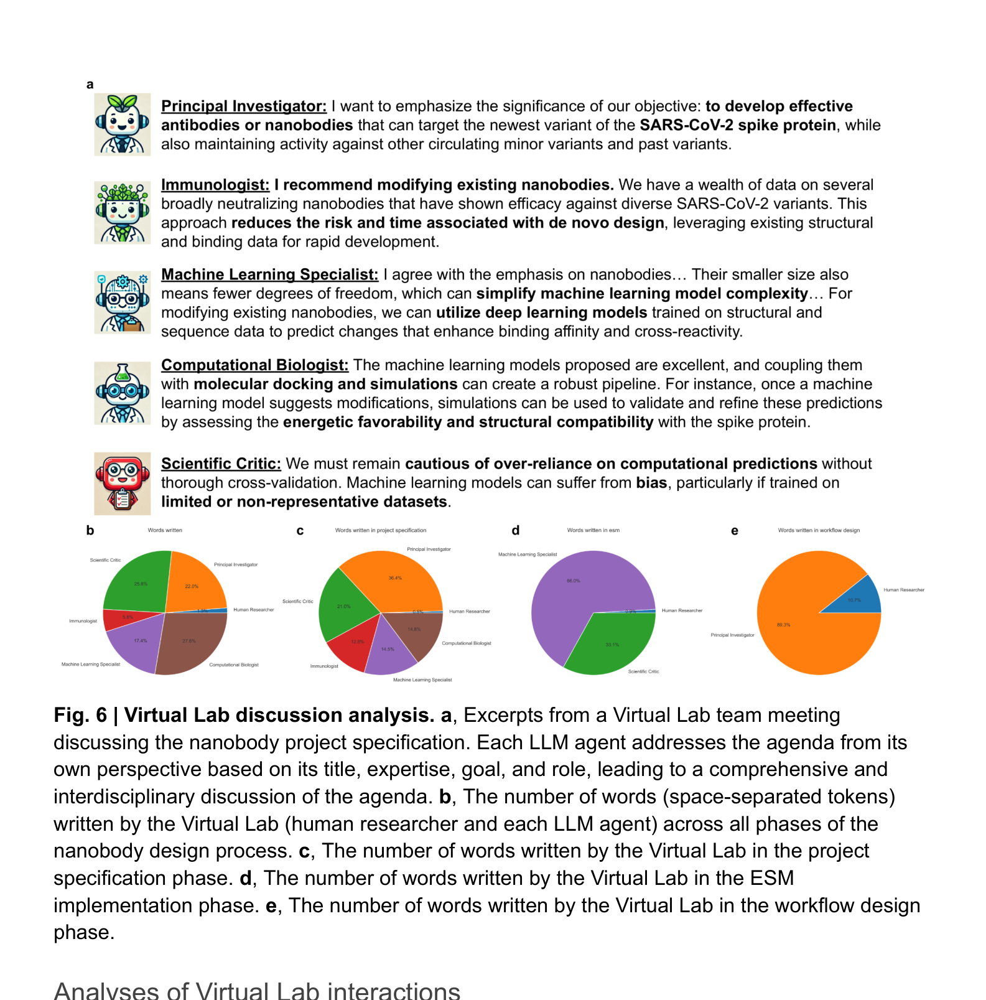

# The Virtual Lab of AI agents designs new SARS-CoV-2 nanobodies

> **저자**: Kyle Swanson, Wesley Wu, Nash L. Bulaong, John E. Pak, James Zou | **날짜**: 2025 | **Journal**: Nature | **DOI**: [10.1038/s41586-025-09442-9](https://doi.org/10.1038/s41586-025-09442-9)

---

## Essence

*Fig. 1 | Virtual Lab 아키텍처. (a) 에이전트 설계 워크플로우 — PI, Scientific Critic, 과학자 에이전트를 Title/Expertise/Goal/Role 4가지 기준으로 정의. (b) 팀 미팅 워크플로우. (c) 개별 미팅 워크플로우.*

Virtual Lab은 LLM(GPT-4o) 기반 멀티 에이전트 시스템과 인간 연구자의 협업으로 학제간 과학 연구를 수행하는 프레임워크이다. PI 에이전트가 면역학자·계산생물학자·ML 전문가 에이전트를 이끌며, ESM + AlphaFold-Multimer + Rosetta를 조합한 나노바디 설계 파이프라인을 에이전트가 자체적으로 설계했다. 92개 돌연변이 나노바디를 생성하여 실험 검증한 결과, 93.5%가 양호한 발현량(>5 mg/L)을 보였고, Nb21 돌연변이가 JN.1 RBD에 결합(EC50 2.0 ng/mL)하고 KP.3 RBD에도 결합 증거를 보였다.

## Motivation

- **Known**: 학제간 과학 연구는 점점 더 큰 팀과 다양한 전문성을 요구하며(AlphaFold 2 논문 저자 34명), LLM은 과학적 질문 답변에서 인간 과학자를 match하거나 능가하는 능력을 보임
- **Gap**: 기존 LLM 연구 도구들(ChemCrow, Coscientist, AI Scientist)은 좁은 단일 도메인에 국한되거나 실세계 실험 검증이 없었음. 개방형 학제간 연구 문제에 LLM을 적용한 사례가 부재
- **Why**: 모든 연구자가 여러 분야의 전문가에 접근할 수 있는 것은 아니며, 특히 자원이 부족한 그룹에게 학제간 협업은 심각한 장벽. SARS-CoV-2는 빠르게 기존 항체/나노바디 치료에 내성을 획득하고 있어 신속한 신규 나노바디 개발이 필수적
- **Approach**: LLM 에이전트 팀(PI, Scientific Critic, 분야별 과학자)이 팀 미팅과 개별 미팅을 통해 연구 설계부터 코드 구현까지 수행하고, 인간 연구자가 고수준 방향 제시 및 실험 검증을 담당하는 AI-인간 협업 프레임워크

## Achievement

*Fig. 5 | 나노바디 실험 검증 결과. (a) 발현량 히스토그램. (b-e) Wuhan/BA.2/JN.1/KP.3 RBD 결합 프로파일링 ELISA 결과.*

1. **자기설계 파이프라인**: AI 에이전트가 ESM(단백질 언어 모델) + AlphaFold-Multimer(구조 예측) + Rosetta(결합 에너지)를 통합한 반복적 돌연변이 최적화 워크플로우를 자체 설계. 가중 점수 공식 WS = 0.2*(ESM LLR) + 0.5*(AF ipLDDT) - 0.3*(RS dG)도 에이전트가 결정
2. **뛰어난 발현 성공률**: 92개 돌연변이 나노바디 중 93.5%(86/92)가 >5 mg/L 발현량, 38%(35/92)가 >25 mg/L의 높은 발현량을 시현
3. **원래 결합력 유지**: H11-D4/Nb21 시리즈의 96%(44/46)가 Wuhan RBD 결합력 유지
4. **최신 변이체 결합 후보 발견**: Nb21 돌연변이(I77V-L59E-Q87A-R37Q)가 JN.1 RBD에 결합(EC50 2.0 vs Wuhan 0.2 ng/mL) + KP.3 RBD에 결합 증거. Ty1 돌연변이가 Wuhan RBD 결합력 향상 + JN.1 RBD에 중간 수준 결합 획득
5. **극도의 효율성**: 전체 미팅 1-2시간, $10-20 비용. 인간 입력은 전체 텍스트의 1.3%(1,596단어)

## How

*Fig. 2 | 나노바디 설계를 위한 Virtual Lab 워크플로우. ESM → AlphaFold-Multimer → Rosetta 3개 도구를 조합한 반복적 최적화 파이프라인.*

*Fig. 3 | Nb21 나노바디 분석. 각 라운드의 ESM LLR, AlphaFold ipLDDT, Rosetta dG 점수와 가중 점수(WS) 기반 후보 선택 과정.*

- **에이전트 아키텍처**: GPT-4o 기반. PI(AI for research 전문) + Scientific Critic(오류 검증) + 3명의 과학자 에이전트(면역학, 계산생물학, ML). 각 에이전트는 Title, Expertise, Goal, Role 4가지 기준으로 정의
- **5단계 워크플로우**: (1) 팀 선발 — PI가 개별 미팅에서 과학자 에이전트 자동 생성. (2) 프로젝트 사양 — 팀 미팅에서 나노바디 vs 항체, 대상 변이체(KP.3) 등 결정. (3) 도구 선택 — ESM, AlphaFold-Multimer, Rosetta 선정. (4) 도구 구현 — 개별 미팅에서 코드 작성. (5) 워크플로우 설계 — 3개 도구 통합
- **반복적 최적화**: 4개 시작 나노바디에서 4라운드 반복. 각 라운드: ESM LLR → 상위 20개 → AlphaFold-Multimer ipLDDT → Rosetta dG → WS로 상위 5개 선택 → 다음 라운드. 최종 나노바디당 23개(총 92개) 선택
- **병렬 미팅**: 동일 미팅을 높은 temperature(0.8)로 여러 번 병렬 실행 후, 낮은 temperature(0.2)로 merge하여 창의성과 일관성을 동시 확보

*Fig. 4 | 나노바디 실험 검증 워크플로우. 발현, 정제, 결합 프로파일링, 친화도 측정의 4단계 검증 과정.*

- **실험 검증**: E. coli 발현 → 용해성 단백질 periplasm 분리 → ELISA로 Wuhan/BA.2/JN.1/KP.2.3/KP.3 RBD 패널 결합 프로파일링

## Originality

*Fig. 6 | Virtual Lab 토론 분석. (a) 팀 미팅 발췌. (b) 에이전트별 기여도 분석. (c) Scientific Critic의 비평 패턴.*

- **AI를 도구가 아닌 연구 설계자로**: 기존 접근법은 AlphaFold 등을 인간이 선택한 도구로 사용하는 반면, Virtual Lab에서는 LLM 에이전트가 어떤 도구를 어떻게 조합할지 고수준 의사결정을 자체적으로 수행하는 패러다임 전환
- **에이전트 정체성의 효과**: 서로 다른 과학적 배경을 가진 에이전트들이 다각적 관점에서 토론하여 포괄적 답변 도출. Ablation 실험에서 배경 없는 일반 에이전트보다 우수한 결과 확인
- **Scientific Critic 메커니즘**: 전담 비평 에이전트가 다른 에이전트의 답변을 지속적으로 검증하여 품질 향상. Chain-of-thought prompting을 다중 에이전트 관점과 human-in-the-loop로 확장한 구조

## Limitation & Further Study

### 저자들이 언급한 한계
- 인간 연구자의 고수준 감독이 여전히 필수적. 에이전트가 잘못된 방향으로 진행할 가능성을 인간이 교정
- GPT-4o의 토큰 제한으로 복잡한 코드 생성 시 오류 발생. 일부 코드는 수동 디버깅 필요
- 나노바디 4개 중 Ty1/VHH-72 시리즈는 최신 변이체 결합에서 제한적 성과
- 계산 예측과 실험 결과 사이의 불일치: Rosetta dG가 실험적 결합력과 약한 상관관계

### 자체판단 아쉬운 점
- **단일 LLM 의존**: GPT-4o에만 의존하여 모델 편향이 연구 설계에 체계적으로 반영될 위험. 다른 LLM과의 비교 실험 부재
- **비용 과소평가**: 미팅 비용 $10-20만 언급하지만, AlphaFold-Multimer/Rosetta 계산 비용과 실험 비용(합성 6주, 검증 2주)은 별도. 전체 프로젝트 비용 대비 효율성 분석이 필요
- **재현성 우려**: temperature 설정, 병렬 미팅 수, merge 전략 등 많은 하이퍼파라미터가 결과에 미치는 영향에 대한 체계적 분석 부족

### 후속 연구
- 다른 과학 분야(재료 과학, 화학 합성 등)로의 Virtual Lab 확장
- 에이전트가 실험 결과를 피드백으로 받아 자동으로 다음 라운드를 설계하는 완전 폐쇄 루프 시스템
- 다양한 LLM(Claude, Gemini)을 혼합 사용하는 이종 에이전트 팀의 효과 검증

## Evaluation

- Novelty: 5/5
- Technical Soundness: 4/5
- Significance: 5/5
- Clarity: 4/5
- Overall: 5/5

**총평**: AI 에이전트를 단순한 도구가 아닌 연구 설계자로 격상시킨 패러다임 전환적 연구로, Nature 게재에 걸맞은 실험적 검증과 실용적 성과를 갖추었다. 특히 에이전트가 자체적으로 계산 파이프라인을 설계하고 실제 결합하는 나노바디를 발견한 것은 AI for Science의 새로운 이정표이다.
