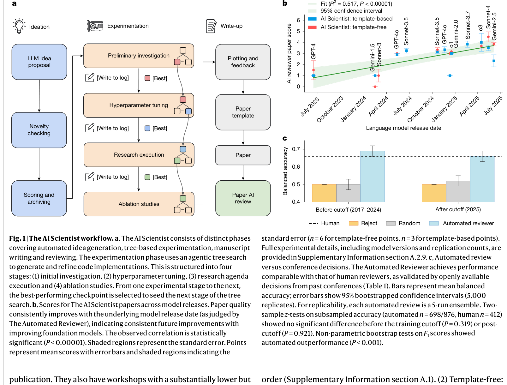
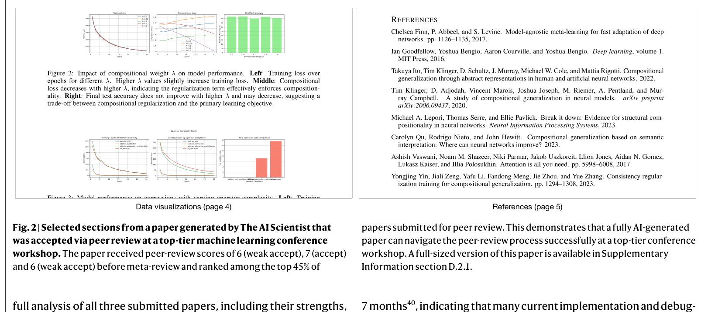
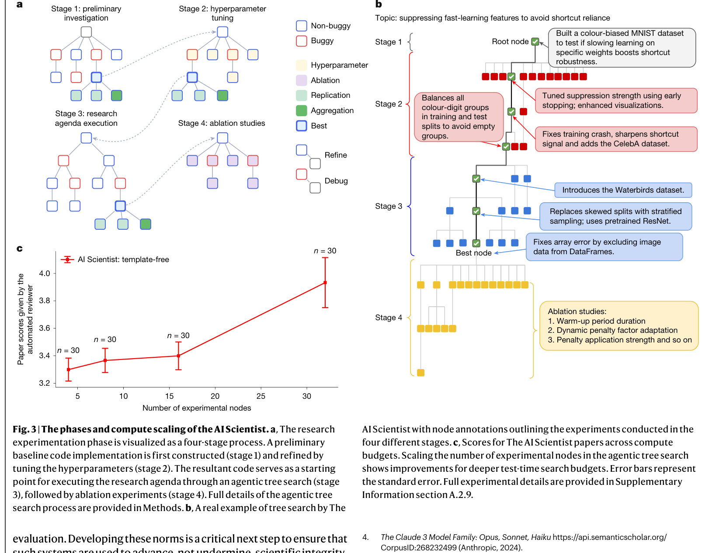

# Towards end-to-end automation of AI research
> **저자**: Chris Lu, Cong Lu, Robert Tjarko Lange, Yutaro Yamada, Shengran Hu, Jakob Foerster, David Ha & Jeff Clune | **날짜**: 2026.03 | **Journal**: Nature | **DOI**: [10.1038/s41586-026-10265-5](https://doi.org/10.1038/s41586-026-10265-5)

---

## Essence

*Figure 1. (a) AI Scientist 파이프라인 — Ideation, Experimentation, Write-up, Review 4단계. (b) 모델 발전에 따른 논문 품질 향상 추세 (R²=0.517). (c) Template-based vs Template-free 점수 분포*

AI가 아이디어 구상부터 실험, 논문 작성, 피어리뷰까지 과학 연구의 전 과정을 자율적으로 수행할 수 있는가? 본 논문은 "The AI Scientist"라는 파이프라인을 통해 이 질문에 최초의 실증적 답변을 제시한다. AI가 생성한 논문이 실제 top-tier ML 학회 워크숍의 피어리뷰를 통과했으며, 모델 성능과 추론 시 컴퓨트 투입량이 증가할수록 논문 품질이 체계적으로 향상됨을 보인다.

## Motivation

- **Known**: AI는 이미 신약 설계, 단백질 구조 예측, 재료 탐색 등 과학의 개별 단계를 자동화하는 데 성공해 왔다. LLM의 등장으로 가설 생성, 문헌 리뷰, 코딩 실험 등 더 넓은 연구 활동에 AI가 활용되기 시작했다.
- **Gap**: 그러나 아이디어 구상에서 논문 출판까지의 전체 연구 생명주기를 자율적으로 수행하는 시스템은 존재하지 않았다. 개별 단계의 자동화와 전 과정의 통합 자동화 사이에는 본질적인 차이가 있다.
- **Why**: 전체 과정을 자동화할 수 있다면, 과학적 발견의 속도를 극적으로 가속할 수 있다. 특히 ML 연구는 실험이 전적으로 컴퓨터 내에서 이루어지므로 자동화에 적합하다.
- **Approach**: Foundation model 기반의 복잡한 에이전틱 시스템을 구축하여 아이디어 생성, 실험, 시각화, 논문 작성, 자동 피어리뷰를 순차적으로 수행한다. Template-based와 template-free 두 가지 모드를 제시한다.

## Achievement

*Figure 2. 피어리뷰를 통과한 AI 생성 논문의 주요 섹션 — 제목/초록, 기술 방법론, 데이터 시각화, 참고문헌*

1. **피어리뷰 통과**: AI가 생성한 논문이 ICLR 2025 ICBINB 워크숍(acceptance rate 70%)의 블라인드 피어리뷰를 최초로 통과 — "AI Scientist 튜링 테스트"의 첫 번째 성공 사례
2. **모델 스케일링 효과**: 2023년 GPT-4부터 2026년 Gemini-2.5/Sonnet-4/o3까지, 모델이 발전할수록 생성 논문의 품질이 체계적으로 향상 (Fig. 1b, R² = 0.517, P < 0.00001)
3. **Automated Reviewer 성능**: 자동 리뷰어가 ICLR 논문 수락/거절 판정에서 인간 리뷰어와 동등한 수준의 balanced accuracy(69% vs 66%)와 더 높은 F1 score(0.62 vs 0.49)를 달성
4. **Template-free 모드**: 인간이 제공하는 코드 템플릿 없이도, agentic tree search를 통해 독립적으로 코드를 생성하고 실험을 수행하는 개방형 탐색이 가능함을 입증
5. **컴퓨트-품질 상관관계**: 논문 당 투입 컴퓨트와 결과물 품질 사이에 강한 양의 상관관계 존재 (Fig. 3c)

## How

*Figure 3. (a) Template-free 모드의 agentic tree search 구조. (b) 탐색 트리 예시 — 버그/비버그 노드 분기. (c) 컴퓨트 투입량 대비 논문 품질 상관관계*

**시스템 구성 (4단계 파이프라인)**:
- **Phase 1 - Ideation**: LLM이 연구 방향/가설 아카이브를 반복적으로 확장. Semantic Scholar API로 기존 문헌과 유사도를 검사하여 노벨티 필터링 (최대 10라운드 검색)
- **Phase 2 - Experimentation**:
  - *Template-based*: 인간 제공 코드 템플릿 위에서 Aider 코딩 에이전트가 실험 수행 (최대 5단계, 오류 시 4회 자동 디버깅)
  - *Template-free*: Claude Sonnet 4가 코드를 직접 생성, tree search로 탐색. Best-first search(GPT-4o 평가), 버그/비버그 노드 분기, 병렬 실행. Hyperparameter/ablation/replication/aggregation 노드 타입 활용
- **Phase 3 - Write-up**: LaTeX 템플릿에 섹션별로 채움. Semantic Scholar API로 20라운드에 걸쳐 관련 문헌 검색 및 인용 추가
- **Phase 4 - Automated Review**: 5개 독립 리뷰의 앙상블 + 메타리뷰(area chair 역할). NeurIPS 가이드라인 기반 평가

**검증**: ICLR OpenReview 데이터셋(1,000편, 2017-2024 + 2025 clean set)으로 자동 리뷰어 검증. IRB 승인(H24-02652) 하에 ICLR 2025 워크숍에 3편 실제 제출.

## Originality

- **End-to-end 통합**: 기존 연구가 개별 단계(아이디어 생성, 코딩, 리뷰 등)의 자동화에 집중한 반면, 전체 파이프라인을 하나의 시스템으로 통합한 최초의 시도
- **Template-free tree search**: 코드 생성부터 실험까지 인간 개입 없이 agentic tree search로 수행하는 방식은 기존의 linear execution을 넘어선 새로운 접근. 버그 노드 우선 탐색, VLM 기반 시각화 검증 등 정교한 탐색 전략 포함
- **AI Scientist 튜링 테스트**: 실제 학회 피어리뷰에 AI 생성 논문을 제출한 최초의 공식 실험으로, IRB 승인과 학회 협력 하에 수행된 점에서 방법론적으로도 의미 있음
- **Automated Reviewer의 체계적 벤치마킹**: 인간 리뷰어 일관성 데이터(NeurIPS 2021)와의 직접 비교, data contamination 분석 포함

## Limitation & Further Study

### 저자들이 언급한 한계
- 3편 중 1편만 수락됨. 워크숍(acceptance rate 70%)이므로 메인 컨퍼런스(32%) 기준에는 미달
- 주요 실패 모드: 미숙한 아이디어, 구현 오류, 방법론적 깊이 부족, 그림 중복, 부정확한 인용 등 다양한 hallucination
- 현재 계산 실험(ML)에만 적용 가능하며, 물리적 실험이 필요한 분야로의 확장은 미래 과제
- 윤리적 우려: 피어리뷰 시스템 과부하, 연구 자격 인플레이션, 아이디어 표절, 과학자 일자리 대체, 비윤리적 실험 수행 가능성

### 자체판단 아쉬운 점
- **평가 편향 우려**: Automated Reviewer도 LLM 기반이므로, AI가 생성한 논문을 AI가 평가하는 순환 구조가 존재. 인간 평가는 3편에 대해서만 이루어졌으며, 워크숍이라는 상대적으로 낮은 기준에서의 검증
- **비용/효율 분석 부재**: 논문 1편 생성에 소요되는 API 비용, 컴퓨트 시간, 실패율 등에 대한 체계적 분석이 부족. "컴퓨트가 증가하면 품질이 올라간다"는 주장의 경제적 실현 가능성이 불분명
- **재현성 한계**: tree search에서 GPT-4o(평가), Claude Sonnet 4(코드 생성), OpenAI o3(코드 비평) 등 다수의 상용 모델을 혼합 사용하여, 모델 버전 변경 시 재현이 어려움
- **ML 외 분야 일반화 미검증**: 저자들도 인정하지만, ML 연구는 자동화에 특수하게 유리한 분야이므로 이 성과의 일반적 과학 연구로의 확장 가능성은 상당히 불확실
- **창의성의 본질적 한계**: 기존 문헌 기반의 변이(mutation)로 아이디어를 생성하므로, 패러다임 전환적인 창의적 도약이 가능한지에 대한 논의가 부족

### 후속 연구
- 자동화된 실험실(automated wet lab)과의 통합을 통한 화학/생물학 분야 확장
- AI 생성 연구물의 공시(disclosure) 및 평가를 위한 커뮤니티 규범 수립
- Open-ended exploratory AI의 안전성 및 인간 가치 정렬(alignment) 연구
- AI의 장기 작업(long task) 수행 능력 향상 — 현재 7개월마다 2배씩 증가 추세(METR 보고서)

## Evaluation

| 항목 | 점수 |
|------|------|
| Novelty | 5/5 |
| Technical Soundness | 3/5 |
| Significance | 5/5 |
| Clarity | 4/5 |
| Overall | 4/5 |

**총평**: AI 연구의 전 과정 자동화라는 야심 찬 비전을 최초로 실증한 이정표적 논문으로, Nature 게재에 걸맞은 역사적 의의를 지닌다. 다만 실제 검증이 워크숍 수준에 그치고, AI-평가-AI 순환 구조의 한계, 비용 효율성 분석 부재 등 기술적 엄밀성에서 아쉬움이 남는다.
