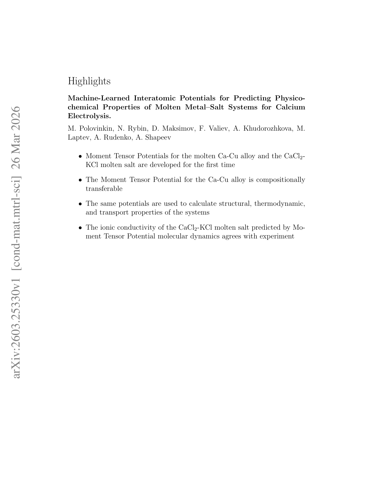

# Machine-Learned Interatomic Potentials for Predicting Physicochemical Properties of Molten Metal-Salt Systems for Calcium Electrolysis

> **저자**: M. Polovinkin, N. Rybin, D. Maksimov, F. Valiev, A. Khudorozhkova, M. Laptev, A. Rudenko, A. Shapeev | **날짜**: 2026-03-26 | **DOI**: — | **arXiv**: 2603.25330v1
> **리뷰 모드**: Web-only (abstract)

---

## Essence

칼슘 전해 장치 설계에 필요한 용융 금속-염 시스템(Ca-Cu 합금 및 CaCl$_2$-KCl 전해질)의 열역학·수송 특성을, DFT 기반으로 훈련된 Moment Tensor Potentials(MTP)을 이용한 분자동역학 시뮬레이션으로 실험을 대체하여 정확하게 예측할 수 있음을 보인다. 밀도, 점도, 확산 계수 등 주요 물성치를 고온 실험 없이 효율적으로 산출함으로써 칼슘 전해 공정 최적화의 비용과 시간을 크게 줄일 수 있다.

*Figure 1: 논문의 핵심 연구 흐름 — DFT 데이터 기반 MTP 훈련부터 MD 시뮬레이션을 통한 물성 예측까지의 워크플로우*

---

## Originality (Abstract 기반)

- [context] "The design of efficient electrolysis devices for pure metal production requires accurate data on the properties of the melts used in the process."
- [authorship, approach] "This work focuses on two key systems for calcium production: the molten Ca-Cu alloy and the CaCl$_2$-KCl electrolyte."
- [authorship, finding, result, learned] "High-temperature experiments are often expensive and time-consuming; however, we demonstrate that molecular dynamics (MD) simulations driven by machine-learned Moment Tensor Potentials (MTPs), trained on highly accurate density functional theory (DFT) calculations, can efficiently and accurately predict thermodynamic and transport properties such as density, viscosity, and diffusion coefficients for these systems."

---

## How (방법론)

- 고정밀 DFT 계산으로 훈련 데이터 생성
- Moment Tensor Potentials(MTP) 모델을 DFT 데이터에 학습
- 훈련된 MTP로 분자동역학(MD) 시뮬레이션 수행
- 대상 시스템: 용융 Ca-Cu 합금 + CaCl$_2$-KCl 전해질
- 예측 물성: 밀도, 동점도(viscosity), 확산 계수(diffusion coefficients)

---

## Why (중요성)

- 칼슘 전해를 위한 용융 시스템 물성 데이터는 효율적 전해 장치 설계의 전제 조건
- 고온 실험은 비용이 크고 시간이 많이 소요됨
- ML 포텐셜 기반 MD는 DFT 수준의 정확도를 실험 비용 없이 제공
- 순수 금속 생산(칼슘 제련) 공정 최적화에 직접 기여

---

## Limitation

- Abstract 기반 리뷰로 정량적 정확도 수치(실험 대비 오차) 미확인
- MTP 훈련 데이터의 커버리지 범위(온도, 조성 범위) 불명확
- 다른 금속-염 시스템으로의 전이 가능성(transferability) 미검증

---

## Further Study

- 다양한 전해질 조성(다성분 시스템)으로 MTP 적용 확장
- 전기화학적 반응 경로 시뮬레이션과의 통합
- 실험 검증을 통한 MTP 예측 정확도의 체계적 정량화

---

## 평가

| 항목 | 점수 |
|------|------|
| Novelty | 3/5 |
| Technical Soundness | 4/5 |
| Significance | 4/5 |
| Clarity | 4/5 |
| Overall | 4/5 |

**총평**: DFT 품질의 ML 포텐셜을 칼슘 전해 용융 시스템에 적용하여 고온 실험을 대체하는 실용적 접근으로, 산업적 파급력이 크나 방법론 자체의 독창성은 기존 MTP 프레임워크의 응용 수준에 머문다.
