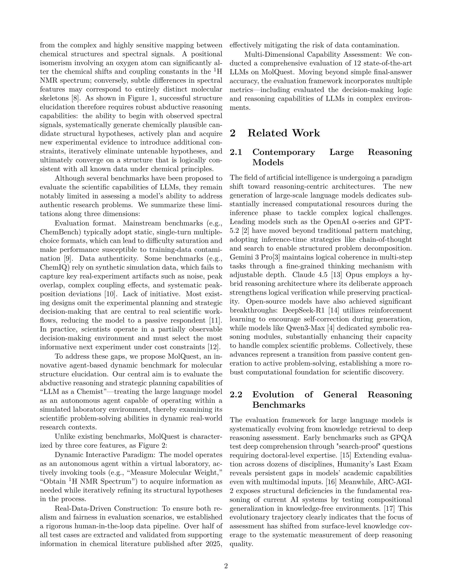

# MolQuest: A Benchmark for Agentic Evaluation of Abductive Reasoning in Chemical Structure Elucidation

> **저자**: Taolin Han, Shuang Wu, Jinghang Wang, Yuhao Zhou, Renquan Lv, Bing Zhao, Wei Hu | **날짜**: 2026-03-26 | **DOI**: — | **arXiv**: 2603.25253
> **리뷰 모드**: Web-only (abstract)

---

## Essence

LLM이 실제 화학 구조 결정(chemical structure elucidation) 과제에서 다단계 추론과 실험적 상호작용을 얼마나 잘 수행하는지 평가할 수 있는 기존 벤치마크가 없었다. MolQuest는 이 공백을 메우기 위해 귀납적 추론(abductive reasoning) 기반의 에이전틱 벤치마크를 새롭게 제시하며, 정적 단일 QA가 아닌 멀티스텝 반복·실험 상호작용 포맷으로 LLM의 동적 과학 추론 능력을 측정한다.

*Figure 1: MolQuest 벤치마크 구조 — 화학 구조 결정 태스크에서 에이전트의 다단계 추론 및 실험 상호작용 평가 프레임워크*

---

## Originality (Abstract 기반)

- [authorship, novelty, action, finding] "To address this gap, we introduce MolQuest, a novel agentic benchmark designed to evaluate LLMs on abductive reasoning in chemical structure elucidation."

---

## How (방법론)

- 화학 구조 결정(structure elucidation) 시나리오 기반 태스크 설계
- 귀납적 추론(abductive reasoning) 능력을 측정하는 에이전틱 평가 프레임워크
- 단일 QA가 아닌 멀티스텝 반복·실험 상호작용 포맷 채용
- 다양한 LLM을 동일 벤치마크에서 동적으로 평가

---

## Why (중요성)

- LLM의 과학 발견 잠재력을 실제 연구 시나리오에서 체계적으로 평가할 필요성
- 기존 정적 QA 벤치마크는 복잡한 과학 태스크의 동적·반복적 특성을 포착 불가
- 화학 구조 결정은 귀납적 추론과 실험 피드백이 필수인 대표적 실제 연구 문제
- AI for Science 분야에서 모델 능력의 현실적 한계를 파악하는 데 기여

---

## Limitation

- Abstract 기반으로 벤치마크 태스크의 규모(문제 수, 분자 다양성) 미확인
- 평가 지표의 구체적 정의 및 인간 전문가 대비 LLM 성능 수치 미파악
- 화학 구조 결정 외 다른 과학 분야로의 확장성 불명확

---

## Further Study

- 벤치마크를 NMR, MS 등 다양한 분광 기법 통합 시나리오로 확장
- 인간 화학자와 LLM 에이전트의 협업 성능 비교 연구
- 실험실 자동화 시스템과의 실제 통합 평가

---

## 평가

| 항목 | 점수 |
|------|------|
| Novelty | 4/5 |
| Technical Soundness | 3/5 |
| Significance | 4/5 |
| Clarity | 4/5 |
| Overall | 4/5 |

**총평**: 화학 구조 결정이라는 현실적·고난도 과학 태스크에서 LLM의 에이전틱 추론을 평가하는 최초의 체계적 벤치마크로, AI for Science 평가 인프라에 실질적 기여를 한다.
