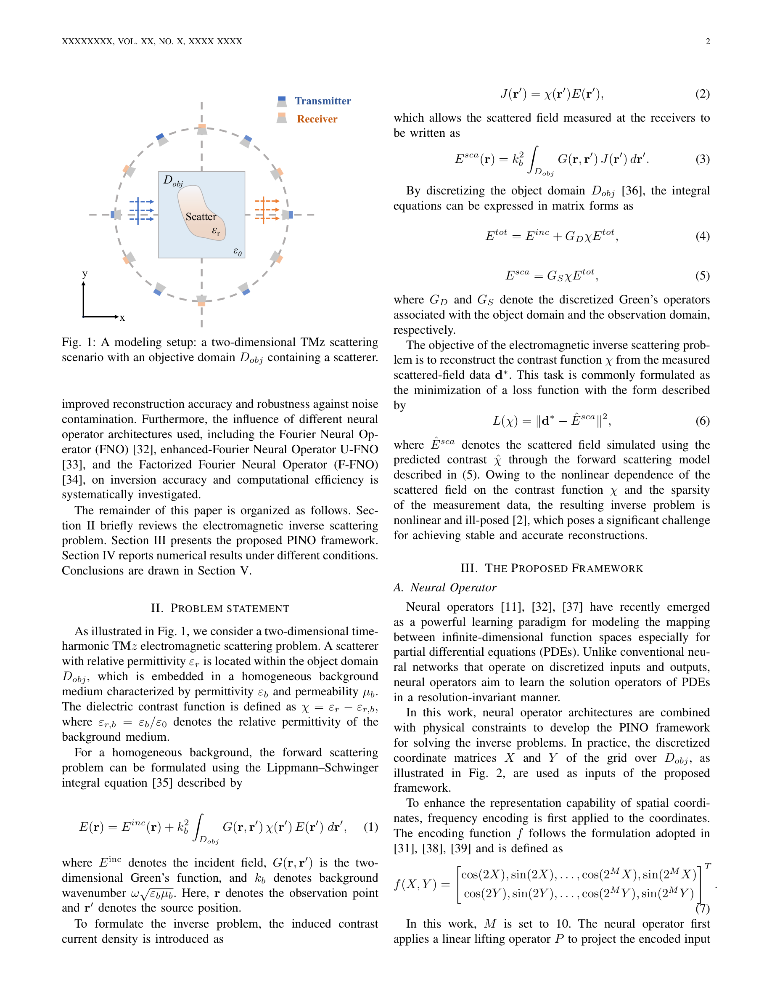

# Physics-Informed Neural Operator for Electromagnetic Inverse Scattering Problems

> **저자**: Q. C. Dong, Zi-Xuan Su, Qing Huo Liu, Wen Chen, Zhizhang Chen | **날짜**: 2026-03-26 | **DOI**: — | **arXiv**: 2603.25404
> **리뷰 모드**: Web-only (abstract)

---

## Essence

전자기 역산란(inverse scattering) 문제를 풀기 위해, 유전 특성을 학습 가능한 텐서로 표현하고 신경 연산자(neural operator)로 유도 전류 분포를 예측하는 물리 정보 신경 연산자(PINO) 프레임워크를 제안한다. State loss, data loss, TV 정규화로 구성된 하이브리드 손실 함수를 통해 다양한 측정 조건에서 신속하고 정확한 유전율 분포 재구성을 가능하게 한다.

*Figure 1: PINO 프레임워크 구조 — 역산란 문제에서 학습 가능한 유전 텐서와 신경 연산자 기반 유도 전류 예측 흐름*

---

## Originality (Abstract 기반)

- [authorship, action, finding, approach] "This paper proposes a physics-informed neural operator (PINO) framework for solving inverse scattering problems, enabling rapid and accurate reconstructions under diverse measurement conditions."
- [action, approach, learned] "In the proposed approach, the dielectric property is represented as a learnable tensor, while a neural operator is employed to predict the induced current distribution."
- [action] "A hybrid loss function, consisting of the state loss, data loss and total-variation (TV) regularization, is constructed to establish a faithful physical model."

---

## How (방법론)

- 유전 특성을 학습 가능한 텐서(learnable tensor)로 파라미터화
- 신경 연산자(neural operator)로 유도 전류 분포 예측
- 하이브리드 손실 함수: state loss + data loss + TV 정규화
- 다양한 측정 조건(diverse measurement conditions)에서의 역문제 재구성
- 물리 법칙(Maxwell 방정식)을 신경망 학습에 내재화

---

## Why (중요성)

- 역산란 문제는 의료 영상, 비파괴 검사, 레이더 등 다양한 응용 분야의 핵심 문제
- 기존 반복적 수치해법은 계산 비용이 크고 초기값 의존성이 높음
- PINO는 빠른 추론 속도와 물리 일관성을 동시에 확보
- 다양한 측정 조건에 대한 범용성(generalization)이 실용적 활용의 관건

---

## Limitation

- Abstract 기반으로 벤치마크 데이터셋의 종류 및 성능 수치 미확인
- 3D 대형 산란체나 강한 비선형 산란에 대한 적용 한계 불명확
- 측정 잡음(noise) 강건성에 대한 평가 미파악

---

## Further Study

- 3D 역산란 및 다중 주파수 데이터로 확장
- 실험적 측정 데이터(실제 안테나 어레이)를 이용한 검증
- 강한 산란체(high-contrast scatterer)에 대한 성능 개선

---

## 평가

| 항목 | 점수 |
|------|------|
| Novelty | 4/5 |
| Technical Soundness | 4/5 |
| Significance | 4/5 |
| Clarity | 4/5 |
| Overall | 4/5 |

**총평**: 유전 특성의 학습 가능한 텐서 표현과 신경 연산자를 결합한 PINO 프레임워크는 전자기 역산란 문제에서 속도와 물리 일관성을 동시에 달성하는 실용적이고 기술적으로 견실한 접근이다.
