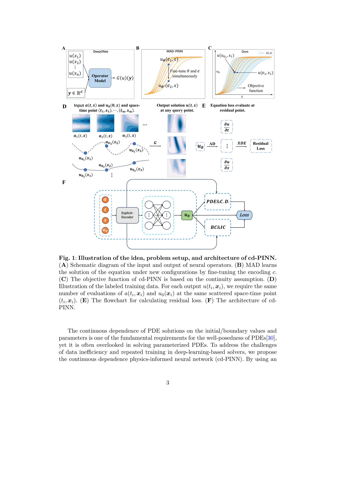

# Incorporating Continuous Dependence Qualifies Physics-Informed Neural Networks for Operator Learning

> **저자**: Guojie Li, Wuyue Yang, Liu Hong | **날짜**: 2026-03-26 | **DOI**: — | **arXiv**: 2603.25122
> **리뷰 모드**: Web-only (abstract)

---

## Essence

기존 PINN의 핵심 약점인 낮은 일반화 성능 문제를, PDE의 수학적 적분성(well-posedness)에서 보장되는 해의 연속 의존성(continuous dependence) 정보를 학습에 추가 반영함으로써 해결한다. 이 확장은 PINN이 단순한 PDE 솔버에서 나아가 operator learning 수준의 일반화 능력을 갖추도록 하며, PDE 해의 수학적 구조를 훈련 제약으로 활용하는 새로운 패러다임을 제시한다.

*Figure 1: 연속 의존성 조건을 통합한 확장 PINN 프레임워크 — 초기·경계 조건 변화에 대한 해의 민감도를 손실 함수에 반영하는 구조*

---

## Originality (Abstract 기반)

- [authorship, novelty, action] "Inspired by the rigorous mathematical statements on the well-posedness of PDEs, we develop a novel extension of PINNs by incorporating the additional information on the continuous dependence of solutions on initial and boundary conditions."

---

## How (방법론)

- 기존 PINN에 PDE well-posedness의 연속 의존성 조건을 추가 제약으로 도입
- 초기 조건 및 경계 조건의 변화에 대한 해의 민감도를 손실 함수에 반영
- 수학적 엄밀성(Hadamard well-posedness)에서 영감을 얻은 훈련 프레임워크
- 고차원 PDE 및 불규칙 경계를 갖는 문제에 적용

---

## Why (중요성)

- PINN의 낮은 일반화 성능은 실제 응용에서 가장 큰 걸림돌
- 연속 의존성 조건은 수학적으로 보장된 well-posedness 성질에서 도출되어 이론적 근거가 명확
- Operator learning(DeepONet, FNO 등)과의 경쟁에서 PINN의 경쟁력 강화
- 단일 솔루션 학습을 넘어 파라미터/조건 변화에 대한 robust 예측 가능

---

## Limitation

- Abstract 기반으로 구체적 PDE 유형 및 성능 개선 수치 미확인
- 연속 의존성 정보를 손실 함수에 반영하는 구체적 구현 방식 불명확
- 강한 비선형 PDE나 불연속 해(shock wave 등)에 대한 적용 가능성 미검토

---

## Further Study

- Navier-Stokes, 파동 방정식 등 다양한 물리 PDE에의 검증 확장
- DeepONet, FNO 등 기존 operator learning 방법과의 체계적 비교
- 연속 의존성 이외의 well-posedness 조건(유일성, 존재성) 활용 탐색

---

## 평가

| 항목 | 점수 |
|------|------|
| Novelty | 4/5 |
| Technical Soundness | 4/5 |
| Significance | 4/5 |
| Clarity | 4/5 |
| Overall | 4/5 |

**총평**: PDE well-posedness의 수학적 구조를 PINN 훈련 제약으로 활용하는 아이디어는 이론적으로 우아하며, 일반화 성능 향상을 통해 PINN을 operator learning 수준으로 격상시키는 실질적 기여를 한다.
