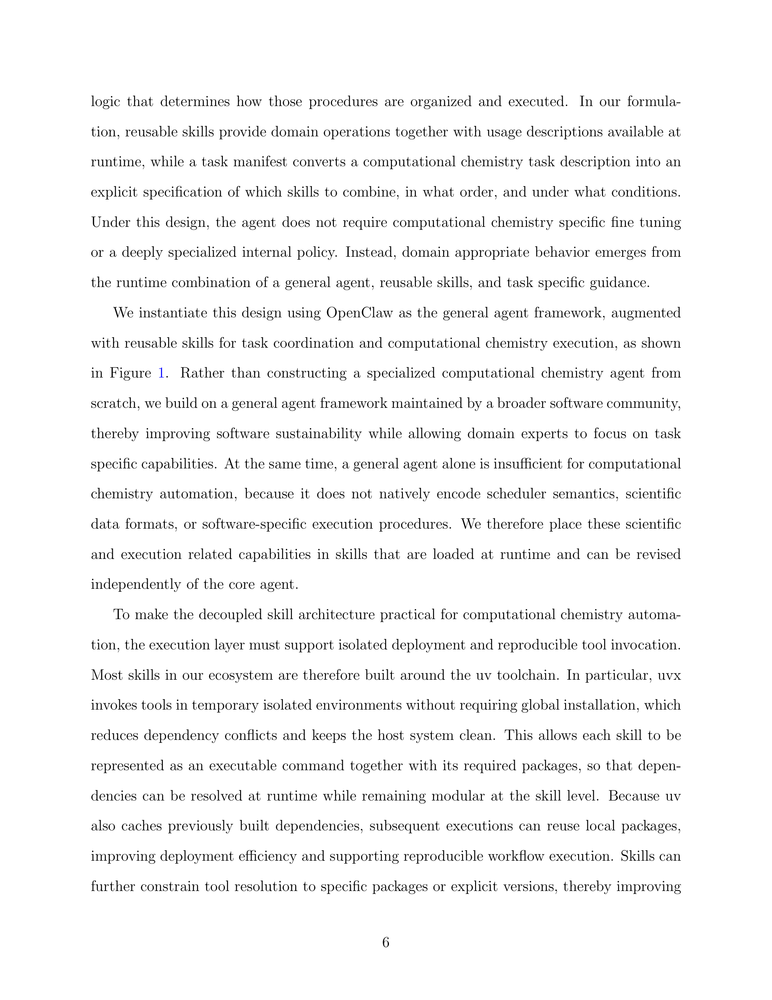

# Automating Computational Chemistry Workflows via OpenClaw and Domain-Specific Skills

> **저자**: Mingwei Ding, Chen Huang, Yibo Hu, Yifan Li, Zitian Lu, Xingtai Yu, Duo Zhang, Wenxi Zhai, Tong Zhu, Qiangqiang Gu, Jinzhe Zeng | **날짜**: 2026-03-26 | **Journal**: arXiv preprint | **DOI**: N/A | **arXiv**: 2603.25522
> **리뷰 모드**: PDF

---

## Essence

계산 화학 자동화의 핵심 장벽은 추론·워크플로 명세·소프트웨어 실행·HPC 실행이 단일 에이전트 안에 강하게 결합되어 있어 새 기능 추가 시 에이전트 전체를 재설계해야 한다는 점이다. 이 논문은 OpenClaw를 범용 제어 루프로 삼고, schema 기반 planning skill이 과학적 목표를 실행 가능한 task specification으로 변환하며, domain skill이 특정 화학 소프트웨어 절차를 캡슐화하고, DPDispatcher가 HPC 스케줄러를 추상화하는 **분리형(decoupled) agent-skill 아키텍처**를 제시한다. 메탄 산화 반응 MD 사례 연구에서 인간 개입 없이 다단계 크로스-툴 실행, 런타임 오류 복구, 반응 네트워크 추출을 완수하였다.

*Figure 1: OpenClaw 기반 분리형 agent-skill 프레임워크 아키텍처. 중앙 제어 루프(OpenClaw), planning skill, domain skill, DPDispatcher의 역할 분담을 도식화.*

## Originality (Abstract 기반)

- [authorship, action, finding, learned] "We demonstrate a decoupled agent-skill design for computational chemistry automation leveraging OpenClaw."
- [finding] "OpenClaw provides centralized control and supervision; schema-defined planning skills translate scientific goals into executable task specifications; domain skills encapsulate specific computational chemistry procedures; and DPDispatcher manages job execution across heterogeneous HPC environments."
- [continuation] "In a molecular dynamics case study of methane oxidation, the system completed cross-tool execution, bounded recovery from runtime failures, and reaction network extraction without human intervention."

## How (방법론)

- **분리형 설계**: OpenClaw 제어 루프는 계산 화학 도메인 지식 없이 범용 조율을 담당; 도메인 로직은 skill 파일로 외재화
- **Agent Taskboard Manifest**: 자연어 태스크 설명을 명시적·실행 가능한 워크플로 명세(어떤 skill을, 어떤 순서로, 어떤 조건 하에)로 변환하는 planning skill
- **Progressive skill loading**: 현재 필요한 skill만 컨텍스트 창에 로드하여 토큰 낭비 방지 및 확장성 확보
- **DPDispatcher 통합**: Slurm, PBS, LSF 등 이기종 HPC 스케줄러를 단일 인터페이스로 추상화; 큐잉·모니터링·결과 수집을 워크플로 상태로 관리
- **사례 연구 — 메탄 산화 MD**: Open Babel(구조 생성) → Gaussian(DFT 최적화) → dpdata(포맷 변환) → Packmol(벌크 시스템) → LAMMPS + DeePMD-kit(반응 MD @ 3000 K) → ReacNetGenerator(반응 네트워크 추출)의 6단계 크로스-툴 파이프라인을 자율 완수

## Why (중요성)

- 계산 화학 워크플로 자동화는 AI for Science 연구 가속화의 핵심 병목이며, 기존 접근(AiiDA, FireWorks 등)은 제어 흐름이 미리 고정되어 동적 복구나 새 소프트웨어 통합이 어렵다
- Skill 교체만으로 새 소프트웨어를 통합할 수 있는 모듈식 구조는 유지보수 비용을 크게 낮추고, 대규모 계산 화학 커뮤니티가 공유·재사용할 수 있는 skill 생태계 구축 가능
- 런타임 오류 발생 시 bounded recovery(사용자 개입 요청 포함)를 지원함으로써 실제 HPC 환경의 불안정성을 프로덕션 수준에서 처리

## Limitation

- 사례 연구가 단일 메탄 산화 시스템에 국한되어 있어 다양한 계산 화학 워크플로에 대한 범용성 검증 부족
- Skill 작성 자체가 전문 지식을 요구하므로, 새 소프트웨어 통합이 쉬워졌다고는 해도 skill 생태계 구축에는 상당한 초기 투자가 필요
- 대규모 멀티-노드 HPC 환경에서의 성능 및 확장성(수백 개의 병렬 작업) 벤치마크가 제시되지 않음

## Further Study

- 다양한 계산 화학 태스크(자유 에너지 계산, 단백질 폴딩, 소재 스크리닝)로 skill 저장소 확장
- Skill 자동 생성 혹은 LLM 보조 skill 작성 도구 개발로 진입 장벽 완화
- 멀티-에이전트 병렬 실행 지원 및 대규모 HPC 클러스터에서의 수천 작업 동시 처리 검증

## 평가

| 항목 | 점수 |
|------|------|
| Novelty | 3/5 |
| Technical Soundness | 4/5 |
| Significance | 4/5 |
| Clarity | 4/5 |
| Overall | 4/5 |

**총평**: 계산 화학 자동화의 결합 문제를 agent-skill 분리 아키텍처로 깔끔하게 해결하며, 실제 메탄 산화 MD 사례로 실행 가능성을 입증한 완성도 높은 시스템 논문이다. 단일 사례 연구의 한계가 있으나 재현 가능하고 확장 가능한 설계 원칙이 명확하여 AI for Science 자동화 플랫폼 연구에 중요한 기여를 한다.
