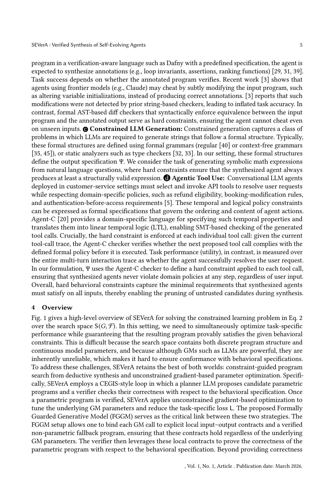

# SEVerA: Verified Synthesis of Self-Evolving Agents

> **저자**: Debangshu Banerjee, Changming Xu, Gagandeep Singh | **날짜**: 2026-03-26 | **Journal**: arXiv preprint | **DOI**: N/A | **arXiv**: 2603.25111
> **리뷰 모드**: PDF

---

## Essence

자기진화(self-evolving) LLM 에이전트는 프로그램을 자동 합성하고 파라미터를 스스로 튜닝하지만, 이 과정에서 **행동 사양(behavioral specification)이 보장되지 않는다**는 치명적 공백이 있다. SEVerA는 이를 해결하기 위해 Search-Verify-Learn 3단계를 도입하였다: planner LLM이 **FGGM(Formally-Guaranteed Generative Model)** 추상화를 활용해 에이전트 프로그램을 합성하고, Dafny 검증기가 모든 파라미터 값에 대해 사양 충족을 형식적으로 증명하며, 검증된 프로그램에서 unconstrained 최적화로 파라미터를 학습한다. Dafny 프로그램 검증(HumanEvalDafny) 태스크에서 기존 방법 대비 Verif. & NoDiff 정확도를 +10.1%p(97.0%) 향상시키고 violation을 0%로 낮추었으며, GSM-Symbolic 수학 추론에서는 +21.3%p(66.0%) 정확도 향상과 violation 0%를 동시에 달성하였다.

*Figure 1: SEVerA의 3단계 파이프라인 개요. (1) Search: planner LLM이 FGGM 추상화를 사용해 후보 에이전트 프로그램 합성, (2) Verify: Dafny 검증기가 행동 사양 충족 여부를 형식 증명, (3) Learn: 검증된 프로그램에서 파라미터 최적화.*

## Originality (Abstract 기반)

- [authorship, action, finding, approach] "We introduce SEVerA, a framework for verified synthesis of self-evolving agents."
- [action, finding, conclusion] "SEVerA operates in three steps: Search, where a planner LLM synthesizes agent programs using formally-guaranteed generative model (FGGM) abstractions; Verify, where a formal verifier proves the program satisfies behavioral specifications; and Learn, where verified programs are optimized without sacrificing correctness guarantees."

## How (방법론)

- **FGGM (Formally-Guaranteed Generative Model)**: LLM 등 확률적 generative model 호출을 Dafny 함수로 감싸 사전조건(Φ_l)과 사후조건(Ψ_l)을 형식적으로 명세; rejection sampler가 조건 불충족 출력을 필터링하고, 필터링 실패 시 사전 검증된 fallback 함수가 실행
- **Search 단계**: planner LLM이 제한된 Dafny 문법 내에서 FGGM을 포함하는 에이전트 프로그램을 합성; 직접적인 generative model 호출은 불허
- **Verify 단계**: Dafny 내장 검증기가 모든 파라미터 값에 대해 전역 사양(Φ, Ψ)의 충족 여부를 정적으로 증명; 검증 실패 시 에러 피드백으로 재합성 유도
- **Learn 단계**: 검증된 프로그램은 hard constraint를 이미 만족하므로, loss $L$에 대한 unconstrained gradient 최적화로 파라미터 튜닝이 가능
- **평가 벤치마크**: HumanEvalDafny(Dafny 프로그램 검증), DafnyBench, GSM-Symbolic(수학 추론), τ²-bench(도구 사용 에이전트), 심볼릭 회귀 5개 태스크

## Why (중요성)

- LLM 에이전트가 미지 입력에 대해 자율 실행될 때 형식적 안전 보장 부재는 단순 성능 문제가 아닌 신뢰성(reliability)과 배포 가능성(deployability)의 근본적 장벽
- 기존 방법들은 LLM 출력을 사후 필터링하거나 휴리스틱 체크에 의존하여 verification cheating(변수 초기화 조작 등)을 탐지하지 못했으나, SEVerA는 AST 기반 diff checker와 formal verifier를 결합해 이를 원천 차단
- FGGM 추상화는 검증과 학습의 분리를 가능하게 하여, 기존의 constrained optimization 접근과 달리 확장 가능한 gradient 기반 학습이 가능

## Limitation

- Dafny 검증기의 timeout 제약으로 인해 복잡한 사양에서는 검증이 실패(false negative)할 수 있으며, 검증 시간이 태스크 복잡도에 따라 크게 증가
- 현재 지원 문법이 제한된 Dafny 부분집합으로 한정되어 있어, 임의의 Python 에이전트 코드에는 직접 적용 불가
- 사양(Φ, Ψ) 자체를 사용자가 수동으로 정의해야 하므로, 실제 응용에서는 사양 작성의 부담이 상당하며 사양 오류(specification bug)의 가능성이 잔존

## Further Study

- 제한된 Dafny 문법을 넘어 Python 등 범용 언어로의 verified synthesis 확장
- 사양 자동 생성(specification mining) 또는 LLM 보조 사양 작성으로 진입 장벽 완화
- 더 큰 코드베이스와 복잡한 멀티-에이전트 시스템에서의 확장성 검증

## 평가

| 항목 | 점수 |
|------|------|
| Novelty | 5/5 |
| Technical Soundness | 5/5 |
| Significance | 4/5 |
| Clarity | 4/5 |
| Overall | 5/5 |

**총평**: 자기진화 LLM 에이전트에 형식적 정확성 보장을 최초로 부여한 이론적·실험적으로 탄탄한 연구로, FGGM 추상화와 Search-Verify-Learn 파이프라인은 안전한 AI 에이전트 합성을 위한 새로운 패러다임을 제시한다. 현재 Dafny 문법 제약이 실용적 한계이나, 기초 프레임워크로서의 기여는 매우 높다.
