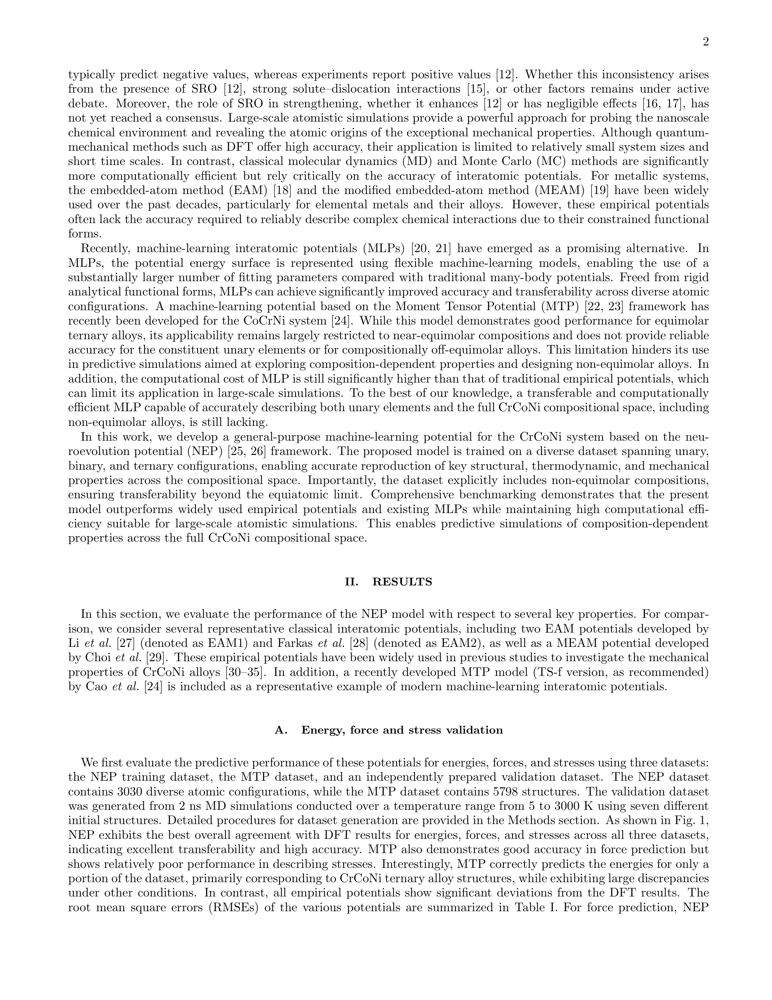

# General-Purpose Machine-Learned Potential for CrCoNi Alloys Enabling Large-Scale Atomistic Simulations with First-Principles Accuracy

> **저자**: Yong-Chao Wu, Tero Mäkinen, Mikko Alava, Amin Esfandiarpour | **날짜**: 2026-03-26 | **Journal**: arXiv preprint | **DOI**: N/A | **arXiv**: 2603.25616v1
> **리뷰 모드**: PDF

---

## Essence

CrCoNi medium-entropy alloy(MEA)는 우수한 기계적 성질로 주목받지만, SRO(short-range order)와 조성 변화를 동시에 다루는 대규모 원자론적 시뮬레이션이 어렵다. 이 논문은 NEP(neuroevolution potential) 프레임워크를 이용해 CrCoNi 삼원계 전 조성 범위를 커버하는 범용 머신러닝 포텐셜을 개발하였다. NEP는 힘 RMSE 106.1 meV/Å(훈련셋), 에너지 RMSE 2.45 meV/atom으로 DFT 수준 정확도를 달성하며, MTP 대비 CPU에서 약 2배, Tesla V100 GPU 단일 카드에서 **48배** 빠른 속도로 수백만 원자 규모 MD 시뮬레이션을 가능하게 한다.

*Figure 1: NEP, EAM1/2, MEAM, MTP가 예측한 에너지·힘·응력의 DFT 대비 pairwise 비교(NEP, MTP, 검증 데이터셋)와 NEP descriptor 기반 PCA. NEP가 모든 데이터셋에서 가장 낮은 RMSE를 달성함.*

## Originality (Abstract 기반)

- [authorship, action, conclusion] "Here we develop a general-purpose machine-learned potential for the CrCoNi system using the neuroevolution potential (NEP) framework."
- [novelty, result] "The potential achieves first-principles accuracy for a wide range of properties and enables large-scale simulations with significant speedup over DFT."

## How (방법론)

- **NEP 훈련 데이터셋 구축**: SOAP 기반 PCA에서 farthest point sampling으로 2,000개 대표 구조 선별 후 DFT 레이블링; 이후 active learning으로 원소계(0~3,000 K), 점결함(300~1,000 K), 적층 결함, 비등몰비 삼원계 구조를 반복적으로 추가
- **NEP 학습**: 뉴로에볼루션(진화 알고리즘 기반 학습) 방식으로 파라미터 최적화; GPU 병렬화에 최적화된 구현
- **비교 벤치마크**: EAM1, EAM2, MEAM(경험적 포텐셜), MTP(기존 MLIP)와 에너지·힘·응력 RMSE 정량 비교
- **검증 특성**: 격자 상수, 탄성 상수, 표면/공공 형성 에너지, 그레인 바운더리 에너지, SFE, 포논 분산, Warren-Cowley SRO 파라미터, 용융 온도(고액 공존 MD), 변형 유도 상변태, 전위 해리
- **대규모 시뮬레이션**: hybrid MC/MD로 SRO 평형화 후 150개 독립 구성에서 SFE 통계 계산; 전위 쌍극자(edge) 및 사중극자(screw) 모델로 적층 결함 에너지 및 전위 해리 분석

## Why (중요성)

- CrCoNi의 SFE는 DFT 계산에서도 실험값과 부호가 반대(-26 ~ -60 mJ/m² vs 양수)이며, SRO의 역할(강화 vs 무효과)에 대한 논쟁이 지속되고 있어 대규모 원자론적 시뮬레이션이 필수
- 비등몰비 조성은 성질 조율의 유효한 경로이나 기존 포텐셜들은 등몰 조성에 집중되어 있어 조성 전이 가능(transferable) 모델이 결여되어 있었음
- GPU 1장으로 MTP 대비 48배 속도 향상은 수백만 원자, 수십 ns 시뮬레이션을 현실적으로 가능하게 하여 나노스케일 변형 메커니즘 연구의 패러다임을 바꿈

## Limitation

- SFE 계산에서 NEP는 -52 mJ/m²를 예측하지만, 실험값이 양수인 이유(SRO 기여, 강한 용질-전위 상호작용 등)에 대한 논쟁은 이 논문으로도 해소되지 않음
- 훈련 데이터가 특정 DFT 설정(PBE 범함수, PAW, VASP)에 의존하므로, 다른 DFT 레벨로의 transferability는 검증되지 않음
- 4원계 이상(CrCoNiMn, CrCoNiFe 등)으로의 확장은 별도의 새 훈련이 필요하며 현재 구현 범위 밖

## Further Study

- SRO가 전위 운동 및 강화 메커니즘에 미치는 영향을 수백만 원자 규모에서 직접 시뮬레이션으로 규명
- 비등몰비 조성 공간 전체에 걸친 SFE, 항복 강도 등 기계적 성질 ternary plot 체계적 탐색
- NEP 프레임워크를 활용한 4원계 CrCoNiMn, HEA(high-entropy alloy)로의 일반화된 MLIP 개발

## 평가

| 항목 | 점수 |
|------|------|
| Novelty | 3/5 |
| Technical Soundness | 5/5 |
| Significance | 4/5 |
| Clarity | 4/5 |
| Overall | 4/5 |

**총평**: CrCoNi MEA를 위한 최초의 조성 전이 가능 범용 MLIP를 NEP 기반으로 개발하고, DFT 수준 정확도와 GPU 기반 대규모 시뮬레이션 가능성을 수십 가지 물성 검증으로 철저히 입증한 고신뢰도 재료 시뮬레이션 논문이다. 방법론적 독창성은 제한적이나 CrCoNi 연구 공동체에 즉시 활용 가능한 고품질 포텐셜을 제공한다는 점에서 실용적 가치가 크다.
