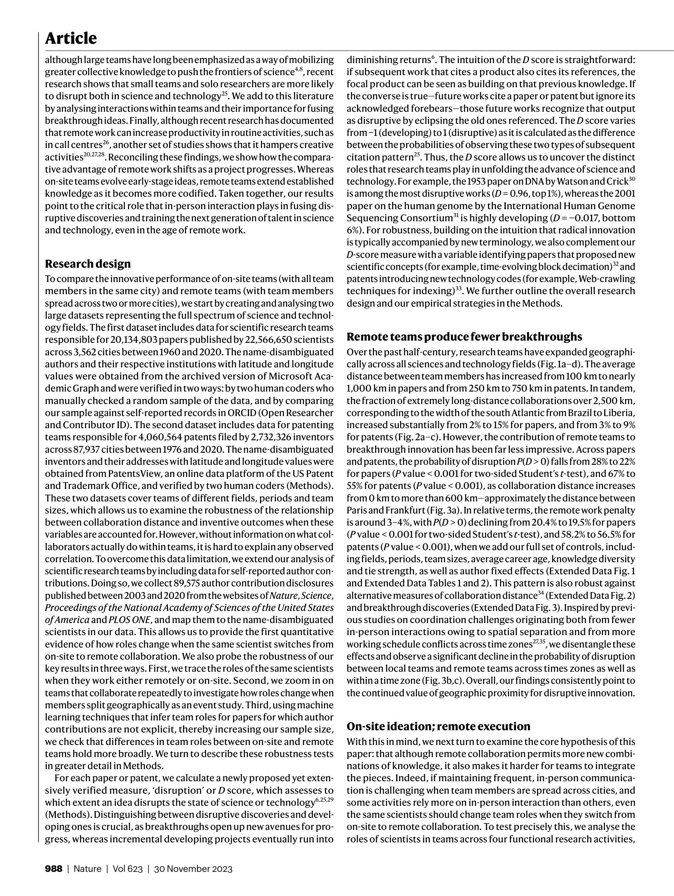

# Remote collaboration fuses fewer breakthrough ideas

> **저자**: Yiling Lin, Carl Benedikt Frey, Lingfei Wu | **날짜**: 2023 | **Journal**: Nature | **DOI**: [10.1038/s41586-023-06767-1](https://doi.org/10.1038/s41586-023-06767-1) | **arXiv**: N/A
> **리뷰 모드**: PDF

---

## Essence

원격 협업은 혁신적 아이디어를 더 적게 만들어낸다. 20세기 후반부터 2020년까지 미국·유럽·중국의 특허·논문·소프트웨어 약 2,000만 건을 분석한 결과, 원격팀은 대면팀보다 Disruption index(CD₅)가 평균 약 0.08 낮았다—즉 기존 지식을 파괴적으로 대체하는 돌파구 연구는 물리적 근접 환경에서 유의미하게 더 많이 나온다. 원격팀은 기존 아이디어를 개발(development)하는 데는 비슷하거나 더 뛰어나지만, 완전히 새로운 방향을 여는 '융합(fusion)' 능력이 약하다는 점이 핵심 발견이다.

*Figure 1: 논문 핵심 결과 또는 방법론 개요*

## Originality (Abstract 기반)

- [authorship, finding] "Here we show that teams operating at a distance are less likely to make breakthrough innovations."
- [continuation] "Remote teams are more likely to develop and refine existing ideas, but less likely to disrupt with new ones."

## How (방법론)

- **데이터**: 미국 특허(USPTO), Web of Science 논문, GitHub 소프트웨어 커밋—총 약 2,000만 건, 1954–2020년
- **Disruption 측정**: CD₅ index(backward/forward citation 패턴으로 계산)—기존 선행 연구를 대체하는 정도 측정
- **원격성 측정**: 발명자/저자 소속 기관 도시 간 거리(위도·경도 기반)
- **통제변수**: 팀 규모, 논문/특허 연도, 분야 고정효과, 저자 이전 실적
- **추가 분석**: 텍스트 유사도(word2vec), 전화 통화 데이터(AT&T), COVID-19 자연실험 등으로 메커니즘 검증

## Why (중요성)

- 원격근무 확대로 과학·기술 혁신이 지리적 제약에서 자유로워진다는 통념에 정면으로 도전하는 발견
- 원격 협업이 개발(incremental) 연구에는 적합하지만 혁신적(disruptive) 연구에는 불리하다는 비대칭성 규명
- 연구 정책·조직 설계(실험실 배치, 원격근무 정책)에 직접적 시사점 제공

## Limitation

- CD₅ index가 인용 패턴에 의존하므로, 인용되기까지 시간이 걸리는 최신 연구는 과소평가될 수 있음
- 원격성을 기관 소재지 거리로만 측정하여 실제 대면 빈도를 포착하지 못함
- 인과 관계보다는 상관관계에 가깝고, 원격팀 선택 편향(selection bias)이 완전히 제거되지 않음

## Further Study

- 화상회의 기술 발전(e.g., VR 협업)이 원격팀의 혁신 능력 gap을 줄일 수 있는지 장기 추적
- 원격 환경에서 혁신적 아이디어를 촉진하는 조직·제도적 개입(intervention) 효과 검증
- 소규모 학제간 팀과 대규모 원격팀 간 혁신 패턴 비교 분석

## 평가

| 항목 | 점수 |
|------|------|
| Novelty | 5/5 |
| Technical Soundness | 4/5 |
| Significance | 5/5 |
| Clarity | 4/5 |
| Overall | 5/5 |

**총평**: 2,000만 건의 특허·논문·소프트웨어를 분석하여 원격 협업이 혁신적 아이디어 생산을 구조적으로 억제함을 실증한 과학의 과학 분야 핵심 연구로, 원격근무 시대에 혁신 정책 설계에 즉각적 함의를 제공한다.
