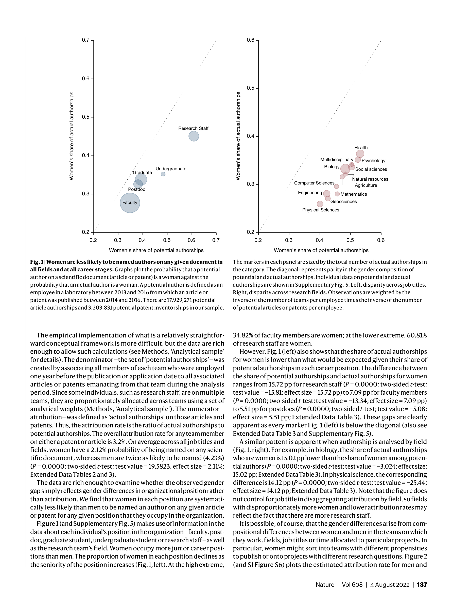

# Women are credited less in science than men

> **저자**: Matthew B. Ross, Britta M. Glennon, Raviv Murciano-Goroff, Enrico G. Berkes, Bruce A. Weinberg, Julia I. Lane | **날짜**: 2022 | **Journal**: Nature | **DOI**: [10.1038/s41586-022-04966-w](https://doi.org/10.1038/s41586-022-04966-w) | **arXiv**: N/A
> **리뷰 모드**: PDF

---

## Essence

과학에서 여성의 기여는 체계적으로 과소 인정된다. 대규모 행정 데이터(NIH 연구팀), 저자 설문조사, 정성적 인터뷰 세 가지 독립적 데이터 소스를 분석한 결과, 같은 팀에서 동일한 기여를 해도 여성이 남성보다 논문·특허 저자로 포함될 확률이 유의미하게 낮았다. 이 크레딧 gap은 거의 모든 과학 분야와 경력 단계에 걸쳐 일관되게 나타났으며, 관찰된 성별 생산성 격차의 상당 부분이 실제 기여 차이가 아닌 귀속(attribution) 차이에서 비롯됨을 시사한다.

*Figure 1: 논문 핵심 결과 또는 방법론 개요*

## Originality (Abstract 기반)

- [authorship, finding] "Here we find that at least part of this gap is the result of unacknowledged contributions: women in research teams are significantly less likely than men to be credited with authorship."
- [continuation] "The gender gap in attribution is present across most scientific fields and almost all career stages."

## How (방법론)

- **데이터 1**: NIH UMETRICS 행정 데이터—연구팀 구성, 논문/특허 산출물, 개인별 크레딧 귀속 매칭 (대규모 종단 데이터)
- **데이터 2**: 저자 대상 설문조사—자신의 기여가 제대로 인정받았는지 자기보고
- **데이터 3**: 정성적 인터뷰—여성의 기여가 묵살되는 사회적 메커니즘 탐색
- **분석**: 팀 고정효과(within-team comparison)로 동일 팀 내 성별 귀속 차이 추정, logistic regression으로 저자 포함 확률 모델링
- **통제변수**: 경력 단계, 팀 규모, 분야, 연도

## Why (중요성)

- 관찰된 성별 생산성 격차가 실제 기여 차이가 아닌 구조적 편향에서 비롯됨을 증명, 과학계 다양성 정책 근거 제공
- 세 가지 독립 방법론이 동일한 결론에 수렴하여 발견의 강건성(robustness) 확인
- 여성 과학자 유지 및 승진 정책 설계에 직접적 증거 제공

## Limitation

- NIH 데이터 기반이므로 미국 생의학·보건 분야 편향이 있으며, 다른 나라·분야로의 일반화 주의 필요
- 기여 수준을 직접 측정하지 못하고 행정 데이터(급여, 지출 등)의 간접 지표에 의존
- 설문 응답 편향(response bias): 크레딧을 받은 사람이 응답할 가능성이 높을 수 있음

## Further Study

- 다국가·다분야 비교 연구로 귀속 불평등의 국가별·문화별 변이 분석
- 저자 순서(first/last authorship) 내 성별 편향 심층 분석
- 저자 기재 관행 개선(CRediT taxonomy 등)의 실제 효과 평가

## 평가

| 항목 | 점수 |
|------|------|
| Novelty | 4/5 |
| Technical Soundness | 5/5 |
| Significance | 5/5 |
| Clarity | 5/5 |
| Overall | 5/5 |

**총평**: 세 가지 독립 데이터로 여성 과학자의 기여가 체계적으로 저평가됨을 증명하여, 관찰된 성별 생산성 격차의 원인이 능력 차이가 아닌 구조적 귀속 편향임을 실증한 과학정책 분야의 중요 연구다.
