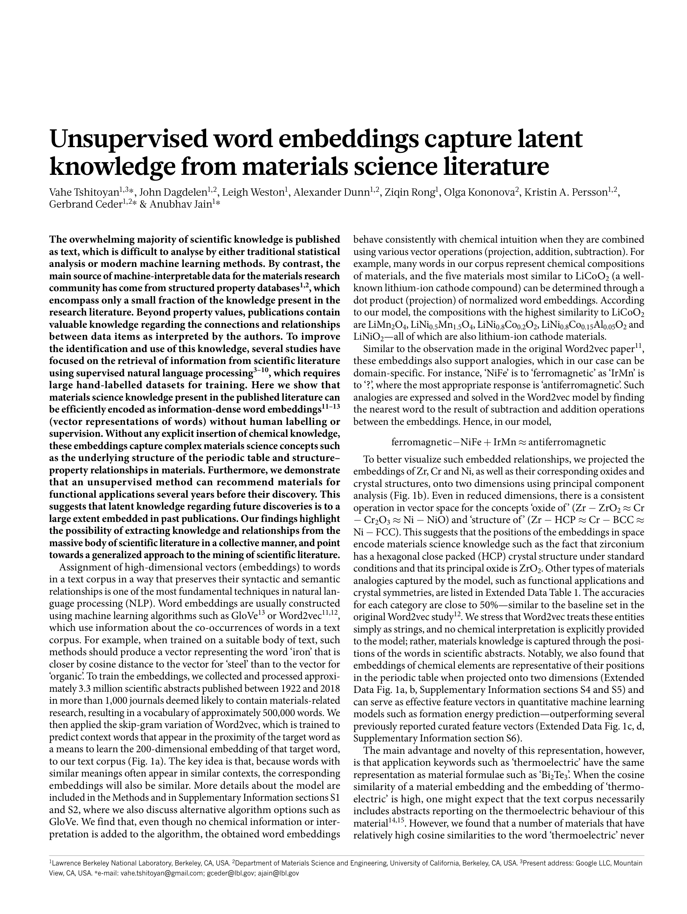

# Unsupervised Word Embeddings Capture Latent Knowledge from Materials Science Literature

> **저자**: Vahe Tshitoyan, John Dagdelen, Leigh Weston, Alexander Dunn, Ziqin Rong, Olga Kononova, Kristin A. Persson, Gerbrand Ceder, Anubhav Jain | **날짜**: 2019 | **Journal**: Nature | **DOI**: [10.1038/s41586-019-1335-8](https://doi.org/10.1038/s41586-019-1335-8) | **arXiv**: N/A
> **리뷰 모드**: PDF

---

## Essence

재료과학 문헌에서 훈련된 비지도 단어 임베딩(word2vec)이 열전 재료 발견에 관한 잠재 지식을 포착한다. mat2vec 모델은 2018년 이전 문헌만으로 훈련되었는데도 2018년 이후 실제로 발견된 열전 재료 후보들을 정확히 예측했으며, '미래 재료'와 기능적으로 유사한 재료를 높은 순위로 추천했다. 이는 과학 문헌에 명시적으로 기술되지 않은 잠재 지식(latent knowledge)이 언어 모델을 통해 추출 가능함을 보인 것이다.

*Figure 1: 논문 핵심 결과 또는 방법론 개요*

## Originality (Abstract 기반)

- [authorship, action] "We show that materials science knowledge present in the scientific literature can be efficiently encoded as information-dense word embeddings."
- [novelty, finding] "The embeddings allow for predictions about future materials discoveries by identifying hidden structure in the literature."

## How (방법론)

- **데이터**: 재료과학 문헌 330만 편 초록 + 전체 텍스트 일부(1922–2018)
- **모델**: word2vec(skip-gram) 기반 mat2vec—200차원 임베딩, 특수 재료 토크나이저
- **검증**: 원소 주기율표 구조 재현, 열전 재료 예측(2018 이전 데이터로 이후 발견 예측)
- **응용**: 특정 성질(예: 열전 성능 ZT 값)과 가장 유사한 재료 추천

## Why (중요성)

- 과학 문헌에 흩어진 암묵적 지식을 자동으로 추출·연결하여 새로운 재료 발견 가속화
- 실험 없이 컴퓨터만으로 유망 재료 후보를 좁혀 연구 효율성 획기적 향상
- NLP 기법을 재료과학에 처음으로 체계적으로 적용한 방법론 확립

## Limitation

- 훈련 데이터의 편향(영어 문헌 중심, 인기 재료 과잉 대표)이 예측 편향으로 이어질 수 있음
- 단어 의미의 맥락 의존성(같은 단어가 다른 의미)을 처리하는 데 word2vec의 한계
- 문헌에 기술된 것만 학습—미발표 음성 결과(negative results)는 반영 못함

## Further Study

- BERT/LLM 기반 문맥 인식 임베딩으로의 업그레이드
- 합성 경로, 처리 조건 등 다중 성질 동시 최적화
- 임베딩이 포착한 재료 관계의 해석가능성(interpretability) 향상

## 평가

| 항목 | 점수 |
|------|------|
| Novelty | 5/5 |
| Technical Soundness | 4/5 |
| Significance | 5/5 |
| Clarity | 5/5 |
| Overall | 5/5 |

**총평**: 330만 편 재료과학 문헌에서 훈련된 word2vec 임베딩이 미래 열전 재료 발견을 정확히 예측하여, 과학 문헌의 잠재 지식 추출 가능성을 실증한 AI for Science 분야의 선구적 논문이다.
