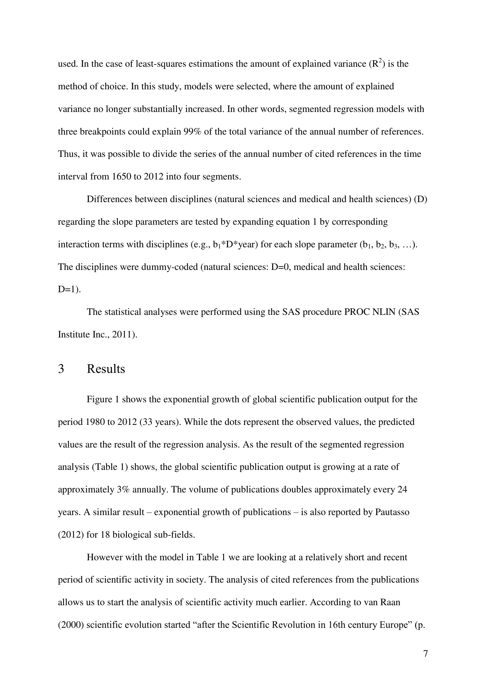

# Growth Rates of Modern Science: Bibliometric Analysis Based on the Number of Publications and Cited References

> **저자**: Lutz Bornmann, Rüdiger Mutz | **날짜**: 2015 | **Journal**: Journal of the Association for Information Science and Technology | **DOI**: [10.1002/asi.23329](https://doi.org/10.1002/asi.23329) | **arXiv**: N/A
> **리뷰 모드**: PDF

---

## Essence

현대 과학은 지수적으로 성장하고 있다. Bornmann & Mutz(2015)는 1650년부터 2012년까지 논문 수와 참고문헌 수의 시계열을 분석하여, 20세기 중반까지는 약 35년마다 두 배로 증가하는 지수적 성장이 지배했으며, 이후 성장률이 다소 둔화되었음을 밝혔다. 특히 참고문헌 수는 논문 수보다 더 빠르게 증가하고 있어 지식 연결 밀도가 높아지고 있다.

*Figure 1: 논문 핵심 결과 또는 방법론 개요*

## Originality (Abstract 기반)

- [authorship, action] "We present a bibliometric analysis of the growth of science based on the number of publications and cited references."
- [finding] "The growth of science follows an exponential pattern, with a doubling time of approximately 9 years for publications in recent decades."

## How (방법론)

- **데이터**: Web of Science(1980–2012), Scopus, 역사적 문헌 추정치(Price 1963, Mabe 2003 등)
- **측정**: 연도별 논문 수, 참고문헌 수 집계 및 성장률 계산
- **분석**: 지수 성장 모델 피팅, 분야별(자연과학·사회과학·인문학) 성장률 비교
- **통계**: 성장 가속/감속 구간 검출, doubling time 추정

## Why (중요성)

- 과학 성장률 파악은 저널 용량 계획, 동료 심사 부하, R&D 예산 정책에 핵심 기초 데이터
- 참고문헌 성장이 논문 수 성장을 앞선다는 발견은 지식 통합 속도 분석에 중요
- 역사적 성장 패턴 이해는 미래 과학 생태계 예측의 기반

## Limitation

- Web of Science의 저널 커버리지 편향—비영어권, 신흥국 문헌 과소 대표
- 논문 수 증가가 품질 향상을 의미하지 않으며, 분할출판(salami slicing) 등으로 인한 인위적 증가 가능
- 데이터베이스 색인 정책 변화가 외관상 성장률 변화로 나타날 수 있음

## Further Study

- 오픈 액세스·프리프린트 시대의 과학 성장 패턴 재분석
- 논문 수 증가 대비 실질 지식 증가율(질 보정 성장) 측정 방법론 개발
- AI 보조 연구가 성장률에 미치는 영향 전망

## 평가

| 항목 | 점수 |
|------|------|
| Novelty | 3/5 |
| Technical Soundness | 4/5 |
| Significance | 4/5 |
| Clarity | 4/5 |
| Overall | 4/5 |

**총평**: 1650년 이래 과학 문헌의 지수적 성장 패턴을 체계적으로 정량화하여, 현대 과학 생산성 연구와 저널 정책 설계를 위한 기초 계량 자료를 제공하는 견실한 서지계량 연구다.
