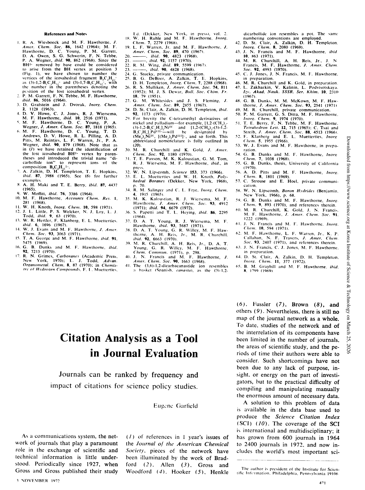

# Citation Analysis as a Tool in Journal Evaluation

> **저자**: Eugene Garfield | **날짜**: 1972 | **Journal**: Science | **DOI**: [10.1126/science.178.4060.471](https://doi.org/10.1126/science.178.4060.471) | **arXiv**: N/A
> **리뷰 모드**: PDF

---

## Essence

인용 분석은 저널 평가의 유효한 도구다. Garfield(1972)는 저널 임팩트 팩터(Journal Impact Factor, JIF) 개념을 공식 제안하고, Science Citation Index(SCI) 데이터를 이용해 저널이 과학 문헌에 미치는 영향력을 정량적으로 측정하는 방법론을 제시했다. 이 논문은 계량과학 분야에서 가장 많이 인용되는 고전 중 하나로, JIF가 수십 년간 학술 평가의 표준 지표가 된 것의 기초를 놓았다.

*Figure 1: 논문 핵심 결과 또는 방법론 개요*

## Originality (Abstract 기반)

- [novelty] "Journal Impact Factor 개념을 최초로 공식 정의하고 저널 평가 도구로의 적용을 체계화함"

## How (방법론)

- **데이터**: Science Citation Index(SCI) 1969–1971년 데이터
- **JIF 계산**: 2년간 논문 피인용 수 / 2년간 총 논문 수
- **검증**: 상위 저널과 하위 저널 간 JIF 비교, 분야별 JIF 분포 분석
- **응용**: 도서관 저널 구독 선택 기준으로의 활용 가능성 논의

## Why (중요성)

- 저널 품질을 계량적으로 비교 가능한 단일 숫자로 요약하는 방법 제시
- 도서관·연구기관의 저널 구독 결정에 객관적 기준 제공
- 과학 문헌의 영향력 전파 패턴 이해의 기초 확립

## Limitation

- 분야별 인용 관행 차이로 인해 JIF는 다른 분야 간 비교에 부적합
- 2년 인용 창(citation window)이 느린 분야(수학, 인문학)에서는 부적절
- 저널 수준 지표를 개별 논문·연구자 평가에 오용하는 관행(San Francisco Declaration, Leiden Manifesto에서 비판)
- 리뷰 논문, 편집자 사설 등이 분모·분자에 불균등하게 포함되어 조작 가능

## Further Study

- 분야 정규화 피인용도(FNCS), RCR 등 JIF 한계를 보완하는 새 지표 개발(실제로 진행됨)
- 논문 수준 지표(Altmetrics, 개별 논문 피인용도)로의 전환 논의
- AI가 생성한 논문에서 JIF의 의미가 어떻게 변화하는지

## 평가

| 항목 | 점수 |
|------|------|
| Novelty | 5/5 |
| Technical Soundness | 3/5 |
| Significance | 5/5 |
| Clarity | 5/5 |
| Overall | 5/5 |

**총평**: 저널 임팩트 팩터(JIF)를 최초로 공식 정의하고 저널 평가 도구로 제안한 계량과학의 가장 영향력 있는 고전 논문으로, 수십 년간 학술 평가의 표준 지표가 된 JIF의 이론적·실용적 기반을 마련했다.
