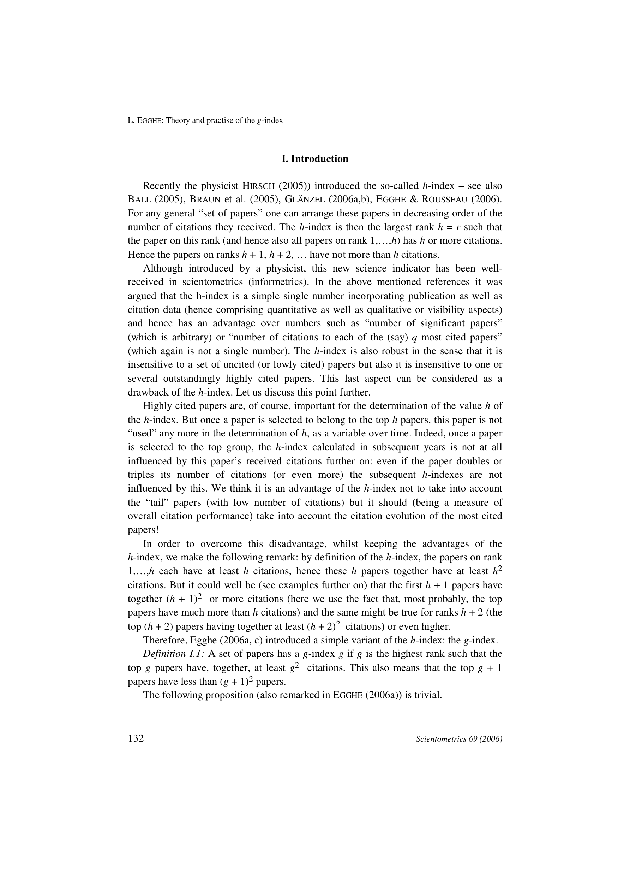

# Theory and Practice of the g-index

> **저자**: Leo Egghe | **날짜**: 2006 | **Journal**: Scientometrics | **DOI**: [10.1007/s11192-006-0144-7](https://doi.org/10.1007/s11192-006-0144-7) | **arXiv**: N/A
> **리뷰 모드**: PDF

---

## Essence

g-index는 h-index의 한계를 보완하는 새로운 인용 지표다. Egghe(2006)가 제안한 g-index는 '상위 g편 논문이 평균적으로 g²회 이상 인용된' 최대 g값으로 정의되어, h-index가 놓치는 고피인용 논문의 기여를 포착한다. h-index와 달리 g는 상위 논문의 인용 수 증가에 민감하게 반응하며, 수학적으로는 항상 g ≥ h 관계가 성립한다.

*Figure 1: 논문 핵심 결과 또는 방법론 개요*

## Originality (Abstract 기반)

- [authorship, novelty, action] "We introduce the g-index as a new bibliometric indicator that improves upon the h-index by giving more weight to highly cited articles."
- [finding] "The g-index always satisfies g ≥ h and captures the tail performance of highly cited papers."

## How (방법론)

- **이론**: g-index 정의 공식화—상위 g편 논문의 총 인용 수 ≥ g² 조건 충족하는 최대 g
- **수학 분석**: h와 g의 관계(g ≥ h 증명), Lotka 법칙·Zipf 분포 하에서의 g 점근 분석
- **실증 비교**: 노벨상 수상자, 과학자 샘플에서 h와 g 비교

## Why (중요성)

- h-index는 고인용 논문의 추가 인용을 무시하는 구조적 한계를 가짐
- g-index는 단 하나의 수로 누적 인용 성과를 더 민감하게 포착
- 연구자 평가·채용·승진 결정에서 h의 보완 지표로 광범위하게 활용됨

## Limitation

- g-index도 분야별 인용 관행 차이를 보정하지 못함
- 경력 초기 연구자에게 불리한 구조(누적 인용 필요)
- 자기인용, 리뷰 논문의 고인용 등에 취약

## Further Study

- 분야 정규화 g-index(normalized g) 개발
- h, g 외 다양한 지표의 조합 최적화 연구
- 동료 심사 기반 평가와 지표 기반 평가의 상관관계 분석

## 평가

| 항목 | 점수 |
|------|------|
| Novelty | 4/5 |
| Technical Soundness | 4/5 |
| Significance | 4/5 |
| Clarity | 4/5 |
| Overall | 4/5 |

**총평**: h-index가 놓치는 고피인용 논문의 탁월한 기여를 포착하는 g-index를 수학적으로 정의·분석한 계량과학 논문으로, h-index의 주요 보완 지표로 자리잡았다.
