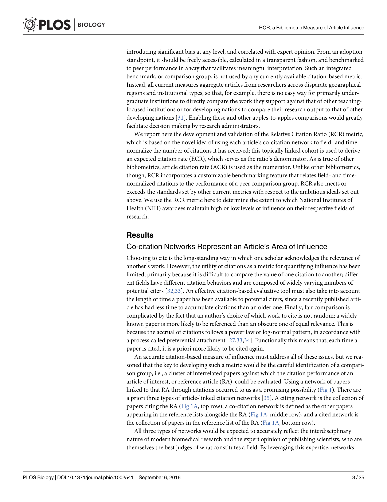

# Relative Citation Ratio: A New Metric That Uses Citation Rates to Measure Influence at the Article Level

> **저자**: B. Ian Hutchins, Xin Yuan, James M. Anderson, George M. Santangelo | **날짜**: 2016 | **Journal**: PLOS Biology | **DOI**: [10.1371/journal.pbio.1002541](https://doi.org/10.1371/journal.pbio.1002541) | **arXiv**: N/A
> **리뷰 모드**: PDF

---

## Essence

논문 수준의 상대적 인용 비율(Relative Citation Ratio, RCR)은 기존 JIF나 절대 피인용수의 한계를 극복하는 분야 정규화 지표다. Hutchins et al.(2016)은 NIH PubMed Central 데이터로 RCR를 개발했는데, 이는 동일 시기·분야 논문들의 인용 네트워크를 기준으로 개별 논문의 영향력을 정규화한다. RCR 1.0이 분야 평균이며, peer review 평가와 높은 상관관계(r=0.87)를 보여 연구 영향력의 실용적 지표로 검증되었다.

*Figure 1: 논문 핵심 결과 또는 방법론 개요*

## Originality (Abstract 기반)

- [authorship, novelty, action] "We developed the Relative Citation Ratio (RCR), a new field-normalized bibliometric measure of scientific influence at the article level."
- [finding] "RCR correlates strongly with peer review assessments of scientific influence (r = 0.87)."

## How (방법론)

- **데이터**: NIH PubMed Central 논문 약 880만 편
- **RCR 계산**: 논문의 연간 인용률을 공동인용 네트워크(co-citation network)로 정의된 동분야 논문들의 평균 인용률로 나누어 정규화
- **검증**: NIH 연구비 수혜 논문의 expert peer review 점수와 RCR 상관관계 분석
- **비교**: JIF, h-index 등 기존 지표와의 비교

## Why (중요성)

- 분야 간 비교 가능한 논문 수준 지표 제공—JIF는 저널 수준, 분야 간 비교 불가
- 연구비 배분, 연구자 채용·평가에서 더 공정하고 정확한 정량 지표 필요
- NIH 공식 채택으로 실제 정책 영향력 획득

## Limitation

- 공동인용 네트워크 정의 방법에 따라 결과가 달라질 수 있음
- 인용되기 전(발표 직후) 논문은 RCR 계산 불가
- 신흥 학제간 분야에서 적절한 비교 분야 설정이 어려울 수 있음

## Further Study

- 프리프린트·오픈 데이터 시대의 RCR 확장
- 부정적 인용(반박 논문 인용)을 분리 처리하는 정교화
- 팀 기여도 가중치 RCR 변형 개발

## 평가

| 항목 | 점수 |
|------|------|
| Novelty | 4/5 |
| Technical Soundness | 5/5 |
| Significance | 4/5 |
| Clarity | 5/5 |
| Overall | 4/5 |

**총평**: 공동인용 네트워크 기반의 분야 정규화 논문 영향력 지표 RCR을 개발하고 NIH 데이터로 검증하여, 분야 간 비교 가능한 실용적 연구 평가 도구를 제시한 계량과학 논문이다.
