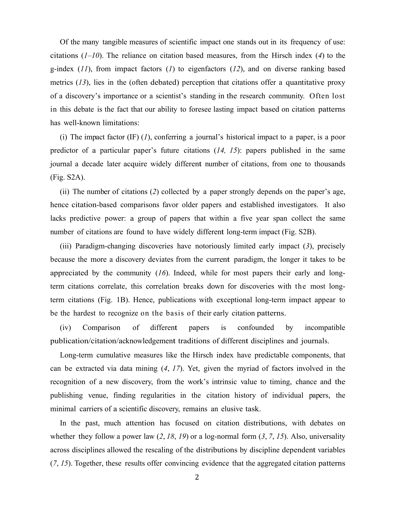

# Quantifying Long-term Scientific Impact

> **저자**: Dashun Wang, Chaoming Song, Albert-László Barabási | **날짜**: 2013 | **Journal**: Science | **DOI**: [10.1126/science.1237825](https://doi.org/10.1126/science.1237825) | **arXiv**: N/A
> **리뷰 모드**: PDF

---

## Essence

논문의 장기 인용 영향력은 'sleeping beauty(수면 후 각성)' 현상을 포함하여 단순 지수 감소가 아닌 복잡한 패턴을 보인다. Wang et al.(2013)은 Physical Review 저널의 30만 편 논문 인용 시계열을 분석해, 대부분의 논문은 발표 직후 인용이 증가했다 감소하는 패턴을 보이지만, 일부는 오랜 잠복기 후 급격히 각성하는 sleeping beauty 패턴을 보임을 확인했다. 이들은 이를 $c(t) = m(e^{\mu t}-1) + \eta$ 모델로 정량화했다.

*Figure 1: 논문 핵심 결과 또는 방법론 개요*

## Originality (Abstract 기반)

- [authorship, novelty, action] "We quantify the long-term scientific impact of papers by fitting their citation histories with a model that captures immediate and delayed recognition."
- [finding] "A subset of papers exhibit 'sleeping beauty' patterns—delayed recognition after initial obscurity."

## How (방법론)

- **데이터**: Physical Review(PR) 1893–2009, 30만 편 논문의 연도별 인용 시계열
- **모델**: $c(t) = m(e^{\mu t}-1) + \eta$ (즉각 영향 m, 성장률 μ, 지연 영향 η 세 파라미터)
- **분류**: 모델 파라미터 기반 논문 유형(regular, delayed impact 등) 군집화
- **검증**: 노벨상 수상 논문의 sleeping beauty 패턴 확인

## Why (중요성)

- 단기 인용 지표(JIF 2년)가 장기 영향력을 과소평가하는 문제 해결
- Sleeping beauty 현상의 정량적 이해는 연구비 심사, 조기 종료 결정의 근거 재고에 활용
- 피인용 패턴의 다양성 이해는 분야별 평가 지표 정교화에 기여

## Limitation

- 물리학(PR) 데이터에 편중—다른 분야 일반화 필요
- 모델의 세 파라미터 추정에 노이즈가 많고 과적합 위험
- Sleeping beauty 정의가 임의적이어서 다른 기준에서는 결과 달라질 수 있음

## Further Study

- 다분야 비교: 생의학·화학·사회과학에서 sleeping beauty 비율 비교
- 무엇이 sleeping beauty를 '깨우는지' 인과 분석(리뷰 논문? 기술 발전? 재발견?)
- 사전 출판(preprint) 시대의 인용 패턴 변화

## 평가

| 항목 | 점수 |
|------|------|
| Novelty | 4/5 |
| Technical Soundness | 4/5 |
| Significance | 4/5 |
| Clarity | 4/5 |
| Overall | 4/5 |

**총평**: 30만 편 논문의 인용 시계열을 3-파라미터 모델로 정량화하여 sleeping beauty 패턴을 포함한 과학적 영향력의 장기 역학을 체계적으로 분석한 계량과학 연구다.
