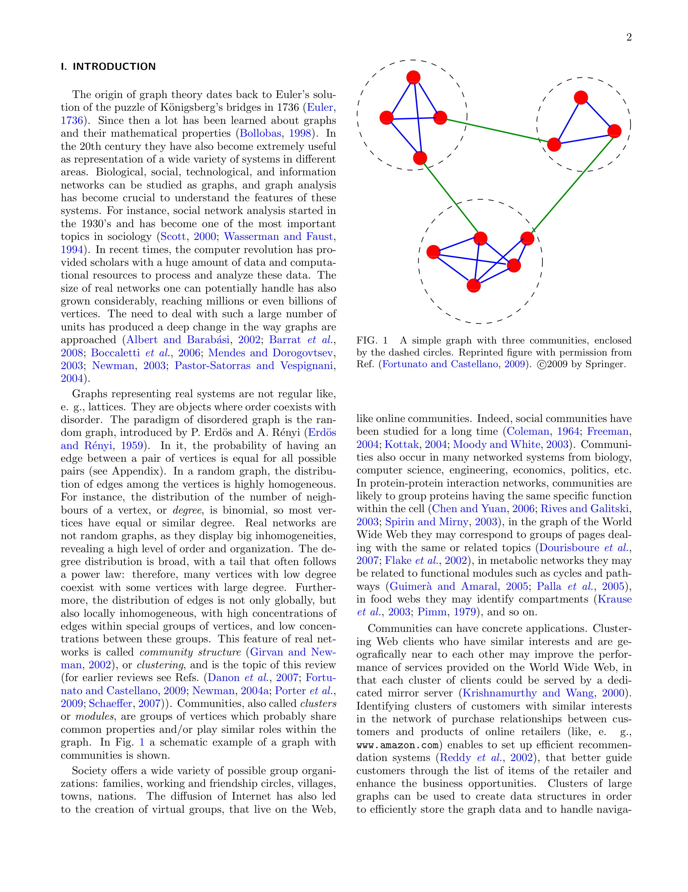

# Community Detection in Graphs

> **저자**: Santo Fortunato | **날짜**: 2010 | **Journal**: Physics Reports | **DOI**: [10.1016/j.physrep.2009.11.002](https://doi.org/10.1016/j.physrep.2009.11.002) | **arXiv**: N/A
> **리뷰 모드**: PDF

---

## Essence

그래프의 커뮤니티 탐지(community detection)는 노드와 엣지로 이루어진 네트워크에서 내부 연결이 밀하고 외부 연결이 성긴 클러스터를 찾는 문제다. Fortunato(2010)의 이 리뷰 논문은 계층적 클러스터링, modularity 최적화, 스펙트럼 방법, 통계적 추론 등 주요 알고리즘 패밀리를 체계적으로 정리하고 비교하며, 해상도 한계(resolution limit of modularity)와 같은 근본적 문제점을 분석한다.

*Figure 1: 논문 핵심 결과 또는 방법론 개요*

## Originality (Abstract 기반)

- [authorship, action] "We present a comprehensive review of community detection algorithms in complex networks, covering both deterministic and statistical approaches."

## How (방법론)

- **범위**: 2010년까지 주요 커뮤니티 탐지 알고리즘 전체 리뷰
- **분류 체계**: 계층적 방법, graph partitioning, modularity 기반, 스펙트럼, 베이지안/통계적, 동적 방법
- **평가 기준**: 정확도(ground truth 비교), 계산 복잡도, 확장성
- **벤치마크**: LFR benchmark, karate club, football network 등 표준 테스트 그래프 사용

## Why (중요성)

- 커뮤니티 탐지는 소셜 네트워크, 생물 네트워크, 지식 그래프, 인용 네트워크에 광범위하게 적용
- 알고리즘 선택 기준과 한계에 대한 통합 이해 제공
- 2010년 이후 커뮤니티 탐지 연구의 표준 참고 문헌으로 기능(10,000회 이상 피인용)

## Limitation

- 리뷰 특성상 저자의 알고리즘 선택·설명에 주관적 편향 가능
- Modularity 기반 방법의 해상도 한계(resolution limit) 등 한계는 기술하지만 완전한 해결책 미제시
- 2010년 이후 등장한 딥러닝 기반 방법(graph neural network, deep clustering) 미포함

## Further Study

- GNN(Graph Neural Network) 기반 커뮤니티 탐지 방법으로의 확장
- 동적·시간 진화 네트워크에서의 커뮤니티 탐지
- 지식 그래프·인용 네트워크에서의 실용적 응용

## 평가

| 항목 | 점수 |
|------|------|
| Novelty | 3/5 |
| Technical Soundness | 5/5 |
| Significance | 5/5 |
| Clarity | 5/5 |
| Overall | 5/5 |

**총평**: 네트워크 커뮤니티 탐지 알고리즘 전체를 체계적으로 정리하고 한계를 분석한 포괄적 리뷰로, 10,000회 이상 피인용된 해당 분야의 표준 참고 논문이다.
