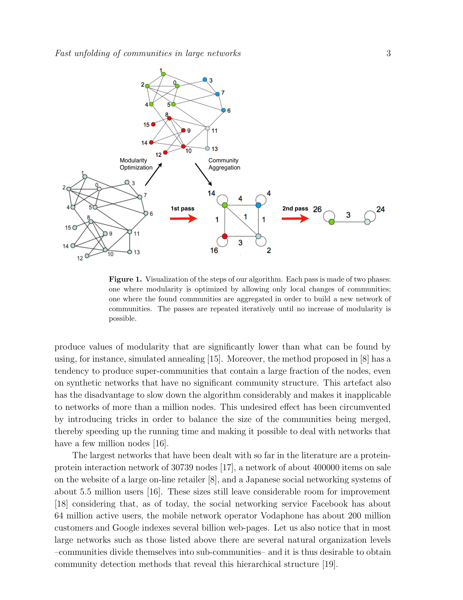

# Fast Unfolding of Communities in Large Networks

> **저자**: Vincent D Blondel, Jean-Loup Guillaume, Renaud Lambiotte, Etienne Lefebvre | **날짜**: 2008 | **Journal**: Journal of Statistical Mechanics: Theory and Experiment | **DOI**: [10.1088/1742-5468/2008/10/P10008](https://doi.org/10.1088/1742-5468/2008/10/P10008) | **arXiv**: N/A
> **리뷰 모드**: PDF

---

## Essence

Louvain 알고리즘은 대규모 네트워크에서 커뮤니티를 빠르고 정확하게 탐지하는 방법이다. Blondel et al.(2008)이 제안한 이 알고리즘은 modularity를 국소적으로 탐욕적(greedy)으로 최적화하는 두 단계 절차를 반복하여, 1억 2,800만 엣지의 네트워크에서도 수분 내에 계층적 커뮤니티 구조를 탐지한다. 기존 방법 대비 수십~수백 배 빠른 속도를 달성하면서도 modularity 품질은 경쟁 알고리즘과 대등하거나 우월하다.

*Figure 1: 논문 핵심 결과 또는 방법론 개요*

## Originality (Abstract 기반)

- [authorship, novelty, action] "We propose a fast algorithm for community detection in large networks, which we call the Louvain method, based on greedy modularity optimization."
- [finding] "The algorithm achieves high modularity values while being orders of magnitude faster than competing methods."

## How (방법론)

- **알고리즘**: Phase 1—각 노드를 이웃과 같은 커뮤니티에 배치할 때 modularity 이득 계산 후 탐욕적 이동; Phase 2—커뮤니티를 슈퍼노드로 집계하여 새 그래프 생성 → 반복
- **데이터**: 휴대폰 통화 네트워크(200만 노드, 1억 2,800만 엣지), 웹 그래프, 생물 네트워크 등
- **비교**: CNM, Wakita-Tsurumi 등 기존 greedy 방법과 속도·modularity 비교

## Why (중요성)

- 실제 소셜·생물·기술 네트워크는 수백만~수십억 노드 규모로 기존 방법의 적용이 불가
- 빠른 커뮤니티 탐지는 실시간 네트워크 분석, 추천 시스템, 과학 지도 제작에 필수
- 광범위한 도메인 적용 가능성으로 사실상 업계 표준 알고리즘이 됨(40,000회 이상 피인용)

## Limitation

- Modularity의 해상도 한계(resolution limit): 소규모 커뮤니티가 대규모 커뮤니티에 흡수될 수 있음
- 탐욕적 국소 최적화로 인한 global optimum 미보장
- 무작위 초기화로 실행마다 결과가 달라질 수 있음(non-deterministic)

## Further Study

- Leiden 알고리즘 등 해상도 한계와 비결정성을 개선한 후속 개발(실제 진행됨)
- 방향 그래프, 가중 네트워크, 다중층 네트워크로의 확장
- 실시간 동적 네트워크 업데이트에서의 incremental Louvain

## 평가

| 항목 | 점수 |
|------|------|
| Novelty | 5/5 |
| Technical Soundness | 4/5 |
| Significance | 5/5 |
| Clarity | 5/5 |
| Overall | 5/5 |

**총평**: 대규모 네트워크에서 modularity를 탐욕적으로 최적화하는 Louvain 알고리즘을 제안하여 수억 엣지 규모 네트워크의 실용적 커뮤니티 탐지를 가능하게 한, 40,000회 이상 피인용된 네트워크 과학의 핵심 방법론 논문이다.
