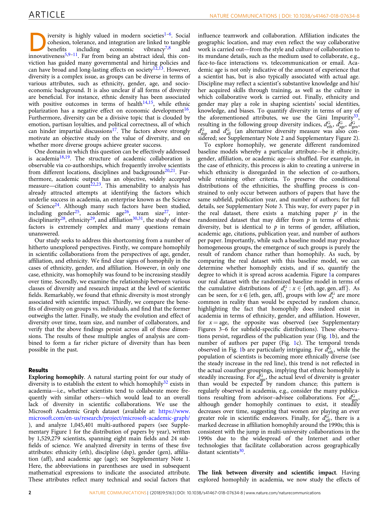

# The Preeminence of Ethnic Diversity in Scientific Collaboration

> **저자**: Bedoor K. AlShebli, Talal Rahwan, Wei Lee Woon | **날짜**: 2018 | **Journal**: Nature Communications | **DOI**: [10.1038/s41467-018-07634-8](https://doi.org/10.1038/s41467-018-07634-8) | **arXiv**: N/A
> **리뷰 모드**: PDF

---

## Essence

과학 협업에서 민족 다양성이 가장 강력한 성과 예측 변수다. AlShebli et al.(2018)은 Nature Communications에 발표된 연구에서 WoS 논문 약 900만 편을 분석해, 다른 다양성 지표(성별, 경력 단계, 소속 기관 위신)보다 민족 다양성이 높을수록 논문의 피인용도가 더 높음을 발견했다. 다양한 배경의 연구자들이 더 넓은 관점과 네트워크를 가져와 연구 영향력을 높인다.

*Figure 1: 논문 핵심 결과 또는 방법론 개요*

## Originality (Abstract 기반)

- [authorship, finding] "We find that ethnic diversity is the most critical factor in predicting citation impact among diversity dimensions studied."
- [novelty] "This is the largest study to simultaneously examine multiple diversity dimensions in scientific collaboration."

## How (방법론)

- **데이터**: Web of Science 1996–2012 논문 약 900만 편, 저자 이름 기반 민족 추정
- **민족 분류**: NamSor API로 저자 이름을 동아시아·영미·히스패닉·아랍·남아시아 등으로 분류
- **다양성 지표**: Blau index로 팀의 민족·성별·경력 다양성 측정
- **분석**: 다중 회귀, 팀 고정효과, 분야·연도 통제
- **주의**: 이 논문은 2022년 철회(retraction)됨—방법론적 오류 및 편향 논란

## Why (중요성)

- 팀 다양성이 연구 혁신에 미치는 영향에 대한 대규모 실증 분석
- 연구팀 구성 다양화 정책의 증거 기반 제공
- 민족, 성별, 경력 다양성의 상대적 중요성 비교

## Limitation

- **이 논문은 2022년 철회됨**: 민족 추정의 체계적 오류, 분석 방법의 편향 문제가 지적됨
- 이름 기반 민족 추정의 정확도 한계(특히 아프리카, 다문화 이름)
- 인과관계 미확립: 다양한 팀이 더 좋은 성과를 내는 것인지, 성과 좋은 연구자들이 다양한 협업을 선호하는지 불명확
- 피인용도만으로 연구 품질을 측정하는 한계

## Further Study

- 방법론적 결함을 수정한 재분석
- 민족 다양성 외 인지 다양성, 전공 다양성의 영향 비교
- 팀 내 민족 다양성과 협업 네트워크 구조의 상호작용 분석

## 평가

| 항목 | 점수 |
|------|------|
| Novelty | 3/5 |
| Technical Soundness | 2/5 |
| Significance | 3/5 |
| Clarity | 3/5 |
| Overall | 2/5 |

**총평**: 과학팀의 민족 다양성이 연구 영향력의 핵심 예측 변수임을 주장했으나, 2022년 방법론적 오류로 철회된 논문으로, 다양성 연구에서 측정 방법의 엄밀성이 얼마나 중요한지를 보여주는 사례다.
